# ClinicDesk — Complete Planning Package

> **Project:** ClinicDesk — Web-Based Clinic Management System  
> **Team Size:** 5 Developers  
> **Timeline:** 5-Day Hackathon  
> **Date:** June 2026  
> **Version:** 1.0  

---

## Table of Contents

1. [Vision Document](#1-vision-document)
2. [Requirements Specification](#2-requirements-specification)
3. [User Stories](#3-user-stories)
4. [Use Cases](#4-use-cases)
5. [Use Case Diagram](#5-use-case-diagram)
6. [Domain Analysis](#6-domain-analysis)
7. [Database Design (ERD)](#7-database-design-erd)
8. [System Architecture](#8-system-architecture)
9. [API Design](#9-api-design)
10. [Wireframes](#10-wireframes)
11. [Sprint Planning](#11-sprint-planning)
12. [MVP Scope Definition](#12-mvp-scope-definition-moscow)
13. [Tech Stack Justification](#13-tech-stack-justification)
14. [Folder Structure](#14-folder-structure)
15. [Implementation Roadmap](#15-implementation-roadmap)

---


---

# ClinicDesk — Part 1: Vision, Requirements & User Stories

> **Project:** ClinicDesk — Web-Based Clinic Management System  
> **Version:** 1.0  
> **Date:** 2026-06-09  
> **Status:** Draft  
> **Languages:** Arabic (RTL) · English (LTR)

---

## Table of Contents

1. [Vision Document](#1-vision-document)
2. [Requirements Specification](#2-requirements-specification)
   - [Functional Requirements](#21-functional-requirements)
   - [Non-Functional Requirements](#22-non-functional-requirements)
3. [User Stories](#3-user-stories)

---

## 1. Vision Document

### 1.1 Problem Statement

Small and medium-sized clinics across the MENA region continue to rely on **paper-based records, fragmented spreadsheets, and disconnected communication channels** to manage their day-to-day operations. This leads to a cascade of preventable problems:

| Pain Point | Impact |
|---|---|
| **Paper medical records** | Records are lost, misfiled, or illegible — leading to diagnostic errors and repeated tests. |
| **Manual appointment scheduling** | Double-bookings, no-shows without follow-up, and long patient wait times erode trust and revenue. |
| **Handwritten prescriptions** | Dosage errors, pharmacy call-backs, and patient confusion increase liability. |
| **Disconnected billing** | Revenue leakage from un-invoiced services; no consolidated financial view for clinic owners. |
| **No centralized dashboard** | Clinic administrators lack real-time visibility into operational performance and cannot make data-driven decisions. |
| **Language barriers** | Existing solutions are predominantly English-only, alienating Arabic-speaking staff and patients. |

These inefficiencies cost clinics **time, money, and patient satisfaction**. Larger hospital information systems (HIS) exist but are prohibitively expensive, complex to deploy, and over-engineered for a 2–15 doctor practice.

### 1.2 Target Users

**Primary Market:** Small-to-medium clinics (1–15 physicians) in the **MENA region** — particularly in Egypt, Saudi Arabia, Jordan, UAE, and Iraq.

**User Personas:**

| Persona | Description | Tech Comfort |
|---|---|---|
| **Dr. Ahmed** | General practitioner running a solo clinic. Needs fast examination recording and prescription printing. | Moderate |
| **Nour (Receptionist)** | Front-desk staff juggling phone bookings, walk-ins, and billing. Needs a single screen for scheduling and invoicing. | Low–Moderate |
| **Fatima (Clinic Administrator)** | Clinic owner/manager who wants financial reports, staff oversight, and operational KPIs. | Moderate–High |
| **Omar (Patient)** | Wants to book online, view upcoming appointments, and access prescription history. | Variable |
| **Guest Visitor** | Prospective patient browsing clinic info, services, and doctor profiles before registering. | Variable |

### 1.3 Business Goals & Success Metrics

#### Goals

1. **Digitize core clinic workflows** — appointments, examinations, prescriptions, and billing — into a single, unified web application.
2. **Deliver a fully bilingual (Arabic RTL + English LTR) experience** to serve the underserved MENA market.
3. **Reduce administrative overhead** so clinicians spend more time with patients and less time on paperwork.
4. **Provide a hackathon-ready MVP** that demonstrates end-to-end value within a constrained timeline.

#### Success Metrics

| Metric | Target | Measurement |
|---|---|---|
| Appointment booking time | < 60 seconds from search to confirmation | In-app timing |
| Prescription generation time | < 90 seconds per prescription | In-app timing |
| Daily active users (pilot) | ≥ 10 users in a single clinic | Analytics |
| Patient record retrieval | < 3 seconds (search to display) | Performance monitoring |
| User satisfaction (pilot) | ≥ 4.0 / 5.0 average rating | Post-pilot survey |
| System uptime | ≥ 99% during pilot period | Infrastructure monitoring |

### 1.4 Scope Boundaries

#### In Scope (MVP)

```
✅ User authentication & role-based authorization (Guest, Patient, Receptionist, Doctor, Admin)
✅ Patient registration and profile management
✅ Appointment scheduling with conflict detection
✅ Examination/visit recording (vitals, diagnosis, notes)
✅ Prescription creation and printing
✅ Invoice generation and payment recording
✅ Role-specific dashboards with summary statistics
✅ Notification system (in-app appointment reminders)
✅ Full Arabic (RTL) and English (LTR) localization
✅ Responsive web design (desktop-first, mobile-friendly)
✅ Audit logging for sensitive operations
```

#### Post-MVP (Phase 2+)

```
📋 SMS/WhatsApp appointment reminders
📋 Lab results and diagnostic imaging integration
📋 Inventory/pharmacy stock management
📋 Multi-clinic/branch management
📋 Patient mobile app (native)
📋 Telemedicine / video consultation
📋 Insurance claim processing
📋 Advanced analytics and reporting (BI dashboards)
📋 Integration with government health information exchanges
```

### 1.5 Explicit Out-of-Scope Items

The following are **explicitly excluded** from all project phases to prevent scope creep:

| Item | Rationale |
|---|---|
| **Electronic Health Record (EHR) certification** (e.g., ONC, NABIDH) | Requires extensive compliance work beyond project scope. |
| **HL7/FHIR interoperability** | No external system integration planned for MVP. |
| **Native mobile applications** (iOS/Android) | Web-responsive approach covers mobile access; native apps are a separate product. |
| **AI-powered diagnosis or clinical decision support** | Regulatory and liability concerns; not appropriate for an MVP. |
| **Medical device integration** (lab machines, imaging equipment) | Requires hardware partnerships and device-specific protocols. |
| **Insurance billing / claims adjudication** | Complex, jurisdiction-specific logic outside MVP scope. |
| **Multi-tenant SaaS architecture** | MVP targets single-clinic deployment; multi-tenancy is a future business model decision. |
| **HIPAA / GDPR full compliance audit** | Best practices will be followed, but formal compliance certification is out of scope. |
| **Offline / PWA mode** | Requires significant additional architecture; stable internet is assumed. |

---

## 2. Requirements Specification

### 2.1 Functional Requirements

#### FR-01 · Authentication & Authorization

| ID | Requirement | Priority |
|---|---|---|
| FR-01.01 | The system shall provide a **registration page** for new users (Patients and clinic staff via admin invite). | Must Have |
| FR-01.02 | The system shall authenticate users via **email/username and password** login. | Must Have |
| FR-01.03 | The system shall issue a **JWT access token** (short-lived) and a **refresh token** (long-lived) upon successful authentication. | Must Have |
| FR-01.04 | The system shall implement **Role-Based Access Control (RBAC)** with the following roles: Guest, Patient, Receptionist, Doctor, Clinic Administrator. | Must Have |
| FR-01.05 | The system shall enforce route-level and API-level authorization based on the user's assigned role. | Must Have |
| FR-01.06 | The system shall provide a **"Forgot Password"** flow that sends a time-limited reset link to the user's registered email. | Should Have |
| FR-01.07 | The system shall allow Clinic Administrators to **invite new staff** (Receptionist, Doctor) by email, assigning them a role upon registration. | Should Have |
| FR-01.08 | The system shall **lock accounts** after 5 consecutive failed login attempts for 15 minutes. | Should Have |
| FR-01.09 | The system shall allow users to **log out**, invalidating the current session/token. | Must Have |
| FR-01.10 | The system shall support **session persistence** so users remain logged in across browser refreshes (via refresh token). | Must Have |

#### FR-02 · Patient Management

| ID | Requirement | Priority |
|---|---|---|
| FR-02.01 | Receptionists and Doctors shall be able to **create a new patient record** with: full name, date of birth, gender, phone number, email (optional), national ID (optional), address, and emergency contact. | Must Have |
| FR-02.02 | The system shall **auto-generate a unique patient ID** (e.g., `PAT-20260001`) upon record creation. | Must Have |
| FR-02.03 | Users with appropriate roles shall be able to **search patients** by name, phone number, patient ID, or national ID. | Must Have |
| FR-02.04 | The system shall display a **patient profile page** consolidating demographics, medical history, appointments, prescriptions, and billing. | Must Have |
| FR-02.05 | Authorized users shall be able to **edit patient demographics** (address, phone, emergency contact). | Must Have |
| FR-02.06 | The system shall support **soft-deletion** of patient records (mark inactive) rather than permanent deletion. | Must Have |
| FR-02.07 | The patient profile shall include a **medical history section** showing chronic conditions, allergies, blood type, and past surgeries (free-text + structured fields). | Should Have |
| FR-02.08 | The system shall display a **timeline view** of all patient visits, sorted newest-first. | Should Have |
| FR-02.09 | Patients (if self-service enabled) shall be able to view their **own profile and appointment history**. | Nice to Have |

#### FR-03 · Appointments

| ID | Requirement | Priority |
|---|---|---|
| FR-03.01 | Receptionists shall be able to **create a new appointment** by selecting a patient, doctor, date, and time slot. | Must Have |
| FR-03.02 | The system shall display a **calendar view** (daily / weekly) of appointments per doctor. | Must Have |
| FR-03.03 | The system shall perform **conflict detection** — preventing double-booking of the same doctor at the same time slot. | Must Have |
| FR-03.04 | Receptionists shall be able to **reschedule** an existing appointment to a new date/time. | Must Have |
| FR-03.05 | Receptionists shall be able to **cancel** an appointment with an optional cancellation reason. | Must Have |
| FR-03.06 | Each appointment shall have a **status**: Scheduled, Confirmed, In Progress, Completed, Cancelled, No-Show. | Must Have |
| FR-03.07 | Doctors shall be able to define their **available time slots** (working hours per day of week). | Should Have |
| FR-03.08 | The system shall support **walk-in appointments** (immediate booking with "Walk-In" flag). | Should Have |
| FR-03.09 | The calendar view shall support **color-coded statuses** for quick visual scanning. | Should Have |
| FR-03.10 | Patients (if self-service enabled) shall be able to **request an appointment online** (subject to receptionist confirmation). | Nice to Have |
| FR-03.11 | The system shall display **estimated wait time** for patients with scheduled appointments. | Nice to Have |

#### FR-04 · Examinations / Visits

| ID | Requirement | Priority |
|---|---|---|
| FR-04.01 | Doctors shall be able to **start an examination** from a scheduled appointment, linking the visit to the patient and appointment records. | Must Have |
| FR-04.02 | The examination form shall capture: **vitals** (blood pressure, heart rate, temperature, weight, height), **chief complaint**, **diagnosis** (free-text + ICD code optional), and **clinical notes**. | Must Have |
| FR-04.03 | Doctors shall be able to **save a visit as draft** and complete it later within the same day. | Should Have |
| FR-04.04 | The system shall automatically update the appointment status to **"Completed"** when the examination is finalized. | Must Have |
| FR-04.05 | Each finalized examination shall be **immutable** — edits create a new amendment record with a timestamp and reason. | Should Have |
| FR-04.06 | Doctors shall be able to **view previous visit records** for the same patient directly from the examination screen. | Must Have |
| FR-04.07 | The examination record shall support **file attachments** (e.g., photos, scanned documents) up to 5 MB each. | Nice to Have |

#### FR-05 · Prescriptions

| ID | Requirement | Priority |
|---|---|---|
| FR-05.01 | Doctors shall be able to **create a prescription** linked to a specific examination/visit. | Must Have |
| FR-05.02 | Each prescription shall contain one or more **medication entries** with: medication name, dosage, frequency, route of administration, duration, and special instructions. | Must Have |
| FR-05.03 | The system shall provide a **searchable medication database** (pre-populated common medications) with autocomplete. | Should Have |
| FR-05.04 | Doctors shall be able to **print a prescription** in a formatted, clinic-branded layout (supporting both Arabic and English). | Must Have |
| FR-05.05 | The system shall maintain a **prescription history** per patient, accessible from the patient profile. | Must Have |
| FR-05.06 | Doctors shall be able to **duplicate a previous prescription** as a starting template for repeat medications. | Should Have |
| FR-05.07 | The system shall flag **basic drug-allergy interactions** if patient allergies are recorded. | Nice to Have |

#### FR-06 · Billing & Invoicing

| ID | Requirement | Priority |
|---|---|---|
| FR-06.01 | The system shall **auto-generate an invoice** upon visit completion, itemizing consultation fees and any additional services. | Must Have |
| FR-06.02 | Receptionists shall be able to **manually create an invoice** for services not tied to a visit. | Should Have |
| FR-06.03 | Each invoice shall have a **unique invoice number**, date, patient details, line items (description, quantity, unit price), subtotal, tax (optional), discount (optional), and total. | Must Have |
| FR-06.04 | The system shall record **payments** against invoices with: amount, payment method (Cash, Card, Bank Transfer), and date. | Must Have |
| FR-06.05 | Invoices shall track a **payment status**: Unpaid, Partially Paid, Paid, Overdue, Cancelled/Voided. | Must Have |
| FR-06.06 | Receptionists shall be able to **print or download a receipt** (PDF) for completed payments. | Must Have |
| FR-06.07 | The system shall support **partial payments** and track remaining balances. | Should Have |
| FR-06.08 | Clinic Administrators shall be able to view **revenue reports** filtered by date range, doctor, and payment method. | Should Have |
| FR-06.09 | Receptionists shall be able to apply **discount codes or manual discounts** to invoices (with admin-configured limits). | Nice to Have |

#### FR-07 · Dashboard

| ID | Requirement | Priority |
|---|---|---|
| FR-07.01 | **Receptionist Dashboard** shall display: today's appointment count, upcoming appointments list, patients checked-in, and pending invoices. | Must Have |
| FR-07.02 | **Doctor Dashboard** shall display: today's patient queue, completed visits count, and recent examination summaries. | Must Have |
| FR-07.03 | **Admin Dashboard** shall display: total patients, total revenue (current month), appointment statistics (completed vs. cancelled vs. no-show), and active staff count. | Must Have |
| FR-07.04 | The Admin Dashboard shall include **charts**: revenue trend (line chart), appointment volume by day (bar chart), and patient demographics (pie chart). | Should Have |
| FR-07.05 | Dashboards shall display **recent activity feed** showing the last 10–20 actions performed in the clinic. | Should Have |
| FR-07.06 | Dashboard data shall **auto-refresh** at a configurable interval (default: every 60 seconds). | Nice to Have |

#### FR-08 · Notifications

| ID | Requirement | Priority |
|---|---|---|
| FR-08.01 | The system shall send **in-app notifications** to Receptionists when a new appointment is requested (if patient self-service is enabled). | Should Have |
| FR-08.02 | The system shall send **in-app notifications** to Doctors when their next patient is checked in. | Must Have |
| FR-08.03 | The system shall display a **notification bell icon** with unread count in the top navigation bar. | Must Have |
| FR-08.04 | Users shall be able to **mark notifications as read** or **dismiss** them. | Must Have |
| FR-08.05 | The system shall generate **appointment reminder notifications** to patients 24 hours and 1 hour before their appointment (in-app). | Should Have |
| FR-08.06 | Clinic Administrators shall be able to **broadcast announcements** to all staff (e.g., schedule changes, holidays). | Nice to Have |

---

### 2.2 Non-Functional Requirements

#### NFR-01 · Security

| ID | Requirement | Details |
|---|---|---|
| NFR-01.01 | **HTTPS Enforcement** | All traffic must be served over TLS 1.2+. HTTP requests shall be redirected to HTTPS. |
| NFR-01.02 | **JWT Token Security** | Access tokens shall expire in 15 minutes. Refresh tokens shall expire in 7 days. Tokens shall be stored in HTTP-only, secure, SameSite cookies. |
| NFR-01.03 | **Password Hashing** | Passwords shall be hashed using bcrypt with a minimum cost factor of 12. Plain-text passwords shall never be stored or logged. |
| NFR-01.04 | **Role-Based Access Control** | Every API endpoint shall validate the caller's role before processing. Unauthorized access shall return HTTP 403 with no data leakage. |
| NFR-01.05 | **Input Validation & Sanitization** | All user inputs shall be validated on both client and server side. SQL injection, XSS, and CSRF protections shall be implemented. |
| NFR-01.06 | **Rate Limiting** | Authentication endpoints shall be rate-limited to 10 requests/minute per IP to prevent brute-force attacks. |
| NFR-01.07 | **Sensitive Data Encryption** | Patient medical data shall be encrypted at rest (AES-256) in the database. |
| NFR-01.08 | **Dependency Security** | Third-party dependencies shall be scanned for known vulnerabilities during CI/CD. |

#### NFR-02 · Performance

| ID | Requirement | Target |
|---|---|---|
| NFR-02.01 | **API Response Time** | 95th percentile response time shall be < 500ms for standard CRUD operations. |
| NFR-02.02 | **Page Load Time** | Initial page load (LCP) shall be < 2.5 seconds on a 4G connection. |
| NFR-02.03 | **Search Performance** | Patient search shall return results in < 1 second for databases up to 50,000 records. |
| NFR-02.04 | **Concurrent Users** | The system shall support at least **50 concurrent users** without degradation. |
| NFR-02.05 | **Database Query Optimization** | All frequently-used queries shall be indexed. N+1 query patterns shall be avoided. |

#### NFR-03 · Scalability

| ID | Requirement | Details |
|---|---|---|
| NFR-03.01 | **Horizontal Scalability** | The application layer shall be stateless, enabling horizontal scaling behind a load balancer. |
| NFR-03.02 | **Database Scalability** | The database schema shall support partitioning strategies for future growth (e.g., by clinic or date range). |
| NFR-03.03 | **Growth Target** | Architecture shall accommodate growth from 1 clinic (MVP) to 10 clinics without re-architecture. |

#### NFR-04 · Reliability & Availability

| ID | Requirement | Target |
|---|---|---|
| NFR-04.01 | **Uptime SLA** | ≥ 99% uptime during business hours (8 AM–10 PM local time). |
| NFR-04.02 | **Data Backup** | Automated daily database backups with 30-day retention. |
| NFR-04.03 | **Error Handling** | All API errors shall return structured JSON responses with error codes. Unhandled exceptions shall be caught by a global error handler. |
| NFR-04.04 | **Graceful Degradation** | If non-critical services (e.g., notifications) fail, core workflows (appointments, examinations) shall remain operational. |

#### NFR-05 · Maintainability

| ID | Requirement | Details |
|---|---|---|
| NFR-05.01 | **Modular Architecture** | Backend shall follow a modular/layered architecture (Controller → Service → Repository). Frontend shall use component-based architecture. |
| NFR-05.02 | **Code Documentation** | All public APIs shall have JSDoc/docstring comments. A README shall exist for each major module. |
| NFR-05.03 | **Coding Standards** | ESLint/Prettier (frontend) and language-appropriate linters (backend) shall be enforced in CI. |
| NFR-05.04 | **Test Coverage** | Critical business logic (billing calculations, conflict detection, RBAC) shall have unit tests with ≥ 70% coverage. |
| NFR-05.05 | **Version Control** | All code shall be managed in Git with a branching strategy (e.g., GitFlow or trunk-based). |

#### NFR-06 · Accessibility

| ID | Requirement | Details |
|---|---|---|
| NFR-06.01 | **WCAG 2.1 Level A** | The application shall meet WCAG 2.1 Level A criteria at minimum. |
| NFR-06.02 | **Keyboard Navigation** | All interactive elements shall be operable via keyboard. |
| NFR-06.03 | **Screen Reader Compatibility** | Semantic HTML and ARIA labels shall be used for all form elements, buttons, and navigation. |
| NFR-06.04 | **Color Contrast** | Text-to-background contrast ratio shall meet ≥ 4.5:1 (AA standard). |

#### NFR-07 · Localization (i18n / L10n)

| ID | Requirement | Details |
|---|---|---|
| NFR-07.01 | **Bilingual Support** | The UI shall fully support **Arabic (ar)** and **English (en)** with a language toggle accessible from any page. |
| NFR-07.02 | **RTL / LTR Layout** | The layout shall dynamically switch between RTL (Arabic) and LTR (English) based on the selected language, including mirrored icons and navigation. |
| NFR-07.03 | **Externalized Strings** | All user-facing text shall be stored in translation files (e.g., JSON locale files), never hardcoded. |
| NFR-07.04 | **Date & Number Formatting** | Dates, numbers, and currency shall be formatted according to the active locale (e.g., `dd/MM/yyyy` for Arabic, `MM/dd/yyyy` for English). |
| NFR-07.05 | **Arabic Typography** | The application shall use a legible Arabic-optimized font (e.g., Cairo, Tajawal, or IBM Plex Arabic) with appropriate line-height. |
| NFR-07.06 | **Bilingual Printing** | Printed outputs (prescriptions, invoices, receipts) shall render correctly in both Arabic and English. |

#### NFR-08 · Audit Logging

| ID | Requirement | Details |
|---|---|---|
| NFR-08.01 | **Audit Trail** | The system shall log all create, update, and delete operations on sensitive entities (patients, examinations, prescriptions, invoices). |
| NFR-08.02 | **Log Content** | Each audit log entry shall include: timestamp, user ID, user role, action type, entity type, entity ID, and a summary of changes (old value → new value for updates). |
| NFR-08.03 | **Immutability** | Audit logs shall be append-only; no user (including admins) shall be able to modify or delete audit records. |
| NFR-08.04 | **Admin Access** | Clinic Administrators shall be able to view and filter audit logs via a dedicated UI page. |
| NFR-08.05 | **Retention** | Audit logs shall be retained for a minimum of 1 year. |

---

## 3. User Stories

### User Story Format

> **As a** [role], **I want** [goal], **So that** [benefit].

### Priority Definitions

| Label | Meaning |
|---|---|
| **Must Have** | Essential for MVP / hackathon demo. The system cannot function without it. |
| **Should Have** | Important for a complete product but not a blocker for the first demo. |
| **Nice to Have** | Enhances UX or covers edge cases; implement if time permits. |

---

### 3.1 Guest Stories

| ID | Role | Story | Priority |
|---|---|---|---|
| US-G01 | Guest | As a **Guest**, I want to **view the clinic's landing page** with services, location, and working hours, so that I can decide whether to visit or register. | Must Have |
| US-G02 | Guest | As a **Guest**, I want to **browse a list of doctors** with their specialties and availability, so that I can choose the right doctor before registering. | Should Have |
| US-G03 | Guest | As a **Guest**, I want to **register for a Patient account** using my email and phone number, so that I can book appointments online. | Must Have |
| US-G04 | Guest | As a **Guest**, I want to **switch the website language between Arabic and English**, so that I can browse in my preferred language. | Must Have |

### 3.2 Patient Stories

| ID | Role | Story | Priority |
|---|---|---|---|
| US-P01 | Patient | As a **Patient**, I want to **log in to my account**, so that I can access my personal health dashboard. | Should Have |
| US-P02 | Patient | As a **Patient**, I want to **view my upcoming and past appointments**, so that I can keep track of my visits. | Should Have |
| US-P03 | Patient | As a **Patient**, I want to **request a new appointment** by selecting a doctor, date, and preferred time, so that I don't have to call the clinic. | Nice to Have |
| US-P04 | Patient | As a **Patient**, I want to **view my prescription history**, so that I can reference past medications and dosages. | Should Have |
| US-P05 | Patient | As a **Patient**, I want to **update my personal information** (phone, address, emergency contact), so that my records stay current. | Should Have |
| US-P06 | Patient | As a **Patient**, I want to **receive a notification 24 hours before my appointment**, so that I am reminded and can cancel if needed. | Nice to Have |

### 3.3 Receptionist Stories

| ID | Role | Story | Priority |
|---|---|---|---|
| US-R01 | Receptionist | As a **Receptionist**, I want to **register a new patient** by entering their demographics, so that they have a record in the system before their first visit. | Must Have |
| US-R02 | Receptionist | As a **Receptionist**, I want to **search for an existing patient** by name, phone, or patient ID, so that I can quickly pull up their record. | Must Have |
| US-R03 | Receptionist | As a **Receptionist**, I want to **schedule a new appointment** by selecting a patient, doctor, date, and time slot, so that the visit is formally booked. | Must Have |
| US-R04 | Receptionist | As a **Receptionist**, I want to **see the daily appointment calendar for each doctor**, so that I can identify available slots at a glance. | Must Have |
| US-R05 | Receptionist | As a **Receptionist**, I want the system to **prevent me from double-booking a doctor**, so that scheduling conflicts are avoided. | Must Have |
| US-R06 | Receptionist | As a **Receptionist**, I want to **reschedule an appointment** to a different date or time, so that I can accommodate patient or doctor requests. | Must Have |
| US-R07 | Receptionist | As a **Receptionist**, I want to **cancel an appointment** and optionally record a reason, so that the slot is freed and the action is documented. | Must Have |
| US-R08 | Receptionist | As a **Receptionist**, I want to **check a patient in** upon arrival (change status to "In Progress"), so that the doctor knows who is ready. | Must Have |
| US-R09 | Receptionist | As a **Receptionist**, I want to **generate an invoice** after a visit is completed, so that the patient can be charged accurately. | Must Have |
| US-R10 | Receptionist | As a **Receptionist**, I want to **record a payment** (cash, card, or transfer) against an invoice, so that billing is tracked in real time. | Must Have |
| US-R11 | Receptionist | As a **Receptionist**, I want to **print a payment receipt** for the patient, so that they have proof of payment. | Must Have |
| US-R12 | Receptionist | As a **Receptionist**, I want to **see my dashboard** with today's appointment count, check-in status, and pending invoices, so that I can prioritize my tasks. | Must Have |

### 3.4 Doctor Stories

| ID | Role | Story | Priority |
|---|---|---|---|
| US-D01 | Doctor | As a **Doctor**, I want to **view my daily patient queue** on my dashboard, so that I know who I'm seeing today and in what order. | Must Have |
| US-D02 | Doctor | As a **Doctor**, I want to **start an examination** from a scheduled appointment, so that the visit record is linked to the correct patient and appointment. | Must Have |
| US-D03 | Doctor | As a **Doctor**, I want to **record patient vitals** (BP, heart rate, temperature, weight, height) during an examination, so that objective measurements are documented. | Must Have |
| US-D04 | Doctor | As a **Doctor**, I want to **enter a diagnosis and clinical notes** during an examination, so that the patient's condition is formally documented. | Must Have |
| US-D05 | Doctor | As a **Doctor**, I want to **create a prescription** with one or more medications (name, dosage, frequency, duration), so that the patient receives clear medication instructions. | Must Have |
| US-D06 | Doctor | As a **Doctor**, I want to **print a prescription** in a clean, clinic-branded format (Arabic or English), so that the patient or pharmacy can read it clearly. | Must Have |
| US-D07 | Doctor | As a **Doctor**, I want to **view a patient's previous visits and prescriptions** from within the examination screen, so that I have full context for clinical decisions. | Must Have |
| US-D08 | Doctor | As a **Doctor**, I want to **finalize and sign off on an examination**, so that the record is locked and the appointment status is updated to "Completed". | Must Have |
| US-D09 | Doctor | As a **Doctor**, I want to **save an examination as a draft** and return to it later, so that I can handle interruptions without losing data. | Should Have |
| US-D10 | Doctor | As a **Doctor**, I want to **set my available working hours** for each day of the week, so that appointments are only booked during my availability. | Should Have |
| US-D11 | Doctor | As a **Doctor**, I want to **duplicate a previous prescription** as a template for a returning patient, so that I save time on repeat medications. | Should Have |
| US-D12 | Doctor | As a **Doctor**, I want to **receive a notification when a patient checks in**, so that I know my next patient is ready without checking the queue manually. | Should Have |

### 3.5 Clinic Administrator Stories

| ID | Role | Story | Priority |
|---|---|---|---|
| US-A01 | Clinic Admin | As a **Clinic Administrator**, I want to **view an admin dashboard** with total patients, monthly revenue, and appointment statistics, so that I have a real-time overview of clinic performance. | Must Have |
| US-A02 | Clinic Admin | As a **Clinic Administrator**, I want to **manage staff accounts** (create, activate, deactivate Receptionists and Doctors), so that I control who has access to the system. | Must Have |
| US-A03 | Clinic Admin | As a **Clinic Administrator**, I want to **assign roles to staff members**, so that each user has the appropriate level of access. | Must Have |
| US-A04 | Clinic Admin | As a **Clinic Administrator**, I want to **configure clinic settings** (clinic name, logo, address, phone, working hours), so that printed documents and the landing page reflect accurate information. | Must Have |
| US-A05 | Clinic Admin | As a **Clinic Administrator**, I want to **view revenue reports** filtered by date range, doctor, and payment method, so that I can track financial performance. | Should Have |
| US-A06 | Clinic Admin | As a **Clinic Administrator**, I want to **view audit logs** of all sensitive actions (patient edits, deletions, prescription changes), so that I can investigate any irregularities. | Should Have |
| US-A07 | Clinic Admin | As a **Clinic Administrator**, I want to **manage the service catalog** (consultation types and their prices), so that invoices are generated with correct fees. | Should Have |
| US-A08 | Clinic Admin | As a **Clinic Administrator**, I want to **export patient and financial data** to CSV/Excel, so that I can perform offline analysis or share reports. | Nice to Have |
| US-A09 | Clinic Admin | As a **Clinic Administrator**, I want to **view appointment analytics** (no-show rate, peak hours, average wait time), so that I can optimize scheduling and staffing. | Nice to Have |
| US-A10 | Clinic Admin | As a **Clinic Administrator**, I want to **broadcast announcements** to all clinic staff, so that I can communicate schedule changes or policy updates efficiently. | Nice to Have |

### 3.6 System-Level Stories

| ID | Role | Story | Priority |
|---|---|---|---|
| US-S01 | System | As the **System**, I want to **enforce RBAC on every API request**, so that no user can access resources beyond their authorized role. | Must Have |
| US-S02 | System | As the **System**, I want to **log all sensitive data operations** to an immutable audit trail, so that a complete history of changes is preserved for accountability. | Must Have |
| US-S03 | System | As the **System**, I want to **automatically refresh expired JWT access tokens** using the refresh token, so that users are not forced to re-login during active sessions. | Must Have |
| US-S04 | System | As the **System**, I want to **send automated in-app notifications** for appointment reminders and status changes, so that relevant users are informed without manual intervention. | Should Have |

---

### User Story Summary

| Role | Count | Must Have | Should Have | Nice to Have |
|---|---|---|---|---|
| Guest | 4 | 3 | 1 | 0 |
| Patient | 6 | 0 | 4 | 2 |
| Receptionist | 12 | 12 | 0 | 0 |
| Doctor | 12 | 8 | 4 | 0 |
| Clinic Administrator | 10 | 4 | 3 | 3 |
| System | 4 | 3 | 1 | 0 |
| **Total** | **48** | **30** | **13** | **5** |

> **MVP Coverage:** The 30 Must Have stories form the complete hackathon MVP scope. They cover end-to-end clinic workflows from patient registration → appointment booking → examination → prescription → billing → dashboard visibility, ensuring a compelling demo.

---

*End of Part 1 — Vision, Requirements & User Stories*

---

# ClinicDesk — Part 2: Use Cases & Domain Analysis

> **Project:** ClinicDesk — Web-Based Clinic Management System
> **Version:** 1.0
> **Date:** 2026-06-09
> **Status:** Draft

---

## Table of Contents

- [4. Use Cases](#4-use-cases)
  - [4.1 Use Case List](#41-use-case-list)
  - [4.2 Use Case Descriptions](#42-use-case-descriptions)
- [5. Use Case Diagram (PlantUML)](#5-use-case-diagram)
- [6. Domain Analysis](#6-domain-analysis)
  - [6.1 Main Entities](#61-main-entities)
  - [6.2 Entity Relationships](#62-entity-relationships)
  - [6.3 Aggregates](#63-aggregates)
  - [6.4 Business Rules & Constraints](#64-business-rules--constraints)

---

## 4. Use Cases

### 4.1 Use Case List

The following table catalogs every major feature in ClinicDesk, mapping each to the responsible user roles.

**User Roles:**

| Role                 | Description                                                                 |
|----------------------|-----------------------------------------------------------------------------|
| Guest                | An unauthenticated visitor browsing the public-facing pages.                |
| Patient              | A registered patient who books appointments and views medical records.      |
| Receptionist         | Front-desk staff managing patient intake, appointments, and billing.        |
| Doctor               | A licensed physician conducting visits, examinations, and prescriptions.    |
| Clinic Administrator | System administrator managing clinic settings, users, and reports.          |

**Use Case Catalog:**

| UC-ID  | Use Case Name                        | Primary Actor(s)               | Priority    |
|--------|--------------------------------------|--------------------------------|-------------|
| UC-01  | Register Account                     | Guest                          | Must-Have   |
| UC-02  | Log In                               | Guest                          | Must-Have   |
| UC-03  | Log Out                              | Patient, Receptionist, Doctor, Clinic Administrator | Must-Have   |
| UC-04  | Reset Password                       | Guest                          | Must-Have   |
| UC-05  | Manage User Profile                  | Patient, Doctor                | Must-Have   |
| UC-06  | Register New Patient                 | Receptionist                   | Must-Have   |
| UC-07  | Search Patients                      | Receptionist, Doctor           | Must-Have   |
| UC-08  | View Patient Medical Record          | Doctor, Patient                | Must-Have   |
| UC-09  | Update Patient Information           | Receptionist, Patient          | Must-Have   |
| UC-10  | Book Appointment                     | Patient, Receptionist          | Must-Have   |
| UC-11  | View Appointment Schedule            | Patient, Receptionist, Doctor  | Must-Have   |
| UC-12  | Cancel Appointment                   | Patient, Receptionist          | Must-Have   |
| UC-13  | Reschedule Appointment               | Patient, Receptionist          | Should-Have |
| UC-14  | Check In Patient for Appointment     | Receptionist                   | Must-Have   |
| UC-15  | Conduct Visit / Examination          | Doctor                         | Must-Have   |
| UC-16  | Record Diagnosis                     | Doctor                         | Must-Have   |
| UC-17  | Create Prescription                  | Doctor                         | Must-Have   |
| UC-18  | View Prescription History            | Doctor, Patient                | Must-Have   |
| UC-19  | Generate Invoice                     | Receptionist                   | Must-Have   |
| UC-20  | Record Payment                       | Receptionist                   | Must-Have   |
| UC-21  | View Billing History                 | Patient, Receptionist          | Should-Have |
| UC-22  | Generate Financial Report            | Clinic Administrator           | Should-Have |
| UC-23  | Generate Patient Visit Report        | Doctor, Clinic Administrator   | Should-Have |
| UC-24  | Send Appointment Reminder            | System (automated)             | Should-Have |
| UC-25  | Notify Patient of Prescription Ready | System (automated)             | Could-Have  |
| UC-26  | Manage Doctors                       | Clinic Administrator           | Must-Have   |
| UC-27  | Manage Clinic Services               | Clinic Administrator           | Must-Have   |
| UC-28  | Configure Clinic Settings            | Clinic Administrator           | Must-Have   |
| UC-29  | View Audit Log                       | Clinic Administrator           | Should-Have |
| UC-30  | Manage Working Hours / Availability  | Doctor, Clinic Administrator   | Must-Have   |

---

### 4.2 Use Case Descriptions

---

#### UC-01: Register Account

| Field            | Detail                                                                                             |
|------------------|----------------------------------------------------------------------------------------------------|
| **Use Case ID**  | UC-01                                                                                              |
| **Name**         | Register Account                                                                                   |
| **Primary Actor**| Guest                                                                                              |
| **Secondary Actors** | System                                                                                         |

**Preconditions:**

1. The Guest has navigated to the ClinicDesk registration page.
2. The Guest does not already possess an active account with the same email address.

**Main Flow:**

1. The Guest opens the registration page.
2. The system displays a registration form requesting: first name, last name, email address, phone number, date of birth, gender, and password.
3. The Guest fills in all required fields and submits the form.
4. The system validates that all required fields are provided and correctly formatted.
5. The system verifies the email address is not already registered.
6. The system hashes the password and creates a new User record with the role **Patient**.
7. The system sends a verification email to the provided email address containing a unique verification link.
8. The system displays a confirmation message instructing the Guest to check their email.
9. The Guest clicks the verification link.
10. The system marks the account as verified and redirects to the login page.

**Alternative Flows:**

- **AF-01a — Duplicate Email:** At step 5, if the email is already registered, the system displays an error: *"An account with this email already exists."* The Guest is prompted to log in or reset their password instead.
- **AF-01b — Weak Password:** At step 4, if the password does not meet strength requirements (minimum 8 characters, at least one uppercase, one lowercase, one digit, one special character), the system displays a validation error.
- **AF-01c — Verification Link Expired:** At step 9, if the verification link has expired (after 24 hours), the system displays an error and offers to resend a new verification email.
- **AF-01d — Invalid Phone Format:** At step 4, if the phone number format is not recognized, the system displays a validation error.

**Postconditions:**

1. A new User record exists in the database with role Patient and status Verified.
2. A corresponding Patient profile record is created.
3. The Guest can now log in using their email and password.

---

#### UC-02: Log In

| Field            | Detail                                                         |
|------------------|-----------------------------------------------------------------|
| **Use Case ID**  | UC-02                                                          |
| **Name**         | Log In                                                         |
| **Primary Actor**| Guest                                                          |
| **Secondary Actors** | System                                                     |

**Preconditions:**

1. The user has a verified, active account.
2. The user is currently unauthenticated.

**Main Flow:**

1. The Guest navigates to the login page.
2. The system presents a form requesting email and password.
3. The Guest enters credentials and submits the form.
4. The system validates the email format.
5. The system retrieves the user record by email and compares the submitted password against the stored hash.
6. The system verifies the account status is Active and Verified.
7. The system creates an authenticated session (JWT token or session cookie).
8. The system records the login event in the Audit Log (timestamp, IP address, user agent).
9. The system redirects the user to their role-specific dashboard:
   - Patient → Patient Dashboard
   - Receptionist → Front Desk Dashboard
   - Doctor → Doctor Dashboard
   - Clinic Administrator → Admin Dashboard

**Alternative Flows:**

- **AF-02a — Invalid Credentials:** At step 5, if the email/password combination is incorrect, the system displays a generic error: *"Invalid email or password."* The system increments the failed-login counter.
- **AF-02b — Account Locked:** If the failed-login counter exceeds 5 attempts within 15 minutes, the account is locked for 30 minutes. The system displays an appropriate message and sends a security notification email.
- **AF-02c — Unverified Account:** At step 6, if the account exists but is unverified, the system informs the user and offers to resend the verification email.
- **AF-02d — Deactivated Account:** At step 6, if the account is deactivated, the system displays: *"Your account has been deactivated. Please contact the clinic."*

**Postconditions:**

1. The user is authenticated with an active session.
2. An audit log entry records the successful login.

---

#### UC-04: Reset Password

| Field            | Detail                                                         |
|------------------|-----------------------------------------------------------------|
| **Use Case ID**  | UC-04                                                          |
| **Name**         | Reset Password                                                 |
| **Primary Actor**| Guest                                                          |
| **Secondary Actors** | System                                                     |

**Preconditions:**

1. The user has a registered account (verified or unverified).

**Main Flow:**

1. The Guest clicks "Forgot Password" on the login page.
2. The system displays a form requesting the registered email address.
3. The Guest enters their email and submits.
4. The system verifies the email exists in the user database.
5. The system generates a unique, time-limited reset token (valid for 1 hour).
6. The system sends a password-reset email containing a secure link with the token.
7. The system displays: *"If an account exists for this email, a reset link has been sent."*
8. The Guest clicks the link in the email.
9. The system validates the token (existence, expiry, single-use).
10. The system displays a form requesting the new password and confirmation.
11. The Guest enters and confirms the new password.
12. The system validates password strength and that both entries match.
13. The system hashes and stores the new password, invalidates the reset token, and revokes all existing sessions for this user.
14. The system redirects the Guest to the login page with a success message.

**Alternative Flows:**

- **AF-04a — Unknown Email:** At step 4, the system still displays the generic message at step 7 (to prevent email enumeration attacks) but does not send an email.
- **AF-04b — Expired Token:** At step 9, if the token has expired, the system displays an error and prompts the user to request a new reset link.
- **AF-04c — Token Already Used:** At step 9, if the token has already been consumed, the system rejects the request.

**Postconditions:**

1. The user's password is updated.
2. All prior sessions are invalidated.
3. The reset token is consumed and cannot be reused.

---

#### UC-06: Register New Patient

| Field            | Detail                                                         |
|------------------|-----------------------------------------------------------------|
| **Use Case ID**  | UC-06                                                          |
| **Name**         | Register New Patient                                           |
| **Primary Actor**| Receptionist                                                   |
| **Secondary Actors** | System                                                     |

**Preconditions:**

1. The Receptionist is authenticated and has an active session.
2. The patient does not already have a record in the system.

**Main Flow:**

1. The Receptionist navigates to the Patient Management section.
2. The Receptionist clicks "Register New Patient."
3. The system displays a patient intake form with fields: first name, last name, date of birth, gender, national ID / passport number, phone number, email (optional), address, emergency contact (name, relationship, phone), blood type (optional), known allergies (optional), and insurance provider/policy number (optional).
4. The Receptionist fills in the required fields from the patient's documentation.
5. The Receptionist submits the form.
6. The system validates all required fields and format constraints.
7. The system checks for potential duplicate patients (matching on name + date of birth or national ID).
8. The system generates a unique Patient ID (e.g., `PAT-20260001`).
9. The system creates the Patient record and, optionally, a linked User account if an email was provided.
10. The system displays the new patient's summary page with their Patient ID.
11. The system logs the creation event in the Audit Log.

**Alternative Flows:**

- **AF-06a — Potential Duplicate Found:** At step 7, if a potential duplicate is detected, the system displays a warning with the matching records. The Receptionist can either confirm creation of a new record or navigate to the existing patient.
- **AF-06b — Missing Required Fields:** At step 6, if required fields are empty, the system highlights them and prevents submission.

**Postconditions:**

1. A new Patient record exists with a unique Patient ID.
2. If an email was provided, a User account is created with a temporary password, and a welcome email is sent.
3. An audit log entry is recorded.

---

#### UC-07: Search Patients

| Field            | Detail                                                         |
|------------------|-----------------------------------------------------------------|
| **Use Case ID**  | UC-07                                                          |
| **Name**         | Search Patients                                                |
| **Primary Actor**| Receptionist, Doctor                                           |
| **Secondary Actors** | System                                                     |

**Preconditions:**

1. The actor is authenticated with role Receptionist or Doctor.

**Main Flow:**

1. The actor navigates to the Patient Search screen.
2. The system displays a search form with fields: Patient ID, name, phone number, national ID, date of birth.
3. The actor enters one or more search criteria and submits.
4. The system performs a case-insensitive, partial-match search across the specified fields.
5. The system returns a paginated results table showing: Patient ID, full name, date of birth, phone, and last visit date.
6. The actor clicks a patient row to open the patient's detail page.

**Alternative Flows:**

- **AF-07a — No Results Found:** At step 5, if no patients match, the system displays: *"No patients found matching your criteria."* The Receptionist is offered a link to register a new patient.
- **AF-07b — Too Many Results:** If more than 50 results are returned, the system displays the first page and prompts the actor to refine search criteria.

**Postconditions:**

1. The search results are displayed. No data is modified.

---

#### UC-10: Book Appointment

| Field            | Detail                                                         |
|------------------|-----------------------------------------------------------------|
| **Use Case ID**  | UC-10                                                          |
| **Name**         | Book Appointment                                               |
| **Primary Actor**| Patient, Receptionist                                          |
| **Secondary Actors** | Doctor (indirectly), System                                |

**Preconditions:**

1. The actor is authenticated.
2. The patient record exists in the system.
3. At least one Doctor has available time slots.

**Main Flow:**

1. The actor navigates to the "Book Appointment" page.
2. If the actor is a Receptionist, they first search for and select a patient (invokes UC-07).
3. The system displays a list of available services/specialties (e.g., General Consultation, Dermatology).
4. The actor selects a service.
5. The system displays a list of doctors who provide the selected service.
6. The actor selects a doctor.
7. The system retrieves the doctor's availability for the upcoming 30 days, subtracting already-booked slots, and displays a calendar view.
8. The actor selects a date.
9. The system displays the available time slots for the chosen date (each slot = clinic-configured duration, e.g., 20 minutes).
10. The actor selects a time slot.
11. The system displays a confirmation summary: patient name, doctor name, service, date, time, estimated cost.
12. The actor confirms the booking.
13. The system creates an Appointment record with status **Scheduled**.
14. The system sends a confirmation notification (email and/or SMS) to the patient.
15. The system displays the appointment confirmation with a unique Appointment ID.

**Alternative Flows:**

- **AF-10a — No Available Slots:** At step 9, if the selected date has no available slots, the system suggests the nearest available dates.
- **AF-10b — Slot Taken (Race Condition):** At step 13, if another user has booked the same slot concurrently, the system displays an error and returns to step 9 with refreshed availability.
- **AF-10c — Patient Has Conflicting Appointment:** At step 12, if the patient already has an appointment overlapping the selected time, the system displays a warning and asks for confirmation or an alternative slot.
- **AF-10d — Doctor on Leave:** At step 7, if the doctor has no availability in the upcoming period, the system informs the actor and suggests other doctors.

**Postconditions:**

1. A new Appointment record exists with status Scheduled.
2. The selected time slot is reserved for the patient with the specified doctor.
3. The patient receives a confirmation notification.

---

#### UC-12: Cancel Appointment

| Field            | Detail                                                         |
|------------------|-----------------------------------------------------------------|
| **Use Case ID**  | UC-12                                                          |
| **Name**         | Cancel Appointment                                             |
| **Primary Actor**| Patient, Receptionist                                          |
| **Secondary Actors** | System                                                     |

**Preconditions:**

1. The actor is authenticated.
2. An appointment with status **Scheduled** exists.

**Main Flow:**

1. The actor navigates to the appointment list and selects the appointment to cancel.
2. The system displays the appointment details and a cancellation form requesting an optional reason.
3. The actor provides an optional reason and confirms cancellation.
4. The system validates that the appointment is at least 2 hours in the future (configurable cancellation policy).
5. The system updates the appointment status to **Cancelled** and records the reason and timestamp.
6. The system frees the time slot, making it available for other bookings.
7. The system sends a cancellation notification to the patient (and the doctor, if configured).

**Alternative Flows:**

- **AF-12a — Late Cancellation:** At step 4, if the appointment is within the cancellation window (less than 2 hours away), the system warns the actor that a late-cancellation fee may apply. The actor may proceed or abort.
- **AF-12b — Already Completed:** If the appointment status is Completed, the system prevents cancellation and displays: *"This appointment has already been completed."*

**Postconditions:**

1. The appointment status is Cancelled.
2. The doctor's time slot is released.
3. Notifications are sent.

---

#### UC-14: Check In Patient for Appointment

| Field            | Detail                                                         |
|------------------|-----------------------------------------------------------------|
| **Use Case ID**  | UC-14                                                          |
| **Name**         | Check In Patient for Appointment                               |
| **Primary Actor**| Receptionist                                                   |
| **Secondary Actors** | System                                                     |

**Preconditions:**

1. The Receptionist is authenticated.
2. The patient has a Scheduled appointment for today.

**Main Flow:**

1. The Receptionist opens the "Today's Appointments" view.
2. The system displays all appointments for the current day, sorted by time, showing: time, patient name, doctor, service, and status.
3. The Receptionist locates the arriving patient's appointment.
4. The Receptionist clicks "Check In."
5. The system updates the appointment status from **Scheduled** to **Checked-In**.
6. The system records the check-in timestamp.
7. The system notifies the assigned Doctor (via dashboard notification or real-time alert) that the patient has arrived.
8. The patient appears in the Doctor's waiting queue.

**Alternative Flows:**

- **AF-14a — Patient Arrives Without Appointment:** The Receptionist can create a walk-in appointment (invokes UC-10 with immediate time slot) and then check the patient in.
- **AF-14b — Patient Arrives Late:** If the patient arrives more than 15 minutes after the scheduled time, the system prompts the Receptionist to either check in normally or reschedule (invokes UC-13).

**Postconditions:**

1. The appointment status is Checked-In.
2. The Doctor is notified.

---

#### UC-15: Conduct Visit / Examination

| Field            | Detail                                                         |
|------------------|-----------------------------------------------------------------|
| **Use Case ID**  | UC-15                                                          |
| **Name**         | Conduct Visit / Examination                                    |
| **Primary Actor**| Doctor                                                         |
| **Secondary Actors** | Patient (passive), System                                  |

**Preconditions:**

1. The Doctor is authenticated.
2. The patient has been checked in (appointment status = Checked-In).

**Main Flow:**

1. The Doctor opens their dashboard and views the waiting queue.
2. The Doctor selects the next patient from the queue.
3. The system displays the patient's summary: demographics, known allergies, chronic conditions, and the last 5 visits.
4. The system creates a new Visit record linked to the Appointment, with status **In-Progress**, and records the visit start time.
5. The Doctor reviews the patient's chief complaint and medical history.
6. The Doctor enters clinical notes in a structured form: chief complaint, history of present illness, examination findings, vital signs (blood pressure, temperature, pulse, weight, height).
7. The Doctor records one or more diagnoses (invokes UC-16).
8. Optionally, the Doctor creates a prescription (invokes UC-17).
9. Optionally, the Doctor orders lab tests or follow-up appointments.
10. The Doctor marks the visit as **Completed**.
11. The system records the visit end time and calculates the visit duration.
12. The system updates the appointment status to **Completed**.
13. The system triggers invoice generation (notifies the Receptionist — invokes UC-19).

**Alternative Flows:**

- **AF-15a — Doctor Refers to Specialist:** At step 9, the Doctor creates a referral note specifying the specialty and reason. The system records the referral and optionally initiates a new appointment booking.
- **AF-15b — Patient Leaves Mid-Visit:** The Doctor can mark the visit as **Incomplete** with a note. The visit is still recorded for documentation purposes.

**Postconditions:**

1. A Visit record exists with clinical notes, diagnoses, and optional prescriptions.
2. The appointment status is Completed.
3. Invoice generation is triggered.

---

#### UC-16: Record Diagnosis

| Field            | Detail                                                         |
|------------------|-----------------------------------------------------------------|
| **Use Case ID**  | UC-16                                                          |
| **Name**         | Record Diagnosis                                               |
| **Primary Actor**| Doctor                                                         |
| **Secondary Actors** | System                                                     |

**Preconditions:**

1. A visit is in progress (status = In-Progress).
2. The Doctor is the assigned physician for the visit.

**Main Flow:**

1. Within the visit form, the Doctor navigates to the Diagnosis section.
2. The system displays a searchable field supporting ICD-10 codes and free-text descriptions.
3. The Doctor searches for and selects a diagnosis code (e.g., `J06.9 — Acute upper respiratory infection, unspecified`).
4. The Doctor sets the diagnosis type: Primary or Secondary.
5. The Doctor adds optional clinical notes specific to the diagnosis.
6. The Doctor may repeat steps 3–5 to add additional diagnoses.
7. The system saves the diagnoses, linking each to the current Visit.

**Alternative Flows:**

- **AF-16a — Custom / Unlisted Diagnosis:** If the Doctor cannot find a matching ICD-10 code, they may enter a free-text diagnosis with a note flagging it for administrative review.

**Postconditions:**

1. One or more Diagnosis records are linked to the Visit.
2. Exactly one Primary diagnosis exists per Visit.

---

#### UC-17: Create Prescription

| Field            | Detail                                                         |
|------------------|-----------------------------------------------------------------|
| **Use Case ID**  | UC-17                                                          |
| **Name**         | Create Prescription                                            |
| **Primary Actor**| Doctor                                                         |
| **Secondary Actors** | System, Patient                                            |

**Preconditions:**

1. A visit is in progress (status = In-Progress).
2. At least one diagnosis has been recorded for the visit.

**Main Flow:**

1. The Doctor navigates to the Prescription section within the visit form.
2. The system displays a prescription form.
3. The Doctor searches the medication database and selects a medication.
4. The Doctor specifies: dosage, frequency (e.g., "twice daily"), route of administration (oral, topical, etc.), duration (e.g., "7 days"), and quantity.
5. The system checks for known drug allergies against the patient's allergy profile and displays a warning if a match is found.
6. The system checks for known drug-drug interactions with the patient's active medications and displays warnings if found.
7. The Doctor reviews any warnings and either adjusts the prescription or explicitly overrides with a documented justification.
8. The Doctor may add additional prescription items by repeating steps 3–7.
9. The Doctor adds optional pharmacist instructions and patient instructions.
10. The Doctor submits the prescription.
11. The system creates a Prescription record with status **Active**, linked to the Visit.
12. The system sends a notification to the Patient that a prescription is ready (if notifications are enabled).

**Alternative Flows:**

- **AF-17a — Allergy Conflict:** At step 5, if a critical allergy match is detected, the system blocks the prescription and requires the Doctor to choose an alternative medication or provide an override reason.
- **AF-17b — Refill of Existing Prescription:** The Doctor may choose to refill an existing prescription from the patient's history, pre-populating the form with previous values.

**Postconditions:**

1. A Prescription record with one or more PrescriptionItems exists, linked to the Visit.
2. The Patient is notified.

---

#### UC-19: Generate Invoice

| Field            | Detail                                                         |
|------------------|-----------------------------------------------------------------|
| **Use Case ID**  | UC-19                                                          |
| **Name**         | Generate Invoice                                               |
| **Primary Actor**| Receptionist                                                   |
| **Secondary Actors** | System                                                     |

**Preconditions:**

1. The Receptionist is authenticated.
2. A Visit has been completed (visit status = Completed).

**Main Flow:**

1. The Receptionist receives a notification that a visit has been completed, or navigates to the "Pending Invoices" queue.
2. The Receptionist selects the completed visit.
3. The system auto-generates a draft invoice based on:
   - The consultation service fee (from the clinic's service catalog).
   - Any additional services performed during the visit.
   - Applicable tax rates.
4. The system displays the draft invoice with line items, subtotal, tax, and total.
5. The Receptionist reviews and may adjust line items (add/remove services, apply discounts).
6. The Receptionist finalizes the invoice.
7. The system assigns a unique Invoice Number (e.g., `INV-20260601-001`).
8. The system sets the invoice status to **Issued** and records the issue date.
9. The system presents the invoice for payment (invokes UC-20) or marks it as pending.

**Alternative Flows:**

- **AF-19a — Insurance-Covered Visit:** At step 5, the Receptionist indicates the visit is covered by insurance. The system splits the invoice into patient-responsibility and insurance-claim portions. The insurance claim is queued for submission.
- **AF-19b — Free / Charity Visit:** The Receptionist applies a 100% discount with reason code "Charity/Pro-bono." The invoice is generated with a zero balance.

**Postconditions:**

1. An Invoice record exists linked to the Visit.
2. The invoice is ready for payment or insurance submission.

---

#### UC-20: Record Payment

| Field            | Detail                                                         |
|------------------|-----------------------------------------------------------------|
| **Use Case ID**  | UC-20                                                          |
| **Name**         | Record Payment                                                 |
| **Primary Actor**| Receptionist                                                   |
| **Secondary Actors** | System                                                     |

**Preconditions:**

1. An invoice with status **Issued** or **Partially Paid** exists.

**Main Flow:**

1. The Receptionist opens the invoice (from the billing queue or patient profile).
2. The system displays the invoice details including the outstanding balance.
3. The Receptionist selects the payment method: Cash, Credit Card, Debit Card, Bank Transfer, or Insurance.
4. The Receptionist enters the payment amount.
5. The system validates the amount (must be > 0 and ≤ outstanding balance).
6. The Receptionist enters a transaction reference number (for card/transfer payments).
7. The Receptionist confirms the payment.
8. The system creates a Payment record linked to the Invoice.
9. The system updates the invoice:
   - If the payment equals the outstanding balance → status changes to **Paid**.
   - If the payment is less → status changes to **Partially Paid**.
10. The system generates a payment receipt (printable / PDF).
11. The system records the transaction in the Audit Log.

**Alternative Flows:**

- **AF-20a — Overpayment:** At step 5, if the entered amount exceeds the outstanding balance, the system rejects the transaction and prompts the Receptionist to enter the correct amount or issue a credit note.
- **AF-20b — Payment Reversal:** If a payment must be reversed (e.g., bounced cheque), the Clinic Administrator can initiate a reversal, which creates a negative Payment record and re-opens the invoice.

**Postconditions:**

1. A Payment record exists linked to the Invoice.
2. The Invoice status accurately reflects the payment state.
3. A receipt is available for printing.

---

#### UC-22: Generate Financial Report

| Field            | Detail                                                         |
|------------------|-----------------------------------------------------------------|
| **Use Case ID**  | UC-22                                                          |
| **Name**         | Generate Financial Report                                      |
| **Primary Actor**| Clinic Administrator                                           |
| **Secondary Actors** | System                                                     |

**Preconditions:**

1. The Clinic Administrator is authenticated.
2. Financial data (invoices, payments) exists in the system.

**Main Flow:**

1. The Clinic Administrator navigates to the Reports section.
2. The system displays available report types: Daily Revenue, Monthly Revenue, Outstanding Invoices, Revenue by Service, Revenue by Doctor.
3. The Clinic Administrator selects a report type.
4. The Clinic Administrator specifies the date range and optional filters (doctor, service).
5. The system queries the database, aggregates the data, and generates the report.
6. The system displays the report with summary statistics, charts (bar/line), and a detailed data table.
7. The Clinic Administrator may export the report as PDF or CSV.

**Alternative Flows:**

- **AF-22a — No Data for Range:** If no financial data exists for the selected date range, the system displays: *"No data available for the selected period."*

**Postconditions:**

1. The report is displayed and optionally exported. No data is modified.

---

#### UC-26: Manage Doctors

| Field            | Detail                                                         |
|------------------|-----------------------------------------------------------------|
| **Use Case ID**  | UC-26                                                          |
| **Name**         | Manage Doctors                                                 |
| **Primary Actor**| Clinic Administrator                                           |
| **Secondary Actors** | System                                                     |

**Preconditions:**

1. The Clinic Administrator is authenticated.

**Main Flow:**

1. The Clinic Administrator navigates to the "Doctor Management" page.
2. The system displays a list of all doctors with: name, specialty, status (Active/Inactive), contact information.
3. **To add a new doctor:**
   a. The Administrator clicks "Add Doctor."
   b. The system displays a form: first name, last name, email, phone, specialty, license number, qualifications, bio (optional), consultation fee.
   c. The Administrator fills in the form and submits.
   d. The system creates a User account with role Doctor, a Doctor profile, and sends an invitation email with a temporary password.
4. **To edit an existing doctor:**
   a. The Administrator selects a doctor and clicks "Edit."
   b. The system displays the doctor's profile form pre-populated.
   c. The Administrator updates the desired fields and saves.
5. **To deactivate a doctor:**
   a. The Administrator clicks "Deactivate."
   b. The system verifies the doctor has no future scheduled appointments.
   c. The system sets the doctor's status to Inactive.

**Alternative Flows:**

- **AF-26a — Deactivation with Pending Appointments:** At step 5b, if the doctor has future appointments, the system warns the Administrator and requires that those appointments be reassigned or cancelled before deactivation.

**Postconditions:**

1. The doctor's record is created, updated, or deactivated as appropriate.
2. Corresponding audit log entries are recorded.

---

#### UC-29: View Audit Log

| Field            | Detail                                                         |
|------------------|-----------------------------------------------------------------|
| **Use Case ID**  | UC-29                                                          |
| **Name**         | View Audit Log                                                 |
| **Primary Actor**| Clinic Administrator                                           |
| **Secondary Actors** | System                                                     |

**Preconditions:**

1. The Clinic Administrator is authenticated.

**Main Flow:**

1. The Clinic Administrator navigates to the Audit Log page.
2. The system displays filter options: date range, user, action type (CREATE, UPDATE, DELETE, LOGIN, LOGOUT), entity type (User, Patient, Appointment, Invoice, etc.).
3. The Administrator applies filters and submits.
4. The system queries and displays a paginated table: timestamp, user (name + role), action, entity type, entity ID, IP address, and a summary of changes (old value → new value).
5. The Administrator can click on a row to view the full change detail as a JSON diff.

**Alternative Flows:**

- **AF-29a — Export Audit Log:** The Administrator may export the filtered results as CSV for compliance or external review.

**Postconditions:**

1. The audit log is displayed. No data is modified. The act of viewing the audit log is itself logged.

---

#### UC-30: Manage Working Hours / Availability

| Field            | Detail                                                         |
|------------------|-----------------------------------------------------------------|
| **Use Case ID**  | UC-30                                                          |
| **Name**         | Manage Working Hours / Availability                            |
| **Primary Actor**| Doctor, Clinic Administrator                                   |
| **Secondary Actors** | System                                                     |

**Preconditions:**

1. The actor is authenticated.
2. A Doctor profile exists.

**Main Flow:**

1. The Doctor (or Clinic Administrator on behalf of a doctor) navigates to the Availability Management page.
2. The system displays the doctor's current weekly schedule as a calendar grid (days × time blocks).
3. The actor sets regular working hours for each day of the week (e.g., Sunday: 09:00–13:00, 15:00–18:00).
4. The actor specifies the consultation slot duration (e.g., 20 minutes) and buffer time between appointments (e.g., 5 minutes).
5. The actor may add **time-off** blocks (vacation, conference) by selecting a date range and a reason.
6. The actor saves the schedule.
7. The system validates that no existing Scheduled appointments conflict with newly blocked time.
8. The system updates the doctor's availability, which is immediately reflected in the appointment booking flow (UC-10).

**Alternative Flows:**

- **AF-30a — Conflict with Existing Appointments:** At step 7, if existing appointments fall within a newly blocked period, the system lists the conflicting appointments and requires the actor to reschedule or cancel them before saving.

**Postconditions:**

1. The doctor's availability is updated.
2. Future appointment booking reflects the new availability.

---

## 5. Use Case Diagram

The following PlantUML code renders the complete use case diagram for ClinicDesk. Copy and paste into any PlantUML renderer.

```plantuml
@startuml ClinicDesk_UseCaseDiagram
!theme plain
skinparam actorStyle awesome
skinparam packageStyle rectangle
skinparam usecaseBackgroundColor #FEFEFE
skinparam rectangleBackgroundColor #F5F5F5
skinparam defaultFontSize 11

left to right direction

' ───────────────────────────────────────────
' ACTORS
' ───────────────────────────────────────────
actor "Guest" as Guest
actor "Patient" as Patient
actor "Receptionist" as Receptionist
actor "Doctor" as Doctor
actor "Clinic\nAdministrator" as Admin

' ───────────────────────────────────────────
' SUBSYSTEMS
' ───────────────────────────────────────────

rectangle "Authentication" {
  usecase "UC-01: Register Account" as UC01
  usecase "UC-02: Log In" as UC02
  usecase "UC-03: Log Out" as UC03
  usecase "UC-04: Reset Password" as UC04
  usecase "UC-05: Manage User Profile" as UC05
}

rectangle "Patient Management" {
  usecase "UC-06: Register New Patient" as UC06
  usecase "UC-07: Search Patients" as UC07
  usecase "UC-08: View Patient\nMedical Record" as UC08
  usecase "UC-09: Update Patient\nInformation" as UC09
}

rectangle "Appointments" {
  usecase "UC-10: Book Appointment" as UC10
  usecase "UC-11: View Appointment\nSchedule" as UC11
  usecase "UC-12: Cancel Appointment" as UC12
  usecase "UC-13: Reschedule\nAppointment" as UC13
  usecase "UC-14: Check In Patient" as UC14
  usecase "UC-30: Manage Working\nHours / Availability" as UC30
}

rectangle "Visits & Examinations" {
  usecase "UC-15: Conduct Visit /\nExamination" as UC15
  usecase "UC-16: Record Diagnosis" as UC16
}

rectangle "Prescriptions" {
  usecase "UC-17: Create Prescription" as UC17
  usecase "UC-18: View Prescription\nHistory" as UC18
}

rectangle "Billing" {
  usecase "UC-19: Generate Invoice" as UC19
  usecase "UC-20: Record Payment" as UC20
  usecase "UC-21: View Billing History" as UC21
}

rectangle "Reports" {
  usecase "UC-22: Generate Financial\nReport" as UC22
  usecase "UC-23: Generate Patient\nVisit Report" as UC23
}

rectangle "Notifications" {
  usecase "UC-24: Send Appointment\nReminder" as UC24
  usecase "UC-25: Notify Patient of\nPrescription Ready" as UC25
}

rectangle "Administration" {
  usecase "UC-26: Manage Doctors" as UC26
  usecase "UC-27: Manage Clinic\nServices" as UC27
  usecase "UC-28: Configure Clinic\nSettings" as UC28
  usecase "UC-29: View Audit Log" as UC29
}

' ───────────────────────────────────────────
' GUEST ASSOCIATIONS
' ───────────────────────────────────────────
Guest --> UC01
Guest --> UC02
Guest --> UC04

' ───────────────────────────────────────────
' PATIENT ASSOCIATIONS
' ───────────────────────────────────────────
Patient --> UC03
Patient --> UC05
Patient --> UC08
Patient --> UC09
Patient --> UC10
Patient --> UC11
Patient --> UC12
Patient --> UC13
Patient --> UC18
Patient --> UC21

' ───────────────────────────────────────────
' RECEPTIONIST ASSOCIATIONS
' ───────────────────────────────────────────
Receptionist --> UC03
Receptionist --> UC06
Receptionist --> UC07
Receptionist --> UC09
Receptionist --> UC10
Receptionist --> UC11
Receptionist --> UC12
Receptionist --> UC13
Receptionist --> UC14
Receptionist --> UC19
Receptionist --> UC20
Receptionist --> UC21

' ───────────────────────────────────────────
' DOCTOR ASSOCIATIONS
' ───────────────────────────────────────────
Doctor --> UC03
Doctor --> UC05
Doctor --> UC07
Doctor --> UC08
Doctor --> UC11
Doctor --> UC15
Doctor --> UC16
Doctor --> UC17
Doctor --> UC18
Doctor --> UC23
Doctor --> UC30

' ───────────────────────────────────────────
' CLINIC ADMINISTRATOR ASSOCIATIONS
' ───────────────────────────────────────────
Admin --> UC03
Admin --> UC22
Admin --> UC23
Admin --> UC26
Admin --> UC27
Admin --> UC28
Admin --> UC29
Admin --> UC30

' ───────────────────────────────────────────
' INCLUDE / EXTEND RELATIONSHIPS
' ───────────────────────────────────────────
UC10 ..> UC07  : <<include>>
UC15 ..> UC16  : <<include>>
UC15 ..> UC17  : <<extend>>
UC15 ..> UC19  : <<triggers>>
UC12 ..> UC24  : <<triggers>>
UC17 ..> UC25  : <<triggers>>
UC13 ..> UC24  : <<triggers>>

@enduml
```

---

## 6. Domain Analysis

### 6.1 Main Entities

The following entities constitute the core domain model for ClinicDesk.

| #  | Entity             | Description                                                                                                     |
|----|--------------------|-----------------------------------------------------------------------------------------------------------------|
| 1  | **User**           | Represents an authenticated account in the system. Holds credentials, role assignment, and account status.       |
| 2  | **Role**           | Defines the set of permissions and access levels (Guest, Patient, Receptionist, Doctor, Clinic Administrator).   |
| 3  | **Patient**        | A person receiving medical care. Contains demographic data, emergency contacts, allergies, and insurance info.   |
| 4  | **Doctor**         | A medical professional linked to a User account. Holds specialty, license number, qualifications, and schedule.  |
| 5  | **Appointment**    | A scheduled time slot linking a Patient to a Doctor for a specific Service. Tracks status lifecycle.             |
| 6  | **Visit**          | A clinical encounter that occurs when a patient's appointment is fulfilled. Contains examination notes.          |
| 7  | **Diagnosis**      | A medical condition identified during a visit. References ICD-10 codes and is typed as Primary or Secondary.    |
| 8  | **Prescription**   | A medication order created during a visit. Acts as a container for one or more PrescriptionItems.                |
| 9  | **PrescriptionItem** | A single medication entry within a Prescription. Specifies drug, dosage, frequency, duration, and quantity.   |
| 10 | **Invoice**        | A financial document generated after a visit. Contains line items, totals, tax, discounts, and payment status.   |
| 11 | **Payment**        | A financial transaction applied against an Invoice. Tracks method, amount, reference, and timestamp.             |
| 12 | **Notification**   | A message sent to a user via email, SMS, or in-app channel. Tracks delivery status and type.                    |
| 13 | **Service**        | A medical or administrative service offered by the clinic (e.g., General Consultation, Lab Test, X-Ray).         |
| 14 | **ClinicSettings** | A singleton configuration entity storing clinic-wide parameters: name, address, tax rates, slot durations, etc.  |
| 15 | **AuditLog**       | An immutable record of every significant action performed in the system, capturing who, what, when, and where.   |
| 16 | **MedicalReport**  | A generated document summarizing a patient's visit history, diagnoses, and treatments for a given date range.    |

---

### 6.2 Entity Relationships

The following table describes the relationships between domain entities.

| Source Entity     | Relationship     | Target Entity      | Cardinality   | Description                                                           |
|-------------------|------------------|--------------------|---------------|-----------------------------------------------------------------------|
| User              | has one          | Role               | 1 : 1         | Each user is assigned exactly one role.                               |
| User              | has one          | Patient            | 1 : 0..1      | A user with the Patient role has a linked Patient profile.            |
| User              | has one          | Doctor             | 1 : 0..1      | A user with the Doctor role has a linked Doctor profile.              |
| Patient           | has many         | Appointment        | 1 : 0..*      | A patient can have zero or more appointments.                         |
| Doctor            | has many         | Appointment        | 1 : 0..*      | A doctor can be assigned zero or more appointments.                   |
| Appointment       | belongs to       | Patient            | * : 1         | Every appointment is linked to exactly one patient.                   |
| Appointment       | belongs to       | Doctor             | * : 1         | Every appointment is assigned to exactly one doctor.                  |
| Appointment       | references       | Service            | * : 1         | Every appointment is for a specific service type.                     |
| Appointment       | has one          | Visit              | 1 : 0..1      | A completed appointment produces exactly one visit (or none if cancelled). |
| Visit             | belongs to       | Appointment        | 1 : 1         | Each visit is linked to its originating appointment.                  |
| Visit             | has many         | Diagnosis          | 1 : 1..*      | A visit must have at least one diagnosis.                             |
| Visit             | has many         | Prescription       | 1 : 0..*      | A visit may have zero or more prescriptions.                          |
| Prescription      | belongs to       | Visit              | * : 1         | Each prescription is created in the context of a visit.               |
| Prescription      | has many         | PrescriptionItem   | 1 : 1..*      | A prescription must have at least one item.                           |
| PrescriptionItem  | belongs to       | Prescription       | * : 1         | Each item belongs to one prescription.                                |
| Visit             | has one          | Invoice            | 1 : 0..1      | A visit may generate one invoice.                                     |
| Invoice           | belongs to       | Visit              | 1 : 1         | Each invoice is linked to one visit.                                  |
| Invoice           | has many         | Payment            | 1 : 0..*      | An invoice may have zero or more payments (partial or full).          |
| Payment           | belongs to       | Invoice            | * : 1         | Each payment is applied against one invoice.                          |
| Doctor            | offers many      | Service            | * : *         | A doctor may offer multiple services; a service may be offered by multiple doctors. |
| User              | generates many   | AuditLog           | 1 : 0..*      | Every user action may produce audit log entries.                      |
| User              | receives many    | Notification       | 1 : 0..*      | A user can receive multiple notifications.                            |
| Patient           | has many         | MedicalReport      | 1 : 0..*      | A patient can have multiple generated medical reports.                |

**Entity Relationship Diagram (Mermaid):**

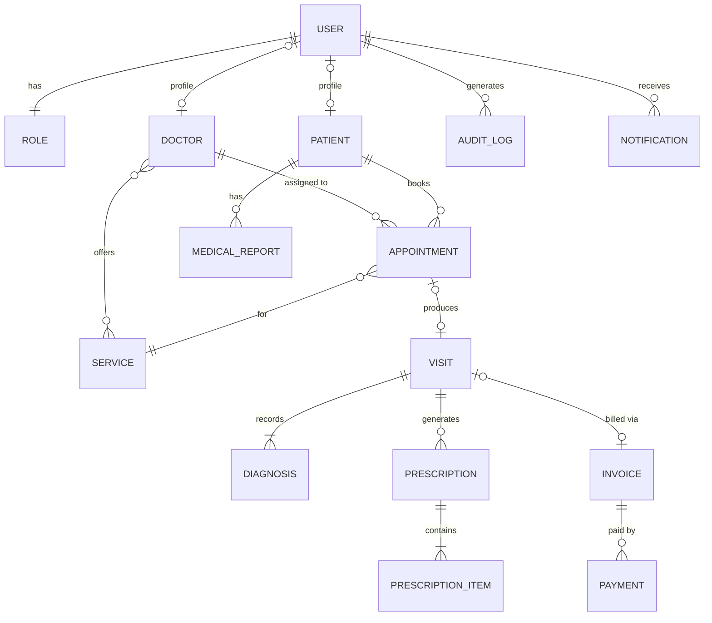

---

### 6.3 Aggregates

Aggregates define transactional consistency boundaries. All modifications within an aggregate pass through its root entity.

| Aggregate Root     | Aggregate Boundary                                      | Rationale                                                                                           |
|--------------------|---------------------------------------------------------|-----------------------------------------------------------------------------------------------------|
| **User**           | User, Role                                              | User credentials and role assignment are always modified together.                                  |
| **Patient**        | Patient                                                 | Patient demographic data is an independent entity. References User but is its own aggregate.        |
| **Doctor**         | Doctor                                                  | Doctor profile, specialty, and qualifications. References User but managed independently.           |
| **Appointment**    | Appointment                                             | Appointment scheduling is a standalone transactional unit. References Patient, Doctor, and Service. |
| **Visit**          | Visit, Diagnosis, Prescription, PrescriptionItem        | A visit and all its clinical contents (diagnoses, prescriptions) are created and modified as a unit. Prescription items cannot exist without their parent prescription, and prescriptions cannot exist without their visit. |
| **Invoice**        | Invoice, Payment                                        | An invoice and its payments form a financial unit. Payments cannot exist without an invoice, and invoice status is derived from its payments. |
| **Notification**   | Notification                                            | Notifications are fire-and-forget; each is an independent entity.                                   |
| **Service**        | Service                                                 | Clinic service definitions are managed independently.                                               |
| **ClinicSettings** | ClinicSettings                                          | Singleton aggregate storing global configuration.                                                   |
| **AuditLog**       | AuditLog                                                | Immutable, append-only entity. Each entry is independent.                                           |
| **MedicalReport**  | MedicalReport                                           | Generated documents referencing patient and visit data. Read-model artifact.                        |

**Aggregate Boundary Diagram:**

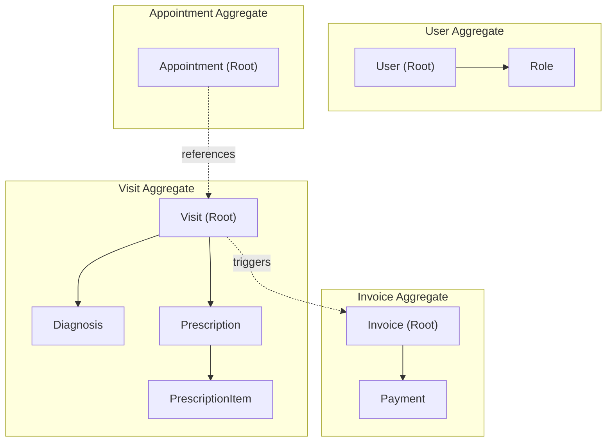

---

### 6.4 Business Rules & Constraints

The following business rules govern the behavior and integrity of the ClinicDesk system.

| #   | Rule ID | Rule Description                                                                                                                 | Enforcement       |
|-----|---------|----------------------------------------------------------------------------------------------------------------------------------|--------------------|
| 1   | BR-01   | An appointment **cannot overlap** with another appointment for the **same doctor** at the same date and time.                    | Application + DB   |
| 2   | BR-02   | An appointment **cannot overlap** with another appointment for the **same patient** at the same date and time.                   | Application + DB   |
| 3   | BR-03   | Only users with the **Doctor** role can create prescriptions and record diagnoses.                                                | Application (AuthZ)|
| 4   | BR-04   | A prescription **must contain at least one** PrescriptionItem. Empty prescriptions are not permitted.                            | Application + DB   |
| 5   | BR-05   | Invoices **cannot be deleted** once a payment has been recorded against them. They may only be voided with a credit note.        | Application + DB   |
| 6   | BR-06   | A payment amount must be **greater than zero** and **must not exceed** the invoice's outstanding balance.                        | Application        |
| 7   | BR-07   | A patient must be **checked in** (appointment status = Checked-In) before a doctor can start a visit.                            | Application        |
| 8   | BR-08   | Every visit must have **exactly one primary diagnosis**. Additional secondary diagnoses are optional.                            | Application        |
| 9   | BR-09   | Appointments can only be booked during a doctor's **configured working hours** and not during blocked time-off periods.          | Application        |
| 10  | BR-10   | An appointment can only be **cancelled** if its status is **Scheduled**. Completed, In-Progress, or already Cancelled appointments cannot be cancelled. | Application |
| 11  | BR-11   | Password reset tokens **expire after 1 hour** and are **single-use**. A consumed or expired token cannot be reused.             | Application + DB   |
| 12  | BR-12   | After **5 consecutive failed login attempts** within 15 minutes, the user account is **locked for 30 minutes**.                  | Application        |
| 13  | BR-13   | A doctor **cannot be deactivated** while they have **future scheduled appointments**. Appointments must be reassigned or cancelled first. | Application |
| 14  | BR-14   | Patient **email addresses must be unique** across all user accounts. Duplicate registrations are rejected.                       | Application + DB   |
| 15  | BR-15   | The **Patient ID** is system-generated, immutable, and follows the format `PAT-YYYYNNNN` where YYYY is the year and NNNN is a sequential number. | Application + DB |
| 16  | BR-16   | All audit log entries are **immutable** — they cannot be edited or deleted by any user, including Clinic Administrators.          | DB (append-only)   |
| 17  | BR-17   | Appointment cancellation within the **late-cancellation window** (configurable, default 2 hours before) may incur a fee.         | Application        |
| 18  | BR-18   | A visit **cannot be marked as Completed** without at least one recorded diagnosis.                                               | Application        |
| 19  | BR-19   | The system must check for **drug-allergy conflicts** and **drug-drug interactions** before a prescription is finalized. Critical conflicts require an explicit override with documented justification. | Application |
| 20  | BR-20   | Only the **Clinic Administrator** role can modify ClinicSettings (tax rates, slot durations, clinic name, etc.).                  | Application (AuthZ)|

---

# ClinicDesk — Part 3: Database & System Architecture

> **Project**: ClinicDesk — Web-based Clinic Management System
> **Stack**: React · NestJS · MySQL · JWT · Docker
> **Document Version**: 1.0
> **Last Updated**: 2026-06-09

---

## Table of Contents

- [7. Database Design (ERD)](#7-database-design-erd)
  - [7.1 Entity Relationship Diagram](#71-entity-relationship-diagram)
  - [7.2 Table Specifications](#72-table-specifications)
  - [7.3 Relationship Summary](#73-relationship-summary)
  - [7.4 Indexing Strategy](#74-indexing-strategy)
  - [7.5 Data Integrity & Conventions](#75-data-integrity--conventions)
- [8. System Architecture](#8-system-architecture)
  - [8.1 High-Level Architecture](#81-high-level-architecture)
  - [8.2 Deployment Architecture](#82-deployment-architecture)
  - [8.3 Authentication & Authorization Flow](#83-authentication--authorization-flow)
  - [8.4 NestJS Module Structure](#84-nestjs-module-structure)
  - [8.5 Frontend Architecture](#85-frontend-architecture)
  - [8.6 Backend Architecture](#86-backend-architecture)
  - [8.7 Technology Stack Summary](#87-technology-stack-summary)
  - [8.8 Hackathon Scope vs. Production Roadmap](#88-hackathon-scope-vs-production-roadmap)

---

## 7. Database Design (ERD)

### 7.1 Entity Relationship Diagram

The following Mermaid ERD captures all 17 tables, their columns with data types, and every relationship in the ClinicDesk system.

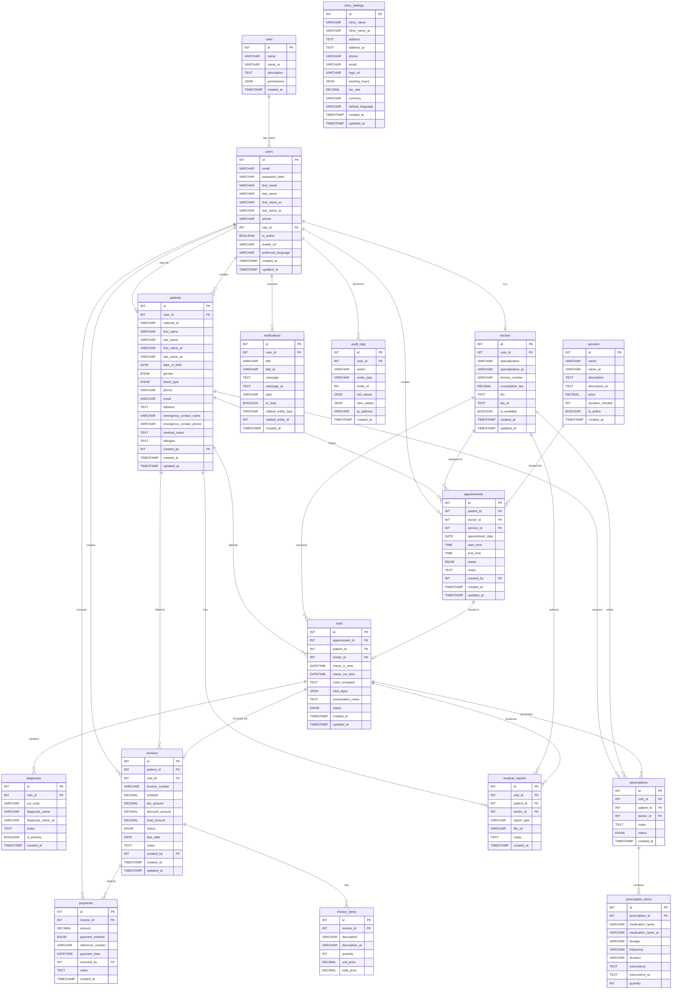

---

### 7.2 Table Specifications

Below is a detailed breakdown of every table, including column constraints, defaults, and design notes.

#### 7.2.1 `roles`

| Column | Type | Constraints | Description |
|---|---|---|---|
| `id` | INT | PK, AUTO_INCREMENT | Unique role identifier |
| `name` | VARCHAR(50) | UNIQUE, NOT NULL | Role name in English (e.g., `admin`, `doctor`, `receptionist`, `patient`) |
| `name_ar` | VARCHAR(100) | NOT NULL | Role name in Arabic |
| `description` | TEXT | NULLABLE | Human-readable description |
| `permissions` | JSON | NOT NULL, DEFAULT `'[]'` | Array of permission strings (e.g., `["patients:read","patients:write"]`) |
| `created_at` | TIMESTAMP | DEFAULT CURRENT_TIMESTAMP | Record creation time |

> [!NOTE]
> **Seed Roles**: The system ships with four default roles — `admin`, `doctor`, `receptionist`, and `patient`. The `permissions` JSON column enables RBAC without a separate pivot table, keeping the schema hackathon-friendly while remaining extensible.

---

#### 7.2.2 `users`

| Column | Type | Constraints | Description |
|---|---|---|---|
| `id` | INT | PK, AUTO_INCREMENT | Unique user identifier |
| `email` | VARCHAR(255) | UNIQUE, NOT NULL | Login email address |
| `password_hash` | VARCHAR(255) | NOT NULL | Bcrypt-hashed password |
| `first_name` | VARCHAR(100) | NOT NULL | First name (English) |
| `last_name` | VARCHAR(100) | NOT NULL | Last name (English) |
| `first_name_ar` | VARCHAR(100) | NULLABLE | First name (Arabic) |
| `last_name_ar` | VARCHAR(100) | NULLABLE | Last name (Arabic) |
| `phone` | VARCHAR(20) | NULLABLE | Phone number |
| `role_id` | INT | FK → `roles.id`, NOT NULL | Assigned role |
| `is_active` | BOOLEAN | DEFAULT `TRUE` | Soft-disable account |
| `avatar_url` | VARCHAR(500) | NULLABLE | Path to profile image |
| `preferred_language` | VARCHAR(5) | DEFAULT `'en'` | `en` or `ar` |
| `created_at` | TIMESTAMP | DEFAULT CURRENT_TIMESTAMP | Record creation time |
| `updated_at` | TIMESTAMP | ON UPDATE CURRENT_TIMESTAMP | Last modification time |

---

#### 7.2.3 `patients`

| Column | Type | Constraints | Description |
|---|---|---|---|
| `id` | INT | PK, AUTO_INCREMENT | Unique patient identifier |
| `user_id` | INT | FK → `users.id`, NULLABLE, UNIQUE | Linked user account (nullable — patients can exist without login) |
| `national_id` | VARCHAR(20) | UNIQUE, NULLABLE | Government-issued ID |
| `first_name` | VARCHAR(100) | NOT NULL | First name (English) |
| `last_name` | VARCHAR(100) | NOT NULL | Last name (English) |
| `first_name_ar` | VARCHAR(100) | NULLABLE | First name (Arabic) |
| `last_name_ar` | VARCHAR(100) | NULLABLE | Last name (Arabic) |
| `date_of_birth` | DATE | NOT NULL | Date of birth |
| `gender` | ENUM('male','female','other') | NOT NULL | Patient gender |
| `blood_type` | ENUM('A+','A-','B+','B-','AB+','AB-','O+','O-') | NULLABLE | Blood group |
| `phone` | VARCHAR(20) | NOT NULL | Primary phone |
| `email` | VARCHAR(255) | NULLABLE | Contact email |
| `address` | TEXT | NULLABLE | Street address |
| `emergency_contact_name` | VARCHAR(200) | NULLABLE | Emergency contact full name |
| `emergency_contact_phone` | VARCHAR(20) | NULLABLE | Emergency contact phone |
| `medical_notes` | TEXT | NULLABLE | General medical notes |
| `allergies` | TEXT | NULLABLE | Known allergies (free text or comma-separated) |
| `created_by` | INT | FK → `users.id`, NOT NULL | Staff member who registered the patient |
| `created_at` | TIMESTAMP | DEFAULT CURRENT_TIMESTAMP | Record creation time |
| `updated_at` | TIMESTAMP | ON UPDATE CURRENT_TIMESTAMP | Last modification time |

> [!IMPORTANT]
> `user_id` is **nullable** by design. Walk-in patients are registered by receptionists and do not need a user account. If a patient later creates an account, the records are linked via this FK.

---

#### 7.2.4 `doctors`

| Column | Type | Constraints | Description |
|---|---|---|---|
| `id` | INT | PK, AUTO_INCREMENT | Unique doctor identifier |
| `user_id` | INT | FK → `users.id`, UNIQUE, NOT NULL | Linked user account |
| `specialization` | VARCHAR(100) | NOT NULL | Specialization (English) |
| `specialization_ar` | VARCHAR(150) | NULLABLE | Specialization (Arabic) |
| `license_number` | VARCHAR(50) | UNIQUE, NOT NULL | Medical license number |
| `consultation_fee` | DECIMAL(10,2) | DEFAULT `0.00` | Base consultation fee |
| `bio` | TEXT | NULLABLE | Doctor biography (English) |
| `bio_ar` | TEXT | NULLABLE | Doctor biography (Arabic) |
| `is_available` | BOOLEAN | DEFAULT `TRUE` | Currently accepting appointments |
| `created_at` | TIMESTAMP | DEFAULT CURRENT_TIMESTAMP | Record creation time |
| `updated_at` | TIMESTAMP | ON UPDATE CURRENT_TIMESTAMP | Last modification time |

---

#### 7.2.5 `services`

| Column | Type | Constraints | Description |
|---|---|---|---|
| `id` | INT | PK, AUTO_INCREMENT | Unique service identifier |
| `name` | VARCHAR(150) | NOT NULL | Service name (English) |
| `name_ar` | VARCHAR(200) | NULLABLE | Service name (Arabic) |
| `description` | TEXT | NULLABLE | Description (English) |
| `description_ar` | TEXT | NULLABLE | Description (Arabic) |
| `price` | DECIMAL(10,2) | NOT NULL | Service price |
| `duration_minutes` | INT | NOT NULL, DEFAULT `30` | Expected duration |
| `is_active` | BOOLEAN | DEFAULT `TRUE` | Whether the service is currently offered |
| `created_at` | TIMESTAMP | DEFAULT CURRENT_TIMESTAMP | Record creation time |

---

#### 7.2.6 `appointments`

| Column | Type | Constraints | Description |
|---|---|---|---|
| `id` | INT | PK, AUTO_INCREMENT | Unique appointment identifier |
| `patient_id` | INT | FK → `patients.id`, NOT NULL | Patient being seen |
| `doctor_id` | INT | FK → `doctors.id`, NOT NULL | Assigned doctor |
| `service_id` | INT | FK → `services.id`, NULLABLE | Service being provided |
| `appointment_date` | DATE | NOT NULL | Date of the appointment |
| `start_time` | TIME | NOT NULL | Scheduled start time |
| `end_time` | TIME | NOT NULL | Scheduled end time |
| `status` | ENUM('scheduled','confirmed','checked_in','in_progress','completed','cancelled','no_show') | DEFAULT `'scheduled'` | Current appointment status |
| `notes` | TEXT | NULLABLE | Appointment-level notes |
| `created_by` | INT | FK → `users.id`, NOT NULL | User who created the appointment |
| `created_at` | TIMESTAMP | DEFAULT CURRENT_TIMESTAMP | Record creation time |
| `updated_at` | TIMESTAMP | ON UPDATE CURRENT_TIMESTAMP | Last modification time |

> [!TIP]
> **Status State Machine**: Appointments follow a strict lifecycle — `scheduled → confirmed → checked_in → in_progress → completed`. At any stage before `completed`, the status can transition to `cancelled` or `no_show`. Enforce this in the NestJS service layer, not in the database.

---

#### 7.2.7 `visits`

| Column | Type | Constraints | Description |
|---|---|---|---|
| `id` | INT | PK, AUTO_INCREMENT | Unique visit identifier |
| `appointment_id` | INT | FK → `appointments.id`, UNIQUE, NULLABLE | Originating appointment (nullable for walk-ins) |
| `patient_id` | INT | FK → `patients.id`, NOT NULL | Patient |
| `doctor_id` | INT | FK → `doctors.id`, NOT NULL | Attending doctor |
| `check_in_time` | DATETIME | NOT NULL | Actual check-in time |
| `check_out_time` | DATETIME | NULLABLE | Actual check-out time |
| `chief_complaint` | TEXT | NULLABLE | Patient's primary complaint |
| `vital_signs` | JSON | NULLABLE | Structured vitals: `{"bp":"120/80","temp":37.0,"pulse":72,"weight":70,"height":175}` |
| `examination_notes` | TEXT | NULLABLE | Doctor's examination notes |
| `status` | ENUM('checked_in','in_progress','completed','cancelled') | DEFAULT `'checked_in'` | Visit status |
| `created_at` | TIMESTAMP | DEFAULT CURRENT_TIMESTAMP | Record creation time |
| `updated_at` | TIMESTAMP | ON UPDATE CURRENT_TIMESTAMP | Last modification time |

---

#### 7.2.8 `diagnoses`

| Column | Type | Constraints | Description |
|---|---|---|---|
| `id` | INT | PK, AUTO_INCREMENT | Unique diagnosis identifier |
| `visit_id` | INT | FK → `visits.id`, NOT NULL | Parent visit |
| `icd_code` | VARCHAR(10) | NULLABLE | ICD-10 code (e.g., `J06.9`) |
| `diagnosis_name` | VARCHAR(255) | NOT NULL | Diagnosis name (English) |
| `diagnosis_name_ar` | VARCHAR(255) | NULLABLE | Diagnosis name (Arabic) |
| `notes` | TEXT | NULLABLE | Additional clinical notes |
| `is_primary` | BOOLEAN | DEFAULT `FALSE` | Whether this is the primary diagnosis |
| `created_at` | TIMESTAMP | DEFAULT CURRENT_TIMESTAMP | Record creation time |

---

#### 7.2.9 `prescriptions`

| Column | Type | Constraints | Description |
|---|---|---|---|
| `id` | INT | PK, AUTO_INCREMENT | Unique prescription identifier |
| `visit_id` | INT | FK → `visits.id`, NOT NULL | Parent visit |
| `patient_id` | INT | FK → `patients.id`, NOT NULL | Patient (denormalized for quick lookup) |
| `doctor_id` | INT | FK → `doctors.id`, NOT NULL | Prescribing doctor |
| `notes` | TEXT | NULLABLE | General prescription notes |
| `status` | ENUM('active','dispensed','cancelled') | DEFAULT `'active'` | Prescription status |
| `created_at` | TIMESTAMP | DEFAULT CURRENT_TIMESTAMP | Record creation time |

---

#### 7.2.10 `prescription_items`

| Column | Type | Constraints | Description |
|---|---|---|---|
| `id` | INT | PK, AUTO_INCREMENT | Unique item identifier |
| `prescription_id` | INT | FK → `prescriptions.id`, NOT NULL, ON DELETE CASCADE | Parent prescription |
| `medication_name` | VARCHAR(200) | NOT NULL | Medication name (English) |
| `medication_name_ar` | VARCHAR(200) | NULLABLE | Medication name (Arabic) |
| `dosage` | VARCHAR(100) | NOT NULL | Dosage (e.g., `500mg`) |
| `frequency` | VARCHAR(100) | NOT NULL | Frequency (e.g., `3 times daily`) |
| `duration` | VARCHAR(100) | NOT NULL | Duration (e.g., `7 days`) |
| `instructions` | TEXT | NULLABLE | Special instructions (English) |
| `instructions_ar` | TEXT | NULLABLE | Special instructions (Arabic) |
| `quantity` | INT | NOT NULL, DEFAULT `1` | Number of units to dispense |

---

#### 7.2.11 `invoices`

| Column | Type | Constraints | Description |
|---|---|---|---|
| `id` | INT | PK, AUTO_INCREMENT | Unique invoice identifier |
| `patient_id` | INT | FK → `patients.id`, NOT NULL | Billed patient |
| `visit_id` | INT | FK → `visits.id`, NULLABLE | Related visit |
| `invoice_number` | VARCHAR(30) | UNIQUE, NOT NULL | Human-readable number (e.g., `INV-2026-00042`) |
| `subtotal` | DECIMAL(10,2) | NOT NULL, DEFAULT `0.00` | Sum before tax/discount |
| `tax_amount` | DECIMAL(10,2) | NOT NULL, DEFAULT `0.00` | Calculated tax |
| `discount_amount` | DECIMAL(10,2) | NOT NULL, DEFAULT `0.00` | Applied discount |
| `total_amount` | DECIMAL(10,2) | NOT NULL, DEFAULT `0.00` | Final amount due |
| `status` | ENUM('draft','issued','paid','partially_paid','cancelled') | DEFAULT `'draft'` | Invoice status |
| `due_date` | DATE | NULLABLE | Payment due date |
| `notes` | TEXT | NULLABLE | Internal notes |
| `created_by` | INT | FK → `users.id`, NOT NULL | User who generated the invoice |
| `created_at` | TIMESTAMP | DEFAULT CURRENT_TIMESTAMP | Record creation time |
| `updated_at` | TIMESTAMP | ON UPDATE CURRENT_TIMESTAMP | Last modification time |

---

#### 7.2.12 `invoice_items`

| Column | Type | Constraints | Description |
|---|---|---|---|
| `id` | INT | PK, AUTO_INCREMENT | Unique item identifier |
| `invoice_id` | INT | FK → `invoices.id`, NOT NULL, ON DELETE CASCADE | Parent invoice |
| `description` | VARCHAR(255) | NOT NULL | Line item description (English) |
| `description_ar` | VARCHAR(255) | NULLABLE | Line item description (Arabic) |
| `quantity` | INT | NOT NULL, DEFAULT `1` | Quantity |
| `unit_price` | DECIMAL(10,2) | NOT NULL | Price per unit |
| `total_price` | DECIMAL(10,2) | NOT NULL | `quantity × unit_price` |

---

#### 7.2.13 `payments`

| Column | Type | Constraints | Description |
|---|---|---|---|
| `id` | INT | PK, AUTO_INCREMENT | Unique payment identifier |
| `invoice_id` | INT | FK → `invoices.id`, NOT NULL | Invoice being paid |
| `amount` | DECIMAL(10,2) | NOT NULL | Payment amount |
| `payment_method` | ENUM('cash','card','insurance') | NOT NULL | Method of payment |
| `reference_number` | VARCHAR(100) | NULLABLE | Transaction reference / receipt number |
| `payment_date` | DATETIME | NOT NULL | When payment was received |
| `received_by` | INT | FK → `users.id`, NOT NULL | Staff member who received payment |
| `notes` | TEXT | NULLABLE | Payment notes |
| `created_at` | TIMESTAMP | DEFAULT CURRENT_TIMESTAMP | Record creation time |

---

#### 7.2.14 `notifications`

| Column | Type | Constraints | Description |
|---|---|---|---|
| `id` | INT | PK, AUTO_INCREMENT | Unique notification identifier |
| `user_id` | INT | FK → `users.id`, NOT NULL | Recipient user |
| `title` | VARCHAR(200) | NOT NULL | Notification title (English) |
| `title_ar` | VARCHAR(200) | NULLABLE | Notification title (Arabic) |
| `message` | TEXT | NOT NULL | Notification body (English) |
| `message_ar` | TEXT | NULLABLE | Notification body (Arabic) |
| `type` | VARCHAR(50) | NOT NULL | Type identifier (e.g., `appointment_reminder`, `payment_received`, `system_alert`) |
| `is_read` | BOOLEAN | DEFAULT `FALSE` | Read status |
| `related_entity_type` | VARCHAR(50) | NULLABLE | Polymorphic type (e.g., `appointment`, `invoice`) |
| `related_entity_id` | INT | NULLABLE | Polymorphic ID linking to related record |
| `created_at` | TIMESTAMP | DEFAULT CURRENT_TIMESTAMP | Record creation time |

---

#### 7.2.15 `clinic_settings`

| Column | Type | Constraints | Description |
|---|---|---|---|
| `id` | INT | PK, AUTO_INCREMENT | Unique record (singleton — always `id = 1`) |
| `clinic_name` | VARCHAR(200) | NOT NULL | Clinic name (English) |
| `clinic_name_ar` | VARCHAR(200) | NULLABLE | Clinic name (Arabic) |
| `address` | TEXT | NULLABLE | Address (English) |
| `address_ar` | TEXT | NULLABLE | Address (Arabic) |
| `phone` | VARCHAR(20) | NULLABLE | Clinic phone |
| `email` | VARCHAR(255) | NULLABLE | Clinic email |
| `logo_url` | VARCHAR(500) | NULLABLE | Logo image path |
| `working_hours` | JSON | NULLABLE | Structured hours: `{"sun":{"open":"08:00","close":"17:00"},...}` |
| `tax_rate` | DECIMAL(5,2) | DEFAULT `15.00` | VAT percentage |
| `currency` | VARCHAR(5) | DEFAULT `'SAR'` | Currency code |
| `default_language` | VARCHAR(5) | DEFAULT `'en'` | System default language |
| `created_at` | TIMESTAMP | DEFAULT CURRENT_TIMESTAMP | Record creation time |
| `updated_at` | TIMESTAMP | ON UPDATE CURRENT_TIMESTAMP | Last modification time |

> [!NOTE]
> This table is a **singleton** — only one row ever exists. It's accessed via `ClinicSettingsService.get()` which caches the result in-memory and invalidates on update.

---

#### 7.2.16 `audit_logs`

| Column | Type | Constraints | Description |
|---|---|---|---|
| `id` | INT | PK, AUTO_INCREMENT | Unique log entry identifier |
| `user_id` | INT | FK → `users.id`, NULLABLE | Acting user (null for system actions) |
| `action` | VARCHAR(50) | NOT NULL | Action performed (`CREATE`, `UPDATE`, `DELETE`, `LOGIN`, `LOGOUT`) |
| `entity_type` | VARCHAR(50) | NOT NULL | Entity being acted on (e.g., `patient`, `appointment`) |
| `entity_id` | INT | NULLABLE | ID of the affected entity |
| `old_values` | JSON | NULLABLE | Previous state (for updates) |
| `new_values` | JSON | NULLABLE | New state (for creates/updates) |
| `ip_address` | VARCHAR(45) | NULLABLE | Client IP (supports IPv6) |
| `created_at` | TIMESTAMP | DEFAULT CURRENT_TIMESTAMP | When the action occurred |

> [!TIP]
> Audit logs are **append-only** — no UPDATE or DELETE operations are permitted on this table. Implement this restriction at the TypeORM entity level via a custom subscriber, not via DB triggers, to keep the hackathon setup simple.

---

#### 7.2.17 `medical_reports`

| Column | Type | Constraints | Description |
|---|---|---|---|
| `id` | INT | PK, AUTO_INCREMENT | Unique report identifier |
| `visit_id` | INT | FK → `visits.id`, NOT NULL | Parent visit |
| `patient_id` | INT | FK → `patients.id`, NOT NULL | Patient (denormalized) |
| `doctor_id` | INT | FK → `doctors.id`, NOT NULL | Authoring doctor |
| `report_type` | VARCHAR(50) | NOT NULL | Type (e.g., `lab_result`, `imaging`, `clinical_note`, `referral`) |
| `file_url` | VARCHAR(500) | NULLABLE | Path to uploaded file |
| `notes` | TEXT | NULLABLE | Report notes / summary |
| `created_at` | TIMESTAMP | DEFAULT CURRENT_TIMESTAMP | Record creation time |

---

### 7.3 Relationship Summary

The following table documents every foreign key relationship in the system:

| From Table | Column | To Table | Column | Cardinality | ON DELETE |
|---|---|---|---|---|---|
| `users` | `role_id` | `roles` | `id` | Many-to-One | RESTRICT |
| `patients` | `user_id` | `users` | `id` | One-to-One (nullable) | SET NULL |
| `patients` | `created_by` | `users` | `id` | Many-to-One | RESTRICT |
| `doctors` | `user_id` | `users` | `id` | One-to-One | CASCADE |
| `appointments` | `patient_id` | `patients` | `id` | Many-to-One | RESTRICT |
| `appointments` | `doctor_id` | `doctors` | `id` | Many-to-One | RESTRICT |
| `appointments` | `service_id` | `services` | `id` | Many-to-One | SET NULL |
| `appointments` | `created_by` | `users` | `id` | Many-to-One | RESTRICT |
| `visits` | `appointment_id` | `appointments` | `id` | One-to-One (nullable) | SET NULL |
| `visits` | `patient_id` | `patients` | `id` | Many-to-One | RESTRICT |
| `visits` | `doctor_id` | `doctors` | `id` | Many-to-One | RESTRICT |
| `diagnoses` | `visit_id` | `visits` | `id` | Many-to-One | CASCADE |
| `prescriptions` | `visit_id` | `visits` | `id` | Many-to-One | CASCADE |
| `prescriptions` | `patient_id` | `patients` | `id` | Many-to-One | RESTRICT |
| `prescriptions` | `doctor_id` | `doctors` | `id` | Many-to-One | RESTRICT |
| `prescription_items` | `prescription_id` | `prescriptions` | `id` | Many-to-One | CASCADE |
| `invoices` | `patient_id` | `patients` | `id` | Many-to-One | RESTRICT |
| `invoices` | `visit_id` | `visits` | `id` | Many-to-One | SET NULL |
| `invoices` | `created_by` | `users` | `id` | Many-to-One | RESTRICT |
| `invoice_items` | `invoice_id` | `invoices` | `id` | Many-to-One | CASCADE |
| `payments` | `invoice_id` | `invoices` | `id` | Many-to-One | RESTRICT |
| `payments` | `received_by` | `users` | `id` | Many-to-One | RESTRICT |
| `notifications` | `user_id` | `users` | `id` | Many-to-One | CASCADE |
| `audit_logs` | `user_id` | `users` | `id` | Many-to-One | SET NULL |
| `medical_reports` | `visit_id` | `visits` | `id` | Many-to-One | CASCADE |
| `medical_reports` | `patient_id` | `patients` | `id` | Many-to-One | RESTRICT |
| `medical_reports` | `doctor_id` | `doctors` | `id` | Many-to-One | RESTRICT |

---

### 7.4 Indexing Strategy

Beyond primary keys and foreign keys (which MySQL/InnoDB auto-indexes), the following additional indexes are recommended:

| Table | Index Name | Columns | Type | Rationale |
|---|---|---|---|---|
| `users` | `idx_users_email` | `email` | UNIQUE | Login lookup |
| `patients` | `idx_patients_national_id` | `national_id` | UNIQUE | National ID search |
| `patients` | `idx_patients_phone` | `phone` | INDEX | Phone search |
| `patients` | `idx_patients_name` | `last_name, first_name` | INDEX | Name search |
| `doctors` | `idx_doctors_license` | `license_number` | UNIQUE | License lookup |
| `appointments` | `idx_appt_date_doctor` | `appointment_date, doctor_id` | INDEX | Schedule view queries |
| `appointments` | `idx_appt_date_patient` | `appointment_date, patient_id` | INDEX | Patient schedule queries |
| `appointments` | `idx_appt_status` | `status` | INDEX | Status filtering |
| `visits` | `idx_visits_patient` | `patient_id, created_at` | INDEX | Patient history |
| `invoices` | `idx_invoices_number` | `invoice_number` | UNIQUE | Invoice lookup |
| `invoices` | `idx_invoices_status` | `status` | INDEX | Financial reports |
| `notifications` | `idx_notif_user_read` | `user_id, is_read` | INDEX | Unread notification count |
| `audit_logs` | `idx_audit_entity` | `entity_type, entity_id` | INDEX | Entity history lookup |
| `audit_logs` | `idx_audit_user` | `user_id, created_at` | INDEX | User activity log |

---

### 7.5 Data Integrity & Conventions

| Convention | Details |
|---|---|
| **Primary Keys** | All tables use `INT AUTO_INCREMENT` named `id`. UUIDs are avoided to keep MySQL performance optimal and hackathon setup simple. |
| **Timestamps** | All tables include `created_at` (auto-set). Tables with mutable data include `updated_at` (auto-updated). |
| **Soft Deletes** | Not implemented globally — only `users.is_active` and `services.is_active` act as soft-disable flags. Records are never hard-deleted in clinical tables; cancellation statuses are used instead. |
| **Bilingual Columns** | Arabic translations use `_ar` suffix columns. This avoids the complexity of a translations table while supporting the two target languages. |
| **Monetary Values** | All currency amounts use `DECIMAL(10,2)` — never `FLOAT` or `DOUBLE`. |
| **ENUM Columns** | Used for fixed-value sets (statuses, gender, blood type, payment method). If the set is expected to grow, use a VARCHAR + application-level validation instead. |
| **JSON Columns** | Used sparingly for semi-structured data (`vital_signs`, `permissions`, `working_hours`, `old_values`/`new_values`). Always define a TypeScript interface for the JSON shape. |
| **Character Set** | All tables use `utf8mb4` collation to fully support Arabic text and emoji. |
| **Engine** | InnoDB for all tables (transactional support, FK constraints, row-level locking). |

---

## 8. System Architecture

### 8.1 High-Level Architecture

The following diagram shows the end-to-end request flow, from client browser through the deployment infrastructure to the database.

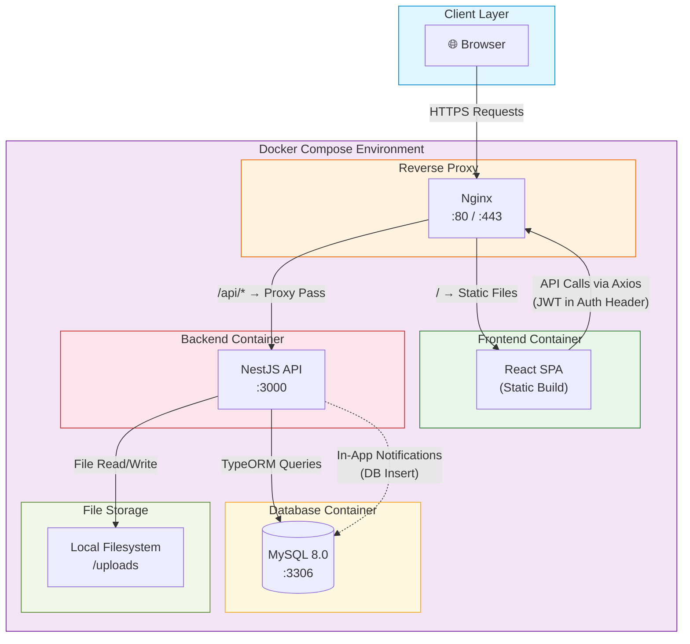

---

### 8.2 Deployment Architecture

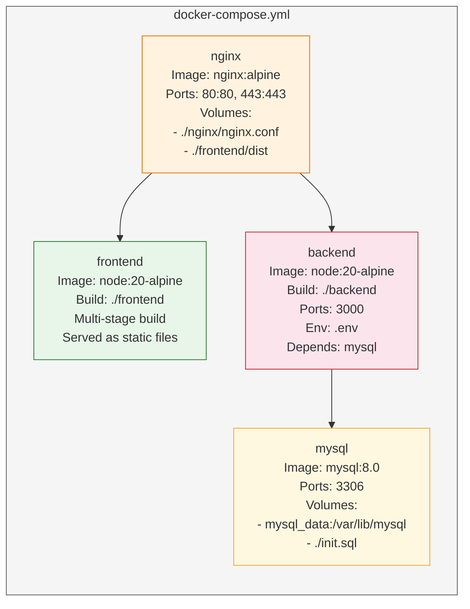

**Docker Compose Services:**

| Service | Image | Ports | Key Configuration |
|---|---|---|---|
| `nginx` | `nginx:alpine` | `80:80`, `443:443` | Reverse proxy; serves React static build; proxies `/api` to backend |
| `frontend` | Multi-stage `node:20-alpine` | — (served via nginx) | Built with `npm run build`; output copied to nginx volume |
| `backend` | `node:20-alpine` | `3000:3000` | NestJS app; reads `.env` for DB credentials and JWT secret |
| `mysql` | `mysql:8.0` | `3306:3306` | Persistent volume `mysql_data`; initialized with seed SQL |

---

### 8.3 Authentication & Authorization Flow

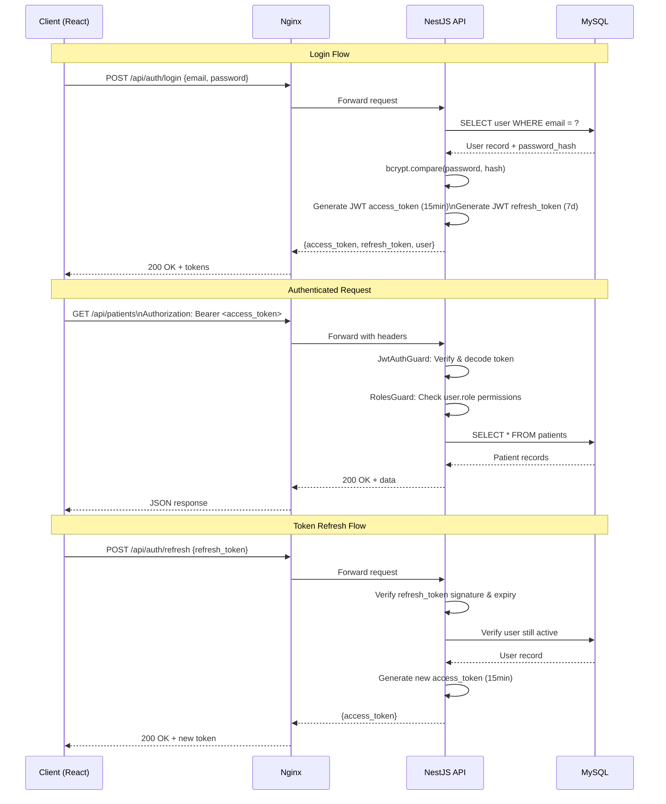

**JWT Token Strategy:**

| Token | Lifetime | Storage (Client) | Purpose |
|---|---|---|---|
| `access_token` | 15 minutes | Memory (React state) | API authentication |
| `refresh_token` | 7 days | `httpOnly` cookie | Silent token renewal |

**RBAC Middleware Chain:**

```
Request → JwtAuthGuard → RolesGuard → Controller
              │                │
              ▼                ▼
         Verify JWT      Check permissions
         Extract user     from role.permissions
         Attach to req    against @Permissions()
                          decorator
```

---

### 8.4 NestJS Module Structure

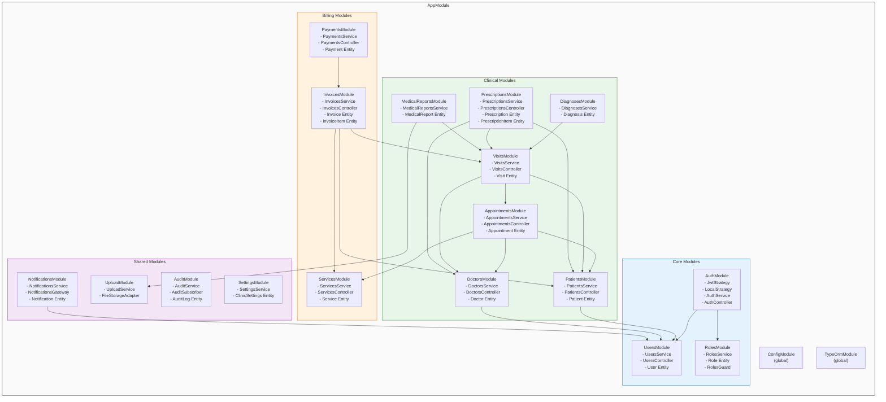

---

### 8.5 Frontend Architecture

| Concern | Technology | Details |
|---|---|---|
| **Framework** | React 18 | Functional components with hooks |
| **Routing** | React Router v6 | Nested routes with layout wrappers and protected route components |
| **State Management** | React Query + Context | React Query for server state caching; Context API for auth/theme/language |
| **HTTP Client** | Axios | Centralized instance with interceptors for JWT injection and 401 refresh logic |
| **UI Generation** | Stitch UI Generation | Automated, custom React components with Vanilla CSS; RTL-ready; supports dynamic bilingual forms and tables |
| **Internationalization** | i18next + react-i18next | Namespaced JSON translation files for `en` and `ar`; RTL layout toggle |
| **Charts** | Recharts | Dashboard analytics: appointment trends, revenue charts, patient demographics |
| **Forms** | React Hook Form + Zod | Declarative validation with bilingual error messages |
| **Date Handling** | Day.js | Lightweight; supports Arabic locale and Hijri calendar plugin |

**Frontend Directory Structure:**

```
frontend/src/
├── api/              # Axios instance, API service modules
├── assets/           # Images, fonts, static files
├── components/       # Reusable UI components
│   ├── common/       # Buttons, modals, tables, loaders
│   └── layout/       # Sidebar, header, RTL wrapper
├── contexts/         # AuthContext, ThemeContext, LanguageContext
├── hooks/            # Custom hooks (useAuth, useDebounce, etc.)
├── locales/          # i18n JSON files (en/, ar/)
├── pages/            # Route-level page components
│   ├── auth/         # Login, ForgotPassword
│   ├── dashboard/    # Main dashboard
│   ├── patients/     # Patient list, detail, create/edit
│   ├── appointments/ # Calendar view, appointment form
│   ├── visits/       # Visit workflow, diagnosis, prescription
│   ├── billing/      # Invoices, payments
│   ├── reports/      # Medical reports, analytics
│   └── settings/     # Clinic settings, user management
├── routes/           # Route definitions, ProtectedRoute
├── utils/            # Helpers, formatters, constants
├── App.tsx
└── main.tsx
```

---

### 8.6 Backend Architecture

| Concern | Technology | Details |
|---|---|---|
| **Framework** | NestJS 10 | Modular architecture; decorators for routes, guards, pipes |
| **ORM** | TypeORM | Entity-based models; migrations for schema management; repository pattern |
| **Validation** | class-validator + class-transformer | DTO-level validation with decorators; auto-transform request payloads |
| **Authentication** | Passport + @nestjs/jwt | Local strategy for login; JWT strategy for protected routes |
| **Authorization** | Custom guards | `RolesGuard` reads `@Permissions()` decorator and compares against `role.permissions` JSON |
| **API Documentation** | @nestjs/swagger | Auto-generated OpenAPI spec at `/api/docs`; DTOs decorated with `@ApiProperty()` |
| **File Upload** | Multer (via NestJS) | `UploadModule` abstracts storage; local disk for hackathon, S3-compatible adapter ready |
| **Email (optional)** | Nodemailer | `NotificationsModule` can dispatch emails for critical alerts; disabled by default |
| **Logging** | NestJS Logger + Winston | Structured JSON logs; log levels configurable via env |
| **Configuration** | @nestjs/config | `.env` file support; validated via Joi schema at startup |

**Backend Directory Structure:**

```
backend/src/
├── auth/
│   ├── auth.module.ts
│   ├── auth.service.ts
│   ├── auth.controller.ts
│   ├── strategies/         # jwt.strategy.ts, local.strategy.ts
│   ├── guards/             # jwt-auth.guard.ts, roles.guard.ts
│   └── dto/                # login.dto.ts, register.dto.ts
├── users/
│   ├── users.module.ts
│   ├── users.service.ts
│   ├── users.controller.ts
│   ├── entities/           # user.entity.ts
│   └── dto/                # create-user.dto.ts, update-user.dto.ts
├── patients/
│   ├── patients.module.ts
│   ├── patients.service.ts
│   ├── patients.controller.ts
│   ├── entities/           # patient.entity.ts
│   └── dto/
├── doctors/                # Same pattern
├── appointments/           # Same pattern
├── visits/                 # Same pattern
├── diagnoses/              # Same pattern
├── prescriptions/          # + prescription-item.entity.ts
├── services/               # Clinic services (not NestJS services)
├── invoices/               # + invoice-item.entity.ts
├── payments/
├── notifications/
│   ├── notifications.gateway.ts  # WebSocket gateway (optional)
│   └── ...
├── audit/
│   ├── audit.subscriber.ts      # TypeORM subscriber for auto-logging
│   └── ...
├── settings/
├── upload/
│   ├── upload.service.ts
│   ├── adapters/                 # local.adapter.ts, s3.adapter.ts
│   └── ...
├── common/
│   ├── decorators/          # @Permissions(), @CurrentUser()
│   ├── filters/             # http-exception.filter.ts
│   ├── interceptors/        # transform.interceptor.ts, audit.interceptor.ts
│   ├── pipes/               # validation.pipe.ts
│   └── interfaces/          # pagination.interface.ts
├── config/
│   ├── database.config.ts
│   ├── jwt.config.ts
│   └── app.config.ts
├── app.module.ts
└── main.ts
```

---

### 8.7 Technology Stack Summary

| Layer | Technology | Version | Purpose |
|---|---|---|---|
| **Frontend** | React | 18.x | UI framework |
| | TypeScript | 5.x | Type safety |
| | Stitch | Latest | UI Generation library (RTL support, Vanilla CSS) |
| | React Router | 6.x | Client-side routing |
| | React Query | 5.x | Server state management |
| | Axios | 1.x | HTTP client |
| | i18next | 23.x | Internationalization (EN/AR) |
| | Recharts | 2.x | Dashboard charts |
| | Vite | 5.x | Build tool & dev server |
| **Backend** | NestJS | 10.x | API framework |
| | TypeORM | 0.3.x | ORM & migrations |
| | Passport | 0.7.x | Authentication strategies |
| | class-validator | 0.14.x | Request validation |
| | Swagger | 7.x | API documentation |
| | Multer | 1.x | File uploads |
| | Nodemailer | 6.x | Email dispatch (optional) |
| **Database** | MySQL | 8.0 | Primary data store |
| **Infrastructure** | Docker | 24.x | Containerization |
| | Docker Compose | 2.x | Multi-container orchestration |
| | Nginx | 1.25 (alpine) | Reverse proxy & static serving |
| **Dev Tools** | ESLint + Prettier | — | Code quality |
| | Jest | 29.x | Unit & integration testing |
| | Husky + lint-staged | — | Pre-commit hooks |

---

### 8.8 Hackathon Scope vs. Production Roadmap

The architecture is designed to be **production-grade in structure** but **hackathon-realistic in scope**. The following table distinguishes what ships in the hackathon versus what the architecture supports for future expansion.

| Concern | Hackathon (MVP) | Production Extension |
|---|---|---|
| **Authentication** | JWT with access + refresh tokens | OAuth 2.0 / SSO integration |
| **Authorization** | JSON permissions in `roles` table | Dedicated permissions table with UI management |
| **File Storage** | Local filesystem (`/uploads`) | AWS S3 / MinIO with signed URLs |
| **Notifications** | In-app (DB-stored, polled via API) | WebSocket push + Email + SMS via queue |
| **Email** | Disabled by default | Nodemailer with template engine, queued via Bull |
| **Caching** | None (acceptable at hackathon scale) | Redis for sessions, query cache, rate limiting |
| **Search** | SQL `LIKE` queries | Elasticsearch for patient/diagnosis search |
| **Logging** | Console + file logger | ELK stack (Elasticsearch, Logstash, Kibana) |
| **CI/CD** | Manual `docker-compose up` | GitHub Actions → Docker Registry → K8s deploy |
| **Monitoring** | None | Prometheus + Grafana, Sentry for error tracking |
| **Database** | Single MySQL instance | Read replicas, automated backups, connection pooling |
| **API Versioning** | None (single version) | URL-based versioning (`/api/v1/`, `/api/v2/`) |
| **Testing** | Key unit tests for services | Full coverage: unit, integration, E2E, load tests |
| **Rate Limiting** | Basic NestJS throttler | Redis-backed distributed rate limiting |
| **Audit Trail** | Selective entity auditing | Full audit with TypeORM subscriber on all entities |

> [!IMPORTANT]
> The architecture uses **adapter patterns** (e.g., `FileStorageAdapter`) and **NestJS module boundaries** so that every hackathon shortcut can be replaced with a production-grade solution without refactoring the application structure. Build fast, migrate cleanly.

---

# 9. API Design

## 9.1 API Conventions

### Base URL
```
https://api.clinicdesk.com/api/v1
```

### Standard Response Format

**Success Response:**
```json
{
  "success": true,
  "data": { },
  "message": "Operation completed successfully",
  "meta": {
    "page": 1,
    "limit": 20,
    "total": 150,
    "totalPages": 8
  }
}
```

**Error Response:**
```json
{
  "success": false,
  "error": {
    "code": "VALIDATION_ERROR",
    "message": "Validation failed",
    "details": [
      {
        "field": "email",
        "message": "Email is required"
      }
    ]
  }
}
```

### HTTP Status Code Conventions

| Status Code | Usage |
|-------------|-------|
| `200 OK` | Successful GET, PUT, PATCH |
| `201 Created` | Successful POST (resource created) |
| `204 No Content` | Successful DELETE |
| `400 Bad Request` | Validation errors, malformed request |
| `401 Unauthorized` | Missing or invalid JWT token |
| `403 Forbidden` | Insufficient role/permissions |
| `404 Not Found` | Resource not found |
| `409 Conflict` | Duplicate resource / scheduling conflict |
| `422 Unprocessable Entity` | Business rule violation |
| `500 Internal Server Error` | Unexpected server error |

### Pagination Query Parameters
```
GET /api/v1/patients?page=1&limit=20&sort=created_at&order=desc
```

| Parameter | Type | Default | Description |
|-----------|------|---------|-------------|
| `page` | integer | 1 | Page number (1-indexed) |
| `limit` | integer | 20 | Items per page (max 100) |
| `sort` | string | `created_at` | Sort field |
| `order` | string | `desc` | Sort order (`asc` / `desc`) |
| `search` | string | — | Global search query |

### Authentication Header
```
Authorization: Bearer <jwt_token>
```

---

## 9.2 Auth Module (`/api/v1/auth`)

| Method | Endpoint | Description | Auth Required |
|--------|----------|-------------|---------------|
| `POST` | `/auth/register` | Register a new user account | No |
| `POST` | `/auth/login` | Authenticate and receive JWT tokens | No |
| `POST` | `/auth/refresh-token` | Refresh access token using refresh token | No |
| `POST` | `/auth/forgot-password` | Request password reset email | No |
| `POST` | `/auth/reset-password` | Reset password with token | No |
| `GET` | `/auth/me` | Get current authenticated user profile | Yes (Any) |
| `PUT` | `/auth/me` | Update current user profile | Yes (Any) |
| `POST` | `/auth/change-password` | Change password (requires current password) | Yes (Any) |

### Example: POST `/auth/login`

**Request:**
```json
{
  "email": "doctor@clinicdesk.com",
  "password": "SecurePass123!"
}
```

**Response (200):**
```json
{
  "success": true,
  "data": {
    "user": {
      "id": 1,
      "email": "doctor@clinicdesk.com",
      "firstName": "Ahmed",
      "lastName": "Hassan",
      "firstNameAr": "أحمد",
      "lastNameAr": "حسن",
      "role": {
        "id": 3,
        "name": "doctor",
        "nameAr": "طبيب"
      },
      "preferredLanguage": "en",
      "avatarUrl": null
    },
    "accessToken": "eyJhbGciOiJIUzI1NiIs...",
    "refreshToken": "eyJhbGciOiJIUzI1NiIs...",
    "expiresIn": 3600
  },
  "message": "Login successful"
}
```

### Example: POST `/auth/register`

**Request:**
```json
{
  "email": "receptionist@clinicdesk.com",
  "password": "SecurePass123!",
  "firstName": "Nour",
  "lastName": "Ali",
  "firstNameAr": "نور",
  "lastNameAr": "علي",
  "phone": "+966501234567",
  "preferredLanguage": "ar"
}
```

**Response (201):**
```json
{
  "success": true,
  "data": {
    "user": {
      "id": 5,
      "email": "receptionist@clinicdesk.com",
      "firstName": "Nour",
      "lastName": "Ali",
      "role": {
        "id": 2,
        "name": "receptionist"
      }
    },
    "accessToken": "eyJhbGciOiJIUzI1NiIs...",
    "refreshToken": "eyJhbGciOiJIUzI1NiIs..."
  },
  "message": "Registration successful"
}
```

---

## 9.3 Patients Module (`/api/v1/patients`)

| Method | Endpoint | Description | Auth Required |
|--------|----------|-------------|---------------|
| `GET` | `/patients` | List patients with pagination, search, filter | Receptionist, Doctor, Admin |
| `POST` | `/patients` | Create a new patient record | Receptionist, Admin |
| `GET` | `/patients/:id` | Get patient details by ID | Receptionist, Doctor, Admin |
| `PUT` | `/patients/:id` | Update patient information | Receptionist, Admin |
| `DELETE` | `/patients/:id` | Soft delete patient record | Admin |
| `GET` | `/patients/:id/appointments` | Get patient's appointment history | Receptionist, Doctor, Admin |
| `GET` | `/patients/:id/visits` | Get patient's visit history | Doctor, Admin |
| `GET` | `/patients/:id/prescriptions` | Get patient's prescription history | Doctor, Admin |
| `GET` | `/patients/:id/invoices` | Get patient's invoice history | Receptionist, Admin |

### Filter Query Parameters for `GET /patients`
```
GET /patients?search=ahmed&gender=male&bloodType=A+&page=1&limit=20
```

| Parameter | Type | Description |
|-----------|------|-------------|
| `search` | string | Search by name, phone, national ID, email |
| `gender` | string | Filter by gender (`male`, `female`) |
| `bloodType` | string | Filter by blood type |
| `dateFrom` | date | Registered after date |
| `dateTo` | date | Registered before date |

### Example: POST `/patients`

**Request:**
```json
{
  "nationalId": "1234567890",
  "firstName": "Omar",
  "lastName": "Khalid",
  "firstNameAr": "عمر",
  "lastNameAr": "خالد",
  "dateOfBirth": "1990-05-15",
  "gender": "male",
  "bloodType": "O+",
  "phone": "+966509876543",
  "email": "omar.khalid@email.com",
  "address": "123 King Fahd Road, Riyadh",
  "emergencyContactName": "Fatima Khalid",
  "emergencyContactPhone": "+966501112233",
  "medicalNotes": "No known chronic conditions",
  "allergies": "Penicillin"
}
```

**Response (201):**
```json
{
  "success": true,
  "data": {
    "id": 42,
    "nationalId": "1234567890",
    "firstName": "Omar",
    "lastName": "Khalid",
    "firstNameAr": "عمر",
    "lastNameAr": "خالد",
    "dateOfBirth": "1990-05-15",
    "gender": "male",
    "bloodType": "O+",
    "phone": "+966509876543",
    "email": "omar.khalid@email.com",
    "address": "123 King Fahd Road, Riyadh",
    "emergencyContactName": "Fatima Khalid",
    "emergencyContactPhone": "+966501112233",
    "medicalNotes": "No known chronic conditions",
    "allergies": "Penicillin",
    "createdBy": 1,
    "createdAt": "2026-06-09T10:30:00Z",
    "updatedAt": "2026-06-09T10:30:00Z"
  },
  "message": "Patient created successfully"
}
```

---

## 9.4 Appointments Module (`/api/v1/appointments`)

| Method | Endpoint | Description | Auth Required |
|--------|----------|-------------|---------------|
| `GET` | `/appointments` | List appointments with filters | Receptionist, Doctor, Admin |
| `POST` | `/appointments` | Schedule a new appointment | Receptionist, Admin, Patient |
| `GET` | `/appointments/:id` | Get appointment details | Receptionist, Doctor, Admin |
| `PUT` | `/appointments/:id` | Update appointment details | Receptionist, Admin |
| `PATCH` | `/appointments/:id/status` | Update appointment status | Receptionist, Doctor, Admin |
| `DELETE` | `/appointments/:id` | Cancel/delete appointment | Receptionist, Admin |
| `GET` | `/appointments/calendar` | Get calendar view data | Receptionist, Doctor, Admin |
| `GET` | `/appointments/available-slots` | Check doctor availability | Receptionist, Admin, Patient |

### Filter Query Parameters for `GET /appointments`
```
GET /appointments?doctorId=3&status=scheduled&date=2026-06-10&page=1
```

| Parameter | Type | Description |
|-----------|------|-------------|
| `doctorId` | integer | Filter by doctor |
| `patientId` | integer | Filter by patient |
| `status` | string | Filter by status (`scheduled`, `confirmed`, `checked_in`, `in_progress`, `completed`, `cancelled`, `no_show`) |
| `date` | date | Filter by specific date |
| `dateFrom` | date | Filter from date |
| `dateTo` | date | Filter to date |
| `serviceId` | integer | Filter by service type |

### Example: POST `/appointments`

**Request:**
```json
{
  "patientId": 42,
  "doctorId": 3,
  "serviceId": 1,
  "appointmentDate": "2026-06-15",
  "startTime": "09:00",
  "endTime": "09:30",
  "notes": "Follow-up for blood pressure monitoring"
}
```

**Response (201):**
```json
{
  "success": true,
  "data": {
    "id": 150,
    "patient": {
      "id": 42,
      "firstName": "Omar",
      "lastName": "Khalid"
    },
    "doctor": {
      "id": 3,
      "firstName": "Ahmed",
      "lastName": "Hassan",
      "specialization": "Cardiology"
    },
    "service": {
      "id": 1,
      "name": "General Consultation"
    },
    "appointmentDate": "2026-06-15",
    "startTime": "09:00",
    "endTime": "09:30",
    "status": "scheduled",
    "notes": "Follow-up for blood pressure monitoring",
    "createdBy": 2,
    "createdAt": "2026-06-09T10:35:00Z"
  },
  "message": "Appointment scheduled successfully"
}
```

### Example: GET `/appointments/available-slots`

**Request:**
```
GET /appointments/available-slots?doctorId=3&date=2026-06-15&serviceId=1
```

**Response (200):**
```json
{
  "success": true,
  "data": {
    "doctorId": 3,
    "date": "2026-06-15",
    "serviceDuration": 30,
    "availableSlots": [
      { "startTime": "09:00", "endTime": "09:30" },
      { "startTime": "09:30", "endTime": "10:00" },
      { "startTime": "10:00", "endTime": "10:30" },
      { "startTime": "11:00", "endTime": "11:30" },
      { "startTime": "14:00", "endTime": "14:30" },
      { "startTime": "14:30", "endTime": "15:00" },
      { "startTime": "15:00", "endTime": "15:30" }
    ]
  },
  "message": "Available slots retrieved"
}
```

### Example: GET `/appointments/calendar`

**Request:**
```
GET /appointments/calendar?doctorId=3&month=2026-06&view=week&weekStart=2026-06-15
```

**Response (200):**
```json
{
  "success": true,
  "data": {
    "view": "week",
    "startDate": "2026-06-15",
    "endDate": "2026-06-21",
    "appointments": [
      {
        "id": 150,
        "patientName": "Omar Khalid",
        "doctorName": "Dr. Ahmed Hassan",
        "serviceName": "General Consultation",
        "date": "2026-06-15",
        "startTime": "09:00",
        "endTime": "09:30",
        "status": "scheduled",
        "statusColor": "#3498db"
      }
    ]
  }
}
```

---

## 9.5 Visits Module (`/api/v1/visits`)

| Method | Endpoint | Description | Auth Required |
|--------|----------|-------------|---------------|
| `GET` | `/visits` | List visits with filters | Doctor, Admin |
| `POST` | `/visits` | Create a new visit record | Doctor |
| `GET` | `/visits/:id` | Get visit details (with diagnoses) | Doctor, Admin |
| `PUT` | `/visits/:id` | Update visit record | Doctor |
| `PATCH` | `/visits/:id/status` | Update visit status (in_progress, completed) | Doctor |
| `POST` | `/visits/:id/diagnoses` | Add diagnosis to visit | Doctor |
| `GET` | `/visits/:id/diagnoses` | Get diagnoses for a visit | Doctor, Admin |

### Example: POST `/visits`

**Request:**
```json
{
  "appointmentId": 150,
  "patientId": 42,
  "chiefComplaint": "Patient reports persistent headaches for 2 weeks",
  "vitalSigns": {
    "bloodPressure": "130/85",
    "temperature": 37.2,
    "pulse": 78,
    "respiratoryRate": 16,
    "weight": 82.5,
    "height": 175,
    "oxygenSaturation": 98
  },
  "examinationNotes": "Patient appears alert and oriented. Mild tenderness in temporal region. No neurological deficits observed."
}
```

**Response (201):**
```json
{
  "success": true,
  "data": {
    "id": 85,
    "appointmentId": 150,
    "patient": {
      "id": 42,
      "firstName": "Omar",
      "lastName": "Khalid",
      "dateOfBirth": "1990-05-15",
      "bloodType": "O+",
      "allergies": "Penicillin"
    },
    "doctor": {
      "id": 3,
      "firstName": "Ahmed",
      "lastName": "Hassan"
    },
    "checkInTime": "2026-06-15T09:05:00Z",
    "chiefComplaint": "Patient reports persistent headaches for 2 weeks",
    "vitalSigns": {
      "bloodPressure": "130/85",
      "temperature": 37.2,
      "pulse": 78,
      "respiratoryRate": 16,
      "weight": 82.5,
      "height": 175,
      "oxygenSaturation": 98
    },
    "examinationNotes": "Patient appears alert and oriented. Mild tenderness in temporal region. No neurological deficits observed.",
    "status": "in_progress",
    "diagnoses": [],
    "createdAt": "2026-06-15T09:05:00Z"
  },
  "message": "Visit record created successfully"
}
```

### Example: POST `/visits/:id/diagnoses`

**Request:**
```json
{
  "icdCode": "G43.9",
  "diagnosisName": "Migraine, unspecified",
  "diagnosisNameAr": "صداع نصفي، غير محدد",
  "notes": "Tension-type migraine with aura",
  "isPrimary": true
}
```

---

## 9.6 Prescriptions Module (`/api/v1/prescriptions`)

| Method | Endpoint | Description | Auth Required |
|--------|----------|-------------|---------------|
| `GET` | `/prescriptions` | List prescriptions with filters | Doctor, Admin |
| `POST` | `/prescriptions` | Create a new prescription | Doctor |
| `GET` | `/prescriptions/:id` | Get prescription details with items | Doctor, Receptionist, Admin |
| `PUT` | `/prescriptions/:id` | Update prescription | Doctor |
| `GET` | `/prescriptions/:id/print` | Generate printable PDF | Doctor, Receptionist, Admin |

### Example: POST `/prescriptions`

**Request:**
```json
{
  "visitId": 85,
  "patientId": 42,
  "notes": "Take medications with food. Follow up in 2 weeks.",
  "items": [
    {
      "medicationName": "Sumatriptan",
      "medicationNameAr": "سوماتريبتان",
      "dosage": "50mg",
      "frequency": "As needed, max 2 per day",
      "duration": "30 days",
      "instructions": "Take at onset of migraine symptoms",
      "instructionsAr": "يؤخذ عند بداية أعراض الصداع النصفي",
      "quantity": 10
    },
    {
      "medicationName": "Ibuprofen",
      "medicationNameAr": "ايبوبروفين",
      "dosage": "400mg",
      "frequency": "3 times daily",
      "duration": "7 days",
      "instructions": "Take after meals",
      "instructionsAr": "يؤخذ بعد الوجبات",
      "quantity": 21
    },
    {
      "medicationName": "Metoclopramide",
      "medicationNameAr": "ميتوكلوبراميد",
      "dosage": "10mg",
      "frequency": "As needed",
      "duration": "14 days",
      "instructions": "Take 30 minutes before meals if nausea occurs",
      "instructionsAr": "يؤخذ قبل الوجبات بنصف ساعة في حالة الغثيان",
      "quantity": 14
    }
  ]
}
```

**Response (201):**
```json
{
  "success": true,
  "data": {
    "id": 60,
    "visitId": 85,
    "patient": {
      "id": 42,
      "firstName": "Omar",
      "lastName": "Khalid"
    },
    "doctor": {
      "id": 3,
      "firstName": "Ahmed",
      "lastName": "Hassan",
      "specialization": "Cardiology",
      "licenseNumber": "MD-12345"
    },
    "notes": "Take medications with food. Follow up in 2 weeks.",
    "status": "active",
    "items": [
      {
        "id": 120,
        "medicationName": "Sumatriptan",
        "medicationNameAr": "سوماتريبتان",
        "dosage": "50mg",
        "frequency": "As needed, max 2 per day",
        "duration": "30 days",
        "instructions": "Take at onset of migraine symptoms",
        "instructionsAr": "يؤخذ عند بداية أعراض الصداع النصفي",
        "quantity": 10
      },
      {
        "id": 121,
        "medicationName": "Ibuprofen",
        "medicationNameAr": "ايبوبروفين",
        "dosage": "400mg",
        "frequency": "3 times daily",
        "duration": "7 days",
        "instructions": "Take after meals",
        "instructionsAr": "يؤخذ بعد الوجبات",
        "quantity": 21
      },
      {
        "id": 122,
        "medicationName": "Metoclopramide",
        "medicationNameAr": "ميتوكلوبراميد",
        "dosage": "10mg",
        "frequency": "As needed",
        "duration": "14 days",
        "instructions": "Take 30 minutes before meals if nausea occurs",
        "instructionsAr": "يؤخذ قبل الوجبات بنصف ساعة في حالة الغثيان",
        "quantity": 14
      }
    ],
    "createdAt": "2026-06-15T09:30:00Z"
  },
  "message": "Prescription created successfully"
}
```

---

## 9.7 Billing Module (`/api/v1/billing`)

| Method | Endpoint | Description | Auth Required |
|--------|----------|-------------|---------------|
| `GET` | `/billing/invoices` | List invoices with filters | Receptionist, Admin |
| `POST` | `/billing/invoices` | Create a new invoice | Receptionist, Admin |
| `GET` | `/billing/invoices/:id` | Get invoice details | Receptionist, Admin |
| `PUT` | `/billing/invoices/:id` | Update invoice | Receptionist, Admin |
| `PATCH` | `/billing/invoices/:id/status` | Update invoice status | Receptionist, Admin |
| `POST` | `/billing/invoices/:id/payments` | Record a payment for invoice | Receptionist, Admin |
| `GET` | `/billing/invoices/:id/payments` | Get payments for an invoice | Receptionist, Admin |
| `GET` | `/billing/invoices/:id/print` | Generate printable invoice PDF | Receptionist, Admin |

### Filter Query Parameters for `GET /billing/invoices`
```
GET /billing/invoices?status=issued&patientId=42&dateFrom=2026-06-01&dateTo=2026-06-30
```

| Parameter | Type | Description |
|-----------|------|-------------|
| `status` | string | `draft`, `issued`, `paid`, `partially_paid`, `cancelled` |
| `patientId` | integer | Filter by patient |
| `dateFrom` | date | Invoice created after |
| `dateTo` | date | Invoice created before |

### Example: POST `/billing/invoices`

**Request:**
```json
{
  "patientId": 42,
  "visitId": 85,
  "dueDate": "2026-07-15",
  "notes": "Consultation and medication",
  "items": [
    {
      "description": "General Consultation",
      "descriptionAr": "استشارة عامة",
      "quantity": 1,
      "unitPrice": 200.00
    },
    {
      "description": "ECG Test",
      "descriptionAr": "فحص تخطيط القلب",
      "quantity": 1,
      "unitPrice": 150.00
    },
    {
      "description": "Blood Pressure Monitoring",
      "descriptionAr": "مراقبة ضغط الدم",
      "quantity": 1,
      "unitPrice": 50.00
    }
  ],
  "discountAmount": 40.00
}
```

**Response (201):**
```json
{
  "success": true,
  "data": {
    "id": 200,
    "invoiceNumber": "INV-2026-0200",
    "patient": {
      "id": 42,
      "firstName": "Omar",
      "lastName": "Khalid"
    },
    "visitId": 85,
    "items": [
      {
        "id": 301,
        "description": "General Consultation",
        "descriptionAr": "استشارة عامة",
        "quantity": 1,
        "unitPrice": 200.00,
        "totalPrice": 200.00
      },
      {
        "id": 302,
        "description": "ECG Test",
        "descriptionAr": "فحص تخطيط القلب",
        "quantity": 1,
        "unitPrice": 150.00,
        "totalPrice": 150.00
      },
      {
        "id": 303,
        "description": "Blood Pressure Monitoring",
        "descriptionAr": "مراقبة ضغط الدم",
        "quantity": 1,
        "unitPrice": 50.00,
        "totalPrice": 50.00
      }
    ],
    "subtotal": 400.00,
    "taxAmount": 60.00,
    "discountAmount": 40.00,
    "totalAmount": 420.00,
    "status": "draft",
    "dueDate": "2026-07-15",
    "notes": "Consultation and medication",
    "payments": [],
    "createdBy": 2,
    "createdAt": "2026-06-15T10:00:00Z"
  },
  "message": "Invoice created successfully"
}
```

### Example: POST `/billing/invoices/:id/payments`

**Request:**
```json
{
  "amount": 420.00,
  "paymentMethod": "cash",
  "referenceNumber": null,
  "notes": "Full payment received"
}
```

**Response (201):**
```json
{
  "success": true,
  "data": {
    "id": 95,
    "invoiceId": 200,
    "amount": 420.00,
    "paymentMethod": "cash",
    "referenceNumber": null,
    "paymentDate": "2026-06-15T10:05:00Z",
    "receivedBy": {
      "id": 2,
      "firstName": "Nour",
      "lastName": "Ali"
    },
    "notes": "Full payment received",
    "createdAt": "2026-06-15T10:05:00Z"
  },
  "message": "Payment recorded successfully"
}
```

---

## 9.8 Reports Module (`/api/v1/reports`)

| Method | Endpoint | Description | Auth Required |
|--------|----------|-------------|---------------|
| `GET` | `/reports/dashboard` | Role-specific dashboard statistics | Any authenticated |
| `GET` | `/reports/revenue` | Revenue reports with date range | Admin |
| `GET` | `/reports/appointments` | Appointment analytics | Admin, Receptionist |
| `GET` | `/reports/patients` | Patient statistics | Admin |
| `POST` | `/reports/medical-reports` | Upload a medical report file | Doctor |
| `GET` | `/reports/medical-reports/:id` | Download/view medical report | Doctor, Admin |

### Example: GET `/reports/dashboard`

**Request (as Admin):**
```
GET /reports/dashboard
```

**Response (200):**
```json
{
  "success": true,
  "data": {
    "role": "admin",
    "stats": {
      "totalPatients": 1250,
      "newPatientsThisMonth": 45,
      "appointmentsToday": 28,
      "appointmentsThisWeek": 142,
      "completedVisitsToday": 15,
      "pendingInvoices": 12,
      "revenueToday": 8500.00,
      "revenueThisMonth": 185000.00
    },
    "recentAppointments": [
      {
        "id": 150,
        "patientName": "Omar Khalid",
        "doctorName": "Dr. Ahmed Hassan",
        "time": "09:00",
        "status": "scheduled",
        "service": "General Consultation"
      }
    ],
    "todaySchedule": [
      {
        "doctorId": 3,
        "doctorName": "Dr. Ahmed Hassan",
        "totalSlots": 16,
        "bookedSlots": 12,
        "completedSlots": 8
      }
    ],
    "revenueChart": {
      "labels": ["Jun 1", "Jun 2", "Jun 3", "Jun 4", "Jun 5"],
      "data": [6500, 7200, 8100, 5900, 8500]
    }
  }
}
```

### Example: GET `/reports/revenue`

**Request:**
```
GET /reports/revenue?dateFrom=2026-06-01&dateTo=2026-06-30&groupBy=week
```

**Response (200):**
```json
{
  "success": true,
  "data": {
    "dateRange": {
      "from": "2026-06-01",
      "to": "2026-06-30"
    },
    "summary": {
      "totalRevenue": 185000.00,
      "totalInvoices": 320,
      "paidInvoices": 285,
      "pendingAmount": 42000.00,
      "averageInvoice": 578.13
    },
    "byWeek": [
      { "week": "2026-W23", "revenue": 42000, "invoiceCount": 72 },
      { "week": "2026-W24", "revenue": 48000, "invoiceCount": 85 },
      { "week": "2026-W25", "revenue": 51000, "invoiceCount": 88 },
      { "week": "2026-W26", "revenue": 44000, "invoiceCount": 75 }
    ],
    "byPaymentMethod": {
      "cash": 120000.00,
      "card": 45000.00,
      "insurance": 20000.00
    }
  }
}
```

---

## 9.9 Admin Module (`/api/v1/admin`)

| Method | Endpoint | Description | Auth Required |
|--------|----------|-------------|---------------|
| `GET` | `/admin/users` | List all users with pagination | Admin |
| `POST` | `/admin/users` | Create a new user (staff member) | Admin |
| `PUT` | `/admin/users/:id` | Update user details | Admin |
| `DELETE` | `/admin/users/:id` | Deactivate user account | Admin |
| `GET` | `/admin/roles` | List all roles | Admin |
| `POST` | `/admin/roles` | Create a new role | Admin |
| `PUT` | `/admin/roles/:id` | Update role permissions | Admin |
| `GET` | `/admin/services` | List clinic services | Admin |
| `POST` | `/admin/services` | Create a new service | Admin |
| `PUT` | `/admin/services/:id` | Update service details | Admin |
| `DELETE` | `/admin/services/:id` | Deactivate a service | Admin |
| `GET` | `/admin/settings` | Get clinic settings | Admin |
| `PUT` | `/admin/settings` | Update clinic settings | Admin |
| `GET` | `/admin/audit-logs` | View audit logs with filters | Admin |

### Filter Query Parameters for `GET /admin/audit-logs`
```
GET /admin/audit-logs?userId=3&action=UPDATE&entityType=patient&dateFrom=2026-06-01
```

| Parameter | Type | Description |
|-----------|------|-------------|
| `userId` | integer | Filter by acting user |
| `action` | string | `CREATE`, `UPDATE`, `DELETE`, `LOGIN`, `LOGOUT` |
| `entityType` | string | `patient`, `appointment`, `visit`, `invoice`, etc. |
| `dateFrom` | date | From date |
| `dateTo` | date | To date |

---

## 9.10 Doctors Module (`/api/v1/doctors`)

| Method | Endpoint | Description | Auth Required |
|--------|----------|-------------|---------------|
| `GET` | `/doctors` | List all doctors | Any authenticated |
| `GET` | `/doctors/:id` | Get doctor details and profile | Any authenticated |
| `PUT` | `/doctors/:id` | Update doctor profile | Doctor (own), Admin |
| `GET` | `/doctors/:id/schedule` | Get doctor's schedule | Receptionist, Doctor, Admin |
| `PATCH` | `/doctors/:id/availability` | Toggle doctor availability | Doctor (own), Admin |

---

## 9.11 Notifications Module (`/api/v1/notifications`)

| Method | Endpoint | Description | Auth Required |
|--------|----------|-------------|---------------|
| `GET` | `/notifications` | List user's notifications | Any authenticated |
| `PATCH` | `/notifications/:id/read` | Mark notification as read | Any authenticated (own) |
| `PATCH` | `/notifications/read-all` | Mark all notifications as read | Any authenticated |
| `DELETE` | `/notifications/:id` | Delete a notification | Any authenticated (own) |
| `GET` | `/notifications/unread-count` | Get unread notification count | Any authenticated |

### Example: GET `/notifications`

**Request:**
```
GET /notifications?isRead=false&page=1&limit=10
```

**Response (200):**
```json
{
  "success": true,
  "data": [
    {
      "id": 501,
      "title": "New Appointment",
      "titleAr": "موعد جديد",
      "message": "You have a new appointment with Omar Khalid on Jun 15 at 09:00",
      "messageAr": "لديك موعد جديد مع عمر خالد في 15 يونيو الساعة 09:00",
      "type": "appointment",
      "isRead": false,
      "relatedEntityType": "appointment",
      "relatedEntityId": 150,
      "createdAt": "2026-06-09T10:35:00Z"
    },
    {
      "id": 500,
      "title": "Payment Received",
      "titleAr": "تم استلام الدفعة",
      "message": "Payment of SAR 420.00 received for Invoice INV-2026-0200",
      "messageAr": "تم استلام مبلغ 420.00 ريال للفاتورة INV-2026-0200",
      "type": "billing",
      "isRead": false,
      "relatedEntityType": "invoice",
      "relatedEntityId": 200,
      "createdAt": "2026-06-09T10:05:00Z"
    }
  ],
  "meta": {
    "page": 1,
    "limit": 10,
    "total": 2,
    "totalPages": 1
  }
}
```

---

## 9.12 API Summary

| Module | Endpoints | Priority |
|--------|-----------|----------|
| Auth | 8 | Must Have |
| Patients | 9 | Must Have |
| Appointments | 8 | Must Have |
| Visits | 7 | Must Have |
| Prescriptions | 5 | Must Have |
| Billing | 8 | Must Have |
| Reports | 6 | Should Have |
| Admin | 14 | Must Have (subset) |
| Doctors | 5 | Must Have |
| Notifications | 5 | Should Have |
| **Total** | **75** | |

### Role-Based Access Summary

| Endpoint Group | Guest | Patient | Receptionist | Doctor | Admin |
|---------------|-------|---------|--------------|--------|-------|
| Auth (login/register) | ✅ | ✅ | ✅ | ✅ | ✅ |
| Auth (profile) | — | ✅ | ✅ | ✅ | ✅ |
| Patients | — | 🔒 Own | ✅ | ✅ Read | ✅ |
| Appointments | — | 🔒 Own | ✅ | ✅ Own | ✅ |
| Visits | — | 🔒 Own | — | ✅ | ✅ |
| Prescriptions | — | 🔒 Own | ✅ Read | ✅ | ✅ |
| Billing | — | 🔒 Own | ✅ | — | ✅ |
| Reports | — | — | ✅ Partial | ✅ Partial | ✅ |
| Admin | — | — | — | — | ✅ |
| Doctors | — | ✅ Read | ✅ Read | ✅ | ✅ |
| Notifications | — | ✅ Own | ✅ Own | ✅ Own | ✅ Own |

> **Legend:** ✅ = Full Access | 🔒 Own = Own records only | ✅ Read = Read-only | ✅ Partial = Limited endpoints | — = No access

---

# 10. Wireframes

## 10.1 Login Page

```
┌──────────────────────────────────────────────────────────────────┐
│                                                    [AR] [EN] 🌐 │
│                                                                  │
│                                                                  │
│                        ┌──────────────┐                          │
│                        │  ClinicDesk  │                          │
│                        │     LOGO     │                          │
│                        └──────────────┘                          │
│                                                                  │
│                    Welcome to ClinicDesk                          │
│               Clinic Management Made Simple                      │
│                                                                  │
│              ┌──────────────────────────────┐                    │
│              │  Email Address               │                    │
│              └──────────────────────────────┘                    │
│                                                                  │
│              ┌──────────────────────────────┐                    │
│              │  Password                    │                    │
│              └──────────────────────────────┘                    │
│                                                                  │
│              [ ] Remember me      Forgot Password?               │
│                                                                  │
│              ┌──────────────────────────────┐                    │
│              │          LOG IN              │                    │
│              └──────────────────────────────┘                    │
│                                                                  │
│              Don't have an account? Register                     │
│                                                                  │
│                     (c) 2026 ClinicDesk                           │
└──────────────────────────────────────────────────────────────────┘
```

---

## 10.2 Dashboard - Admin View

```
┌─────────────────────────────────────────────────────────────────────────────┐
│  ClinicDesk                              Search...        [bell] Admin v   │
├──────────────┬──────────────────────────────────────────────────────────────┤
│              │                                                              │
│  Dashboard   │  Good Morning, Admin                      June 9, 2026      │
│              │                                                              │
│  Patients    │  ┌──────────┐ ┌──────────┐ ┌──────────┐ ┌──────────┐       │
│              │  │   1,250  │ │    28    │ │   8,500  │ │    12    │       │
│  Appointments│  │  Total   │ │  Today   │ │ Revenue  │ │ Pending  │       │
│              │  │ Patients │ │  Appts   │ │  Today   │ │ Invoices │       │
│  Visits      │  └──────────┘ └──────────┘ └──────────┘ └──────────┘       │
│              │                                                              │
│  Prescrip.   │  ┌──────────────────────────┐  ┌─────────────────────┐      │
│              │  │  Revenue Overview (Week)  │  │  Quick Actions      │      │
│  Billing     │  │                          │  │                     │      │
│              │  │  8k |        __           │  │  [+ New Patient]    │      │
│  Reports     │  │  6k |   __ |  |__        │  │  [+ New Appt.]      │      │
│              │  │  4k |__|  ||  |  |__     │  │  [+ New Invoice]    │      │
│  Settings    │  │  2k |  |  ||  |  |  |    │  │  [View Schedule]    │      │
│              │  │     M  Tu  W  Th  F      │  │                     │      │
│  Users       │  └──────────────────────────┘  └─────────────────────┘      │
│              │                                                              │
│  Audit Log   │  ┌──────────────────────────────────────────────────────┐   │
│              │  │  Today's Appointments                    [View All]  │   │
│              │  ├───────┬──────────┬──────────┬─────────┬──────┬──────┤   │
│              │  │ Time  │ Patient  │ Doctor   │ Service │Status│Action│   │
│              │  ├───────┼──────────┼──────────┼─────────┼──────┼──────┤   │
│              │  │ 09:00 │ Omar K.  │ Dr.Ahmed │ General │ Conf │ View │   │
│              │  │ 09:30 │ Fatima S.│ Dr.Ahmed │ Follow  │ Wait │ View │   │
│              │  │ 10:00 │ Ali H.   │ Dr.Sara  │ Dental  │ Schd │ View │   │
│              │  │ 10:30 │ Nour M.  │ Dr.Sara  │ General │ Schd │ View │   │
│              │  └───────┴──────────┴──────────┴─────────┴──────┴──────┘   │
└──────────────┴──────────────────────────────────────────────────────────────┘
```

---

## 10.3 Dashboard - Doctor View

```
┌─────────────────────────────────────────────────────────────────────────────┐
│  ClinicDesk                              Search...     [bell] Dr.Ahmed v   │
├──────────────┬──────────────────────────────────────────────────────────────┤
│              │                                                              │
│  Dashboard   │  Good Morning, Dr. Ahmed                  June 9, 2026      │
│              │                                                              │
│  Schedule    │  ┌──────────────┐ ┌──────────────┐ ┌──────────────┐        │
│              │  │     12       │ │      5       │ │      7       │        │
│  My Visits   │  │   Today's    │ │  Completed   │ │  Remaining   │        │
│              │  │  Patients    │ │   Visits     │ │   Visits     │        │
│  Prescrip.   │  └──────────────┘ └──────────────┘ └──────────────┘        │
│              │                                                              │
│  Patients    │  ┌──────────────────────────────────────────────────────┐   │
│              │  │  Today's Schedule                                    │   │
│              │  ├──────┬───────────────┬───────────┬────────┬─────────┤   │
│              │  │ Time │ Patient       │ Service   │ Status │ Action  │   │
│              │  ├──────┼───────────────┼───────────┼────────┼─────────┤   │
│              │  │09:00 │ Omar Khalid   │ General   │  Done  │ Review  │   │
│              │  │09:30 │ Fatima Salem  │ Follow-up │  Done  │ Review  │   │
│              │  │10:00 │ Ali Hassan    │ General   │  Done  │ Review  │   │
│              │  │10:30 │ Nour Mahmoud  │ Checkup   │  Done  │ Review  │   │
│              │  │11:00 │ Hassan Tarek  │ Cardio    │  Done  │ Review  │   │
│              │  │11:30 │ Maryam Ali    │ General   │ Active │ Start   │   │
│              │  │14:00 │ Youssef Omar  │ Follow-up │ Sched  │Check-in │   │
│              │  └──────┴───────────────┴───────────┴────────┴─────────┘   │
│              │                                                              │
│              │  ┌────────────────────────┐  ┌────────────────────────┐     │
│              │  │ Recent Prescriptions   │  │ Recent Visits          │     │
│              │  │ - Omar K. Sumatriptan  │  │ - Fatima S. Migraine   │     │
│              │  │ - Ali H. Amoxicillin   │  │ - Ali H. Infection     │     │
│              │  │ - Nour M. Metformin    │  │ - Nour M. Diabetes     │     │
│              │  │        [View All]      │  │        [View All]      │     │
│              │  └────────────────────────┘  └────────────────────────┘     │
└──────────────┴──────────────────────────────────────────────────────────────┘
```

---

## 10.4 Patient List

```
┌─────────────────────────────────────────────────────────────────────────────┐
│  ClinicDesk                              Search...        [bell] Admin v   │
├──────────────┬──────────────────────────────────────────────────────────────┤
│              │                                                              │
│  Dashboard   │  Patient Management                      [+ Add Patient]    │
│              │                                                              │
│  Patients    │  ┌────────────────────────────┐ [All] [Male] [Female]       │
│   > List     │  │ Search by name, ID, phone  │ [Blood Type v] [Date v]     │
│   > Add New  │  └────────────────────────────┘                              │
│              │                                                              │
│  Appointments│  ┌──────────────────────────────────────────────────────┐   │
│              │  │  Showing 1-20 of 1,250 patients          Export CSV  │   │
│  Visits      │  ├────┬──────────────┬──────────┬─────────┬──────┬─────┤   │
│              │  │ #  │ Patient Name │ Nat. ID  │ Phone   │ Last │ Act │   │
│  Prescrip.   │  │    │              │          │         │ Visit│     │   │
│              │  ├────┼──────────────┼──────────┼─────────┼──────┼─────┤   │
│  Billing     │  │ 1  │ Omar Khalid  │ 1234567  │ +966-50 │ Jun 8│ V E │   │
│              │  │ 2  │ Fatima Salem │ 2345678  │ +966-50 │ Jun 7│ V E │   │
│  Reports     │  │ 3  │ Ali Hassan   │ 3456789  │ +966-50 │ Jun 5│ V E │   │
│              │  │ 4  │ Nour Mahmoud │ 4567890  │ +966-50 │ Jun 3│ V E │   │
│  Settings    │  │ 5  │ Hassan Tarek │ 5678901  │ +966-50 │ Jun 1│ V E │   │
│              │  │ 6  │ Maryam Ali   │ 6789012  │ +966-50 │ May28│ V E │   │
│              │  │ 7  │ Youssef Omar │ 7890123  │ +966-50 │ May25│ V E │   │
│              │  │ 8  │ Layla Ahmed  │ 8901234  │ +966-50 │ May20│ V E │   │
│              │  └────┴──────────────┴──────────┴─────────┴──────┴─────┘   │
│              │                                                              │
│              │  < Previous  [1] [2] [3] ... [63]  Next >   20 per page v   │
└──────────────┴──────────────────────────────────────────────────────────────┘
```

---

## 10.5 Patient Details

```
┌─────────────────────────────────────────────────────────────────────────────┐
│  ClinicDesk                              Search...        [bell] Admin v   │
├──────────────┬──────────────────────────────────────────────────────────────┤
│              │                                                              │
│  Dashboard   │  < Back to Patients                        [Edit] [Delete]  │
│              │                                                              │
│  Patients    │  ┌──────────────────────────────────────────────────────┐   │
│              │  │  Omar Khalid                                         │   │
│  Appointments│  │                                                      │   │
│              │  │  Email: omar@email.com     Phone: +966-509-876-543   │   │
│  Visits      │  │  ID: 1234567890   DOB: May 15, 1990 (36yrs)  Male   │   │
│              │  │  Address: 123 King Fahd Road, Riyadh                 │   │
│  Prescrip.   │  │  Allergies: Penicillin                               │   │
│              │  │  Emergency: Fatima Khalid (+966-501-112-233)          │   │
│  Billing     │  │  Blood Type: O+                                      │   │
│              │  └──────────────────────────────────────────────────────┘   │
│              │                                                              │
│              │  [Profile] [Appointments] [Visits] [Prescriptions] [Billing]│
│              │  ============================================================│
│              │                                                              │
│              │  ┌──────────────────────────────────────────────────────┐   │
│              │  │  Appointment History                    [+ Book New] │   │
│              │  ├──────────┬──────────┬──────────┬────────┬──────────┤   │
│              │  │ Date     │ Doctor   │ Service  │ Status │ Action   │   │
│              │  ├──────────┼──────────┼──────────┼────────┼──────────┤   │
│              │  │ Jun 15   │ Dr.Ahmed │ General  │ Sched  │  View    │   │
│              │  │ Jun 8    │ Dr.Ahmed │ Follow   │ Done   │  View    │   │
│              │  │ May 20   │ Dr.Sara  │ Dental   │ Done   │  View    │   │
│              │  │ Apr 10   │ Dr.Ahmed │ Checkup  │ Done   │  View    │   │
│              │  └──────────┴──────────┴──────────┴────────┴──────────┘   │
│              │                                                              │
│              │  Medical Notes: No known chronic conditions                  │
└──────────────┴──────────────────────────────────────────────────────────────┘
```

---

## 10.6 Appointment Calendar

```
┌─────────────────────────────────────────────────────────────────────────────┐
│  ClinicDesk                              Search...        [bell] Admin v   │
├──────────────┬──────────────────────────────────────────────────────────────┤
│              │                                                              │
│  Dashboard   │  Appointment Calendar                 [+ New Appointment]   │
│              │                                                              │
│  Patients    │  < June 2026 >          [Month] [Week] [Day]  [Doctor v]    │
│              │                                                              │
│  Appointments│  ┌──────┬──────┬──────┬──────┬──────┬──────┬──────┐        │
│   > Calendar │  │ Sun  │ Mon  │ Tue  │ Wed  │ Thu  │ Fri  │ Sat  │        │
│   > List     │  ├──────┼──────┼──────┼──────┼──────┼──────┼──────┤        │
│              │  │      │  1   │  2   │  3   │  4   │  5   │  6   │        │
│  Visits      │  │      │  5   │  8   │  6   │  10  │  3   │      │        │
│              │  ├──────┼──────┼──────┼──────┼──────┼──────┼──────┤        │
│  Prescrip.   │  │  7   │  8   │ [9]  │  10  │  11  │  12  │  13  │        │
│              │  │      │  7   │  12  │  4   │  9   │  5   │      │        │
│  Billing     │  ├──────┼──────┼──────┼──────┼──────┼──────┼──────┤        │
│              │  │  14  │  15  │  16  │  17  │  18  │  19  │  20  │        │
│  Reports     │  │      │  8   │  6   │  5   │  7   │  4   │      │        │
│              │  ├──────┼──────┼──────┼──────┼──────┼──────┼──────┤        │
│              │  │  21  │  22  │  23  │  24  │  25  │  26  │  27  │        │
│              │  │      │  3   │  5   │      │  4   │  2   │      │        │
│              │  ├──────┼──────┼──────┼──────┼──────┼──────┼──────┤        │
│              │  │  28  │  29  │  30  │      │      │      │      │        │
│              │  │      │  4   │  3   │      │      │      │      │        │
│              │  └──────┴──────┴──────┴──────┴──────┴──────┴──────┘        │
│              │                                                              │
│              │  Legend: Green=Completed Blue=Scheduled Yellow=Checked-in    │
│              │                                                              │
│              │  ┌────────────────────────────────────┐                     │
│              │  │  June 9 - 12 Appointments          │                     │
│              │  │  09:00 Omar Khalid    Checked-in   │                     │
│              │  │  09:30 Fatima Salem   Scheduled     │                     │
│              │  │  10:00 Ali Hassan     Scheduled     │                     │
│              │  └────────────────────────────────────┘                     │
└──────────────┴──────────────────────────────────────────────────────────────┘
```

---

## 10.7 Visit / Examination Form

```
┌─────────────────────────────────────────────────────────────────────────────┐
│  ClinicDesk                              Search...     [bell] Dr.Ahmed v   │
├──────────────┬──────────────────────────────────────────────────────────────┤
│              │                                                              │
│  Dashboard   │  Visit Record                    [Save Draft] [Complete]    │
│              │  < Back to Schedule                                          │
│  Schedule    │                                                              │
│              │  ┌──────────────────────────────────────────────────────┐   │
│  My Visits   │  │ Omar Khalid | ID: 1234567890 | O+ | Allergy: Pen.  │   │
│              │  │ 36 yrs Male | Jun 9, 2026 | General Consultation    │   │
│  Prescrip.   │  └──────────────────────────────────────────────────────┘   │
│              │                                                              │
│  Patients    │  --- Vital Signs ---                                        │
│              │  ┌─────────────┐ ┌─────────────┐ ┌─────────────┐          │
│              │  │ BP          │ │ Temp        │ │ Pulse       │          │
│              │  │ [130/85   ] │ │ [37.2  C  ] │ │ [78    bpm] │          │
│              │  └─────────────┘ └─────────────┘ └─────────────┘          │
│              │  ┌─────────────┐ ┌─────────────┐ ┌─────────────┐          │
│              │  │ Resp. Rate  │ │ Weight      │ │ SpO2        │          │
│              │  │ [16   /min] │ │ [82.5  kg ] │ │ [98      %] │          │
│              │  └─────────────┘ └─────────────┘ └─────────────┘          │
│              │                                                              │
│              │  --- Chief Complaint ---                                     │
│              │  ┌──────────────────────────────────────────────────────┐   │
│              │  │ Patient reports persistent headaches for 2 weeks    │   │
│              │  └──────────────────────────────────────────────────────┘   │
│              │                                                              │
│              │  --- Examination Notes ---                                   │
│              │  ┌──────────────────────────────────────────────────────┐   │
│              │  │ Patient appears alert. Mild tenderness in temporal  │   │
│              │  │ region. No neurological deficits observed.          │   │
│              │  └──────────────────────────────────────────────────────┘   │
│              │                                                              │
│              │  --- Diagnoses ---                       [+ Add Diagnosis]  │
│              │  G43.9 - Migraine, unspecified (Primary)                    │
│              │  R51 - Headache                                              │
│              │                                                              │
│              │     [Write Prescription]    [Save]    [Complete Visit]       │
└──────────────┴──────────────────────────────────────────────────────────────┘
```

---

## 10.8 Prescription Form

```
┌─────────────────────────────────────────────────────────────────────────────┐
│  ClinicDesk                              Search...     [bell] Dr.Ahmed v   │
├──────────────┬──────────────────────────────────────────────────────────────┤
│              │                                                              │
│  Dashboard   │  New Prescription                      [Save] [Print]       │
│              │  < Back to Visit                                             │
│  Schedule    │                                                              │
│              │  ┌──────────────────────────────────────────────────────┐   │
│  My Visits   │  │ Omar Khalid | Visit: Jun 9 | Dx: Migraine          │   │
│              │  └──────────────────────────────────────────────────────┘   │
│  Prescrip.   │                                                              │
│              │  --- Medications ---                         [+ Add Row]    │
│              │  ┌────┬────────────┬────────┬────────┬──────┬──────────┐   │
│              │  │ #  │ Medication │ Dosage │Frequncy│ Days │Instructns│   │
│              │  ├────┼────────────┼────────┼────────┼──────┼──────────┤   │
│              │  │ 1  │Sumatriptan │ 50mg   │PRN 2/d │  30  │At onset  │   │
│              │  │ 2  │Ibuprofen   │ 400mg  │ TID    │   7  │After meal│   │
│              │  │ 3  │Metoclopra. │ 10mg   │ PRN    │  14  │Before mea│   │
│              │  │ 4  │ [Select..] │ [    ] │ [    ] │ [  ] │ [      ] │   │
│              │  └────┴────────────┴────────┴────────┴──────┴──────────┘   │
│              │                                                              │
│              │  --- Notes ---                                               │
│              │  ┌──────────────────────────────────────────────────────┐   │
│              │  │ Take all medications with food. Follow up in 2 wks  │   │
│              │  └──────────────────────────────────────────────────────┘   │
│              │                                                              │
│              │         [Cancel]    [Save Draft]    [Save and Print]         │
└──────────────┴──────────────────────────────────────────────────────────────┘
```

---

## 10.9 Billing / Invoice Page

```
┌─────────────────────────────────────────────────────────────────────────────┐
│  ClinicDesk                              Search...        [bell] Admin v   │
├──────────────┬──────────────────────────────────────────────────────────────┤
│              │                                                              │
│  Dashboard   │  Invoice #INV-2026-0200                    [Edit] [Print]   │
│              │                                                              │
│  Patients    │  ┌────────────────────────┐  ┌──────────────────────────┐   │
│              │  │  Invoice Details       │  │  Patient Information     │   │
│  Appointments│  │  Number: INV-2026-0200 │  │  Name: Omar Khalid       │   │
│              │  │  Date: Jun 15, 2026    │  │  Phone: +966-509-876-543 │   │
│  Visits      │  │  Due: Jul 15, 2026     │  │  ID: 1234567890          │   │
│              │  │  Status: Issued        │  │                          │   │
│  Prescrip.   │  └────────────────────────┘  └──────────────────────────┘   │
│              │                                                              │
│  Billing     │  ┌──────────────────────────────────────────────────────┐   │
│   > Invoices │  │  Line Items                                          │   │
│   > Payments │  ├────┬───────────────────────┬──────┬────────┬────────┤   │
│              │  │ #  │ Description           │ Qty  │ Price  │ Total  │   │
│  Reports     │  ├────┼───────────────────────┼──────┼────────┼────────┤   │
│              │  │ 1  │ General Consultation   │  1   │ 200.00 │ 200.00 │   │
│              │  │ 2  │ ECG Test               │  1   │ 150.00 │ 150.00 │   │
│              │  │ 3  │ BP Monitoring           │  1   │  50.00 │  50.00 │   │
│              │  ├────┴───────────────────────┼──────┼────────┼────────┤   │
│              │  │                    Subtotal │      │        │ 400.00 │   │
│              │  │                  Tax (15%)  │      │        │  60.00 │   │
│              │  │                    Discount │      │        │ -40.00 │   │
│              │  │                      TOTAL  │      │        │ 420.00 │   │
│              │  └────────────────────────────┴──────┴────────┴────────┘   │
│              │                                                              │
│              │  --- Record Payment ---                                      │
│              │  Amount: [420.00]  Method: [Cash v]  Ref: [          ]       │
│              │  Notes:  [Full payment received                    ]         │
│              │                                       [Record Payment]       │
│              │                                                              │
│              │  --- Payment History ---                                     │
│              │  (No payments recorded yet)                                  │
└──────────────┴──────────────────────────────────────────────────────────────┘
```

---

## 10.10 Reports Page

```
┌─────────────────────────────────────────────────────────────────────────────┐
│  ClinicDesk                              Search...        [bell] Admin v   │
├──────────────┬──────────────────────────────────────────────────────────────┤
│              │                                                              │
│  Dashboard   │  Reports and Analytics                  [Export PDF/CSV]    │
│              │                                                              │
│  Patients    │  Date Range: [Jun 1, 2026] to [Jun 30, 2026]  [Apply]      │
│              │  View By: [Revenue] [Appointments] [Patients]               │
│  Appointments│                                                              │
│              │  ┌────────────┐ ┌────────────┐ ┌────────────┐ ┌──────────┐ │
│  Visits      │  │  185,000   │ │    320     │ │     45     │ │   12%    │ │
│              │  │  Total Rev │ │ Total Appts│ │ New Patient│ │  Growth  │ │
│  Prescrip.   │  │  SAR       │ │ This Month │ │ This Month │ │  vs Last │ │
│              │  └────────────┘ └────────────┘ └────────────┘ └──────────┘ │
│  Billing     │                                                              │
│              │  ┌──────────────────────────────────────────────────────┐   │
│  Reports     │  │  Revenue Over Time                                   │   │
│   > Revenue  │  │                                                      │   │
│   > Patients │  │  50k |                    __                         │   │
│   > Appts    │  │  40k |        __    __   |  | __                    │   │
│              │  │  30k |   __  |  |  |  |  |  ||  |                   │   │
│  Settings    │  │  20k |  |  | |  |  |  |  |  ||  |                   │   │
│              │  │  10k |  |  | |  |  |  |  |  ||  |                   │   │
│              │  │       W1    W2    W3    W4   W5                      │   │
│              │  └──────────────────────────────────────────────────────┘   │
│              │                                                              │
│              │  ┌────────────────────────┐  ┌────────────────────────┐     │
│              │  │  By Payment Method     │  │  Appointments by Day   │     │
│              │  │  Cash      ======= 65% │  │  Mon ========== 52     │     │
│              │  │  Card      ====    24% │  │  Tue =========  45     │     │
│              │  │  Insurance ==      11% │  │  Wed ========   40     │     │
│              │  │  Total: SAR 185,000    │  │  Thu =========  48     │     │
│              │  └────────────────────────┘  │  Fri ======     30     │     │
│              │                              └────────────────────────┘     │
└──────────────┴──────────────────────────────────────────────────────────────┘
```

---

---

# 11. Sprint Planning

## 11.1 Team Composition

| Role | Developer | Primary Responsibilities |
|------|-----------|-------------------------|
| **Backend Lead** | Dev 1 | API architecture, auth module, database schema, middleware |
| **Backend Dev** | Dev 2 | Patient, appointment, visit, prescription modules |
| **Frontend Lead** | Dev 3 | App layout, routing, auth pages, dashboard, design system |
| **Frontend Dev** | Dev 4 | Patient UI, appointment calendar, visit/prescription forms |
| **Full-Stack** | Dev 5 | Billing module (FE+BE), reports, notifications, integration |

## 11.2 Sprint Goal

> **Deliver a functional clinic management MVP** that enables receptionists to register patients and schedule appointments, doctors to record visits and write prescriptions, and admins to generate invoices and view analytics -- supporting both Arabic and English -- by end of Day 5.

## 11.3 Day-by-Day Breakdown

### Day 1 - Foundation (All Hands on Setup)

| Developer | Morning (4 hours) | Afternoon (4 hours) |
|-----------|-------------------|---------------------|
| **Dev 1 (BE Lead)** | Git repo + monorepo setup, Docker Compose (MySQL + API), NestJS scaffolding, database config | TypeORM entities + migrations for all 17 tables, seed data (roles, admin user) |
| **Dev 2 (BE)** | Auth module: register, login, JWT strategy, RBAC guards | Auth module: change-password, refresh-token, profile endpoints |
| **Dev 3 (FE Lead)** | Vite + React scaffolding, Stitch UI Generation setup, i18next config, routing skeleton | Auth pages (Login, Register), ProtectedRoute, AppLayout with sidebar |
| **Dev 4 (FE)** | Design system: CSS variables, theme config, RTL stylesheet | Common components: DataTable, PageHeader, StatusBadge, ConfirmModal, LoadingSpinner |
| **Dev 5 (FS)** | Help Dev 1 with Docker + DB setup, API response standardization | Swagger setup, error handling filter, validation pipe, common DTOs |

**Day 1 Checkpoint:** App boots in Docker, auth works end-to-end (register -> login -> protected route), design system ready.

---

### Day 2 - Core Modules

| Developer | Morning (4 hours) | Afternoon (4 hours) |
|-----------|-------------------|---------------------|
| **Dev 1 (BE Lead)** | Patient CRUD API with search + pagination + filters | Doctor module API, services CRUD |
| **Dev 2 (BE)** | Appointment API: create, list, update, status, available-slots | Appointment conflict detection, calendar data endpoint |
| **Dev 3 (FE Lead)** | Dashboard page (role-based), stats cards, recent activity | Dashboard charts (revenue, appointment count) |
| **Dev 4 (FE)** | Patient list page with DataTable, search, filters | Patient detail page with tabs (profile, appointments, visits) |
| **Dev 5 (FS)** | Patient form (create/edit), integrate with API | Appointment form + list page, integrate with API |

**Day 2 Checkpoint:** Patient CRUD works end-to-end, appointments can be created, dashboard shows real data.

---

### Day 3 - Clinical Workflow

| Developer | Morning (4 hours) | Afternoon (4 hours) |
|-----------|-------------------|---------------------|
| **Dev 1 (BE Lead)** | Visit API: create, update, complete, link to appointment | Diagnosis API, audit log interceptor |
| **Dev 2 (BE)** | Prescription API: create with items, get, update | Prescription print endpoint (HTML-to-PDF) |
| **Dev 3 (FE Lead)** | Appointment calendar page (month/week views) | Calendar day detail sidebar, status color coding |
| **Dev 4 (FE)** | Visit/examination form (vitals, complaint, notes, diagnosis) | Prescription form (medication table, add/remove rows) |
| **Dev 5 (FS)** | Invoice API: create with line items, auto-calculate totals | Invoice UI: create form, detail page, line items table |

**Day 3 Checkpoint:** Full clinical workflow works: appointment -> check-in -> visit -> diagnosis -> prescription. Billing foundation ready.

---

### Day 4 - Billing, Admin and Polish

| Developer | Morning (4 hours) | Afternoon (4 hours) |
|-----------|-------------------|---------------------|
| **Dev 1 (BE Lead)** | Admin API: user management, service management, settings | Audit log endpoints, clinic settings API |
| **Dev 2 (BE)** | Payment recording API, invoice status management | Notification service (in-app), notification API |
| **Dev 3 (FE Lead)** | Arabic translations (all UI strings), RTL layout testing | Admin pages: user management, service management |
| **Dev 4 (FE)** | Invoice detail + payment recording UI | Reports page: revenue chart, summary stats, date filters |
| **Dev 5 (FS)** | Reports API: dashboard stats, revenue, appointments | Notification bell UI, notification dropdown, read/unread |

**Day 4 Checkpoint:** Billing complete, admin panel functional, Arabic/English toggle works, reports show data.

---

### Day 5 - Integration, Polish and Demo

| Developer | Morning (4 hours) | Afternoon (4 hours) |
|-----------|-------------------|---------------------|
| **Dev 1 (BE Lead)** | End-to-end testing, API bug fixes, data seeding for demo | Demo data preparation, deployment to staging |
| **Dev 2 (BE)** | API bug fixes, edge case handling, input validation review | Docker production build, environment config |
| **Dev 3 (FE Lead)** | UI responsiveness, mobile-friendly adjustments | Bug fixes, loading states, error handling polish |
| **Dev 4 (FE)** | Cross-browser testing, UI polish, empty state designs | Demo walkthrough preparation |
| **Dev 5 (FS)** | Integration testing (full workflows), data consistency | Demo script, README documentation |

**Day 5 Checkpoint:** MVP complete, demo-ready, deployed to staging.

---

## 11.4 Task Breakdown

| ID | Task Name | Assignee | Day | SP | Dependencies | Status |
|----|-----------|----------|-----|----|-------------|--------|
| T01 | Git repo + monorepo setup | Dev 1 | 1 | 2 | -- | [ ] |
| T02 | Docker Compose (MySQL + API + Frontend) | Dev 1 | 1 | 3 | -- | [ ] |
| T03 | NestJS project scaffolding | Dev 1 | 1 | 2 | T01 | [ ] |
| T04 | Database config + TypeORM setup | Dev 1 | 1 | 3 | T03 | [ ] |
| T05 | All entity definitions (17 tables) | Dev 1 | 1 | 8 | T04 | [ ] |
| T06 | DB migrations + seed data | Dev 1 | 1 | 5 | T05 | [ ] |
| T07 | Auth module: register + login + JWT | Dev 2 | 1 | 8 | T03 | [ ] |
| T08 | RBAC guards + roles decorator | Dev 2 | 1 | 5 | T07 | [ ] |
| T09 | Auth: refresh-token + change-password | Dev 2 | 1 | 3 | T07 | [ ] |
| T10 | Vite + React project scaffolding | Dev 3 | 1 | 2 | -- | [ ] |
| T11 | Stitch UI Generation + i18next + routing setup | Dev 3 | 1 | 3 | T10 | [ ] |
| T12 | Login + Register pages | Dev 3 | 1 | 5 | T11 | [ ] |
| T13 | AppLayout (sidebar, header, footer) | Dev 3 | 1 | 5 | T11 | [ ] |
| T14 | Design system: CSS vars + theme | Dev 4 | 1 | 3 | T10 | [ ] |
| T15 | Common components (DataTable, etc.) | Dev 4 | 1 | 5 | T14 | [ ] |
| T16 | Swagger setup + API standards | Dev 5 | 1 | 3 | T03 | [ ] |
| T17 | Error filter + validation pipe | Dev 5 | 1 | 3 | T03 | [ ] |
| T18 | Patient CRUD API | Dev 1 | 2 | 5 | T06 | [ ] |
| T19 | Doctor + Services API | Dev 1 | 2 | 5 | T06 | [ ] |
| T20 | Appointment API (CRUD + slots) | Dev 2 | 2 | 8 | T06 | [ ] |
| T21 | Appointment conflict detection | Dev 2 | 2 | 5 | T20 | [ ] |
| T22 | Dashboard page (role-based) | Dev 3 | 2 | 5 | T13 | [ ] |
| T23 | Dashboard charts | Dev 3 | 2 | 3 | T22 | [ ] |
| T24 | Patient list page | Dev 4 | 2 | 5 | T15, T18 | [ ] |
| T25 | Patient detail page with tabs | Dev 4 | 2 | 5 | T24 | [ ] |
| T26 | Patient form (create/edit) | Dev 5 | 2 | 3 | T18 | [ ] |
| T27 | Appointment form + list UI | Dev 5 | 2 | 5 | T20 | [ ] |
| T28 | Visit API (CRUD + status) | Dev 1 | 3 | 5 | T20 | [ ] |
| T29 | Diagnosis API | Dev 1 | 3 | 3 | T28 | [ ] |
| T30 | Prescription API + items | Dev 2 | 3 | 5 | T28 | [ ] |
| T31 | Prescription PDF generation | Dev 2 | 3 | 5 | T30 | [ ] |
| T32 | Appointment calendar page | Dev 3 | 3 | 8 | T20, T15 | [ ] |
| T33 | Visit/examination form | Dev 4 | 3 | 8 | T28, T15 | [ ] |
| T34 | Prescription form | Dev 4 | 3 | 5 | T30 | [ ] |
| T35 | Invoice API (CRUD + calculations) | Dev 5 | 3 | 8 | T06 | [ ] |
| T36 | Invoice UI (form + detail) | Dev 5 | 3 | 5 | T35 | [ ] |
| T37 | Admin API (users, services, settings) | Dev 1 | 4 | 5 | T06 | [ ] |
| T38 | Audit log endpoints | Dev 1 | 4 | 3 | T37 | [ ] |
| T39 | Payment API + invoice status mgmt | Dev 2 | 4 | 5 | T35 | [ ] |
| T40 | Notification service + API | Dev 2 | 4 | 5 | T06 | [ ] |
| T41 | Arabic translations + RTL testing | Dev 3 | 4 | 5 | All FE | [ ] |
| T42 | Admin pages (user mgmt, services) | Dev 3 | 4 | 5 | T37 | [ ] |
| T43 | Invoice detail + payment UI | Dev 4 | 4 | 5 | T39 | [ ] |
| T44 | Reports page (charts + stats) | Dev 4 | 4 | 5 | T15 | [ ] |
| T45 | Reports API (dashboard, revenue) | Dev 5 | 4 | 5 | T35 | [ ] |
| T46 | Notification bell + dropdown UI | Dev 5 | 4 | 3 | T40 | [ ] |
| T47 | End-to-end testing + API fixes | Dev 1 | 5 | 5 | All BE | [ ] |
| T48 | Docker prod build + staging deploy | Dev 2 | 5 | 5 | All | [ ] |
| T49 | UI responsiveness + polish | Dev 3 | 5 | 3 | All FE | [ ] |
| T50 | Cross-browser testing + bug fixes | Dev 4 | 5 | 3 | All FE | [ ] |
| T51 | Integration testing + demo prep | Dev 5 | 5 | 5 | All | [ ] |
| T52 | Demo data seeding + README | Dev 1 | 5 | 3 | T47 | [ ] |

**Total Story Points: ~230 SP across 5 days with 5 developers**

---

## 11.5 Dependencies and Critical Path

```
Critical Path:
T01 -> T03 -> T04 -> T05 -> T06 -> T18/T20 -> T28 -> T30/T35 -> T39 -> T47 -> T48

Key Dependencies:
  All backend modules depend on T06 (DB migrations + seeds)
  All frontend pages depend on T11 (routing) and T15 (common components)
  Visit API (T28) depends on Appointment API (T20)
  Prescription API (T30) depends on Visit API (T28)
  Invoice API (T35) depends on DB setup (T06)
  All Day 5 tasks depend on Days 1-4 completion
```

### Blocker Mitigation

| Blocker | Impact | Mitigation |
|---------|--------|------------|
| DB migration fails | Blocks ALL backend | Dev 1 prioritizes + Dev 5 assists |
| Auth not working | Blocks ALL protected routes | Dev 2 focuses exclusively on Day 1 |
| Frontend scaffold issues | Blocks ALL UI work | Dev 3 pre-tests Vite + Stitch UI Generation setup |
| API contract mismatch | Blocks FE-BE integration | Agree on Swagger specs Day 1 afternoon |

---

## 11.6 Risk Management

| # | Risk | Impact | Probability | Mitigation Strategy |
|---|------|--------|-------------|---------------------|
| 1 | **Scope creep** | High | High | Strict MoSCoW enforcement. Feature freeze after Day 3. Only bug fixes Day 4-5. |
| 2 | **Integration failures** | High | Medium | Define API contracts (Swagger) on Day 1. Use mock data for FE until APIs ready. |
| 3 | **Team member unavailable** | High | Low | Cross-train on Day 1. Each module should have a backup dev who understands it. |
| 4 | **Database schema changes mid-sprint** | Medium | Medium | Finalize schema on Day 1 morning. Use TypeORM migrations for any changes. |
| 5 | **Docker/deployment issues** | Medium | Medium | Dev 1 sets up Docker Day 1 morning. Test docker-compose up before anything else. |

---

---

# 12. MVP Scope Definition (MoSCoW)

## Must Have - Core MVP (Day 5 Deadline)

These features are **required** for the system to be considered functional at the hackathon demo.

| Category | Features |
|----------|----------|
| **Authentication** | User login/register, JWT tokens, refresh tokens, RBAC middleware (4 roles) |
| **Patient Management** | Create/read/update patients, search by name/phone/ID, patient profile view |
| **Appointments** | Create/view/update appointments, status changes (scheduled to confirmed to checked_in to completed), list with filters |
| **Visits** | Create visit from appointment, record vitals (BP, temp, pulse, weight), chief complaint, examination notes |
| **Diagnoses** | Add diagnosis to visit (ICD code, name, notes) |
| **Prescriptions** | Create prescription with medication items (name, dosage, frequency, duration) |
| **Billing** | Create invoices with line items, auto-calculate subtotal/tax/total |
| **Dashboard** | Role-based dashboard with key stats (patient count, today's appointments, revenue) |
| **Localization** | Arabic/English toggle, RTL layout support |
| **Infrastructure** | Docker Compose setup, Swagger API docs, basic error handling |

---

## Should Have - Important but Deferrable

These features significantly improve the product but the MVP can function without them.

| Category | Features |
|----------|----------|
| **Appointments** | Calendar view (month/week/day), available slot checking, conflict detection |
| **Prescriptions** | Print prescription as PDF |
| **Billing** | Record payments, payment history, invoice status management (paid/partial) |
| **Notifications** | In-app notification system (bell icon, unread count, dropdown) |
| **Patient History** | Appointment history tab, visit history tab on patient detail |
| **Search and Filter** | Advanced filtering on all list pages, date range filters |
| **Admin** | User management (create/edit staff), service management |
| **Audit** | Audit logging for critical operations (create, update, delete) |

---

## Could Have - Nice-to-Have Enhancements

These features add polish but are not expected for the hackathon.

| Category | Features |
|----------|----------|
| **Notifications** | Email notifications via nodemailer |
| **Reports** | Export reports as PDF/Excel, advanced analytics charts |
| **Charts** | Revenue over time, appointment trends, patient growth charts |
| **Patient Portal** | Patient self-registration and appointment booking |
| **Reminders** | Automated appointment reminder notifications |
| **UI** | Dark mode theme, advanced animations, data export buttons |
| **Files** | Medical report file uploads and viewing |
| **Clinic Settings** | Customizable working hours, tax rate, clinic branding |

---

## Won't Have - Explicitly Deferred

These features are out of scope for the hackathon and planned for future iterations.

| Category | Features | Rationale |
|----------|----------|-----------|
| **Insurance** | Insurance provider management, claims, coverage | Complex domain, requires external integrations |
| **Multi-Clinic** | Branch management, cross-clinic data | Adds significant architectural complexity |
| **Telemedicine** | Video consultations, screen sharing | Requires WebRTC, too complex for hackathon |
| **Lab Integration** | Lab order management, result import | Requires external system integration |
| **Pharmacy** | Inventory management, stock tracking | Separate domain, not core to clinic flow |
| **Mobile App** | iOS/Android native app | Web responsive is sufficient for MVP |
| **EMR Integration** | HL7/FHIR integration with other systems | Enterprise feature, not hackathon-appropriate |
| **Online Payments** | Payment gateway (Stripe, etc.) | Requires merchant account + PCI compliance |
| **AI Features** | AI-assisted diagnosis, symptom checker | Research-grade feature, not viable in 5 days |
| **Advanced Security** | 2FA, SSO, session management | Important but not needed for demo |
| **Localization** | Beyond AR/EN (e.g., French, Urdu) | Two languages sufficient for MVP |
| **Offline Support** | PWA offline mode, sync | Complex data sync, not needed for demo |

---

# ClinicDesk — Part 6: Tech Stack, Project Structure & Implementation Roadmap

---

## 13. Tech Stack Justification

The following technology choices are optimized for a **5-day hackathon** environment — prioritizing developer velocity, ecosystem maturity, and the ability to deliver a polished, production-realistic demo within extreme time constraints.

| Technology | Purpose | Justification (for Hackathon) |
|---|---|---|
| **React 18** | Frontend framework | Largest ecosystem of any UI library; component reuse accelerates parallel development; hooks simplify state management without boilerplate; concurrent rendering features improve perceived performance; team familiarity ensures zero ramp-up time |
| **Vite** | Build tool | Instant Hot Module Replacement (HMR) during development — sub-50ms updates vs. CRA's multi-second rebuilds; native ES module support eliminates bundling during dev; production builds via Rollup are optimized out of the box; minimal configuration required |
| **React Router v6** | Routing | Industry-standard declarative routing for React; nested route support maps naturally to the clinic layout hierarchy; built-in loader/action patterns simplify data fetching; `<Outlet>` enables clean layout composition |
| **Stitch UI Generation** | UI Generation Library | Automated UI generation using Stitch to create custom, responsive React components with Vanilla CSS; saves significant development time by generating layouts and screen flows directly from design prompts; provides first-class RTL/LTR layout support |
| **i18next + react-i18next** | Internationalization | Seamless Arabic/English switching with namespace-based translation files; automatic RTL/LTR direction handling; pluralization rules; interpolation support; lazy-loading of locale bundles; the de facto standard for React i18n |
| **Axios** | HTTP client | Request/response interceptors enable automatic JWT token injection and refresh logic; consistent error handling via interceptor chains; built-in request cancellation; cleaner API than native `fetch` for complex use cases |
| **Recharts** | Charts | Built specifically for React — composable chart components using JSX; responsive containers; simple API for bar, line, pie, and area charts; sufficient for dashboard analytics without the overhead of D3.js |
| **React Query (TanStack Query)** | Server state management | Automatic caching eliminates redundant API calls; background re-fetching keeps data fresh; built-in loading/error/success states reduce boilerplate by ~60%; optimistic updates for better UX; devtools for debugging; mutations with automatic cache invalidation |
| **NestJS** | Backend framework | Full TypeScript support with strict typing; modular architecture maps 1:1 to clinic domains; built-in Dependency Injection (DI) container; decorators for routes, guards, pipes, and interceptors; first-class Swagger integration; opinionated structure eliminates architecture debates |
| **TypeORM** | ORM | Decorator-based entity definitions match NestJS patterns; automatic migration generation from entity changes; supports MySQL natively; repository pattern for clean data access; eager/lazy relation loading; query builder for complex reports |
| **MySQL 8** | Database | Reliable ACID-compliant relational database; excellent for structured clinic data (patients, appointments, invoices); JSON column support for flexible fields; team familiarity reduces debugging time; well-documented, battle-tested in healthcare systems |
| **Passport + passport-jwt** | Authentication | Standard JWT strategy integrates seamlessly with NestJS guards; stateless authentication eliminates session management; token-based auth works cleanly with SPA frontend; extensible for future OAuth/SSO integration |
| **class-validator + class-transformer** | Validation | Decorator-based DTO validation (`@IsEmail()`, `@IsNotEmpty()`, `@MinLength()`) integrates with NestJS `ValidationPipe`; automatic request body transformation; clear, self-documenting validation rules; reduces manual validation code to near-zero |
| **Swagger (@nestjs/swagger)** | API documentation | Auto-generated from controller decorators and DTOs — zero maintenance overhead; interactive API explorer for frontend developers; schema validation documentation; enables parallel frontend/backend development from Day 1 |
| **Multer** | File upload | Standard multipart/form-data handling middleware; configurable file size limits and type filters; integrates with NestJS via `@UseInterceptors(FileInterceptor())`; handles patient document and profile photo uploads |
| **Docker + Docker Compose** | Containerization | One-command environment setup (`docker-compose up`); eliminates "works on my machine" issues; consistent MySQL + Node.js + Nginx stack across all team members; reproducible demo environment for judges |
| **Nginx** | Reverse proxy | Serves static frontend build; proxies `/api` requests to NestJS backend; SSL termination for HTTPS; gzip compression; clean URL routing (SPA history fallback); production-realistic deployment architecture |
| **bcrypt** | Password hashing | Industry-standard adaptive hashing algorithm; configurable salt rounds; resistant to rainbow table and brute-force attacks; well-audited Node.js implementation; meets healthcare security baseline requirements |
| **nodemailer** | Email (optional) | Simple SMTP-based email sending for appointment reminders and password resets; template support for HTML emails; works with Gmail SMTP for demo purposes; can be stubbed during development and enabled for demo |

### Tech Stack Architecture Overview

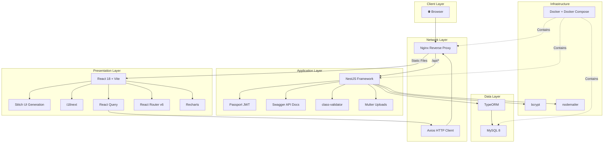

---

## 14. Folder Structure

### 14.1 Frontend (React + Vite)

```
clinic-desk-frontend/
├── public/
│   ├── favicon.ico
│   └── locales/
│       ├── en/
│       │   └── translation.json
│       └── ar/
│           └── translation.json
├── src/
│   ├── main.jsx
│   ├── App.jsx
│   ├── api/
│   │   ├── axiosInstance.js          # Base Axios config, interceptors, token refresh
│   │   ├── authApi.js                # login(), register(), logout(), refreshToken()
│   │   ├── patientApi.js             # CRUD + search + timeline
│   │   ├── appointmentApi.js         # CRUD + calendar queries
│   │   ├── visitApi.js               # CRUD + vitals + diagnosis
│   │   ├── prescriptionApi.js        # CRUD + print/PDF
│   │   ├── billingApi.js             # Invoices + payments
│   │   ├── reportApi.js              # Dashboard stats + report generation
│   │   └── adminApi.js               # User management + clinic settings
│   ├── assets/
│   │   ├── images/                   # Logo, placeholders, illustrations
│   │   └── styles/
│   │       ├── global.css            # Base styles, font imports
│   │       ├── variables.css         # CSS custom properties (colors, spacing)
│   │       └── rtl.css               # RTL-specific overrides
│   ├── components/
│   │   ├── common/                   # Shared, reusable UI components
│   │   │   ├── AppLayout.jsx         # Main layout shell (sidebar + header + content)
│   │   │   ├── Sidebar.jsx           # Navigation sidebar with role-based menu
│   │   │   ├── Header.jsx            # Top bar: user info, language toggle, notifications
│   │   │   ├── Footer.jsx            # App footer with version info
│   │   │   ├── LoadingSpinner.jsx    # Full-page and inline loading states
│   │   │   ├── ErrorBoundary.jsx     # React error boundary with fallback UI
│   │   │   ├── ProtectedRoute.jsx    # Auth check wrapper for routes
│   │   │   ├── RoleGuard.jsx         # Role-based access control wrapper
│   │   │   ├── LanguageToggle.jsx    # AR/EN language switcher button
│   │   │   ├── DataTable.jsx         # Reusable table with pagination (generated by Stitch)
│   │   │   ├── StatusBadge.jsx       # Color-coded status indicators
│   │   │   ├── ConfirmModal.jsx      # Reusable confirmation dialog
│   │   │   └── PageHeader.jsx        # Consistent page title + breadcrumb + actions
│   │   ├── auth/
│   │   │   ├── LoginForm.jsx         # Email + password login form
│   │   │   └── RegisterForm.jsx      # New user registration form
│   │   ├── patients/
│   │   │   ├── PatientForm.jsx       # Create/edit patient form (demographics, contact)
│   │   │   ├── PatientCard.jsx       # Patient summary card for lists
│   │   │   └── PatientTimeline.jsx   # Visit history timeline view
│   │   ├── appointments/
│   │   │   ├── AppointmentForm.jsx   # Schedule/edit appointment modal
│   │   │   ├── AppointmentCalendar.jsx # Calendar view (day/week/month)
│   │   │   └── AppointmentCard.jsx   # Appointment summary card
│   │   ├── visits/
│   │   │   ├── VisitForm.jsx         # Visit creation/editing form
│   │   │   ├── VitalsForm.jsx        # Blood pressure, temp, weight, height
│   │   │   └── DiagnosisForm.jsx     # Diagnosis entry with ICD codes
│   │   ├── prescriptions/
│   │   │   ├── PrescriptionForm.jsx  # Medication entry form (drug, dosage, frequency)
│   │   │   └── PrescriptionPreview.jsx # Print-ready prescription view
│   │   ├── billing/
│   │   │   ├── InvoiceForm.jsx       # Create invoice with line items
│   │   │   ├── PaymentForm.jsx       # Record payment (cash, card, insurance)
│   │   │   └── InvoicePreview.jsx    # Print-ready invoice view
│   │   ├── dashboard/
│   │   │   ├── StatsCard.jsx         # KPI card (patients today, revenue, etc.)
│   │   │   ├── RevenueChart.jsx      # Revenue over time (line/bar chart)
│   │   │   ├── AppointmentChart.jsx  # Appointment distribution chart
│   │   │   └── RecentActivity.jsx    # Activity feed / recent actions list
│   │   └── admin/
│   │       ├── UserForm.jsx          # Create/edit staff user
│   │       ├── ServiceForm.jsx       # Define clinic services & pricing
│   │       └── ClinicSettingsForm.jsx # Clinic name, logo, working hours
│   ├── contexts/
│   │   ├── AuthContext.jsx           # Authentication state & user info provider
│   │   ├── LanguageContext.jsx       # i18n language direction & locale provider
│   │   └── NotificationContext.jsx   # In-app notification state provider
│   ├── hooks/
│   │   ├── useAuth.js                # Auth context consumer + helper methods
│   │   ├── usePermissions.js         # Role/permission checking hook
│   │   ├── useNotifications.js       # Notification display helper
│   │   └── usePagination.js          # Table pagination state management
│   ├── pages/
│   │   ├── LoginPage.jsx             # Login page layout
│   │   ├── RegisterPage.jsx          # Registration page layout
│   │   ├── DashboardPage.jsx         # Main dashboard with stats & charts
│   │   ├── patients/
│   │   │   ├── PatientListPage.jsx   # Searchable patient list with filters
│   │   │   └── PatientDetailPage.jsx # Single patient view with tabs
│   │   ├── appointments/
│   │   │   ├── AppointmentListPage.jsx    # Appointment list with date filters
│   │   │   └── AppointmentCalendarPage.jsx # Full calendar view
│   │   ├── visits/
│   │   │   ├── VisitListPage.jsx     # Visit history list
│   │   │   └── VisitDetailPage.jsx   # Visit details with vitals & diagnosis
│   │   ├── prescriptions/
│   │   │   └── PrescriptionListPage.jsx # Prescription list with print
│   │   ├── billing/
│   │   │   ├── InvoiceListPage.jsx   # Invoice list with status filters
│   │   │   └── InvoiceDetailPage.jsx # Invoice detail with payment history
│   │   ├── reports/
│   │   │   └── ReportsPage.jsx       # Report generation & viewing
│   │   ├── admin/
│   │   │   ├── UserManagementPage.jsx    # Staff user CRUD
│   │   │   ├── ServiceManagementPage.jsx # Services & pricing CRUD
│   │   │   └── ClinicSettingsPage.jsx    # Clinic configuration
│   │   └── NotFoundPage.jsx          # 404 page
│   ├── routes/
│   │   └── AppRoutes.jsx             # Central route definitions with guards
│   └── utils/
│       ├── constants.js              # API URLs, role names, status values
│       ├── formatters.js             # Date, currency, phone formatters
│       ├── validators.js             # Client-side validation rules
│       └── helpers.js                # Misc utility functions
├── .env.example                      # Environment variable template
├── .eslintrc.cjs                     # ESLint configuration
├── vite.config.js                    # Vite configuration with proxy
├── package.json                      # Dependencies and scripts
└── README.md                         # Frontend setup instructions
```

### 14.2 Backend (NestJS)

```
clinic-desk-backend/
├── src/
│   ├── main.ts                       # Bootstrap: Swagger, CORS, ValidationPipe, prefix
│   ├── app.module.ts                 # Root module importing all feature modules
│   ├── common/                       # Shared code across all modules
│   │   ├── decorators/
│   │   │   ├── roles.decorator.ts              # @Roles('admin', 'doctor') metadata
│   │   │   ├── current-user.decorator.ts       # @CurrentUser() param decorator
│   │   │   └── api-paginated-response.decorator.ts # Swagger pagination docs
│   │   ├── dto/
│   │   │   ├── pagination.dto.ts               # { page, limit, total, data[] }
│   │   │   └── api-response.dto.ts             # { success, message, data }
│   │   ├── enums/
│   │   │   ├── role.enum.ts                    # ADMIN, DOCTOR, RECEPTIONIST, NURSE
│   │   │   ├── appointment-status.enum.ts      # SCHEDULED, CONFIRMED, IN_PROGRESS, COMPLETED, CANCELLED, NO_SHOW
│   │   │   ├── invoice-status.enum.ts          # DRAFT, SENT, PAID, PARTIALLY_PAID, OVERDUE, CANCELLED
│   │   │   ├── payment-method.enum.ts          # CASH, CREDIT_CARD, INSURANCE, BANK_TRANSFER
│   │   │   └── gender.enum.ts                  # MALE, FEMALE
│   │   ├── filters/
│   │   │   └── http-exception.filter.ts        # Global exception handling & formatting
│   │   ├── guards/
│   │   │   ├── jwt-auth.guard.ts               # JWT token verification guard
│   │   │   └── roles.guard.ts                  # Role-based access control guard
│   │   ├── interceptors/
│   │   │   ├── transform.interceptor.ts        # Wrap responses in standard format
│   │   │   └── audit-log.interceptor.ts        # Log write operations for audit trail
│   │   ├── middleware/
│   │   │   └── logger.middleware.ts            # Request logging middleware
│   │   └── pipes/
│   │       └── validation.pipe.ts              # Global DTO validation pipe config
│   ├── config/
│   │   ├── database.config.ts        # TypeORM MySQL connection configuration
│   │   ├── jwt.config.ts             # JWT secret, expiration, algorithm
│   │   └── app.config.ts             # Port, CORS origins, upload limits
│   ├── modules/                      # Feature modules (domain-driven)
│   │   ├── auth/
│   │   │   ├── auth.module.ts        # Auth module: imports JWT, Passport
│   │   │   ├── auth.controller.ts    # POST /auth/login, /auth/register, /auth/refresh
│   │   │   ├── auth.service.ts       # Login validation, token generation, password hashing
│   │   │   ├── strategies/
│   │   │   │   └── jwt.strategy.ts   # Passport JWT extraction & validation strategy
│   │   │   └── dto/
│   │   │       ├── login.dto.ts              # { email, password }
│   │   │       ├── register.dto.ts           # { name, email, password, role }
│   │   │       └── change-password.dto.ts    # { currentPassword, newPassword }
│   │   ├── users/
│   │   │   ├── users.module.ts
│   │   │   ├── users.controller.ts   # CRUD /users, role-restricted
│   │   │   ├── users.service.ts
│   │   │   ├── entities/
│   │   │   │   └── user.entity.ts    # id, name, email, password, role, isActive, avatar
│   │   │   └── dto/
│   │   │       ├── create-user.dto.ts
│   │   │       └── update-user.dto.ts
│   │   ├── patients/
│   │   │   ├── patients.module.ts
│   │   │   ├── patients.controller.ts # CRUD /patients + search + timeline
│   │   │   ├── patients.service.ts
│   │   │   ├── entities/
│   │   │   │   └── patient.entity.ts  # id, name, dob, gender, phone, email, address,
│   │   │   │                          # bloodType, allergies, medicalHistory, emergencyContact
│   │   │   └── dto/
│   │   │       ├── create-patient.dto.ts
│   │   │       ├── update-patient.dto.ts
│   │   │       └── filter-patient.dto.ts     # Search by name, phone, date range
│   │   ├── doctors/
│   │   │   ├── doctors.module.ts
│   │   │   ├── doctors.controller.ts  # CRUD /doctors + schedule + availability
│   │   │   ├── doctors.service.ts
│   │   │   ├── entities/
│   │   │   │   └── doctor.entity.ts   # id, userId, specialization, licenseNumber, schedule
│   │   │   └── dto/
│   │   ├── appointments/
│   │   │   ├── appointments.module.ts
│   │   │   ├── appointments.controller.ts # CRUD /appointments + calendar + status
│   │   │   ├── appointments.service.ts    # Conflict detection, status transitions
│   │   │   ├── entities/
│   │   │   │   └── appointment.entity.ts  # id, patientId, doctorId, dateTime, duration,
│   │   │   │                              # status, type, notes
│   │   │   └── dto/
│   │   │       ├── create-appointment.dto.ts
│   │   │       ├── update-appointment.dto.ts
│   │   │       └── filter-appointment.dto.ts  # Filter by date, doctor, status
│   │   ├── visits/
│   │   │   ├── visits.module.ts
│   │   │   ├── visits.controller.ts   # CRUD /visits + vitals + diagnosis
│   │   │   ├── visits.service.ts
│   │   │   ├── entities/
│   │   │   │   ├── visit.entity.ts        # id, appointmentId, patientId, doctorId,
│   │   │   │   │                          # chiefComplaint, vitals, notes, createdAt
│   │   │   │   └── diagnosis.entity.ts    # id, visitId, icdCode, description, notes
│   │   │   └── dto/
│   │   ├── prescriptions/
│   │   │   ├── prescriptions.module.ts
│   │   │   ├── prescriptions.controller.ts # CRUD /prescriptions + print
│   │   │   ├── prescriptions.service.ts
│   │   │   ├── entities/
│   │   │   │   ├── prescription.entity.ts      # id, visitId, patientId, doctorId, date, notes
│   │   │   │   └── prescription-item.entity.ts # id, prescriptionId, medication, dosage,
│   │   │   │                                   # frequency, duration, instructions
│   │   │   └── dto/
│   │   ├── billing/
│   │   │   ├── billing.module.ts
│   │   │   ├── billing.controller.ts  # CRUD /invoices + /payments
│   │   │   ├── billing.service.ts     # Invoice generation, payment processing, balance calc
│   │   │   ├── entities/
│   │   │   │   ├── invoice.entity.ts       # id, patientId, visitId, invoiceNumber, status,
│   │   │   │   │                           # subtotal, tax, discount, total, dueDate
│   │   │   │   ├── invoice-item.entity.ts  # id, invoiceId, serviceId, description, qty,
│   │   │   │   │                           # unitPrice, total
│   │   │   │   └── payment.entity.ts       # id, invoiceId, amount, method, date, reference
│   │   │   └── dto/
│   │   ├── notifications/
│   │   │   ├── notifications.module.ts
│   │   │   ├── notifications.controller.ts # GET /notifications, PATCH mark-as-read
│   │   │   ├── notifications.service.ts    # Create, send, mark-read
│   │   │   ├── entities/
│   │   │   │   └── notification.entity.ts  # id, userId, type, title, message, isRead, createdAt
│   │   │   └── dto/
│   │   ├── reports/
│   │   │   ├── reports.module.ts
│   │   │   ├── reports.controller.ts  # GET /reports/revenue, /reports/patients, /reports/appointments
│   │   │   └── reports.service.ts     # Aggregate queries, date-range reports
│   │   ├── admin/
│   │   │   ├── admin.module.ts
│   │   │   ├── admin.controller.ts    # System-wide admin operations
│   │   │   └── admin.service.ts       # User management, system health, audit logs
│   │   └── clinic-settings/
│   │       ├── clinic-settings.module.ts
│   │       ├── clinic-settings.controller.ts # GET/PUT /clinic-settings
│   │       ├── clinic-settings.service.ts
│   │       ├── entities/
│   │       │   └── clinic-settings.entity.ts # id, clinicName, logo, address, phone,
│   │       │                                 # workingHours, currency, taxRate
│   │       └── dto/
│   ├── database/
│   │   ├── migrations/               # TypeORM auto-generated migrations
│   │   └── seeds/
│   │       ├── seed.ts               # Master seed runner
│   │       ├── roles.seed.ts         # Default roles
│   │       ├── admin-user.seed.ts    # Default admin account
│   │       └── sample-data.seed.ts   # Demo patients, doctors, appointments
│   └── uploads/                      # Uploaded files (patient docs, avatars)
├── test/
│   ├── app.e2e-spec.ts               # End-to-end API tests
│   └── jest-e2e.json                 # Jest e2e configuration
├── .env.example                      # Environment variable template
├── .eslintrc.js                      # ESLint configuration
├── nest-cli.json                     # NestJS CLI configuration
├── tsconfig.json                     # TypeScript configuration
├── tsconfig.build.json               # TypeScript build configuration
├── package.json                      # Dependencies and scripts
├── docker-compose.yml                # MySQL + Backend + Frontend + Nginx
├── Dockerfile                        # Multi-stage Node.js build
├── nginx/
│   └── nginx.conf                    # Reverse proxy configuration
└── README.md                         # Backend setup instructions
```

### 14.3 Structural Design Rationale

#### Domain-Driven Module Organization

The backend follows a **domain-driven modular architecture** where each business domain (patients, appointments, billing, etc.) is encapsulated as a self-contained NestJS module:

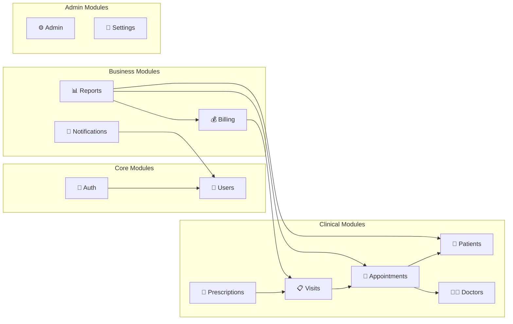

**Why this structure works for a hackathon:**

| Principle | Implementation | Hackathon Benefit |
|---|---|---|
| **Separation of Concerns** | Each module owns its entities, DTOs, service, and controller | Developers work on different modules without merge conflicts |
| **Single Responsibility** | One module = one business domain | Easy to reason about; new team members can understand a module in minutes |
| **Encapsulation** | Modules export only their service; entities are internal | Changes to one module don't cascade to others |
| **Consistent Convention** | Every module follows the same `module → controller → service → entity → dto` pattern | Any developer can jump into any module and know exactly where to find things |
| **Parallel Development** | Independent modules with clear interfaces | 3-4 developers can work simultaneously on different modules |

#### Frontend Organization Principles

The frontend structure follows a **feature-based** organization layered on top of a **type-based** foundation:

```
src/
├── api/          → HOW we talk to the backend (data access layer)
├── components/   → WHAT we render (UI building blocks, by domain)
├── contexts/     → WHERE state lives (global state providers)
├── hooks/        → REUSABLE logic (custom hooks)
├── pages/        → WHERE routes land (route-level components)
├── routes/       → HOW navigation works (route definitions)
└── utils/        → SHARED helpers (pure functions)
```

**Key design decisions:**

1. **`api/` layer isolates network calls** — Components never call Axios directly. This enables easy mocking for development before the backend is ready, and centralizes error handling.

2. **`components/common/` provides the design system** — `DataTable`, `PageHeader`, `StatusBadge`, and `ConfirmModal` ensure visual consistency across all pages and reduce duplicate code.

3. **`components/{domain}/` groups by feature** — Patient-related components live together, appointment components live together. This mirrors the backend module structure and makes it intuitive to find code.

4. **`pages/` mirrors the route structure** — Every route maps to exactly one page component. Pages compose domain components and handle data fetching via React Query.

5. **`contexts/` + `hooks/` separate state from UI** — `AuthContext` provides auth state; `useAuth()` hook makes it consumable. This pattern keeps components clean and testable.

---

## 15. Implementation Roadmap

### Team Composition (Assumed)

| Role | ID | Primary Responsibility |
|---|---|---|
| **Dev A** | Backend Lead | NestJS, database, API architecture |
| **Dev B** | Backend Support | API modules, seed data, testing |
| **Dev C** | Frontend Lead | React architecture, layout, core pages |
| **Dev D** | Frontend Support | Feature pages, charts, i18n, polish |

> **Note:** If the team has 3 developers, merge Dev B's tasks into Dev A's schedule and defer notifications module and email functionality.

---

### Phase 0: Pre-Hackathon (Before Day 1)

> **Goal:** Zero setup time on Day 1 — hit the ground running.

| # | Task | Owner | Deliverable |
|---|---|---|---|
| 0.1 | Create GitHub repository with `main` and `develop` branches | Dev A | Repo URL, branch protection rules |
| 0.2 | Set up communication channel (Discord/Slack) with channels: `#general`, `#frontend`, `#backend`, `#bugs` | Any | Channel invites sent |
| 0.3 | Create Docker Compose template (MySQL 8 + phpMyAdmin) | Dev A | Working `docker-compose.yml` |
| 0.4 | Agree on coding conventions: ESLint config, naming (camelCase TS, kebab-case files), commit message format (conventional commits) | All | `.eslintrc` files committed |
| 0.5 | Define PR process: feature branches (`feature/patients-crud`), at least 1 review, squash merge | All | `CONTRIBUTING.md` |
| 0.6 | Set up project board (GitHub Projects / Trello) with swim lanes: To Do, In Progress, Review, Done | Any | Board link shared |
| 0.7 | Share `.env.example` templates for frontend and backend | Dev A + C | Files committed |
| 0.8 | Install all tools: Node 20 LTS, Docker Desktop, MySQL Workbench, VS Code extensions (ESLint, Prettier, NestJS snippets) | All | Confirmed in chat |

---

### Phase 1: Foundation (Day 1, Hours 1-8)

> **Goal:** By end of Day 1, the app skeleton is running — backend serves APIs, frontend renders pages, auth works end-to-end.

#### Hour-by-Hour Breakdown

##### Hours 1-2: Project Scaffolding

| Time | Dev A (Backend) | Dev B (Backend) | Dev C (Frontend) | Dev D (Frontend) |
|---|---|---|---|---|
| **H1** | `nest new clinic-desk-backend` — configure TypeORM, MySQL connection, Swagger setup, global pipes/filters/interceptors | Define all enums (`role`, `appointment-status`, `invoice-status`, `payment-method`, `gender`) in `common/enums/` | `npm create vite@latest clinic-desk-frontend -- --template react` — install React Router, Axios, i18next, React Query, and initialize Stitch UI Generation | Set up i18n: configure `i18next`, create `en/translation.json` and `ar/translation.json` with initial keys (nav items, common labels) |
| **H2** | Create `User` entity with all fields; create auth module skeleton (controller, service, JWT strategy) | Create common DTOs (`pagination.dto.ts`, `api-response.dto.ts`), guards (`jwt-auth.guard.ts`, `roles.guard.ts`), decorators (`@Roles`, `@CurrentUser`) | Set up project structure: create all directories (`api/`, `components/`, `pages/`, etc.); configure `axiosInstance.js` with base URL and interceptor stubs | Set up RTL support: configure i18n and Stitch layout classes for direction, create `rtl.css`, implement `LanguageToggle` component |

##### Hours 3-4: Auth System

| Time | Dev A (Backend) | Dev B (Backend) | Dev C (Frontend) | Dev D (Frontend) |
|---|---|---|---|---|
| **H3** | Implement `AuthService`: `register()` with bcrypt hashing, `login()` with JWT generation, `validateUser()` | Implement `JwtStrategy`, configure Passport module, test token generation with Swagger | Build `LoginForm.jsx` and `LoginPage.jsx` using React Hook Form, Zod, and Stitch-generated components | Build AppLayout.jsx with Stitch-generated layout and sidebar container; implement Sidebar.jsx with role-based menu items |
| **H4** | Implement `AuthController`: `POST /auth/login`, `POST /auth/register`; add Swagger decorators; test with Postman/Swagger UI | Create `UsersModule` with basic CRUD: `UsersController`, `UsersService`, `User` entity repository | Build `AuthContext.jsx`: store user + token in state and localStorage; implement `useAuth()` hook; build `ProtectedRoute.jsx` | Build `Header.jsx` with user avatar, language toggle, notification bell; build `PageHeader.jsx` reusable component |

##### Hours 5-6: Patient Module (First Domain Module)

| Time | Dev A (Backend) | Dev B (Backend) | Dev C (Frontend) | Dev D (Frontend) |
|---|---|---|---|---|
| **H5** | Create `Patient` entity with all fields (demographics, contact, medical history); create `PatientsModule` with CRUD endpoints | Create `Doctor` entity linking to `User`; create `DoctorsModule` skeleton | Build `patientApi.js` with all CRUD functions; build `PatientListPage.jsx` with `DataTable` component showing patient list | Build reusable `DataTable.jsx` (generated by Stitch) with search, pagination, and loading states; build `StatusBadge.jsx` |
| **H6** | Implement patient search/filter endpoint (`GET /patients?search=&gender=&dateFrom=&dateTo=`); add pagination | Implement `DoctorsController` CRUD; add doctor availability/schedule fields | Build `PatientForm.jsx` (create/edit modal) with validation; connect to API | Build `PatientCard.jsx` summary component; build `ConfirmModal.jsx` for delete confirmations |

##### Hours 7-8: Appointments Module

| Time | Dev A (Backend) | Dev B (Backend) | Dev C (Frontend) | Dev D (Frontend) |
|---|---|---|---|---|
| **H7** | Create `Appointment` entity with relations (patient, doctor); implement `AppointmentsModule` with CRUD + status transitions | Implement appointment conflict detection (no double-booking same doctor at same time); add filter endpoints | Build `appointmentApi.js`; build `AppointmentListPage.jsx` with date/status filters | Build `AppointmentForm.jsx` (schedule modal) with doctor/patient select, date/time picker, duration |
| **H8** | Add appointment calendar query endpoint (`GET /appointments/calendar?start=&end=&doctorId=`); test all Day 1 endpoints | Write database seed script: create admin user, sample doctors, 20 sample patients, 50 sample appointments | Build `AppointmentCalendarPage.jsx` using Stitch-generated calendar view or custom calendar view | Integration testing: verify login → dashboard → patients list → create patient → appointments flow end-to-end |

#### Day 1 Checkpoint ✅

By end of Day 1, verify:
- [ ] Login/Register works end-to-end
- [ ] Protected routes redirect unauthenticated users
- [ ] Patient CRUD works (list, create, edit, delete)
- [ ] Appointment CRUD works with calendar view
- [ ] Sidebar navigation reflects user role
- [ ] Language toggle switches AR/EN with RTL layout change
- [ ] Seed data populates demo-ready content
- [ ] Docker Compose starts the full stack

---

### Phase 2: Core Features (Days 2-3)

> **Goal:** Complete the clinical workflow — visits, prescriptions, and the dashboard. All four developers work on parallel streams.

#### Day 2: Clinical Workflow

| Stream | Owner | Tasks | Depends On |
|---|---|---|---|
| **Visits API** | Dev A | Create `Visit` + `Diagnosis` entities; implement `VisitsModule` CRUD; link visits to appointments (auto-create visit when appointment status → `IN_PROGRESS`); vitals recording endpoint | Appointments module |
| **Prescriptions API** | Dev B | Create `Prescription` + `PrescriptionItem` entities; implement `PrescriptionsModule` CRUD; link to visits; prescription print/PDF endpoint | Visits module (can stub initially) |
| **Visits UI** | Dev C | Build `visitApi.js`; build `VisitListPage.jsx`, `VisitDetailPage.jsx`; implement `VisitForm.jsx`, `VitalsForm.jsx`, `DiagnosisForm.jsx`; connect appointment → visit flow | Visits API |
| **Dashboard UI** | Dev D | Build `reportApi.js`; build `DashboardPage.jsx`; implement `StatsCard.jsx` (4 KPI cards), `RevenueChart.jsx`, `AppointmentChart.jsx`, `RecentActivity.jsx` using Recharts | Reports API (can use mock data initially) |

#### Day 3: Prescriptions UI + Reports API + Patient Detail

| Stream | Owner | Tasks | Depends On |
|---|---|---|---|
| **Reports API** | Dev A | Implement `ReportsModule`: revenue by period, patient count trends, appointment statistics, doctor performance; aggregate SQL queries with TypeORM QueryBuilder | Billing entities (stub), Visits, Appointments |
| **Clinic Settings + Notifications** | Dev B | Implement `ClinicSettingsModule` (CRUD for clinic info); implement `NotificationsModule` (in-app notifications: new appointment, visit completed); configure nodemailer (optional) | — |
| **Prescriptions UI** | Dev C | Build `prescriptionApi.js`; build `PrescriptionListPage.jsx`; implement `PrescriptionForm.jsx` and `PrescriptionPreview.jsx` (print-ready layout) | Prescriptions API |
| **Patient Detail + Timeline** | Dev D | Build `PatientDetailPage.jsx` with tabbed view (Info, Visits, Prescriptions, Invoices); implement `PatientTimeline.jsx` showing chronological visit history | Visits API, Prescriptions API |

#### Day 2-3 Checkpoint ✅

By end of Day 3, verify:
- [ ] Complete clinical flow: Appointment → Check-in → Visit → Vitals → Diagnosis → Prescription
- [ ] Dashboard shows real statistics from database
- [ ] Patient detail page shows full history with timeline
- [ ] Prescriptions can be created and previewed for printing
- [ ] Clinic settings can be configured
- [ ] In-app notifications appear for key events

---

### Phase 3: Extended Features (Day 4)

> **Goal:** Add billing/invoicing, finalize reports, and polish the admin panel.

#### Day 4: Billing + Reports + Admin

| Stream | Owner | Tasks | Depends On |
|---|---|---|---|
| **Billing API** | Dev A | Create `Invoice`, `InvoiceItem`, `Payment` entities; implement `BillingModule`: create invoice from visit, add line items, record payments, calculate balances; invoice number auto-generation | Visits module |
| **Admin API + Seed Data** | Dev B | Implement `AdminModule`: user management (CRUD staff), service management (define clinic services with pricing); enhance seed data with realistic demo content (50+ patients, 200+ appointments, invoices) | Users module |
| **Billing UI** | Dev C | Build `billingApi.js`; build `InvoiceListPage.jsx` with status filters; build `InvoiceDetailPage.jsx`; implement `InvoiceForm.jsx`, `PaymentForm.jsx`, `InvoicePreview.jsx` (print-ready) | Billing API |
| **Admin UI + Reports** | Dev D | Build `adminApi.js`; build `UserManagementPage.jsx`, `ServiceManagementPage.jsx`, `ClinicSettingsPage.jsx`; enhance `ReportsPage.jsx` with date-range filters and export | Admin API, Reports API |

#### Day 4 Checkpoint ✅

By end of Day 4, verify:
- [ ] Invoices can be created from visits with service line items
- [ ] Payments can be recorded against invoices
- [ ] Invoice status updates correctly (Draft → Sent → Paid)
- [ ] Admin can manage users (create, edit, activate/deactivate)
- [ ] Admin can manage clinic services and pricing
- [ ] Reports page shows revenue, patient, and appointment analytics
- [ ] All CRUD operations work with proper validation and error messages

---

### Phase 4: Polish & Demo Prep (Day 5)

> **Goal:** Bug-free, visually polished, demo-ready application.

#### Day 5 Morning (Hours 1-4): Bug Fixes & Testing

| Stream | Owner | Tasks |
|---|---|---|
| **API Hardening** | Dev A | Fix all known backend bugs; add missing validation rules; ensure proper error messages; verify all Swagger docs are accurate; test edge cases (empty states, large datasets) |
| **E2E Testing** | Dev B | Write and run key e2e test scenarios; test role-based access (admin vs doctor vs receptionist); verify all API endpoints return correct status codes; load test with seed data |
| **UI Polish** | Dev C | Fix responsive layout issues; ensure all forms validate properly on submit; add loading states to all API calls; fix RTL layout issues; ensure print views (prescription, invoice) work correctly |
| **UX Enhancement** | Dev D | Add empty state illustrations; improve error messages (user-friendly Arabic/English); add success notifications (Stitch-generated or custom notifications); ensure consistent spacing and alignment |

#### Day 5 Afternoon (Hours 5-8): Demo Preparation

| Stream | Owner | Tasks |
|---|---|---|
| **Demo Environment** | Dev A | Deploy final Docker Compose stack; verify database with full seed data; create demo user accounts (admin, doctor, receptionist); ensure clean environment startup |
| **Demo Script** | Dev B | Write step-by-step demo script covering: login → dashboard → create patient → schedule appointment → record visit → write prescription → generate invoice → view reports; time the demo to fit presentation slot |
| **Demo Data** | Dev C | Ensure seed data tells a compelling story; create realistic patient names (Arabic/English), appointment history, billing data; verify charts show meaningful trends |
| **Presentation** | Dev D | Prepare presentation slides (if required): problem statement, solution overview, architecture diagram, tech stack, live demo plan, future roadmap; practice demo transitions |

#### Final Checklist ✅

- [ ] Application starts cleanly with `docker-compose up`
- [ ] Login works for all roles (admin, doctor, receptionist)
- [ ] Dashboard loads with meaningful data
- [ ] Complete patient workflow demonstrated
- [ ] Arabic/English switching works flawlessly with RTL
- [ ] Print views (prescription, invoice) render correctly
- [ ] No console errors in browser
- [ ] API returns proper error messages
- [ ] Demo script rehearsed at least twice
- [ ] Backup plan if live demo fails (screenshots/video recording)

---

### Implementation Timeline — Gantt Chart

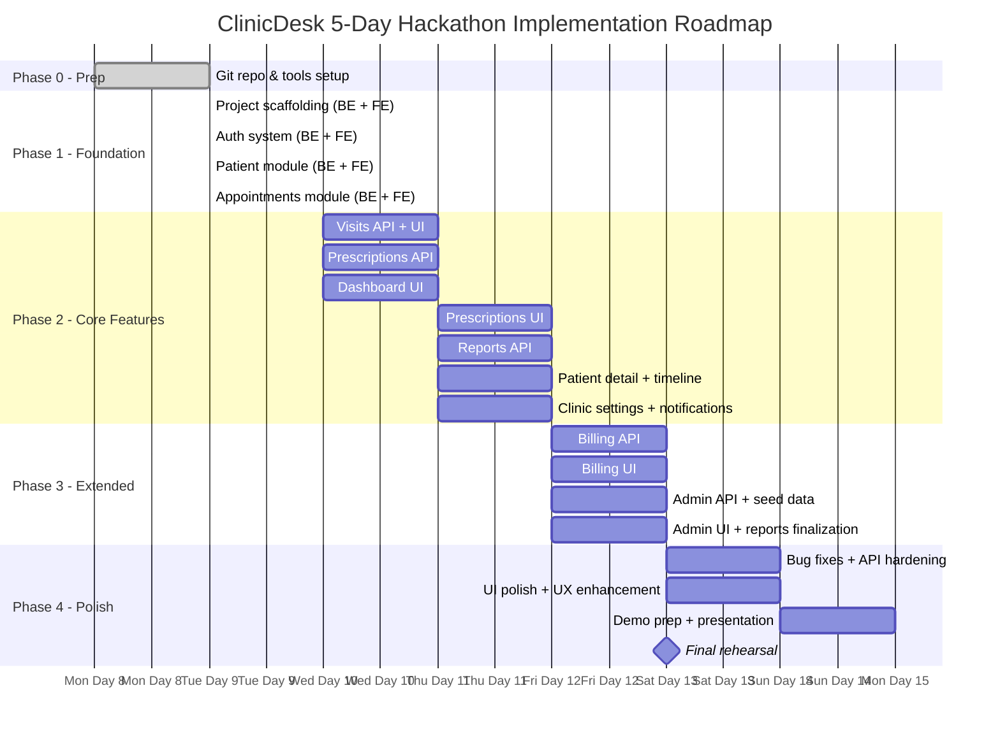

---

### Task Dependency Diagram

The following diagram shows which tasks **block** other tasks. Arrows indicate "must be completed before":

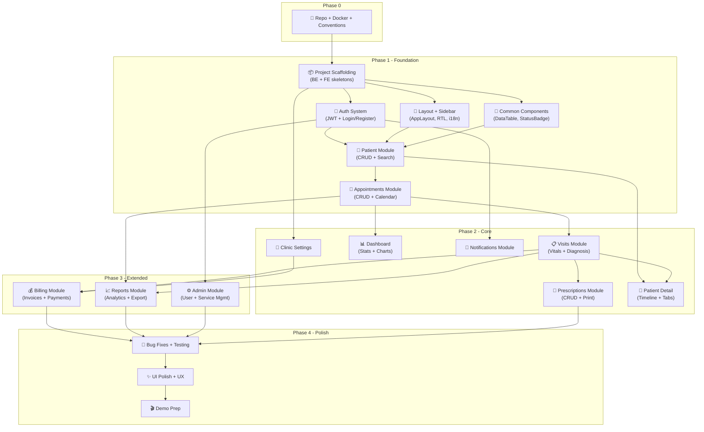

#### Critical Path

The **critical path** (longest chain of dependencies) that determines the minimum project duration:

```
Repo Setup → Scaffolding → Auth → Patients → Appointments → Visits → Billing → Bug Fixes → Polish → Demo
```

> [!IMPORTANT]
> **The critical path runs through the clinical workflow.** Any delay in the Auth → Patients → Appointments → Visits chain will directly delay the entire project. Prioritize these modules above all else.

#### Parallel Work Opportunities

| Parallel Stream | Can Run Simultaneously With |
|---|---|
| Frontend layout + i18n + common components | Backend auth + patient module |
| Dashboard UI (with mock data) | Visits API development |
| Prescriptions API | Visits UI development |
| Clinic Settings module | Any Phase 2 work |
| Notifications module | Any Phase 2 work |
| Admin UI | Billing UI |
| Reports finalization | Admin API |

#### Risk Mitigation — What to Cut if Behind Schedule

| Priority | Feature | Cut Strategy |
|---|---|---|
| 🔴 **Must Have** | Auth, Patients, Appointments, Visits | Cannot cut — these ARE the app |
| 🟡 **Should Have** | Dashboard, Prescriptions, Billing | Simplify: use basic tables instead of charts; remove print preview; basic invoice without payments |
| 🟢 **Nice to Have** | Notifications, Email, Reports export, Admin panel | Cut entirely if behind; hardcode clinic settings; skip notification module; show reports as static queries |
| ⚪ **Polish** | RTL perfection, animations, empty states, loading skeletons | Reduce scope: ensure AR works but skip fine-tuning; remove animations; use basic loading spinners |

---

> **Last Updated:** June 9, 2026
> **Document Version:** 1.0
> **Status:** Ready for execution
---

*Generated by ClinicDesk Architecture Team — June 2026*
