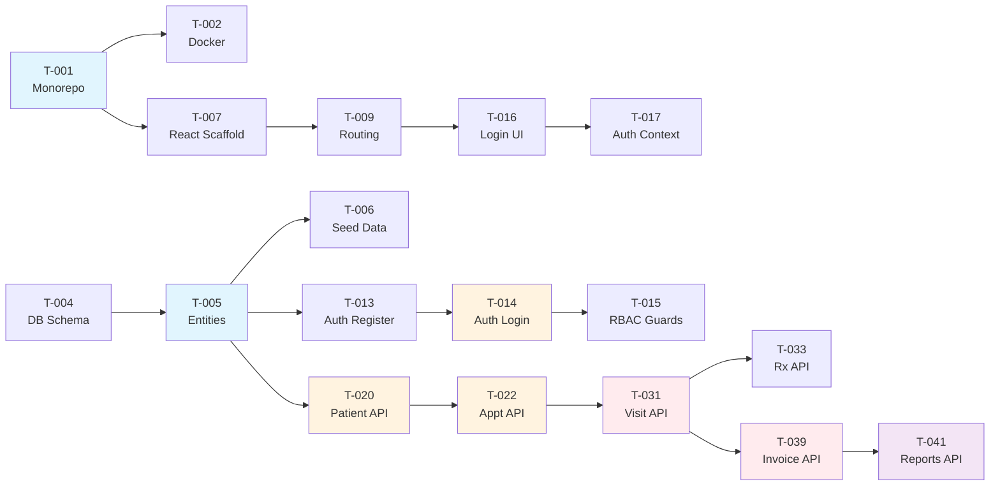

# ClinicDesk — Part 5: Wireframes, Sprint Planning & MVP Scope

> **Project**: ClinicDesk — Clinic Management System  
> **Version**: 1.0.0  
> **Date**: 2026-06-09  
> **Tech Stack**: NestJS · React · PostgreSQL · TypeORM  

---

## 10. Wireframes

Detailed text-based wireframes for the key ClinicDesk interfaces. All wireframes use box-drawing characters and are designed to guide UI development directly.

---

### 10.1 Login Page

```
┌──────────────────────────────────────────────────────────────────────┐
│                                                        [ AR │ EN ] ◄── Language Toggle
│                                                                      │
│                                                                      │
│                        ┌──────────────────┐                          │
│                        │   ┌──────────┐   │                          │
│                        │   │  ╔═══╗   │   │                          │
│                        │   │  ║ + ║   │   │                          │
│                        │   │  ╚═══╝   │   │                          │
│                        │   │ClinicDesk│   │                          │
│                        │   └──────────┘   │                          │
│                        │                  │                          │
│                        │  Welcome Back    │                          │
│                        │  Sign in to your │                          │
│                        │  account         │                          │
│                        │                  │                          │
│                        │  ┌─────────────────────────────────────┐   │
│                        │  │ 📧  Email address                   │   │
│                        │  └─────────────────────────────────────┘   │
│                        │                  │                          │
│                        │  ┌─────────────────────────────────────┐   │
│                        │  │ 🔒  Password                  👁    │   │
│                        │  └─────────────────────────────────────┘   │
│                        │                  │                          │
│                        │  ☐ Remember me       Forgot Password? ──┐  │
│                        │                  │                       │  │
│                        │  ┌─────────────────────────────────────┐│  │
│                        │  │           🔑  Sign In               ││  │
│                        │  └─────────────────────────────────────┘│  │
│                        │                  │                       │  │
│                        │  ─────── OR ───────                     │  │
│                        │                  │                       │  │
│                        │  Don't have an account? Register ───────┘  │
│                        │                  │                          │
│                        └──────────────────┘                          │
│                                                                      │
│  © 2026 ClinicDesk                                                   │
└──────────────────────────────────────────────────────────────────────┘
```

**Key Elements:**
| Element            | Description                                          |
|--------------------|------------------------------------------------------|
| Language Toggle    | Switches between Arabic (RTL) and English (LTR)     |
| Logo               | Centered brand logo + app name                       |
| Email Field        | Validated email input with icon                      |
| Password Field     | Password input with show/hide toggle                 |
| Remember Me        | Checkbox to persist session                          |
| Forgot Password    | Link to password reset flow                          |
| Sign In Button     | Primary CTA, full width                              |
| Register Link      | Navigate to registration page                        |

---

### 10.2 Dashboard — Admin View

```
┌──────────────────────────────────────────────────────────────────────────────────┐
│  ClinicDesk          🔍 Search...              🔔 3  🌐 AR/EN  👤 Dr. Admin ▾  │
├──────────┬───────────────────────────────────────────────────────────────────────┤
│          │                                                                      │
│  ┌─────┐ │  Dashboard                                          📅 June 9, 2026 │
│  │ 🏠  │ │  ──────────────────────────────────────────────────────────────────  │
│  │Dash │ │                                                                      │
│  ├─────┤ │  ┌──────────────┐ ┌──────────────┐ ┌──────────────┐ ┌────────────┐  │
│  │ 👥  │ │  │ 👥 Patients  │ │ 📅 Today's   │ │ 💰 Revenue   │ │ 👨‍⚕️ Active │  │
│  │Patnt│ │  │              │ │ Appointments │ │              │ │ Doctors    │  │
│  ├─────┤ │  │    1,247     │ │     23       │ │  $12,450     │ │    8       │  │
│  │ 📅  │ │  │  ↑ 12% ▲    │ │  ↑ 5% ▲     │ │  ↑ 8% ▲     │ │            │  │
│  │Appts│ │  └──────────────┘ └──────────────┘ └──────────────┘ └────────────┘  │
│  ├─────┤ │                                                                      │
│  │ 🏥  │ │  ┌──────────────────────────────────────┐ ┌───────────────────────┐  │
│  │Visit│ │  │  📋 Recent Appointments              │ │  ⚡ Quick Actions     │  │
│  ├─────┤ │  │  ────────────────────────────────────│ │  ─────────────────── │  │
│  │ 💊  │ │  │  Patient    │ Doctor  │ Time  │ Stat ││ │  ┌─────────────────┐ │  │
│  │Presc│ │  │  ───────────┼─────────┼───────┼──────││ │  │ + New Patient   │ │  │
│  ├─────┤ │  │  Ahmed K.   │ Dr.Sara │ 09:00 │ ✅   ││ │  └─────────────────┘ │  │
│  │ 💰  │ │  │  Fatima H.  │ Dr.Omar │ 09:30 │ 🕐   ││ │  ┌─────────────────┐ │  │
│  │Bill │ │  │  Omar S.    │ Dr.Sara │ 10:00 │ 🕐   ││ │  │ + New Appt      │ │  │
│  ├─────┤ │  │  Layla M.   │ Dr.Ali  │ 10:30 │ ⏳   ││ │  └─────────────────┘ │  │
│  │ 📊  │ │  │  Yusuf A.   │ Dr.Sara │ 11:00 │ ⏳   ││ │  ┌─────────────────┐ │  │
│  │Rprts│ │  │                                      ││ │  │ + New Invoice   │ │  │
│  ├─────┤ │  │  ◄ 1  2  3  ►        View All ──►  ││ │  └─────────────────┘ │  │
│  │ ⚙️  │ │  └──────────────────────────────────────┘ │  ┌─────────────────┐ │  │
│  │Stngs│ │                                            │  │ 📊 View Reports │ │  │
│  │     │ │                                            │  └─────────────────┘ │  │
│  └─────┘ │                                            └───────────────────────┘  │
│          │                                                                      │
├──────────┴───────────────────────────────────────────────────────────────────────┤
│  © 2026 ClinicDesk  │  v1.0.0  │  Support                                       │
└──────────────────────────────────────────────────────────────────────────────────┘
```

**Key Elements:**
| Element               | Description                                                    |
|------------------------|----------------------------------------------------------------|
| Sidebar Navigation     | Collapsible icon + label nav for all modules                  |
| Top Bar                | Search, notifications badge, language toggle, user menu       |
| Stats Cards (×4)       | Total patients, today's appointments, revenue, active doctors |
| Recent Appointments    | Paginated table with patient, doctor, time, status columns    |
| Quick Actions Panel    | Shortcut buttons: New Patient, New Appt, New Invoice, Reports |

---

### 10.3 Dashboard — Doctor View

```
┌──────────────────────────────────────────────────────────────────────────────────┐
│  ClinicDesk          🔍 Search...              🔔 1  🌐 AR/EN  👤 Dr. Sara ▾   │
├──────────┬───────────────────────────────────────────────────────────────────────┤
│          │                                                                      │
│  ┌─────┐ │  Good Morning, Dr. Sara 👋                          📅 June 9, 2026 │
│  │ 🏠  │ │  ──────────────────────────────────────────────────────────────────  │
│  │Dash │ │                                                                      │
│  ├─────┤ │  ┌───────────────────┐ ┌───────────────────┐ ┌──────────────────┐   │
│  │ 📅  │ │  │  📅 Today's Appts │ │  ✅ Completed     │ │  👥 Total Patnt  │   │
│  │Appts│ │  │       12          │ │       5           │ │      342         │   │
│  ├─────┤ │  └───────────────────┘ └───────────────────┘ └──────────────────┘   │
│  │ 🏥  │ │                                                                      │
│  │Visit│ │  ┌─────────────────────────────────────────────────────────────────┐ │
│  ├─────┤ │  │  🕐 Today's Schedule                                           │ │
│  │ 💊  │ │  │  ─────────────────────────────────────────────────────────────  │ │
│  │Presc│ │  │                                                                 │ │
│  ├─────┤ │  │  09:00  ┌────────────────────────────────────────────────────┐  │ │
│  │ ⚙️  │ │  │    ●────│ ✅ Ahmed K. — Follow-up  │ Completed             │  │ │
│  │Stngs│ │  │         └────────────────────────────────────────────────────┘  │ │
│  │     │ │  │  09:30  ┌────────────────────────────────────────────────────┐  │ │
│  └─────┘ │  │    ●────│ ✅ Fatima H. — Checkup   │ Completed             │  │ │
│          │  │         └────────────────────────────────────────────────────┘  │ │
│          │  │  10:00  ┌────────────────────────────────────────────────────┐  │ │
│          │  │    ●────│ 🟢 Omar S. — Consultation │ In Progress ► Start  │  │ │
│          │  │         └────────────────────────────────────────────────────┘  │ │
│          │  │  10:30  ┌────────────────────────────────────────────────────┐  │ │
│          │  │    ○────│ 🕐 Layla M. — Dental Pain │ Waiting               │  │ │
│          │  │         └────────────────────────────────────────────────────┘  │ │
│          │  │  11:00  ┌────────────────────────────────────────────────────┐  │ │
│          │  │    ○────│ ⏳ Yusuf A. — Lab Review  │ Scheduled             │  │ │
│          │  │         └────────────────────────────────────────────────────┘  │ │
│          │  └─────────────────────────────────────────────────────────────────┘ │
│          │                                                                      │
│          │  ┌────────────────────────────┐ ┌──────────────────────────────────┐ │
│          │  │  📋 Upcoming Patients      │ │  📝 Recent Visits               │ │
│          │  │  ────────────────────────  │ │  ──────────────────────────────  │ │
│          │  │  10:30  Layla M.    Dental │ │  Ahmed K.  │ Follow-up │ Today  │ │
│          │  │  11:00  Yusuf A.    Labs   │ │  Fatima H. │ Checkup   │ Today  │ │
│          │  │  11:30  Noor R.     Cardio │ │  Nadia T.  │ Consult   │ Jun 8  │ │
│          │  │  12:00  Tariq B.    Ortho  │ │  Karim L.  │ Emergency │ Jun 7  │ │
│          │  │                            │ │                                  │ │
│          │  │         View All ──►       │ │         View All ──►            │ │
│          │  └────────────────────────────┘ └──────────────────────────────────┘ │
│          │                                                                      │
├──────────┴───────────────────────────────────────────────────────────────────────┤
│  © 2026 ClinicDesk  │  v1.0.0                                                   │
└──────────────────────────────────────────────────────────────────────────────────┘
```

**Key Elements:**
| Element             | Description                                              |
|---------------------|----------------------------------------------------------|
| Greeting Header     | Personalized greeting with doctor's name                 |
| Stats Cards (×3)    | Today's appointments, completed visits, total patients   |
| Today's Schedule    | Timeline view with status indicators and action buttons  |
| Upcoming Patients   | Next patients in queue with type of visit                |
| Recent Visits       | Last visits conducted by the doctor                      |

---

### 10.4 Patient List

```
┌──────────────────────────────────────────────────────────────────────────────────┐
│  ClinicDesk          🔍 Search...              🔔 3  🌐 AR/EN  👤 Dr. Admin ▾  │
├──────────┬───────────────────────────────────────────────────────────────────────┤
│          │                                                                      │
│  Sidebar │  👥 Patient Management                                               │
│          │  ──────────────────────────────────────────────────────────────────  │
│          │                                                                      │
│          │  ┌───────────────────────────────────┐  ┌─────────────────────────┐  │
│          │  │ 🔍  Search patients by name, ID,  │  │  + Add New Patient      │  │
│          │  │     phone, or email...             │  └─────────────────────────┘  │
│          │  └───────────────────────────────────┘                               │
│          │                                                                      │
│          │  Filter: [ All ▾ ] [ Gender ▾ ] [ Blood Type ▾ ]  [ Date Range 📅 ] │
│          │                                                                      │
│          │  Showing 1–20 of 1,247 patients                     Export CSV  📥   │
│          │                                                                      │
│          │  ┌─────┬──────────────┬──────────┬──────────────┬──────────┬───────┐ │
│          │  │  #  │ Patient Name │ ID       │ Phone        │Last Visit│Actions│ │
│          │  ├─────┼──────────────┼──────────┼──────────────┼──────────┼───────┤ │
│          │  │  1  │ Ahmed Khalil │ P-001001 │ +966-5X-XXX  │ Jun 9   │ 👁 ✏️ 🗑│ │
│          │  │  2  │ Fatima Hassan│ P-001002 │ +966-5X-XXX  │ Jun 9   │ 👁 ✏️ 🗑│ │
│          │  │  3  │ Omar Said    │ P-001003 │ +966-5X-XXX  │ Jun 8   │ 👁 ✏️ 🗑│ │
│          │  │  4  │ Layla Mansour│ P-001004 │ +966-5X-XXX  │ Jun 7   │ 👁 ✏️ 🗑│ │
│          │  │  5  │ Yusuf Ali    │ P-001005 │ +966-5X-XXX  │ Jun 7   │ 👁 ✏️ 🗑│ │
│          │  │  6  │ Noor Rashid  │ P-001006 │ +966-5X-XXX  │ Jun 5   │ 👁 ✏️ 🗑│ │
│          │  │  7  │ Tariq Bahri  │ P-001007 │ +966-5X-XXX  │ Jun 4   │ 👁 ✏️ 🗑│ │
│          │  │  8  │ Hana Qasim   │ P-001008 │ +966-5X-XXX  │ Jun 3   │ 👁 ✏️ 🗑│ │
│          │  │  9  │ Karim Lutfi  │ P-001009 │ +966-5X-XXX  │ Jun 2   │ 👁 ✏️ 🗑│ │
│          │  │ 10  │ Nadia Tawfiq │ P-001010 │ +966-5X-XXX  │ Jun 1   │ 👁 ✏️ 🗑│ │
│          │  └─────┴──────────────┴──────────┴──────────────┴──────────┴───────┘ │
│          │                                                                      │
│          │  ┌──────────────────────────────────────────────────────────────────┐ │
│          │  │  ◄ Prev   1   2   3   4   5   ...  63   Next ►   │ 20/page ▾ │ │
│          │  └──────────────────────────────────────────────────────────────────┘ │
│          │                                                                      │
└──────────┴───────────────────────────────────────────────────────────────────────┘
```

**Key Elements:**
| Element            | Description                                              |
|--------------------|----------------------------------------------------------|
| Search Bar         | Full-text search across name, patient ID, phone, email   |
| Filter Row         | Dropdown filters for status, gender, blood type, dates   |
| Add Patient Btn    | Primary button opens patient creation modal/page         |
| Data Table         | Sortable columns: #, Name, ID, Phone, Last Visit, Actions|
| Action Icons       | View (👁), Edit (✏️), Delete (🗑) per row                |
| Pagination         | Page navigation with items-per-page selector             |
| Export CSV         | Download current filtered list as CSV                    |

---

### 10.5 Patient Details

```
┌──────────────────────────────────────────────────────────────────────────────────┐
│  ClinicDesk          🔍 Search...              🔔 3  🌐 AR/EN  👤 Dr. Admin ▾  │
├──────────┬───────────────────────────────────────────────────────────────────────┤
│          │                                                                      │
│  Sidebar │  ◄ Back to Patients                                                  │
│          │                                                                      │
│          │  ┌──────────────────────────────────────────────────────────────────┐ │
│          │  │  ┌──────┐                                                       │ │
│          │  │  │      │  Ahmed Khalil                          ┌────────────┐ │ │
│          │  │  │  👤  │  ID: P-001001  │  Male  │  Age: 34     │  ✏️ Edit    │ │ │
│          │  │  │      │  📞 +966-5X-XXXXXXX                   │  📅 Book   │ │ │
│          │  │  └──────┘  📧 ahmed.k@email.com                  │  🏥 Visit  │ │ │
│          │  │            🩸 Blood Type: A+                     └────────────┘ │ │
│          │  │            📍 Riyadh, Saudi Arabia                              │ │
│          │  └──────────────────────────────────────────────────────────────────┘ │
│          │                                                                      │
│          │  ┌─────────┬──────────────┬──────────┬───────────────┬─────────────┐ │
│          │  │ Profile │ Appointments │  Visits  │ Prescriptions │   Billing   │ │
│          │  │  ━━━━━  │              │          │               │             │ │
│          │  └─────────┴──────────────┴──────────┴───────────────┴─────────────┘ │
│          │  ┌──────────────────────────────────────────────────────────────────┐ │
│          │  │                                                                  │ │
│          │  │  📋 Personal Information                                         │ │
│          │  │  ──────────────────────────────────────────────────────────────  │ │
│          │  │  Full Name:      Ahmed Khalil       Date of Birth: 1992-03-15   │ │
│          │  │  Gender:         Male                National ID:  1098XXXXXXX  │ │
│          │  │  Marital Status: Married             Occupation:   Engineer     │ │
│          │  │                                                                  │ │
│          │  │  📱 Contact Information                                          │ │
│          │  │  ──────────────────────────────────────────────────────────────  │ │
│          │  │  Phone:   +966-5X-XXXXXXX            Email: ahmed.k@email.com   │ │
│          │  │  Address: 123 King Fahd Rd, Riyadh   Emergency: +966-5X-XXXXXX │ │
│          │  │                                                                  │ │
│          │  │  🏥 Medical Information                                          │ │
│          │  │  ──────────────────────────────────────────────────────────────  │ │
│          │  │  Blood Type:  A+                     Allergies:  Penicillin     │ │
│          │  │  Chronic:     Hypertension            Notes:      On Amlodipine │ │
│          │  │                                                                  │ │
│          │  └──────────────────────────────────────────────────────────────────┘ │
│          │                                                                      │
└──────────┴───────────────────────────────────────────────────────────────────────┘
```

**Tab Content Descriptions:**
| Tab            | Content                                                         |
|----------------|-----------------------------------------------------------------|
| Profile        | Personal info, contact, medical history (shown above)           |
| Appointments   | Table of past & upcoming appointments with status               |
| Visits         | Chronological list of visit records with vitals & diagnosis     |
| Prescriptions  | List of all prescriptions issued to this patient                |
| Billing        | Invoices, payments, outstanding balance summary                 |

---

### 10.6 Appointment Calendar

```
┌──────────────────────────────────────────────────────────────────────────────────┐
│  ClinicDesk          🔍 Search...              🔔 3  🌐 AR/EN  👤 Dr. Admin ▾  │
├──────────┬───────────────────────────────────────────────────────────────────────┤
│          │                                                                      │
│  Sidebar │  📅 Appointment Calendar                     + New Appointment       │
│          │  ──────────────────────────────────────────────────────────────────  │
│          │                                                                      │
│          │  ◄ Prev    June 2026    Next ►        [ Month │ Week │ Day ]         │
│          │  Doctor: [ All Doctors ▾ ]                                            │
│          │                                                                      │
│          │  ┌──────┬──────┬──────┬──────┬──────┬──────┬──────┐                  │
│          │  │ Sun  │ Mon  │ Tue  │ Wed  │ Thu  │ Fri  │ Sat  │                  │
│          │  ├──────┼──────┼──────┼──────┼──────┼──────┼──────┤                  │
│          │  │  1   │  2   │  3   │  4   │  5   │  6   │  7   │                  │
│          │  │      │ 🟢 3 │ 🔵 5 │ 🟢 4 │ 🟡 2 │      │      │                  │
│          │  ├──────┼──────┼──────┼──────┼──────┼──────┼──────┤                  │
│          │  │  8   │ ★9   │  10  │  11  │  12  │  13  │  14  │                  │
│          │  │      │🟢12  │ 🔵 8 │ 🟢 6 │ 🟡 3 │      │      │                  │
│          │  │      │🔴 1  │      │      │      │      │      │                  │
│          │  ├──────┼──────┼──────┼──────┼──────┼──────┼──────┤                  │
│          │  │  15  │  16  │  17  │  18  │  19  │  20  │  21  │                  │
│          │  │      │ 🔵 7 │ 🟢 4 │ 🟢 5 │ 🟡 1 │      │      │                  │
│          │  ├──────┼──────┼──────┼──────┼──────┼──────┼──────┤                  │
│          │  │  22  │  23  │  24  │  25  │  26  │  27  │  28  │                  │
│          │  │      │ 🔵 6 │ 🟢 3 │ 🟢 4 │ 🟡 2 │      │      │                  │
│          │  └──────┴──────┴──────┴──────┴──────┴──────┴──────┘                  │
│          │                                                                      │
│          │  Legend:  🟢 Confirmed  🔵 Scheduled  🟡 Pending  🔴 Cancelled       │
│          │           ★ Today                                                    │
│          │                                                                      │
│          │  ┌──────────────────────────────────────────────────────────────────┐ │
│          │  │  📋 June 9, 2026 — 13 Appointments                              │ │
│          │  │  ──────────────────────────────────────────────────────────────  │ │
│          │  │  ┌────┬───────────────┬────────────┬───────────┬──────────────┐  │ │
│          │  │  │Time│ Patient       │ Doctor     │ Type      │ Status       │  │ │
│          │  │  ├────┼───────────────┼────────────┼───────────┼──────────────┤  │ │
│          │  │  │9:00│ Ahmed K.      │ Dr. Sara   │ Follow-up │ 🟢 Confirmed│  │ │
│          │  │  │9:30│ Fatima H.     │ Dr. Omar   │ Checkup   │ 🟢 Confirmed│  │ │
│          │  │  │10:0│ Omar S.       │ Dr. Sara   │ Consult   │ 🔵 Scheduled│  │ │
│          │  │  │10:3│ Layla M.      │ Dr. Ali    │ Dental    │ 🟡 Pending  │  │ │
│          │  │  │11:0│ Yusuf A.      │ Dr. Sara   │ Lab Rev.  │ 🔵 Scheduled│  │ │
│          │  │  │11:3│ Noor R.       │ Dr. Omar   │ Cardio    │ 🔴 Cancelled│  │ │
│          │  │  └────┴───────────────┴────────────┴───────────┴──────────────┘  │ │
│          │  └──────────────────────────────────────────────────────────────────┘ │
│          │                                                                      │
└──────────┴───────────────────────────────────────────────────────────────────────┘
```

**Key Elements:**
| Element            | Description                                                   |
|--------------------|---------------------------------------------------------------|
| View Toggle        | Switch between Month, Week, and Day calendar views            |
| Doctor Filter      | Dropdown to filter by specific doctor or show all             |
| Navigation         | Prev/Next buttons to navigate months/weeks/days               |
| Calendar Grid      | Date cells with color-coded appointment count badges          |
| Color Legend        | Status indicators: Confirmed, Scheduled, Pending, Cancelled  |
| Day Detail Panel   | Table showing all appointments for the selected day           |
| New Appointment    | Button to open appointment creation form                      |

---

### 10.7 Visit / Examination Form

```
┌──────────────────────────────────────────────────────────────────────────────────┐
│  ClinicDesk          🔍 Search...              🔔 3  🌐 AR/EN  👤 Dr. Sara ▾   │
├──────────┬───────────────────────────────────────────────────────────────────────┤
│          │                                                                      │
│  Sidebar │  🏥 Visit / Examination                                              │
│          │  ──────────────────────────────────────────────────────────────────  │
│          │                                                                      │
│          │  ┌──────────────────────────────────────────────────────────────────┐ │
│          │  │  👤 Ahmed Khalil │ P-001001 │ Male, 34y │ 🩸A+ │ ⚠ Penicillin │ │
│          │  │  📅 June 9, 2026  │  Dr. Sara  │  Visit #: V-20260609-001       │ │
│          │  └──────────────────────────────────────────────────────────────────┘ │
│          │                                                                      │
│          │  ┌──────────────────────────────────────────────────────────────────┐ │
│          │  │  💉 Vitals                                                       │ │
│          │  │  ──────────────────────────────────────────────────────────────  │ │
│          │  │                                                                  │ │
│          │  │  ┌──────────────┐ ┌──────────────┐ ┌────────────┐ ┌──────────┐  │ │
│          │  │  │ Blood Press. │ │ Temperature  │ │ Pulse Rate │ │ Weight   │  │ │
│          │  │  │ ┌────┐/┌───┐│ │ ┌──────────┐ │ │ ┌────────┐ │ │ ┌──────┐ │  │ │
│          │  │  │ │120 │ │80 ││ │ │  37.2    │ │ │ │  78    │ │ │ │  82  │ │  │ │
│          │  │  │ └────┘ └───┘│ │ └──────────┘ │ │ └────────┘ │ │ └──────┘ │  │ │
│          │  │  │   mmHg      │ │    °C        │ │   bpm      │ │   kg     │  │ │
│          │  │  └──────────────┘ └──────────────┘ └────────────┘ └──────────┘  │ │
│          │  │                                                                  │ │
│          │  │  ┌─────────────┐ ┌──────────────┐                               │ │
│          │  │  │ Height      │ │ SpO₂         │                               │ │
│          │  │  │ ┌─────────┐ │ │ ┌──────────┐ │                               │ │
│          │  │  │ │  175    │ │ │ │  98      │ │                               │ │
│          │  │  │ └─────────┘ │ │ └──────────┘ │                               │ │
│          │  │  │   cm        │ │    %         │                               │ │
│          │  │  └─────────────┘ └──────────────┘                               │ │
│          │  └──────────────────────────────────────────────────────────────────┘ │
│          │                                                                      │
│          │  ┌──────────────────────────────────────────────────────────────────┐ │
│          │  │  🗣 Chief Complaint                                              │ │
│          │  │  ┌────────────────────────────────────────────────────────────┐  │ │
│          │  │  │ Patient reports persistent headache for 3 days,           │  │ │
│          │  │  │ accompanied by dizziness and mild nausea...              │  │ │
│          │  │  └────────────────────────────────────────────────────────────┘  │ │
│          │  └──────────────────────────────────────────────────────────────────┘ │
│          │                                                                      │
│          │  ┌──────────────────────────────────────────────────────────────────┐ │
│          │  │  🔬 Examination Notes                                            │ │
│          │  │  ┌────────────────────────────────────────────────────────────┐  │ │
│          │  │  │ General appearance: alert, oriented. HEENT: normocephalic│  │ │
│          │  │  │ Cardiovascular: regular rate and rhythm, no murmurs...   │  │ │
│          │  │  │                                                            │  │ │
│          │  │  │                                                            │  │ │
│          │  │  └────────────────────────────────────────────────────────────┘  │ │
│          │  └──────────────────────────────────────────────────────────────────┘ │
│          │                                                                      │
│          │  ┌──────────────────────────────────────────────────────────────────┐ │
│          │  │  🩺 Diagnosis                                                    │ │
│          │  │  ──────────────────────────────────────────────────────────────  │ │
│          │  │  Primary:   ┌──────────────────────────────────────────────┐    │ │
│          │  │             │ Tension-type headache (ICD: G44.2)          │    │ │
│          │  │             └──────────────────────────────────────────────┘    │ │
│          │  │  Secondary: ┌──────────────────────────────────────────────┐    │ │
│          │  │             │ Hypertension, uncontrolled (ICD: I10)       │    │ │
│          │  │             └──────────────────────────────────────────────┘    │ │
│          │  │                                                   + Add More    │ │
│          │  └──────────────────────────────────────────────────────────────────┘ │
│          │                                                                      │
│          │  ┌──────────────────────────────────────────────────────────────────┐ │
│          │  │                                                                  │ │
│          │  │  ┌──────────────┐  ┌────────────────┐  ┌──────────────────────┐ │ │
│          │  │  │ 💊 Prescribe │  │  💾 Save Draft  │  │  ✅ Complete Visit   │ │ │
│          │  │  └──────────────┘  └────────────────┘  └──────────────────────┘ │ │
│          │  │                                                                  │ │
│          │  └──────────────────────────────────────────────────────────────────┘ │
│          │                                                                      │
└──────────┴───────────────────────────────────────────────────────────────────────┘
```

**Key Elements:**
| Element               | Description                                          |
|-----------------------|------------------------------------------------------|
| Patient Header        | Name, ID, age, blood type, allergy warnings          |
| Vitals Form           | BP (sys/dia), Temperature, Pulse, Weight, Height, SpO₂|
| Chief Complaint       | Rich text area for patient's presenting complaint    |
| Examination Notes     | Multi-line textarea for clinical findings            |
| Diagnosis Section     | Primary/secondary diagnosis with ICD code lookup     |
| Prescribe Button      | Opens prescription form pre-linked to this visit     |
| Save Draft            | Saves incomplete visit for later completion          |
| Complete Visit        | Finalizes and locks the visit record                 |

---

### 10.8 Prescription Form

```
┌──────────────────────────────────────────────────────────────────────────────────┐
│  ClinicDesk          🔍 Search...              🔔 3  🌐 AR/EN  👤 Dr. Sara ▾   │
├──────────┬───────────────────────────────────────────────────────────────────────┤
│          │                                                                      │
│  Sidebar │  💊 Prescription                                    Rx #: RX-005421  │
│          │  ──────────────────────────────────────────────────────────────────  │
│          │                                                                      │
│          │  ┌──────────────────────────────────────────────────────────────────┐ │
│          │  │  👤 Patient: Ahmed Khalil (P-001001)                            │ │
│          │  │  👨‍⚕️ Doctor:  Dr. Sara Ahmed          📅 Date: June 9, 2026     │ │
│          │  │  🩺 Diagnosis: Tension-type headache, Hypertension              │ │
│          │  └──────────────────────────────────────────────────────────────────┘ │
│          │                                                                      │
│          │  ┌──────────────────────────────────────────────────────────────────┐ │
│          │  │  💊 Medications                                                  │ │
│          │  │  ──────────────────────────────────────────────────────────────  │ │
│          │  │                                                                  │ │
│          │  │ ┌───┬────────────┬────────┬───────────┬────────┬──────────┬────┐ │ │
│          │  │ │ # │ Medication │ Dosage │ Frequency │Duration│Instructions│ 🗑│ │ │
│          │  │ ├───┼────────────┼────────┼───────────┼────────┼──────────┼────┤ │ │
│          │  │ │ 1 │ Paracetam- │ 500 mg │ 3× daily  │ 5 days │ After    │ ✕  │ │ │
│          │  │ │   │ ol         │        │           │        │ meals    │    │ │ │
│          │  │ ├───┼────────────┼────────┼───────────┼────────┼──────────┼────┤ │ │
│          │  │ │ 2 │ Amlodipine │ 5 mg   │ 1× daily  │ 30 days│ Morning  │ ✕  │ │ │
│          │  │ │   │            │        │           │        │ before   │    │ │ │
│          │  │ │   │            │        │           │        │ food     │    │ │ │
│          │  │ ├───┼────────────┼────────┼───────────┼────────┼──────────┼────┤ │ │
│          │  │ │ 3 │ Ibuprofen  │ 400 mg │ 2× daily  │ 3 days │ After    │ ✕  │ │ │
│          │  │ │   │            │        │           │        │ meals    │    │ │ │
│          │  │ └───┴────────────┴────────┴───────────┴────────┴──────────┴────┘ │ │
│          │  │                                                                  │ │
│          │  │  ┌──────────────────┐                                            │ │
│          │  │  │  + Add Medication │                                            │ │
│          │  │  └──────────────────┘                                            │ │
│          │  │                                                                  │ │
│          │  └──────────────────────────────────────────────────────────────────┘ │
│          │                                                                      │
│          │  ┌──────────────────────────────────────────────────────────────────┐ │
│          │  │  📝 Additional Notes                                             │ │
│          │  │  ┌────────────────────────────────────────────────────────────┐  │ │
│          │  │  │ Follow up in 1 week. Monitor blood pressure daily.       │  │ │
│          │  │  │ Return if symptoms worsen or new symptoms appear.        │  │ │
│          │  │  └────────────────────────────────────────────────────────────┘  │ │
│          │  └──────────────────────────────────────────────────────────────────┘ │
│          │                                                                      │
│          │  ┌──────────────────────────────────────────────────────────────────┐ │
│          │  │                                                                  │ │
│          │  │  ┌────────────┐  ┌──────────────┐  ┌──────────────────────────┐ │ │
│          │  │  │ 💾 Save    │  │ 🖨️ Print PDF  │  │  ✅ Save & Close        │ │ │
│          │  │  └────────────┘  └──────────────┘  └──────────────────────────┘ │ │
│          │  │                                                                  │ │
│          │  └──────────────────────────────────────────────────────────────────┘ │
│          │                                                                      │
└──────────┴───────────────────────────────────────────────────────────────────────┘
```

**Key Elements:**
| Element             | Description                                              |
|---------------------|----------------------------------------------------------|
| Patient Info Header | Patient name, ID, doctor, date, linked diagnosis         |
| Medication Table    | Columns: #, Medication, Dosage, Frequency, Duration, Instructions |
| Row Actions         | Delete button (✕) per row                                |
| Add Medication      | Button to append new medication row                      |
| Notes Field         | Free-text area for follow-up instructions                |
| Save Button         | Save prescription as draft                               |
| Print PDF           | Generate printable prescription document                 |
| Save & Close        | Finalize prescription and return to visit                |

---

### 10.9 Billing / Invoice Page

```
┌──────────────────────────────────────────────────────────────────────────────────┐
│  ClinicDesk          🔍 Search...              🔔 3  🌐 AR/EN  👤 Dr. Admin ▾  │
├──────────┬───────────────────────────────────────────────────────────────────────┤
│          │                                                                      │
│  Sidebar │  💰 Invoice                                                          │
│          │  ──────────────────────────────────────────────────────────────────  │
│          │                                                                      │
│          │  ┌──────────────────────────────────────────────────────────────────┐ │
│          │  │  ┌──────────────────────┐        ┌───────────────────────────┐  │ │
│          │  │  │ ClinicDesk           │        │ INVOICE                   │  │ │
│          │  │  │ 123 Medical Plaza    │        │                           │  │ │
│          │  │  │ Riyadh, KSA          │        │ No:   INV-20260609-0042   │  │ │
│          │  │  │ Tel: +966-11-XXX     │        │ Date: June 9, 2026        │  │ │
│          │  │  │ VAT: 3XXXXXXXXXX003  │        │ Due:  June 23, 2026       │  │ │
│          │  │  └──────────────────────┘        │ Status: ⏳ Pending        │  │ │
│          │  │                                  └───────────────────────────┘  │ │
│          │  │  ──────────────────────────────────────────────────────────────  │ │
│          │  │  Bill To:                                                        │ │
│          │  │  Ahmed Khalil (P-001001)                                         │ │
│          │  │  📞 +966-5X-XXXXXXX                                              │ │
│          │  └──────────────────────────────────────────────────────────────────┘ │
│          │                                                                      │
│          │  ┌──────────────────────────────────────────────────────────────────┐ │
│          │  │  📋 Line Items                                                   │ │
│          │  │  ──────────────────────────────────────────────────────────────  │ │
│          │  │  ┌───┬──────────────────────┬─────┬────────────┬──────────────┐ │ │
│          │  │  │ # │ Description          │ Qty │ Unit Price │    Total     │ │ │
│          │  │  ├───┼──────────────────────┼─────┼────────────┼──────────────┤ │ │
│          │  │  │ 1 │ Consultation Fee     │  1  │   200.00   │    200.00    │ │ │
│          │  │  │ 2 │ Blood Pressure Check │  1  │    50.00   │     50.00    │ │ │
│          │  │  │ 3 │ ECG Test             │  1  │   150.00   │    150.00    │ │ │
│          │  │  │ 4 │ Paracetamol 500mg    │  15 │     2.00   │     30.00    │ │ │
│          │  │  │ 5 │ Amlodipine 5mg       │  30 │     3.50   │    105.00    │ │ │
│          │  │  └───┴──────────────────────┴─────┴────────────┴──────────────┘ │ │
│          │  │                                                                  │ │
│          │  │  ┌──────────────────┐                                            │ │
│          │  │  │  + Add Line Item  │                                            │ │
│          │  │  └──────────────────┘                                            │ │
│          │  │                                                                  │ │
│          │  │  ──────────────────────────────────────────────────────────────  │ │
│          │  │                                          Subtotal:     535.00    │ │
│          │  │                                          Discount (10%): -53.50  │ │
│          │  │                                          ────────────────────    │ │
│          │  │                                          Net:          481.50    │ │
│          │  │                                          VAT (15%):     72.23    │ │
│          │  │                                          ════════════════════    │ │
│          │  │                                          TOTAL (SAR):  553.73    │ │
│          │  └──────────────────────────────────────────────────────────────────┘ │
│          │                                                                      │
│          │  ┌──────────────────────────────────────────────────────────────────┐ │
│          │  │  💳 Payment                                                      │ │
│          │  │  ──────────────────────────────────────────────────────────────  │ │
│          │  │  Method: [ Cash ▾ ]    Amount: ┌──────────┐   ┌──────────────┐  │ │
│          │  │                                │  553.73  │   │ Record Pay.  │  │ │
│          │  │                                └──────────┘   └──────────────┘  │ │
│          │  │                                                                  │ │
│          │  │  Payment History:                                                │ │
│          │  │  (No payments recorded)                                          │ │
│          │  └──────────────────────────────────────────────────────────────────┘ │
│          │                                                                      │
│          │  ┌────────────┐  ┌──────────────┐  ┌────────────────────────────┐   │
│          │  │ 💾 Save    │  │ 🖨️ Print PDF  │  │  📧 Email to Patient      │   │
│          │  └────────────┘  └──────────────┘  └────────────────────────────┘   │
│          │                                                                      │
└──────────┴───────────────────────────────────────────────────────────────────────┘
```

**Key Elements:**
| Element             | Description                                                 |
|---------------------|-------------------------------------------------------------|
| Invoice Header      | Clinic info, invoice number, date, due date, status badge   |
| Bill-To Section     | Patient name, ID, contact info                              |
| Line Items Table    | Description, Qty, Unit Price, Total per item                |
| Add Line Item       | Button to append a new billable item                        |
| Totals Section      | Subtotal → Discount → Net → VAT → Grand Total              |
| Payment Section     | Payment method dropdown, amount input, record payment button|
| Payment History     | List of past payments against this invoice                  |
| Action Buttons      | Save, Print PDF, Email to Patient                           |

---

### 10.10 Reports Page

```
┌──────────────────────────────────────────────────────────────────────────────────┐
│  ClinicDesk          🔍 Search...              🔔 3  🌐 AR/EN  👤 Dr. Admin ▾  │
├──────────┬───────────────────────────────────────────────────────────────────────┤
│          │                                                                      │
│  Sidebar │  📊 Reports & Analytics                                              │
│          │  ──────────────────────────────────────────────────────────────────  │
│          │                                                                      │
│          │  ┌────────────────────────────────────────────────────────────────┐  │
│          │  │  📅 Date Range:  [ Jun 1, 2026 ] — [ Jun 9, 2026 ]  Apply    │  │
│          │  │  Report Type: [ Revenue ▾ ]  Doctor: [ All ▾ ]   Export 📥    │  │
│          │  └────────────────────────────────────────────────────────────────┘  │
│          │                                                                      │
│          │  ┌───────────────────┐ ┌───────────────────┐ ┌──────────────────┐   │
│          │  │  💰 Total Revenue │ │  📅 Appointments  │ │  👥 New Patients │   │
│          │  │                   │ │                   │ │                  │   │
│          │  │    SAR 42,350     │ │       187         │ │       34         │   │
│          │  │    ↑ 15% vs prev  │ │    ↑ 8% vs prev  │ │   ↑ 22% vs prev │   │
│          │  └───────────────────┘ └───────────────────┘ └──────────────────┘   │
│          │                                                                      │
│          │  ┌──────────────────────────────────────────────────────────────────┐ │
│          │  │  📈 Revenue Over Time                                            │ │
│          │  │  ──────────────────────────────────────────────────────────────  │ │
│          │  │                                                                  │ │
│          │  │  6000│                                                           │ │
│          │  │      │         ╭──╮                                              │ │
│          │  │  5000│    ╭────╯  │              ╭──╮                            │ │
│          │  │      │    │       │         ╭────╯  │                            │ │
│          │  │  4000│────╯       ╰────╮   │       ╰──╮                         │ │
│          │  │      │                 │   │          │   ╭──                    │ │
│          │  │  3000│                 ╰───╯          ╰───╯                      │ │
│          │  │      │                                                           │ │
│          │  │  2000│                                                           │ │
│          │  │      ├────┬────┬────┬────┬────┬────┬────┬────┬────               │ │
│          │  │       Jun1 Jun2 Jun3 Jun4 Jun5 Jun6 Jun7 Jun8 Jun9              │ │
│          │  │                                                                  │ │
│          │  └──────────────────────────────────────────────────────────────────┘ │
│          │                                                                      │
│          │  ┌────────────────────────────────┐ ┌───────────────────────────────┐ │
│          │  │  🥧 Revenue by Service         │ │  👨‍⚕️ Appointments by Doctor   │ │
│          │  │  ────────────────────────────  │ │  ───────────────────────────  │ │
│          │  │                                │ │                               │ │
│          │  │   Consultation ██████░ 45%     │ │  Dr. Sara   ██████████░ 42   │ │
│          │  │   Lab Tests    ████░░░ 25%     │ │  Dr. Omar   ███████░░░ 35   │ │
│          │  │   Procedures   ███░░░░ 18%     │ │  Dr. Ali    █████░░░░░ 28   │ │
│          │  │   Medications  ██░░░░░ 12%     │ │  Dr. Nadia  ████░░░░░░ 22   │ │
│          │  │                                │ │                               │ │
│          │  └────────────────────────────────┘ └───────────────────────────────┘ │
│          │                                                                      │
│          │  ┌──────────────────────────────────────────────────────────────────┐ │
│          │  │  📋 Detailed Summary                                             │ │
│          │  │  ┌──────────────────┬────────┬──────────┬──────────┬───────────┐ │ │
│          │  │  │ Metric           │ Today  │ This Wk  │ This Mo  │ Trend     │ │ │
│          │  │  ├──────────────────┼────────┼──────────┼──────────┼───────────┤ │ │
│          │  │  │ Appointments     │   23   │   127    │   187    │  ↑ 8%     │ │ │
│          │  │  │ Revenue (SAR)    │  5,200 │  28,100  │  42,350  │  ↑ 15%    │ │ │
│          │  │  │ New Patients     │    4   │    18    │    34    │  ↑ 22%    │ │ │
│          │  │  │ Avg. Visit (min) │   22   │    24    │    23    │  ↓ 2%     │ │ │
│          │  │  │ Cancellations    │    1   │     5    │     8    │  ↓ 10%    │ │ │
│          │  │  └──────────────────┴────────┴──────────┴──────────┴───────────┘ │ │
│          │  └──────────────────────────────────────────────────────────────────┘ │
│          │                                                                      │
└──────────┴───────────────────────────────────────────────────────────────────────┘
```

**Key Elements:**
| Element                | Description                                             |
|------------------------|---------------------------------------------------------|
| Date Range Picker      | Start/end date inputs with Apply button                 |
| Report Type Filter     | Dropdown: Revenue, Appointments, Patients, etc.         |
| Doctor Filter          | Filter data by specific doctor                          |
| Summary Stats Cards    | Total Revenue, Appointments, New Patients with trends   |
| Revenue Line Chart     | Daily revenue trend over selected date range            |
| Pie Chart              | Revenue breakdown by service type                       |
| Bar Chart              | Appointments count per doctor                           |
| Detailed Summary Table | Metrics with Today, This Week, This Month, and Trend    |
| Export Button           | Download report as PDF or Excel                         |

---

## 11. Sprint Planning

### Team Composition

| Role   | Name       | Focus Area                                    |
|--------|------------|-----------------------------------------------|
| Dev 1  | Backend Lead  | API architecture, auth, database, DevOps   |
| Dev 2  | Backend Dev   | Patient, appointment, visit, prescription modules |
| Dev 3  | Frontend Lead | Layout, auth, dashboard, routing, design system |
| Dev 4  | Frontend Dev  | Patient, appointment, visit UI components   |
| Dev 5  | Full-Stack    | Billing, prescriptions, reports, integration|

### Sprint Goal

> **Deliver a fully functional ClinicDesk MVP** that enables clinic staff to manage patients, schedule appointments, conduct visits with vitals recording, create prescriptions, generate invoices, and view role-based dashboards — supporting both Arabic and English — by the end of Day 5.

---

### Day-by-Day Breakdown

#### Day 1 — Foundation & Authentication (Mon)

| Time Block | Dev 1 (Backend Lead) | Dev 2 (Backend) | Dev 3 (Frontend Lead) | Dev 4 (Frontend) | Dev 5 (Full-Stack) |
|---|---|---|---|---|---|
| **AM** | Monorepo setup (Nx/Turborepo), Docker Compose (Postgres, Redis), CI pipeline | DB schema design, TypeORM entities, seed data | React + Vite scaffold, Tailwind/ShadCN setup, routing (React Router) | Design system: color tokens, typography, shared components | ERD review, API contract spec (OpenAPI/Swagger) |
| **PM** | Auth module: register, login, JWT (access+refresh), RBAC guards | Run migrations, seed initial users & roles | Login page, register page, auth context, protected routes | Sidebar nav, top bar, responsive shell layout | i18n framework setup (react-i18next), AR/EN translation files |

**Day 1 Exit Criteria:**
- [ ] Docker environment runs with single `docker-compose up`
- [ ] Auth endpoints functional: `POST /auth/register`, `POST /auth/login`, `POST /auth/refresh`
- [ ] RBAC guards protect routes by role (admin, doctor, receptionist)
- [ ] Frontend login flow works end-to-end
- [ ] App shell with sidebar navigation renders correctly

---

#### Day 2 — Core Modules (Tue)

| Time Block | Dev 1 (Backend Lead) | Dev 2 (Backend) | Dev 3 (Frontend Lead) | Dev 4 (Frontend) | Dev 5 (Full-Stack) |
|---|---|---|---|---|---|
| **AM** | User management API (CRUD doctors, staff), role assignment | Patient CRUD API: create, list (paginated, searchable), get, update, soft-delete | Admin dashboard: stats cards, recent appointments table, quick actions | Patient list page: data table, search, filters, pagination | Doctor management API + UI |
| **PM** | API middleware: validation pipes, error filters, request logging | Appointment API: create, list by doctor/date, update status, cancel | Doctor dashboard: today's schedule timeline, upcoming patients, recent visits | Patient creation form + edit form with validation | Appointment scheduling API: time slots, conflict detection |

**Day 2 Exit Criteria:**
- [ ] Patient CRUD fully functional (API + UI)
- [ ] Appointment creation and listing works
- [ ] Both dashboard views (Admin + Doctor) display live data
- [ ] Doctor management complete
- [ ] Pagination, search, and filtering operational

---

#### Day 3 — Clinical Workflow (Wed)

| Time Block | Dev 1 (Backend Lead) | Dev 2 (Backend) | Dev 3 (Frontend Lead) | Dev 4 (Frontend) | Dev 5 (Full-Stack) |
|---|---|---|---|---|---|
| **AM** | Visit API: create, record vitals, save examination, complete visit | Prescription API: create, add medications, link to visit, PDF generation | Appointment calendar UI: month/week/day views, color-coded statuses | Visit/Examination form UI: vitals inputs, complaint, exam notes, diagnosis | Patient detail page: info card, tabbed interface (Profile, Appointments, Visits) |
| **PM** | Visit status workflow (draft → in-progress → completed) | Prescription printing (PDF template with clinic branding) | Calendar click-to-create appointment, drag interactions | Prescription form UI: medication table, add/remove rows, notes | Connect patient tabs to API: fetch appointments, visits, prescriptions |

**Day 3 Exit Criteria:**
- [ ] Visit can be created from an appointment, vitals recorded, completed
- [ ] Prescription created from visit with multiple medications
- [ ] Calendar view shows appointments with status colors
- [ ] Patient detail page shows all tabs with real data
- [ ] Prescription PDF generates correctly

---

#### Day 4 — Billing, Reports & Polish (Thu)

| Time Block | Dev 1 (Backend Lead) | Dev 2 (Backend) | Dev 3 (Frontend Lead) | Dev 4 (Frontend) | Dev 5 (Full-Stack) |
|---|---|---|---|---|---|
| **AM** | Invoice API: generate from visit, line items, totals with VAT, PDF | Reports API: revenue by date range, appointments stats, patient stats | Reports page UI: date picker, charts (Recharts/Chart.js), summary table | Invoice UI: line items table, totals, payment section | Notification system: in-app alerts for appointments |
| **PM** | Payment recording API, invoice status management | Audit logging middleware, data export endpoints (CSV) | Arabic RTL support, language toggle, translation completeness check | Billing list view, invoice print/PDF layout | End-to-end flow testing, bug triage & fixes |

**Day 4 Exit Criteria:**
- [ ] Invoices generate from visits with correct calculations
- [ ] Payment can be recorded against invoices
- [ ] Reports page shows revenue chart and summary stats
- [ ] Arabic locale functional with RTL layout
- [ ] Notification system delivers in-app alerts
- [ ] No critical bugs in core flows

---

#### Day 5 — Integration, Testing & Demo (Fri)

| Time Block | Dev 1 (Backend Lead) | Dev 2 (Backend) | Dev 3 (Frontend Lead) | Dev 4 (Frontend) | Dev 5 (Full-Stack) |
|---|---|---|---|---|---|
| **AM** | Cloud deployment (Docker → Railway/Render/AWS), environment config | E2E API tests (Jest/Supertest), data integrity checks | Responsive design pass (mobile/tablet), loading states, error boundaries | UI polish: animations, empty states, confirmation dialogs | Integration testing: full patient → appointment → visit → invoice flow |
| **PM** | Production DB setup, SSL, final deploy | Fix remaining bugs, API documentation (Swagger) | Demo flow preparation, screenshots | Visual QA, cross-browser testing | Demo rehearsal, presentation deck, backup & documentation |

**Day 5 Exit Criteria:**
- [ ] App deployed and accessible via public URL
- [ ] Complete demo flow works without errors
- [ ] All critical paths tested
- [ ] Documentation available (README, API docs)
- [ ] Demo presentation ready

---

### Task Breakdown

| Task ID | Task Name | Assignee | Day | Points | Dependencies | Status |
|---------|-----------|----------|-----|--------|--------------|--------|
| **T-001** | Initialize monorepo (Nx/Turborepo) | Dev 1 | 1 | 2 | — | 🔲 TODO |
| **T-002** | Docker Compose setup (Postgres, Redis) | Dev 1 | 1 | 3 | T-001 | 🔲 TODO |
| **T-003** | CI/CD pipeline (GitHub Actions) | Dev 1 | 1 | 2 | T-001 | 🔲 TODO |
| **T-004** | Database schema design & ERD | Dev 2 | 1 | 5 | — | 🔲 TODO |
| **T-005** | TypeORM entities & migrations | Dev 2 | 1 | 5 | T-004 | 🔲 TODO |
| **T-006** | Seed data (users, roles, sample patients) | Dev 2 | 1 | 3 | T-005 | 🔲 TODO |
| **T-007** | React + Vite project scaffold | Dev 3 | 1 | 2 | T-001 | 🔲 TODO |
| **T-008** | Tailwind CSS + ShadCN UI setup | Dev 3 | 1 | 2 | T-007 | 🔲 TODO |
| **T-009** | React Router configuration | Dev 3 | 1 | 2 | T-007 | 🔲 TODO |
| **T-010** | Design system: tokens, typography, shared components | Dev 4 | 1 | 3 | T-008 | 🔲 TODO |
| **T-011** | Sidebar navigation component | Dev 4 | 1 | 3 | T-010 | 🔲 TODO |
| **T-012** | Top bar component (search, notifications, user menu) | Dev 4 | 1 | 2 | T-010 | 🔲 TODO |
| **T-013** | Auth module: register endpoint | Dev 1 | 1 | 3 | T-005 | 🔲 TODO |
| **T-014** | Auth module: login endpoint + JWT | Dev 1 | 1 | 5 | T-013 | 🔲 TODO |
| **T-015** | Auth module: refresh token + RBAC guards | Dev 1 | 1 | 5 | T-014 | 🔲 TODO |
| **T-016** | Login page UI | Dev 3 | 1 | 3 | T-009 | 🔲 TODO |
| **T-017** | Auth context + protected route wrapper | Dev 3 | 1 | 3 | T-016 | 🔲 TODO |
| **T-018** | i18n setup (react-i18next) + AR/EN files | Dev 5 | 1 | 3 | T-007 | 🔲 TODO |
| **T-019** | API contract spec (OpenAPI/Swagger) | Dev 5 | 1 | 3 | T-004 | 🔲 TODO |
| **T-020** | Patient CRUD API (create, list, get, update, delete) | Dev 2 | 2 | 5 | T-005 | 🔲 TODO |
| **T-021** | Patient search & pagination | Dev 2 | 2 | 3 | T-020 | 🔲 TODO |
| **T-022** | Appointment API (create, list, update status, cancel) | Dev 2 | 2 | 5 | T-005, T-020 | 🔲 TODO |
| **T-023** | Appointment time slot & conflict detection | Dev 5 | 2 | 3 | T-022 | 🔲 TODO |
| **T-024** | User management API (CRUD doctors/staff) | Dev 1 | 2 | 3 | T-015 | 🔲 TODO |
| **T-025** | API middleware: validation, error handling, logging | Dev 1 | 2 | 3 | T-002 | 🔲 TODO |
| **T-026** | Admin dashboard page (stats cards, recent appts) | Dev 3 | 2 | 5 | T-017 | 🔲 TODO |
| **T-027** | Doctor dashboard page (schedule, upcoming, recent) | Dev 3 | 2 | 5 | T-017 | 🔲 TODO |
| **T-028** | Patient list page (table, search, filters, pagination) | Dev 4 | 2 | 5 | T-011, T-020 | 🔲 TODO |
| **T-029** | Patient create/edit form with validation | Dev 4 | 2 | 3 | T-028 | 🔲 TODO |
| **T-030** | Doctor management UI | Dev 5 | 2 | 3 | T-024 | 🔲 TODO |
| **T-031** | Visit API (create, vitals, examination, complete) | Dev 1 | 3 | 5 | T-022 | 🔲 TODO |
| **T-032** | Visit status workflow (draft → in-progress → completed) | Dev 1 | 3 | 3 | T-031 | 🔲 TODO |
| **T-033** | Prescription API (create, medications, link to visit) | Dev 2 | 3 | 5 | T-031 | 🔲 TODO |
| **T-034** | Prescription PDF generation | Dev 2 | 3 | 5 | T-033 | 🔲 TODO |
| **T-035** | Appointment calendar UI (month/week/day views) | Dev 3 | 3 | 8 | T-022 | 🔲 TODO |
| **T-036** | Visit/Examination form UI | Dev 4 | 3 | 5 | T-031 | 🔲 TODO |
| **T-037** | Prescription form UI (medication table, add/remove) | Dev 5 | 3 | 5 | T-033 | 🔲 TODO |
| **T-038** | Patient detail page with tabs | Dev 5 | 3 | 5 | T-020, T-022, T-031 | 🔲 TODO |
| **T-039** | Invoice API (generate, line items, VAT, PDF) | Dev 1 | 4 | 5 | T-031 | 🔲 TODO |
| **T-040** | Payment recording API + invoice status | Dev 1 | 4 | 3 | T-039 | 🔲 TODO |
| **T-041** | Reports API (revenue, appointments, patients) | Dev 2 | 4 | 5 | T-039 | 🔲 TODO |
| **T-042** | Audit logging middleware | Dev 2 | 4 | 3 | T-025 | 🔲 TODO |
| **T-043** | Reports page UI (charts, date picker, summary) | Dev 3 | 4 | 5 | T-041 | 🔲 TODO |
| **T-044** | Arabic RTL support + language toggle | Dev 3 | 4 | 5 | T-018 | 🔲 TODO |
| **T-045** | Invoice/billing UI (line items, totals, payment) | Dev 4 | 4 | 5 | T-039 | 🔲 TODO |
| **T-046** | Invoice PDF + print layout | Dev 4 | 4 | 3 | T-045 | 🔲 TODO |
| **T-047** | In-app notification system | Dev 5 | 4 | 5 | T-022 | 🔲 TODO |
| **T-048** | End-to-end flow testing & bug triage | Dev 5 | 4 | 3 | T-038, T-045 | 🔲 TODO |
| **T-049** | Cloud deployment (Railway/Render/AWS) | Dev 1 | 5 | 5 | T-002 | 🔲 TODO |
| **T-050** | Production DB setup + SSL | Dev 1 | 5 | 3 | T-049 | 🔲 TODO |
| **T-051** | E2E API tests (Jest + Supertest) | Dev 2 | 5 | 5 | T-041 | 🔲 TODO |
| **T-052** | API documentation (Swagger UI) | Dev 2 | 5 | 2 | T-019 | 🔲 TODO |
| **T-053** | Responsive design pass (mobile/tablet) | Dev 3 | 5 | 3 | T-044 | 🔲 TODO |
| **T-054** | Loading states, error boundaries, empty states | Dev 3 | 5 | 3 | T-043 | 🔲 TODO |
| **T-055** | UI polish: animations, confirmations, toasts | Dev 4 | 5 | 3 | T-046 | 🔲 TODO |
| **T-056** | Cross-browser & visual QA | Dev 4 | 5 | 2 | T-055 | 🔲 TODO |
| **T-057** | Integration testing: full workflow | Dev 5 | 5 | 5 | T-048 | 🔲 TODO |
| **T-058** | Demo preparation + rehearsal | Dev 5 | 5 | 2 | T-057 | 🔲 TODO |

**Sprint Totals:**

| Metric | Value |
|--------|-------|
| Total Tasks | 58 |
| Total Story Points | 213 |
| Avg Points/Dev/Day | ~8.5 |

---

### Dependencies & Critical Path



**Critical Path:**
```
T-001 → T-005 → T-020 → T-022 → T-031 → T-039 → T-041
(Monorepo → Entities → Patient API → Appt API → Visit API → Invoice API → Reports API)
```

> [!IMPORTANT]
> The critical path runs through the backend data model. Any delay in the DB schema (T-004/T-005) or Patient API (T-020) will cascade through the entire sprint. These tasks must be completed on schedule in Day 1 and early Day 2 respectively.

**Key Blockers:**
1. **Auth before everything**: Frontend can't test protected routes without JWT endpoints (Day 1 PM).
2. **Patient API before Appointments**: Appointments require patient IDs (Day 2 AM).
3. **Appointment API before Visits**: Visits are created from appointments (Day 2 PM → Day 3 AM).
4. **Visit API before Invoices**: Invoices reference visit line items (Day 3 → Day 4).
5. **Invoice API before Reports**: Revenue reports aggregate invoice data (Day 4).

**Mitigation Strategy:**
- Backend team starts 30 min earlier each day to unblock frontend
- Frontend uses mock data / MSW (Mock Service Worker) until APIs are ready
- Daily 15-min stand-ups at 9:00 AM and sync at 3:00 PM

---

### Risk Management

| # | Risk | Impact | Prob. | Mitigation Strategy |
|---|------|--------|-------|---------------------|
| 1 | **Database schema changes mid-sprint** — New requirements surface that require entity modifications, breaking existing APIs and frontend integrations | **H** | **M** | Invest heavily in Day 1 schema design. Use TypeORM migrations for safe changes. Keep entities flexible with JSON columns for extensible fields. Run full migration review before Day 3. |
| 2 | **Arabic RTL layout breaks UI** — Switching to RTL mode causes layout misalignment, overflows, and broken component styling across the app | **H** | **H** | Use CSS logical properties (`margin-inline-start` vs `margin-left`) from Day 1. Test RTL toggle on each component as it's built. Allocate dedicated RTL time in Day 4. Use Tailwind RTL plugin. |
| 3 | **Calendar component complexity** — Building a full month/week/day calendar view with drag-and-drop and conflict detection takes longer than estimated | **M** | **H** | Use a proven library (FullCalendar or react-big-calendar) instead of building from scratch. Scope to month view + list view for MVP. Add week/day views only if time permits. |
| 4 | **PDF generation issues** — Prescription and invoice PDF generation produces inconsistent results across environments, especially with Arabic text | **M** | **M** | Use server-side PDF generation (Puppeteer or PDFKit) for consistency. Create simple HTML templates. Test Arabic rendering early on Day 3. Have a print-CSS fallback plan. |
| 5 | **Deployment & environment issues on Day 5** — Production environment differences (env vars, DB connections, CORS, SSL) cause last-minute failures during demo | **H** | **M** | Do a test deployment at end of Day 3 (staging). Use environment variable templates. Dockerize everything for consistency. Have a local demo fallback plan ready. |

---

## 12. MVP Scope Definition (MoSCoW)

### ✅ Must Have — Day 5 MVP

These features are **non-negotiable** for a successful demo and constitute the core value proposition.

| # | Feature | Description | API Endpoints | UI Pages |
|---|---------|-------------|---------------|----------|
| M1 | **User Authentication** | Register, login, JWT tokens, refresh flow | `POST /auth/register`, `POST /auth/login`, `POST /auth/refresh` | Login, Register |
| M2 | **Role-Based Access Control** | Admin, Doctor, Receptionist roles with route guards | RBAC middleware on all routes | Role-based sidebar, protected routes |
| M3 | **Patient Management** | Create, read, update, soft-delete patients with search | `CRUD /patients`, `GET /patients?search=` | Patient List, Patient Form, Patient Detail |
| M4 | **Appointment Scheduling** | Create appointments, assign doctor, set time, update status | `CRUD /appointments`, `GET /appointments?date=&doctor=` | Appointment List, Create Appointment |
| M5 | **Visit Recording** | Record vitals (BP, temp, pulse, weight), complaint, exam notes, diagnosis | `POST /visits`, `PATCH /visits/:id`, `GET /visits/:id` | Visit Form, Visit Detail |
| M6 | **Basic Prescription** | Create prescription with medications linked to a visit | `POST /prescriptions`, `GET /prescriptions/:id` | Prescription Form |
| M7 | **Invoice Generation** | Generate invoice from visit with line items, VAT calculation | `POST /invoices`, `GET /invoices/:id` | Invoice Page |
| M8 | **Role-Based Dashboard** | Admin sees stats + recent data; Doctor sees today's schedule | `GET /dashboard/admin`, `GET /dashboard/doctor` | Admin Dashboard, Doctor Dashboard |
| M9 | **Arabic/English Toggle** | Basic i18n with language switcher, UI labels in AR and EN | — | Language toggle in top bar |

### 🟡 Should Have

High-value features that improve the product significantly but the MVP can function without them.

| # | Feature | Description | Rationale for Deferral |
|---|---------|-------------|------------------------|
| S1 | **Appointment Calendar View** | Interactive month/week/day calendar with color-coded statuses | Complex UI component; list view is a functional alternative |
| S2 | **Prescription PDF Printing** | Generate branded PDF for prescriptions | Print-CSS or screenshot is a quick workaround |
| S3 | **Payment Recording & Tracking** | Record payments against invoices, track outstanding balance | Invoices can be marked paid manually |
| S4 | **In-App Notifications** | Alert doctors of upcoming appointments, new bookings | Users can check dashboard manually |
| S5 | **Patient Appointment History** | View all past appointments in patient detail tab | Data exists; just needs UI tab |
| S6 | **Advanced Search & Filtering** | Filter patients by gender, blood type, date range | Basic search covers most use cases |
| S7 | **Audit Logging** | Track who created/modified records and when | Important for compliance but not for demo |

### 🔵 Could Have

Nice-to-have features that enhance the experience but are clearly outside MVP scope.

| # | Feature | Description |
|---|---------|-------------|
| C1 | **Email Notifications** | Send appointment reminders and invoice receipts via email |
| C2 | **Report Export (PDF/Excel)** | Download analytics reports in PDF or Excel format |
| C3 | **Advanced Analytics Charts** | Revenue trends, patient demographics, doctor performance |
| C4 | **Patient Self-Registration Portal** | Public-facing form for patients to register themselves |
| C5 | **Appointment Reminders** | Automated SMS/email reminders before appointments |
| C6 | **Dark Mode** | Toggle between light and dark UI themes |
| C7 | **Medical File Uploads** | Attach lab results, X-rays, documents to patient records |

### 🔴 Won't Have — Out of Scope

Features explicitly excluded from this sprint. Documented to prevent scope creep.

| # | Feature | Reason for Exclusion |
|---|---------|---------------------|
| W1 | **Insurance Management** | Complex domain requiring payer integrations and claim workflows |
| W2 | **Multi-Clinic / Branch Support** | Requires tenant isolation, complex data partitioning |
| W3 | **Telemedicine / Video Calls** | Requires WebRTC infrastructure, media servers |
| W4 | **Lab Integration** | Needs HL7/FHIR standards, external system APIs |
| W5 | **Pharmacy Inventory** | Separate domain (supply chain, stock management) |
| W6 | **Mobile App** | Responsive web is sufficient; native apps need separate sprint |
| W7 | **Third-Party EMR Integration** | Requires API agreements, data mapping, compliance work |
| W8 | **Online Payment Gateway** | Needs payment provider integration (Stripe, Moyasar), PCI compliance |
| W9 | **AI-Assisted Diagnosis** | Requires ML infrastructure, medical datasets, regulatory approval |

---

### MVP Acceptance Criteria

The MVP is considered **complete and demo-ready** when all of the following can be demonstrated end-to-end:

```
1. Admin logs in → sees dashboard with stats
2. Admin creates a new patient → patient appears in list
3. Receptionist searches for a patient → books an appointment
4. Doctor logs in → sees today's schedule
5. Doctor starts a visit from an appointment → records vitals, complaint, diagnosis
6. Doctor creates a prescription from the visit → medications listed
7. System generates an invoice for the visit → correct totals with VAT
8. UI switches between Arabic and English → layout adjusts
9. Role-based access works → doctors can't access admin settings
```

> [!TIP]
> **Demo Script**: Walk through the above 9 steps in sequence during the hackathon demo. Each step takes ~1 minute, making for a compelling 10-minute demo.

---

*Document generated for ClinicDesk hackathon sprint planning. Last updated: June 9, 2026.*
