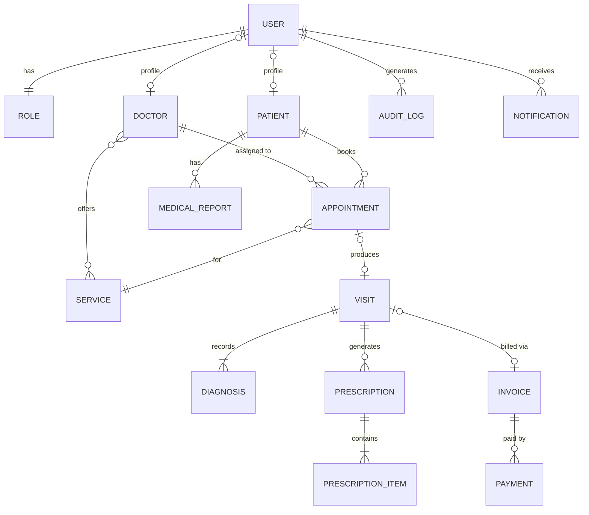
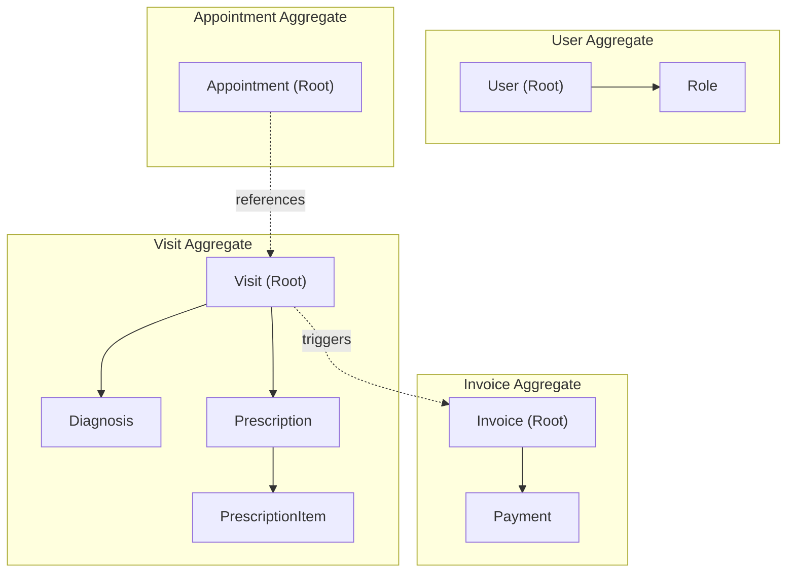

# ClinicDesk — Part 2: Use Cases & Domain Analysis

> **Project:** ClinicDesk — Web-Based Clinic Management System
> **Version:** 1.0
> **Date:** 2026-06-09
> **Status:** Draft

---

## Table of Contents

- [4. Use Cases](#4-use-cases)
  - [4.1 Use Case List](#41-use-case-list)
  - [4.2 Use Case Descriptions](#42-use-case-descriptions)
- [5. Use Case Diagram (PlantUML)](#5-use-case-diagram)
- [6. Domain Analysis](#6-domain-analysis)
  - [6.1 Main Entities](#61-main-entities)
  - [6.2 Entity Relationships](#62-entity-relationships)
  - [6.3 Aggregates](#63-aggregates)
  - [6.4 Business Rules & Constraints](#64-business-rules--constraints)

---

## 4. Use Cases

### 4.1 Use Case List

The following table catalogs every major feature in ClinicDesk, mapping each to the responsible user roles.

**User Roles:**

| Role                 | Description                                                                 |
|----------------------|-----------------------------------------------------------------------------|
| Guest                | An unauthenticated visitor browsing the public-facing pages.                |
| Patient              | A registered patient who books appointments and views medical records.      |
| Receptionist         | Front-desk staff managing patient intake, appointments, and billing.        |
| Doctor               | A licensed physician conducting visits, examinations, and prescriptions.    |
| Clinic Administrator | System administrator managing clinic settings, users, and reports.          |

**Use Case Catalog:**

| UC-ID  | Use Case Name                        | Primary Actor(s)               | Priority    |
|--------|--------------------------------------|--------------------------------|-------------|
| UC-01  | Register Account                     | Guest                          | Must-Have   |
| UC-02  | Log In                               | Guest                          | Must-Have   |
| UC-03  | Log Out                              | Patient, Receptionist, Doctor, Clinic Administrator | Must-Have   |
| UC-04  | Reset Password                       | Guest                          | Must-Have   |
| UC-05  | Manage User Profile                  | Patient, Doctor                | Must-Have   |
| UC-06  | Register New Patient                 | Receptionist                   | Must-Have   |
| UC-07  | Search Patients                      | Receptionist, Doctor           | Must-Have   |
| UC-08  | View Patient Medical Record          | Doctor, Patient                | Must-Have   |
| UC-09  | Update Patient Information           | Receptionist, Patient          | Must-Have   |
| UC-10  | Book Appointment                     | Patient, Receptionist          | Must-Have   |
| UC-11  | View Appointment Schedule            | Patient, Receptionist, Doctor  | Must-Have   |
| UC-12  | Cancel Appointment                   | Patient, Receptionist          | Must-Have   |
| UC-13  | Reschedule Appointment               | Patient, Receptionist          | Should-Have |
| UC-14  | Check In Patient for Appointment     | Receptionist                   | Must-Have   |
| UC-15  | Conduct Visit / Examination          | Doctor                         | Must-Have   |
| UC-16  | Record Diagnosis                     | Doctor                         | Must-Have   |
| UC-17  | Create Prescription                  | Doctor                         | Must-Have   |
| UC-18  | View Prescription History            | Doctor, Patient                | Must-Have   |
| UC-19  | Generate Invoice                     | Receptionist                   | Must-Have   |
| UC-20  | Record Payment                       | Receptionist                   | Must-Have   |
| UC-21  | View Billing History                 | Patient, Receptionist          | Should-Have |
| UC-22  | Generate Financial Report            | Clinic Administrator           | Should-Have |
| UC-23  | Generate Patient Visit Report        | Doctor, Clinic Administrator   | Should-Have |
| UC-24  | Send Appointment Reminder            | System (automated)             | Should-Have |
| UC-25  | Notify Patient of Prescription Ready | System (automated)             | Could-Have  |
| UC-26  | Manage Doctors                       | Clinic Administrator           | Must-Have   |
| UC-27  | Manage Clinic Services               | Clinic Administrator           | Must-Have   |
| UC-28  | Configure Clinic Settings            | Clinic Administrator           | Must-Have   |
| UC-29  | View Audit Log                       | Clinic Administrator           | Should-Have |
| UC-30  | Manage Working Hours / Availability  | Doctor, Clinic Administrator   | Must-Have   |

---

### 4.2 Use Case Descriptions

---

#### UC-01: Register Account

| Field            | Detail                                                                                             |
|------------------|----------------------------------------------------------------------------------------------------|
| **Use Case ID**  | UC-01                                                                                              |
| **Name**         | Register Account                                                                                   |
| **Primary Actor**| Guest                                                                                              |
| **Secondary Actors** | System                                                                                         |

**Preconditions:**

1. The Guest has navigated to the ClinicDesk registration page.
2. The Guest does not already possess an active account with the same email address.

**Main Flow:**

1. The Guest opens the registration page.
2. The system displays a registration form requesting: first name, last name, email address, phone number, date of birth, gender, and password.
3. The Guest fills in all required fields and submits the form.
4. The system validates that all required fields are provided and correctly formatted.
5. The system verifies the email address is not already registered.
6. The system hashes the password and creates a new User record with the role **Patient**.
7. The system sends a verification email to the provided email address containing a unique verification link.
8. The system displays a confirmation message instructing the Guest to check their email.
9. The Guest clicks the verification link.
10. The system marks the account as verified and redirects to the login page.

**Alternative Flows:**

- **AF-01a — Duplicate Email:** At step 5, if the email is already registered, the system displays an error: *"An account with this email already exists."* The Guest is prompted to log in or reset their password instead.
- **AF-01b — Weak Password:** At step 4, if the password does not meet strength requirements (minimum 8 characters, at least one uppercase, one lowercase, one digit, one special character), the system displays a validation error.
- **AF-01c — Verification Link Expired:** At step 9, if the verification link has expired (after 24 hours), the system displays an error and offers to resend a new verification email.
- **AF-01d — Invalid Phone Format:** At step 4, if the phone number format is not recognized, the system displays a validation error.

**Postconditions:**

1. A new User record exists in the database with role Patient and status Verified.
2. A corresponding Patient profile record is created.
3. The Guest can now log in using their email and password.

---

#### UC-02: Log In

| Field            | Detail                                                         |
|------------------|-----------------------------------------------------------------|
| **Use Case ID**  | UC-02                                                          |
| **Name**         | Log In                                                         |
| **Primary Actor**| Guest                                                          |
| **Secondary Actors** | System                                                     |

**Preconditions:**

1. The user has a verified, active account.
2. The user is currently unauthenticated.

**Main Flow:**

1. The Guest navigates to the login page.
2. The system presents a form requesting email and password.
3. The Guest enters credentials and submits the form.
4. The system validates the email format.
5. The system retrieves the user record by email and compares the submitted password against the stored hash.
6. The system verifies the account status is Active and Verified.
7. The system creates an authenticated session (JWT token or session cookie).
8. The system records the login event in the Audit Log (timestamp, IP address, user agent).
9. The system redirects the user to their role-specific dashboard:
   - Patient → Patient Dashboard
   - Receptionist → Front Desk Dashboard
   - Doctor → Doctor Dashboard
   - Clinic Administrator → Admin Dashboard

**Alternative Flows:**

- **AF-02a — Invalid Credentials:** At step 5, if the email/password combination is incorrect, the system displays a generic error: *"Invalid email or password."* The system increments the failed-login counter.
- **AF-02b — Account Locked:** If the failed-login counter exceeds 5 attempts within 15 minutes, the account is locked for 30 minutes. The system displays an appropriate message and sends a security notification email.
- **AF-02c — Unverified Account:** At step 6, if the account exists but is unverified, the system informs the user and offers to resend the verification email.
- **AF-02d — Deactivated Account:** At step 6, if the account is deactivated, the system displays: *"Your account has been deactivated. Please contact the clinic."*

**Postconditions:**

1. The user is authenticated with an active session.
2. An audit log entry records the successful login.

---

#### UC-04: Reset Password

| Field            | Detail                                                         |
|------------------|-----------------------------------------------------------------|
| **Use Case ID**  | UC-04                                                          |
| **Name**         | Reset Password                                                 |
| **Primary Actor**| Guest                                                          |
| **Secondary Actors** | System                                                     |

**Preconditions:**

1. The user has a registered account (verified or unverified).

**Main Flow:**

1. The Guest clicks "Forgot Password" on the login page.
2. The system displays a form requesting the registered email address.
3. The Guest enters their email and submits.
4. The system verifies the email exists in the user database.
5. The system generates a unique, time-limited reset token (valid for 1 hour).
6. The system sends a password-reset email containing a secure link with the token.
7. The system displays: *"If an account exists for this email, a reset link has been sent."*
8. The Guest clicks the link in the email.
9. The system validates the token (existence, expiry, single-use).
10. The system displays a form requesting the new password and confirmation.
11. The Guest enters and confirms the new password.
12. The system validates password strength and that both entries match.
13. The system hashes and stores the new password, invalidates the reset token, and revokes all existing sessions for this user.
14. The system redirects the Guest to the login page with a success message.

**Alternative Flows:**

- **AF-04a — Unknown Email:** At step 4, the system still displays the generic message at step 7 (to prevent email enumeration attacks) but does not send an email.
- **AF-04b — Expired Token:** At step 9, if the token has expired, the system displays an error and prompts the user to request a new reset link.
- **AF-04c — Token Already Used:** At step 9, if the token has already been consumed, the system rejects the request.

**Postconditions:**

1. The user's password is updated.
2. All prior sessions are invalidated.
3. The reset token is consumed and cannot be reused.

---

#### UC-06: Register New Patient

| Field            | Detail                                                         |
|------------------|-----------------------------------------------------------------|
| **Use Case ID**  | UC-06                                                          |
| **Name**         | Register New Patient                                           |
| **Primary Actor**| Receptionist                                                   |
| **Secondary Actors** | System                                                     |

**Preconditions:**

1. The Receptionist is authenticated and has an active session.
2. The patient does not already have a record in the system.

**Main Flow:**

1. The Receptionist navigates to the Patient Management section.
2. The Receptionist clicks "Register New Patient."
3. The system displays a patient intake form with fields: first name, last name, date of birth, gender, national ID / passport number, phone number, email (optional), address, emergency contact (name, relationship, phone), blood type (optional), known allergies (optional), and insurance provider/policy number (optional).
4. The Receptionist fills in the required fields from the patient's documentation.
5. The Receptionist submits the form.
6. The system validates all required fields and format constraints.
7. The system checks for potential duplicate patients (matching on name + date of birth or national ID).
8. The system generates a unique Patient ID (e.g., `PAT-20260001`).
9. The system creates the Patient record and, optionally, a linked User account if an email was provided.
10. The system displays the new patient's summary page with their Patient ID.
11. The system logs the creation event in the Audit Log.

**Alternative Flows:**

- **AF-06a — Potential Duplicate Found:** At step 7, if a potential duplicate is detected, the system displays a warning with the matching records. The Receptionist can either confirm creation of a new record or navigate to the existing patient.
- **AF-06b — Missing Required Fields:** At step 6, if required fields are empty, the system highlights them and prevents submission.

**Postconditions:**

1. A new Patient record exists with a unique Patient ID.
2. If an email was provided, a User account is created with a temporary password, and a welcome email is sent.
3. An audit log entry is recorded.

---

#### UC-07: Search Patients

| Field            | Detail                                                         |
|------------------|-----------------------------------------------------------------|
| **Use Case ID**  | UC-07                                                          |
| **Name**         | Search Patients                                                |
| **Primary Actor**| Receptionist, Doctor                                           |
| **Secondary Actors** | System                                                     |

**Preconditions:**

1. The actor is authenticated with role Receptionist or Doctor.

**Main Flow:**

1. The actor navigates to the Patient Search screen.
2. The system displays a search form with fields: Patient ID, name, phone number, national ID, date of birth.
3. The actor enters one or more search criteria and submits.
4. The system performs a case-insensitive, partial-match search across the specified fields.
5. The system returns a paginated results table showing: Patient ID, full name, date of birth, phone, and last visit date.
6. The actor clicks a patient row to open the patient's detail page.

**Alternative Flows:**

- **AF-07a — No Results Found:** At step 5, if no patients match, the system displays: *"No patients found matching your criteria."* The Receptionist is offered a link to register a new patient.
- **AF-07b — Too Many Results:** If more than 50 results are returned, the system displays the first page and prompts the actor to refine search criteria.

**Postconditions:**

1. The search results are displayed. No data is modified.

---

#### UC-10: Book Appointment

| Field            | Detail                                                         |
|------------------|-----------------------------------------------------------------|
| **Use Case ID**  | UC-10                                                          |
| **Name**         | Book Appointment                                               |
| **Primary Actor**| Patient, Receptionist                                          |
| **Secondary Actors** | Doctor (indirectly), System                                |

**Preconditions:**

1. The actor is authenticated.
2. The patient record exists in the system.
3. At least one Doctor has available time slots.

**Main Flow:**

1. The actor navigates to the "Book Appointment" page.
2. If the actor is a Receptionist, they first search for and select a patient (invokes UC-07).
3. The system displays a list of available services/specialties (e.g., General Consultation, Dermatology).
4. The actor selects a service.
5. The system displays a list of doctors who provide the selected service.
6. The actor selects a doctor.
7. The system retrieves the doctor's availability for the upcoming 30 days, subtracting already-booked slots, and displays a calendar view.
8. The actor selects a date.
9. The system displays the available time slots for the chosen date (each slot = clinic-configured duration, e.g., 20 minutes).
10. The actor selects a time slot.
11. The system displays a confirmation summary: patient name, doctor name, service, date, time, estimated cost.
12. The actor confirms the booking.
13. The system creates an Appointment record with status **Scheduled**.
14. The system sends a confirmation notification (email and/or SMS) to the patient.
15. The system displays the appointment confirmation with a unique Appointment ID.

**Alternative Flows:**

- **AF-10a — No Available Slots:** At step 9, if the selected date has no available slots, the system suggests the nearest available dates.
- **AF-10b — Slot Taken (Race Condition):** At step 13, if another user has booked the same slot concurrently, the system displays an error and returns to step 9 with refreshed availability.
- **AF-10c — Patient Has Conflicting Appointment:** At step 12, if the patient already has an appointment overlapping the selected time, the system displays a warning and asks for confirmation or an alternative slot.
- **AF-10d — Doctor on Leave:** At step 7, if the doctor has no availability in the upcoming period, the system informs the actor and suggests other doctors.

**Postconditions:**

1. A new Appointment record exists with status Scheduled.
2. The selected time slot is reserved for the patient with the specified doctor.
3. The patient receives a confirmation notification.

---

#### UC-12: Cancel Appointment

| Field            | Detail                                                         |
|------------------|-----------------------------------------------------------------|
| **Use Case ID**  | UC-12                                                          |
| **Name**         | Cancel Appointment                                             |
| **Primary Actor**| Patient, Receptionist                                          |
| **Secondary Actors** | System                                                     |

**Preconditions:**

1. The actor is authenticated.
2. An appointment with status **Scheduled** exists.

**Main Flow:**

1. The actor navigates to the appointment list and selects the appointment to cancel.
2. The system displays the appointment details and a cancellation form requesting an optional reason.
3. The actor provides an optional reason and confirms cancellation.
4. The system validates that the appointment is at least 2 hours in the future (configurable cancellation policy).
5. The system updates the appointment status to **Cancelled** and records the reason and timestamp.
6. The system frees the time slot, making it available for other bookings.
7. The system sends a cancellation notification to the patient (and the doctor, if configured).

**Alternative Flows:**

- **AF-12a — Late Cancellation:** At step 4, if the appointment is within the cancellation window (less than 2 hours away), the system warns the actor that a late-cancellation fee may apply. The actor may proceed or abort.
- **AF-12b — Already Completed:** If the appointment status is Completed, the system prevents cancellation and displays: *"This appointment has already been completed."*

**Postconditions:**

1. The appointment status is Cancelled.
2. The doctor's time slot is released.
3. Notifications are sent.

---

#### UC-14: Check In Patient for Appointment

| Field            | Detail                                                         |
|------------------|-----------------------------------------------------------------|
| **Use Case ID**  | UC-14                                                          |
| **Name**         | Check In Patient for Appointment                               |
| **Primary Actor**| Receptionist                                                   |
| **Secondary Actors** | System                                                     |

**Preconditions:**

1. The Receptionist is authenticated.
2. The patient has a Scheduled appointment for today.

**Main Flow:**

1. The Receptionist opens the "Today's Appointments" view.
2. The system displays all appointments for the current day, sorted by time, showing: time, patient name, doctor, service, and status.
3. The Receptionist locates the arriving patient's appointment.
4. The Receptionist clicks "Check In."
5. The system updates the appointment status from **Scheduled** to **Checked-In**.
6. The system records the check-in timestamp.
7. The system notifies the assigned Doctor (via dashboard notification or real-time alert) that the patient has arrived.
8. The patient appears in the Doctor's waiting queue.

**Alternative Flows:**

- **AF-14a — Patient Arrives Without Appointment:** The Receptionist can create a walk-in appointment (invokes UC-10 with immediate time slot) and then check the patient in.
- **AF-14b — Patient Arrives Late:** If the patient arrives more than 15 minutes after the scheduled time, the system prompts the Receptionist to either check in normally or reschedule (invokes UC-13).

**Postconditions:**

1. The appointment status is Checked-In.
2. The Doctor is notified.

---

#### UC-15: Conduct Visit / Examination

| Field            | Detail                                                         |
|------------------|-----------------------------------------------------------------|
| **Use Case ID**  | UC-15                                                          |
| **Name**         | Conduct Visit / Examination                                    |
| **Primary Actor**| Doctor                                                         |
| **Secondary Actors** | Patient (passive), System                                  |

**Preconditions:**

1. The Doctor is authenticated.
2. The patient has been checked in (appointment status = Checked-In).

**Main Flow:**

1. The Doctor opens their dashboard and views the waiting queue.
2. The Doctor selects the next patient from the queue.
3. The system displays the patient's summary: demographics, known allergies, chronic conditions, and the last 5 visits.
4. The system creates a new Visit record linked to the Appointment, with status **In-Progress**, and records the visit start time.
5. The Doctor reviews the patient's chief complaint and medical history.
6. The Doctor enters clinical notes in a structured form: chief complaint, history of present illness, examination findings, vital signs (blood pressure, temperature, pulse, weight, height).
7. The Doctor records one or more diagnoses (invokes UC-16).
8. Optionally, the Doctor creates a prescription (invokes UC-17).
9. Optionally, the Doctor orders lab tests or follow-up appointments.
10. The Doctor marks the visit as **Completed**.
11. The system records the visit end time and calculates the visit duration.
12. The system updates the appointment status to **Completed**.
13. The system triggers invoice generation (notifies the Receptionist — invokes UC-19).

**Alternative Flows:**

- **AF-15a — Doctor Refers to Specialist:** At step 9, the Doctor creates a referral note specifying the specialty and reason. The system records the referral and optionally initiates a new appointment booking.
- **AF-15b — Patient Leaves Mid-Visit:** The Doctor can mark the visit as **Incomplete** with a note. The visit is still recorded for documentation purposes.

**Postconditions:**

1. A Visit record exists with clinical notes, diagnoses, and optional prescriptions.
2. The appointment status is Completed.
3. Invoice generation is triggered.

---

#### UC-16: Record Diagnosis

| Field            | Detail                                                         |
|------------------|-----------------------------------------------------------------|
| **Use Case ID**  | UC-16                                                          |
| **Name**         | Record Diagnosis                                               |
| **Primary Actor**| Doctor                                                         |
| **Secondary Actors** | System                                                     |

**Preconditions:**

1. A visit is in progress (status = In-Progress).
2. The Doctor is the assigned physician for the visit.

**Main Flow:**

1. Within the visit form, the Doctor navigates to the Diagnosis section.
2. The system displays a searchable field supporting ICD-10 codes and free-text descriptions.
3. The Doctor searches for and selects a diagnosis code (e.g., `J06.9 — Acute upper respiratory infection, unspecified`).
4. The Doctor sets the diagnosis type: Primary or Secondary.
5. The Doctor adds optional clinical notes specific to the diagnosis.
6. The Doctor may repeat steps 3–5 to add additional diagnoses.
7. The system saves the diagnoses, linking each to the current Visit.

**Alternative Flows:**

- **AF-16a — Custom / Unlisted Diagnosis:** If the Doctor cannot find a matching ICD-10 code, they may enter a free-text diagnosis with a note flagging it for administrative review.

**Postconditions:**

1. One or more Diagnosis records are linked to the Visit.
2. Exactly one Primary diagnosis exists per Visit.

---

#### UC-17: Create Prescription

| Field            | Detail                                                         |
|------------------|-----------------------------------------------------------------|
| **Use Case ID**  | UC-17                                                          |
| **Name**         | Create Prescription                                            |
| **Primary Actor**| Doctor                                                         |
| **Secondary Actors** | System, Patient                                            |

**Preconditions:**

1. A visit is in progress (status = In-Progress).
2. At least one diagnosis has been recorded for the visit.

**Main Flow:**

1. The Doctor navigates to the Prescription section within the visit form.
2. The system displays a prescription form.
3. The Doctor searches the medication database and selects a medication.
4. The Doctor specifies: dosage, frequency (e.g., "twice daily"), route of administration (oral, topical, etc.), duration (e.g., "7 days"), and quantity.
5. The system checks for known drug allergies against the patient's allergy profile and displays a warning if a match is found.
6. The system checks for known drug-drug interactions with the patient's active medications and displays warnings if found.
7. The Doctor reviews any warnings and either adjusts the prescription or explicitly overrides with a documented justification.
8. The Doctor may add additional prescription items by repeating steps 3–7.
9. The Doctor adds optional pharmacist instructions and patient instructions.
10. The Doctor submits the prescription.
11. The system creates a Prescription record with status **Active**, linked to the Visit.
12. The system sends a notification to the Patient that a prescription is ready (if notifications are enabled).

**Alternative Flows:**

- **AF-17a — Allergy Conflict:** At step 5, if a critical allergy match is detected, the system blocks the prescription and requires the Doctor to choose an alternative medication or provide an override reason.
- **AF-17b — Refill of Existing Prescription:** The Doctor may choose to refill an existing prescription from the patient's history, pre-populating the form with previous values.

**Postconditions:**

1. A Prescription record with one or more PrescriptionItems exists, linked to the Visit.
2. The Patient is notified.

---

#### UC-19: Generate Invoice

| Field            | Detail                                                         |
|------------------|-----------------------------------------------------------------|
| **Use Case ID**  | UC-19                                                          |
| **Name**         | Generate Invoice                                               |
| **Primary Actor**| Receptionist                                                   |
| **Secondary Actors** | System                                                     |

**Preconditions:**

1. The Receptionist is authenticated.
2. A Visit has been completed (visit status = Completed).

**Main Flow:**

1. The Receptionist receives a notification that a visit has been completed, or navigates to the "Pending Invoices" queue.
2. The Receptionist selects the completed visit.
3. The system auto-generates a draft invoice based on:
   - The consultation service fee (from the clinic's service catalog).
   - Any additional services performed during the visit.
   - Applicable tax rates.
4. The system displays the draft invoice with line items, subtotal, tax, and total.
5. The Receptionist reviews and may adjust line items (add/remove services, apply discounts).
6. The Receptionist finalizes the invoice.
7. The system assigns a unique Invoice Number (e.g., `INV-20260601-001`).
8. The system sets the invoice status to **Issued** and records the issue date.
9. The system presents the invoice for payment (invokes UC-20) or marks it as pending.

**Alternative Flows:**

- **AF-19a — Insurance-Covered Visit:** At step 5, the Receptionist indicates the visit is covered by insurance. The system splits the invoice into patient-responsibility and insurance-claim portions. The insurance claim is queued for submission.
- **AF-19b — Free / Charity Visit:** The Receptionist applies a 100% discount with reason code "Charity/Pro-bono." The invoice is generated with a zero balance.

**Postconditions:**

1. An Invoice record exists linked to the Visit.
2. The invoice is ready for payment or insurance submission.

---

#### UC-20: Record Payment

| Field            | Detail                                                         |
|------------------|-----------------------------------------------------------------|
| **Use Case ID**  | UC-20                                                          |
| **Name**         | Record Payment                                                 |
| **Primary Actor**| Receptionist                                                   |
| **Secondary Actors** | System                                                     |

**Preconditions:**

1. An invoice with status **Issued** or **Partially Paid** exists.

**Main Flow:**

1. The Receptionist opens the invoice (from the billing queue or patient profile).
2. The system displays the invoice details including the outstanding balance.
3. The Receptionist selects the payment method: Cash, Credit Card, Debit Card, Bank Transfer, or Insurance.
4. The Receptionist enters the payment amount.
5. The system validates the amount (must be > 0 and ≤ outstanding balance).
6. The Receptionist enters a transaction reference number (for card/transfer payments).
7. The Receptionist confirms the payment.
8. The system creates a Payment record linked to the Invoice.
9. The system updates the invoice:
   - If the payment equals the outstanding balance → status changes to **Paid**.
   - If the payment is less → status changes to **Partially Paid**.
10. The system generates a payment receipt (printable / PDF).
11. The system records the transaction in the Audit Log.

**Alternative Flows:**

- **AF-20a — Overpayment:** At step 5, if the entered amount exceeds the outstanding balance, the system rejects the transaction and prompts the Receptionist to enter the correct amount or issue a credit note.
- **AF-20b — Payment Reversal:** If a payment must be reversed (e.g., bounced cheque), the Clinic Administrator can initiate a reversal, which creates a negative Payment record and re-opens the invoice.

**Postconditions:**

1. A Payment record exists linked to the Invoice.
2. The Invoice status accurately reflects the payment state.
3. A receipt is available for printing.

---

#### UC-22: Generate Financial Report

| Field            | Detail                                                         |
|------------------|-----------------------------------------------------------------|
| **Use Case ID**  | UC-22                                                          |
| **Name**         | Generate Financial Report                                      |
| **Primary Actor**| Clinic Administrator                                           |
| **Secondary Actors** | System                                                     |

**Preconditions:**

1. The Clinic Administrator is authenticated.
2. Financial data (invoices, payments) exists in the system.

**Main Flow:**

1. The Clinic Administrator navigates to the Reports section.
2. The system displays available report types: Daily Revenue, Monthly Revenue, Outstanding Invoices, Revenue by Service, Revenue by Doctor.
3. The Clinic Administrator selects a report type.
4. The Clinic Administrator specifies the date range and optional filters (doctor, service).
5. The system queries the database, aggregates the data, and generates the report.
6. The system displays the report with summary statistics, charts (bar/line), and a detailed data table.
7. The Clinic Administrator may export the report as PDF or CSV.

**Alternative Flows:**

- **AF-22a — No Data for Range:** If no financial data exists for the selected date range, the system displays: *"No data available for the selected period."*

**Postconditions:**

1. The report is displayed and optionally exported. No data is modified.

---

#### UC-26: Manage Doctors

| Field            | Detail                                                         |
|------------------|-----------------------------------------------------------------|
| **Use Case ID**  | UC-26                                                          |
| **Name**         | Manage Doctors                                                 |
| **Primary Actor**| Clinic Administrator                                           |
| **Secondary Actors** | System                                                     |

**Preconditions:**

1. The Clinic Administrator is authenticated.

**Main Flow:**

1. The Clinic Administrator navigates to the "Doctor Management" page.
2. The system displays a list of all doctors with: name, specialty, status (Active/Inactive), contact information.
3. **To add a new doctor:**
   a. The Administrator clicks "Add Doctor."
   b. The system displays a form: first name, last name, email, phone, specialty, license number, qualifications, bio (optional), consultation fee.
   c. The Administrator fills in the form and submits.
   d. The system creates a User account with role Doctor, a Doctor profile, and sends an invitation email with a temporary password.
4. **To edit an existing doctor:**
   a. The Administrator selects a doctor and clicks "Edit."
   b. The system displays the doctor's profile form pre-populated.
   c. The Administrator updates the desired fields and saves.
5. **To deactivate a doctor:**
   a. The Administrator clicks "Deactivate."
   b. The system verifies the doctor has no future scheduled appointments.
   c. The system sets the doctor's status to Inactive.

**Alternative Flows:**

- **AF-26a — Deactivation with Pending Appointments:** At step 5b, if the doctor has future appointments, the system warns the Administrator and requires that those appointments be reassigned or cancelled before deactivation.

**Postconditions:**

1. The doctor's record is created, updated, or deactivated as appropriate.
2. Corresponding audit log entries are recorded.

---

#### UC-29: View Audit Log

| Field            | Detail                                                         |
|------------------|-----------------------------------------------------------------|
| **Use Case ID**  | UC-29                                                          |
| **Name**         | View Audit Log                                                 |
| **Primary Actor**| Clinic Administrator                                           |
| **Secondary Actors** | System                                                     |

**Preconditions:**

1. The Clinic Administrator is authenticated.

**Main Flow:**

1. The Clinic Administrator navigates to the Audit Log page.
2. The system displays filter options: date range, user, action type (CREATE, UPDATE, DELETE, LOGIN, LOGOUT), entity type (User, Patient, Appointment, Invoice, etc.).
3. The Administrator applies filters and submits.
4. The system queries and displays a paginated table: timestamp, user (name + role), action, entity type, entity ID, IP address, and a summary of changes (old value → new value).
5. The Administrator can click on a row to view the full change detail as a JSON diff.

**Alternative Flows:**

- **AF-29a — Export Audit Log:** The Administrator may export the filtered results as CSV for compliance or external review.

**Postconditions:**

1. The audit log is displayed. No data is modified. The act of viewing the audit log is itself logged.

---

#### UC-30: Manage Working Hours / Availability

| Field            | Detail                                                         |
|------------------|-----------------------------------------------------------------|
| **Use Case ID**  | UC-30                                                          |
| **Name**         | Manage Working Hours / Availability                            |
| **Primary Actor**| Doctor, Clinic Administrator                                   |
| **Secondary Actors** | System                                                     |

**Preconditions:**

1. The actor is authenticated.
2. A Doctor profile exists.

**Main Flow:**

1. The Doctor (or Clinic Administrator on behalf of a doctor) navigates to the Availability Management page.
2. The system displays the doctor's current weekly schedule as a calendar grid (days × time blocks).
3. The actor sets regular working hours for each day of the week (e.g., Sunday: 09:00–13:00, 15:00–18:00).
4. The actor specifies the consultation slot duration (e.g., 20 minutes) and buffer time between appointments (e.g., 5 minutes).
5. The actor may add **time-off** blocks (vacation, conference) by selecting a date range and a reason.
6. The actor saves the schedule.
7. The system validates that no existing Scheduled appointments conflict with newly blocked time.
8. The system updates the doctor's availability, which is immediately reflected in the appointment booking flow (UC-10).

**Alternative Flows:**

- **AF-30a — Conflict with Existing Appointments:** At step 7, if existing appointments fall within a newly blocked period, the system lists the conflicting appointments and requires the actor to reschedule or cancel them before saving.

**Postconditions:**

1. The doctor's availability is updated.
2. Future appointment booking reflects the new availability.

---

## 5. Use Case Diagram

The following PlantUML code renders the complete use case diagram for ClinicDesk. Copy and paste into any PlantUML renderer.

```plantuml
@startuml ClinicDesk_UseCaseDiagram
!theme plain
skinparam actorStyle awesome
skinparam packageStyle rectangle
skinparam usecaseBackgroundColor #FEFEFE
skinparam rectangleBackgroundColor #F5F5F5
skinparam defaultFontSize 11

left to right direction

' ───────────────────────────────────────────
' ACTORS
' ───────────────────────────────────────────
actor "Guest" as Guest
actor "Patient" as Patient
actor "Receptionist" as Receptionist
actor "Doctor" as Doctor
actor "Clinic\nAdministrator" as Admin

' ───────────────────────────────────────────
' SUBSYSTEMS
' ───────────────────────────────────────────

rectangle "Authentication" {
  usecase "UC-01: Register Account" as UC01
  usecase "UC-02: Log In" as UC02
  usecase "UC-03: Log Out" as UC03
  usecase "UC-04: Reset Password" as UC04
  usecase "UC-05: Manage User Profile" as UC05
}

rectangle "Patient Management" {
  usecase "UC-06: Register New Patient" as UC06
  usecase "UC-07: Search Patients" as UC07
  usecase "UC-08: View Patient\nMedical Record" as UC08
  usecase "UC-09: Update Patient\nInformation" as UC09
}

rectangle "Appointments" {
  usecase "UC-10: Book Appointment" as UC10
  usecase "UC-11: View Appointment\nSchedule" as UC11
  usecase "UC-12: Cancel Appointment" as UC12
  usecase "UC-13: Reschedule\nAppointment" as UC13
  usecase "UC-14: Check In Patient" as UC14
  usecase "UC-30: Manage Working\nHours / Availability" as UC30
}

rectangle "Visits & Examinations" {
  usecase "UC-15: Conduct Visit /\nExamination" as UC15
  usecase "UC-16: Record Diagnosis" as UC16
}

rectangle "Prescriptions" {
  usecase "UC-17: Create Prescription" as UC17
  usecase "UC-18: View Prescription\nHistory" as UC18
}

rectangle "Billing" {
  usecase "UC-19: Generate Invoice" as UC19
  usecase "UC-20: Record Payment" as UC20
  usecase "UC-21: View Billing History" as UC21
}

rectangle "Reports" {
  usecase "UC-22: Generate Financial\nReport" as UC22
  usecase "UC-23: Generate Patient\nVisit Report" as UC23
}

rectangle "Notifications" {
  usecase "UC-24: Send Appointment\nReminder" as UC24
  usecase "UC-25: Notify Patient of\nPrescription Ready" as UC25
}

rectangle "Administration" {
  usecase "UC-26: Manage Doctors" as UC26
  usecase "UC-27: Manage Clinic\nServices" as UC27
  usecase "UC-28: Configure Clinic\nSettings" as UC28
  usecase "UC-29: View Audit Log" as UC29
}

' ───────────────────────────────────────────
' GUEST ASSOCIATIONS
' ───────────────────────────────────────────
Guest --> UC01
Guest --> UC02
Guest --> UC04

' ───────────────────────────────────────────
' PATIENT ASSOCIATIONS
' ───────────────────────────────────────────
Patient --> UC03
Patient --> UC05
Patient --> UC08
Patient --> UC09
Patient --> UC10
Patient --> UC11
Patient --> UC12
Patient --> UC13
Patient --> UC18
Patient --> UC21

' ───────────────────────────────────────────
' RECEPTIONIST ASSOCIATIONS
' ───────────────────────────────────────────
Receptionist --> UC03
Receptionist --> UC06
Receptionist --> UC07
Receptionist --> UC09
Receptionist --> UC10
Receptionist --> UC11
Receptionist --> UC12
Receptionist --> UC13
Receptionist --> UC14
Receptionist --> UC19
Receptionist --> UC20
Receptionist --> UC21

' ───────────────────────────────────────────
' DOCTOR ASSOCIATIONS
' ───────────────────────────────────────────
Doctor --> UC03
Doctor --> UC05
Doctor --> UC07
Doctor --> UC08
Doctor --> UC11
Doctor --> UC15
Doctor --> UC16
Doctor --> UC17
Doctor --> UC18
Doctor --> UC23
Doctor --> UC30

' ───────────────────────────────────────────
' CLINIC ADMINISTRATOR ASSOCIATIONS
' ───────────────────────────────────────────
Admin --> UC03
Admin --> UC22
Admin --> UC23
Admin --> UC26
Admin --> UC27
Admin --> UC28
Admin --> UC29
Admin --> UC30

' ───────────────────────────────────────────
' INCLUDE / EXTEND RELATIONSHIPS
' ───────────────────────────────────────────
UC10 ..> UC07  : <<include>>
UC15 ..> UC16  : <<include>>
UC15 ..> UC17  : <<extend>>
UC15 ..> UC19  : <<triggers>>
UC12 ..> UC24  : <<triggers>>
UC17 ..> UC25  : <<triggers>>
UC13 ..> UC24  : <<triggers>>

@enduml
```

---

## 6. Domain Analysis

### 6.1 Main Entities

The following entities constitute the core domain model for ClinicDesk.

| #  | Entity             | Description                                                                                                     |
|----|--------------------|-----------------------------------------------------------------------------------------------------------------|
| 1  | **User**           | Represents an authenticated account in the system. Holds credentials, role assignment, and account status.       |
| 2  | **Role**           | Defines the set of permissions and access levels (Guest, Patient, Receptionist, Doctor, Clinic Administrator).   |
| 3  | **Patient**        | A person receiving medical care. Contains demographic data, emergency contacts, allergies, and insurance info.   |
| 4  | **Doctor**         | A medical professional linked to a User account. Holds specialty, license number, qualifications, and schedule.  |
| 5  | **Appointment**    | A scheduled time slot linking a Patient to a Doctor for a specific Service. Tracks status lifecycle.             |
| 6  | **Visit**          | A clinical encounter that occurs when a patient's appointment is fulfilled. Contains examination notes.          |
| 7  | **Diagnosis**      | A medical condition identified during a visit. References ICD-10 codes and is typed as Primary or Secondary.    |
| 8  | **Prescription**   | A medication order created during a visit. Acts as a container for one or more PrescriptionItems.                |
| 9  | **PrescriptionItem** | A single medication entry within a Prescription. Specifies drug, dosage, frequency, duration, and quantity.   |
| 10 | **Invoice**        | A financial document generated after a visit. Contains line items, totals, tax, discounts, and payment status.   |
| 11 | **Payment**        | A financial transaction applied against an Invoice. Tracks method, amount, reference, and timestamp.             |
| 12 | **Notification**   | A message sent to a user via email, SMS, or in-app channel. Tracks delivery status and type.                    |
| 13 | **Service**        | A medical or administrative service offered by the clinic (e.g., General Consultation, Lab Test, X-Ray).         |
| 14 | **ClinicSettings** | A singleton configuration entity storing clinic-wide parameters: name, address, tax rates, slot durations, etc.  |
| 15 | **AuditLog**       | An immutable record of every significant action performed in the system, capturing who, what, when, and where.   |
| 16 | **MedicalReport**  | A generated document summarizing a patient's visit history, diagnoses, and treatments for a given date range.    |

---

### 6.2 Entity Relationships

The following table describes the relationships between domain entities.

| Source Entity     | Relationship     | Target Entity      | Cardinality   | Description                                                           |
|-------------------|------------------|--------------------|---------------|-----------------------------------------------------------------------|
| User              | has one          | Role               | 1 : 1         | Each user is assigned exactly one role.                               |
| User              | has one          | Patient            | 1 : 0..1      | A user with the Patient role has a linked Patient profile.            |
| User              | has one          | Doctor             | 1 : 0..1      | A user with the Doctor role has a linked Doctor profile.              |
| Patient           | has many         | Appointment        | 1 : 0..*      | A patient can have zero or more appointments.                         |
| Doctor            | has many         | Appointment        | 1 : 0..*      | A doctor can be assigned zero or more appointments.                   |
| Appointment       | belongs to       | Patient            | * : 1         | Every appointment is linked to exactly one patient.                   |
| Appointment       | belongs to       | Doctor             | * : 1         | Every appointment is assigned to exactly one doctor.                  |
| Appointment       | references       | Service            | * : 1         | Every appointment is for a specific service type.                     |
| Appointment       | has one          | Visit              | 1 : 0..1      | A completed appointment produces exactly one visit (or none if cancelled). |
| Visit             | belongs to       | Appointment        | 1 : 1         | Each visit is linked to its originating appointment.                  |
| Visit             | has many         | Diagnosis          | 1 : 1..*      | A visit must have at least one diagnosis.                             |
| Visit             | has many         | Prescription       | 1 : 0..*      | A visit may have zero or more prescriptions.                          |
| Prescription      | belongs to       | Visit              | * : 1         | Each prescription is created in the context of a visit.               |
| Prescription      | has many         | PrescriptionItem   | 1 : 1..*      | A prescription must have at least one item.                           |
| PrescriptionItem  | belongs to       | Prescription       | * : 1         | Each item belongs to one prescription.                                |
| Visit             | has one          | Invoice            | 1 : 0..1      | A visit may generate one invoice.                                     |
| Invoice           | belongs to       | Visit              | 1 : 1         | Each invoice is linked to one visit.                                  |
| Invoice           | has many         | Payment            | 1 : 0..*      | An invoice may have zero or more payments (partial or full).          |
| Payment           | belongs to       | Invoice            | * : 1         | Each payment is applied against one invoice.                          |
| Doctor            | offers many      | Service            | * : *         | A doctor may offer multiple services; a service may be offered by multiple doctors. |
| User              | generates many   | AuditLog           | 1 : 0..*      | Every user action may produce audit log entries.                      |
| User              | receives many    | Notification       | 1 : 0..*      | A user can receive multiple notifications.                            |
| Patient           | has many         | MedicalReport      | 1 : 0..*      | A patient can have multiple generated medical reports.                |

**Entity Relationship Diagram (Mermaid):**

---

### 6.3 Aggregates

Aggregates define transactional consistency boundaries. All modifications within an aggregate pass through its root entity.

| Aggregate Root     | Aggregate Boundary                                      | Rationale                                                                                           |
|--------------------|---------------------------------------------------------|-----------------------------------------------------------------------------------------------------|
| **User**           | User, Role                                              | User credentials and role assignment are always modified together.                                  |
| **Patient**        | Patient                                                 | Patient demographic data is an independent entity. References User but is its own aggregate.        |
| **Doctor**         | Doctor                                                  | Doctor profile, specialty, and qualifications. References User but managed independently.           |
| **Appointment**    | Appointment                                             | Appointment scheduling is a standalone transactional unit. References Patient, Doctor, and Service. |
| **Visit**          | Visit, Diagnosis, Prescription, PrescriptionItem        | A visit and all its clinical contents (diagnoses, prescriptions) are created and modified as a unit. Prescription items cannot exist without their parent prescription, and prescriptions cannot exist without their visit. |
| **Invoice**        | Invoice, Payment                                        | An invoice and its payments form a financial unit. Payments cannot exist without an invoice, and invoice status is derived from its payments. |
| **Notification**   | Notification                                            | Notifications are fire-and-forget; each is an independent entity.                                   |
| **Service**        | Service                                                 | Clinic service definitions are managed independently.                                               |
| **ClinicSettings** | ClinicSettings                                          | Singleton aggregate storing global configuration.                                                   |
| **AuditLog**       | AuditLog                                                | Immutable, append-only entity. Each entry is independent.                                           |
| **MedicalReport**  | MedicalReport                                           | Generated documents referencing patient and visit data. Read-model artifact.                        |

**Aggregate Boundary Diagram:**

---

### 6.4 Business Rules & Constraints

The following business rules govern the behavior and integrity of the ClinicDesk system.

| #   | Rule ID | Rule Description                                                                                                                 | Enforcement       |
|-----|---------|----------------------------------------------------------------------------------------------------------------------------------|--------------------|
| 1   | BR-01   | An appointment **cannot overlap** with another appointment for the **same doctor** at the same date and time.                    | Application + DB   |
| 2   | BR-02   | An appointment **cannot overlap** with another appointment for the **same patient** at the same date and time.                   | Application + DB   |
| 3   | BR-03   | Only users with the **Doctor** role can create prescriptions and record diagnoses.                                                | Application (AuthZ)|
| 4   | BR-04   | A prescription **must contain at least one** PrescriptionItem. Empty prescriptions are not permitted.                            | Application + DB   |
| 5   | BR-05   | Invoices **cannot be deleted** once a payment has been recorded against them. They may only be voided with a credit note.        | Application + DB   |
| 6   | BR-06   | A payment amount must be **greater than zero** and **must not exceed** the invoice's outstanding balance.                        | Application        |
| 7   | BR-07   | A patient must be **checked in** (appointment status = Checked-In) before a doctor can start a visit.                            | Application        |
| 8   | BR-08   | Every visit must have **exactly one primary diagnosis**. Additional secondary diagnoses are optional.                            | Application        |
| 9   | BR-09   | Appointments can only be booked during a doctor's **configured working hours** and not during blocked time-off periods.          | Application        |
| 10  | BR-10   | An appointment can only be **cancelled** if its status is **Scheduled**. Completed, In-Progress, or already Cancelled appointments cannot be cancelled. | Application |
| 11  | BR-11   | Password reset tokens **expire after 1 hour** and are **single-use**. A consumed or expired token cannot be reused.             | Application + DB   |
| 12  | BR-12   | After **5 consecutive failed login attempts** within 15 minutes, the user account is **locked for 30 minutes**.                  | Application        |
| 13  | BR-13   | A doctor **cannot be deactivated** while they have **future scheduled appointments**. Appointments must be reassigned or cancelled first. | Application |
| 14  | BR-14   | Patient **email addresses must be unique** across all user accounts. Duplicate registrations are rejected.                       | Application + DB   |
| 15  | BR-15   | The **Patient ID** is system-generated, immutable, and follows the format `PAT-YYYYNNNN` where YYYY is the year and NNNN is a sequential number. | Application + DB |
| 16  | BR-16   | All audit log entries are **immutable** — they cannot be edited or deleted by any user, including Clinic Administrators.          | DB (append-only)   |
| 17  | BR-17   | Appointment cancellation within the **late-cancellation window** (configurable, default 2 hours before) may incur a fee.         | Application        |
| 18  | BR-18   | A visit **cannot be marked as Completed** without at least one recorded diagnosis.                                               | Application        |
| 19  | BR-19   | The system must check for **drug-allergy conflicts** and **drug-drug interactions** before a prescription is finalized. Critical conflicts require an explicit override with documented justification. | Application |
| 20  | BR-20   | Only the **Clinic Administrator** role can modify ClinicSettings (tax rates, slot durations, clinic name, etc.).                  | Application (AuthZ)|
