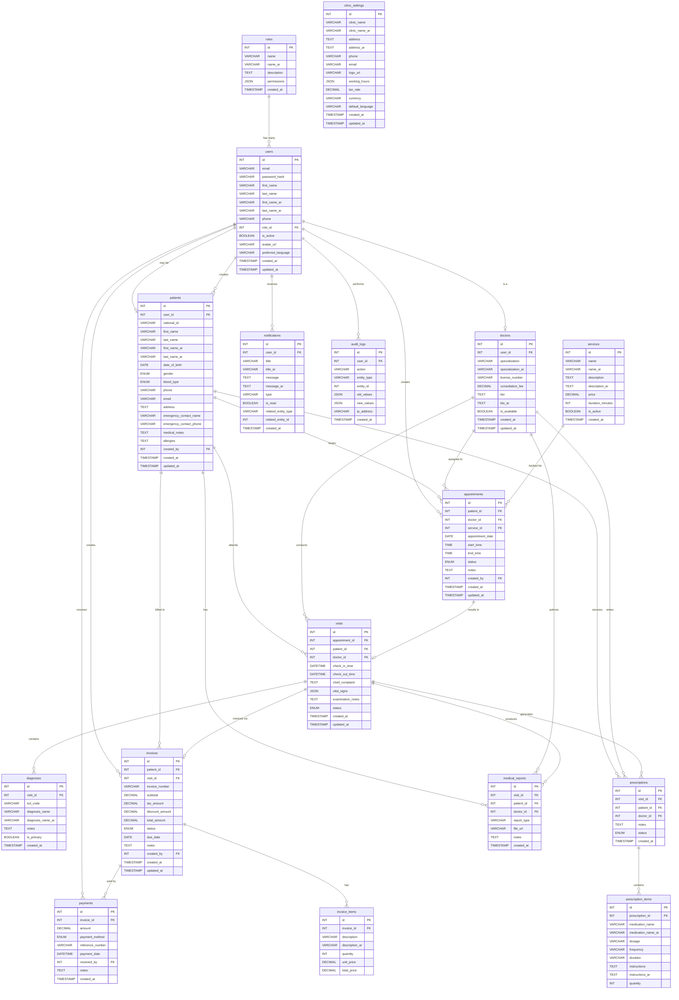
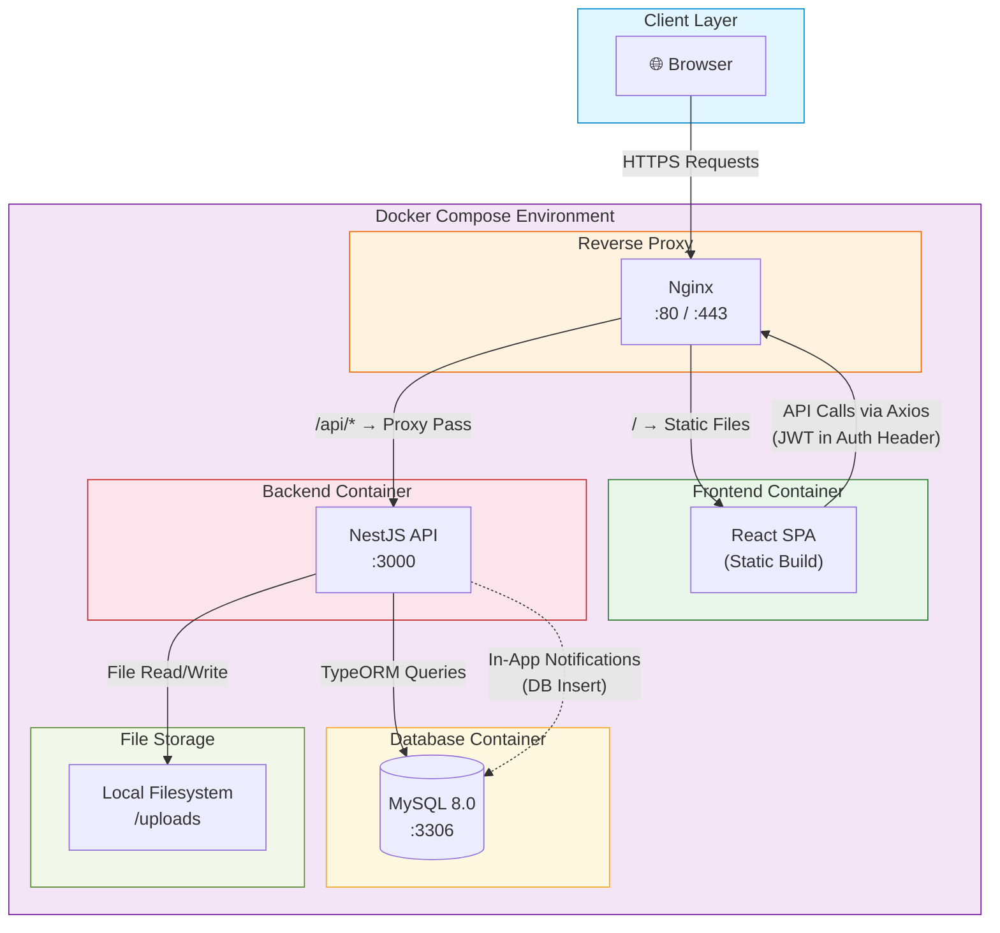
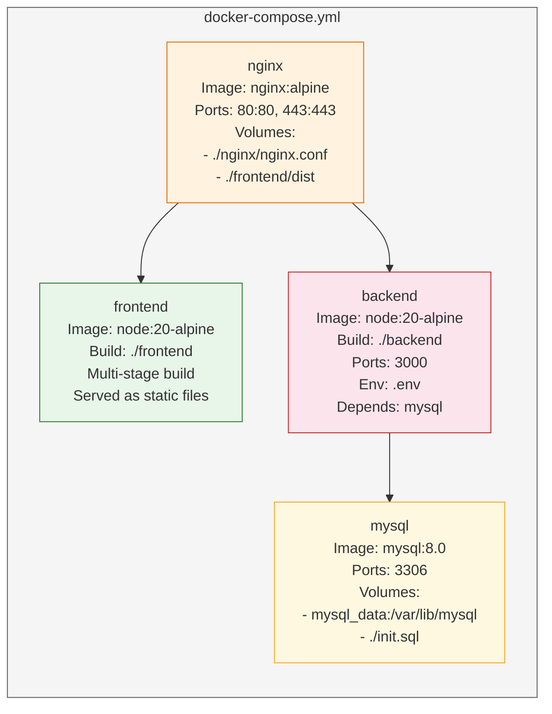
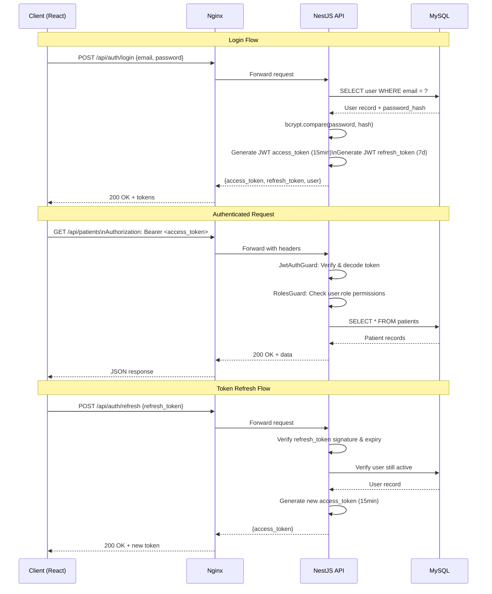
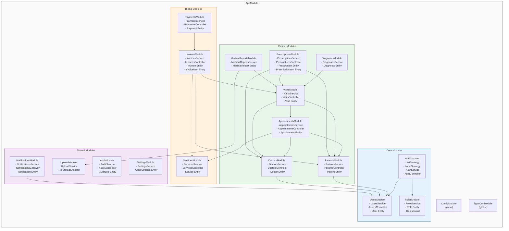

# ClinicDesk — Part 3: Database & System Architecture

> **Project**: ClinicDesk — Web-based Clinic Management System
> **Stack**: React · NestJS · MySQL · JWT · Docker
> **Document Version**: 1.0
> **Last Updated**: 2026-06-09

---

## Table of Contents

- [7. Database Design (ERD)](#7-database-design-erd)
  - [7.1 Entity Relationship Diagram](#71-entity-relationship-diagram)
  - [7.2 Table Specifications](#72-table-specifications)
  - [7.3 Relationship Summary](#73-relationship-summary)
  - [7.4 Indexing Strategy](#74-indexing-strategy)
  - [7.5 Data Integrity & Conventions](#75-data-integrity--conventions)
- [8. System Architecture](#8-system-architecture)
  - [8.1 High-Level Architecture](#81-high-level-architecture)
  - [8.2 Deployment Architecture](#82-deployment-architecture)
  - [8.3 Authentication & Authorization Flow](#83-authentication--authorization-flow)
  - [8.4 NestJS Module Structure](#84-nestjs-module-structure)
  - [8.5 Frontend Architecture](#85-frontend-architecture)
  - [8.6 Backend Architecture](#86-backend-architecture)
  - [8.7 Technology Stack Summary](#87-technology-stack-summary)
  - [8.8 Hackathon Scope vs. Production Roadmap](#88-hackathon-scope-vs-production-roadmap)

---

## 7. Database Design (ERD)

### 7.1 Entity Relationship Diagram

The following Mermaid ERD captures all 17 tables, their columns with data types, and every relationship in the ClinicDesk system.



---

### 7.2 Table Specifications

Below is a detailed breakdown of every table, including column constraints, defaults, and design notes.

#### 7.2.1 `roles`

| Column | Type | Constraints | Description |
|---|---|---|---|
| `id` | INT | PK, AUTO_INCREMENT | Unique role identifier |
| `name` | VARCHAR(50) | UNIQUE, NOT NULL | Role name in English (e.g., `admin`, `doctor`, `receptionist`, `patient`) |
| `name_ar` | VARCHAR(100) | NOT NULL | Role name in Arabic |
| `description` | TEXT | NULLABLE | Human-readable description |
| `permissions` | JSON | NOT NULL, DEFAULT `'[]'` | Array of permission strings (e.g., `["patients:read","patients:write"]`) |
| `created_at` | TIMESTAMP | DEFAULT CURRENT_TIMESTAMP | Record creation time |

> [!NOTE]
> **Seed Roles**: The system ships with four default roles — `admin`, `doctor`, `receptionist`, and `patient`. The `permissions` JSON column enables RBAC without a separate pivot table, keeping the schema hackathon-friendly while remaining extensible.

---

#### 7.2.2 `users`

| Column | Type | Constraints | Description |
|---|---|---|---|
| `id` | INT | PK, AUTO_INCREMENT | Unique user identifier |
| `email` | VARCHAR(255) | UNIQUE, NOT NULL | Login email address |
| `password_hash` | VARCHAR(255) | NOT NULL | Bcrypt-hashed password |
| `first_name` | VARCHAR(100) | NOT NULL | First name (English) |
| `last_name` | VARCHAR(100) | NOT NULL | Last name (English) |
| `first_name_ar` | VARCHAR(100) | NULLABLE | First name (Arabic) |
| `last_name_ar` | VARCHAR(100) | NULLABLE | Last name (Arabic) |
| `phone` | VARCHAR(20) | NULLABLE | Phone number |
| `role_id` | INT | FK → `roles.id`, NOT NULL | Assigned role |
| `is_active` | BOOLEAN | DEFAULT `TRUE` | Soft-disable account |
| `avatar_url` | VARCHAR(500) | NULLABLE | Path to profile image |
| `preferred_language` | VARCHAR(5) | DEFAULT `'en'` | `en` or `ar` |
| `created_at` | TIMESTAMP | DEFAULT CURRENT_TIMESTAMP | Record creation time |
| `updated_at` | TIMESTAMP | ON UPDATE CURRENT_TIMESTAMP | Last modification time |

---

#### 7.2.3 `patients`

| Column | Type | Constraints | Description |
|---|---|---|---|
| `id` | INT | PK, AUTO_INCREMENT | Unique patient identifier |
| `user_id` | INT | FK → `users.id`, NULLABLE, UNIQUE | Linked user account (nullable — patients can exist without login) |
| `national_id` | VARCHAR(20) | UNIQUE, NULLABLE | Government-issued ID |
| `first_name` | VARCHAR(100) | NOT NULL | First name (English) |
| `last_name` | VARCHAR(100) | NOT NULL | Last name (English) |
| `first_name_ar` | VARCHAR(100) | NULLABLE | First name (Arabic) |
| `last_name_ar` | VARCHAR(100) | NULLABLE | Last name (Arabic) |
| `date_of_birth` | DATE | NOT NULL | Date of birth |
| `gender` | ENUM('male','female','other') | NOT NULL | Patient gender |
| `blood_type` | ENUM('A+','A-','B+','B-','AB+','AB-','O+','O-') | NULLABLE | Blood group |
| `phone` | VARCHAR(20) | NOT NULL | Primary phone |
| `email` | VARCHAR(255) | NULLABLE | Contact email |
| `address` | TEXT | NULLABLE | Street address |
| `emergency_contact_name` | VARCHAR(200) | NULLABLE | Emergency contact full name |
| `emergency_contact_phone` | VARCHAR(20) | NULLABLE | Emergency contact phone |
| `medical_notes` | TEXT | NULLABLE | General medical notes |
| `allergies` | TEXT | NULLABLE | Known allergies (free text or comma-separated) |
| `created_by` | INT | FK → `users.id`, NOT NULL | Staff member who registered the patient |
| `created_at` | TIMESTAMP | DEFAULT CURRENT_TIMESTAMP | Record creation time |
| `updated_at` | TIMESTAMP | ON UPDATE CURRENT_TIMESTAMP | Last modification time |

> [!IMPORTANT]
> `user_id` is **nullable** by design. Walk-in patients are registered by receptionists and do not need a user account. If a patient later creates an account, the records are linked via this FK.

---

#### 7.2.4 `doctors`

| Column | Type | Constraints | Description |
|---|---|---|---|
| `id` | INT | PK, AUTO_INCREMENT | Unique doctor identifier |
| `user_id` | INT | FK → `users.id`, UNIQUE, NOT NULL | Linked user account |
| `specialization` | VARCHAR(100) | NOT NULL | Specialization (English) |
| `specialization_ar` | VARCHAR(150) | NULLABLE | Specialization (Arabic) |
| `license_number` | VARCHAR(50) | UNIQUE, NOT NULL | Medical license number |
| `consultation_fee` | DECIMAL(10,2) | DEFAULT `0.00` | Base consultation fee |
| `bio` | TEXT | NULLABLE | Doctor biography (English) |
| `bio_ar` | TEXT | NULLABLE | Doctor biography (Arabic) |
| `is_available` | BOOLEAN | DEFAULT `TRUE` | Currently accepting appointments |
| `created_at` | TIMESTAMP | DEFAULT CURRENT_TIMESTAMP | Record creation time |
| `updated_at` | TIMESTAMP | ON UPDATE CURRENT_TIMESTAMP | Last modification time |

---

#### 7.2.5 `services`

| Column | Type | Constraints | Description |
|---|---|---|---|
| `id` | INT | PK, AUTO_INCREMENT | Unique service identifier |
| `name` | VARCHAR(150) | NOT NULL | Service name (English) |
| `name_ar` | VARCHAR(200) | NULLABLE | Service name (Arabic) |
| `description` | TEXT | NULLABLE | Description (English) |
| `description_ar` | TEXT | NULLABLE | Description (Arabic) |
| `price` | DECIMAL(10,2) | NOT NULL | Service price |
| `duration_minutes` | INT | NOT NULL, DEFAULT `30` | Expected duration |
| `is_active` | BOOLEAN | DEFAULT `TRUE` | Whether the service is currently offered |
| `created_at` | TIMESTAMP | DEFAULT CURRENT_TIMESTAMP | Record creation time |

---

#### 7.2.6 `appointments`

| Column | Type | Constraints | Description |
|---|---|---|---|
| `id` | INT | PK, AUTO_INCREMENT | Unique appointment identifier |
| `patient_id` | INT | FK → `patients.id`, NOT NULL | Patient being seen |
| `doctor_id` | INT | FK → `doctors.id`, NOT NULL | Assigned doctor |
| `service_id` | INT | FK → `services.id`, NULLABLE | Service being provided |
| `appointment_date` | DATE | NOT NULL | Date of the appointment |
| `start_time` | TIME | NOT NULL | Scheduled start time |
| `end_time` | TIME | NOT NULL | Scheduled end time |
| `status` | ENUM('scheduled','confirmed','checked_in','in_progress','completed','cancelled','no_show') | DEFAULT `'scheduled'` | Current appointment status |
| `notes` | TEXT | NULLABLE | Appointment-level notes |
| `created_by` | INT | FK → `users.id`, NOT NULL | User who created the appointment |
| `created_at` | TIMESTAMP | DEFAULT CURRENT_TIMESTAMP | Record creation time |
| `updated_at` | TIMESTAMP | ON UPDATE CURRENT_TIMESTAMP | Last modification time |

> [!TIP]
> **Status State Machine**: Appointments follow a strict lifecycle — `scheduled → confirmed → checked_in → in_progress → completed`. At any stage before `completed`, the status can transition to `cancelled` or `no_show`. Enforce this in the NestJS service layer, not in the database.

---

#### 7.2.7 `visits`

| Column | Type | Constraints | Description |
|---|---|---|---|
| `id` | INT | PK, AUTO_INCREMENT | Unique visit identifier |
| `appointment_id` | INT | FK → `appointments.id`, UNIQUE, NULLABLE | Originating appointment (nullable for walk-ins) |
| `patient_id` | INT | FK → `patients.id`, NOT NULL | Patient |
| `doctor_id` | INT | FK → `doctors.id`, NOT NULL | Attending doctor |
| `check_in_time` | DATETIME | NOT NULL | Actual check-in time |
| `check_out_time` | DATETIME | NULLABLE | Actual check-out time |
| `chief_complaint` | TEXT | NULLABLE | Patient's primary complaint |
| `vital_signs` | JSON | NULLABLE | Structured vitals: `{"bp":"120/80","temp":37.0,"pulse":72,"weight":70,"height":175}` |
| `examination_notes` | TEXT | NULLABLE | Doctor's examination notes |
| `status` | ENUM('checked_in','in_progress','completed','cancelled') | DEFAULT `'checked_in'` | Visit status |
| `created_at` | TIMESTAMP | DEFAULT CURRENT_TIMESTAMP | Record creation time |
| `updated_at` | TIMESTAMP | ON UPDATE CURRENT_TIMESTAMP | Last modification time |

---

#### 7.2.8 `diagnoses`

| Column | Type | Constraints | Description |
|---|---|---|---|
| `id` | INT | PK, AUTO_INCREMENT | Unique diagnosis identifier |
| `visit_id` | INT | FK → `visits.id`, NOT NULL | Parent visit |
| `icd_code` | VARCHAR(10) | NULLABLE | ICD-10 code (e.g., `J06.9`) |
| `diagnosis_name` | VARCHAR(255) | NOT NULL | Diagnosis name (English) |
| `diagnosis_name_ar` | VARCHAR(255) | NULLABLE | Diagnosis name (Arabic) |
| `notes` | TEXT | NULLABLE | Additional clinical notes |
| `is_primary` | BOOLEAN | DEFAULT `FALSE` | Whether this is the primary diagnosis |
| `created_at` | TIMESTAMP | DEFAULT CURRENT_TIMESTAMP | Record creation time |

---

#### 7.2.9 `prescriptions`

| Column | Type | Constraints | Description |
|---|---|---|---|
| `id` | INT | PK, AUTO_INCREMENT | Unique prescription identifier |
| `visit_id` | INT | FK → `visits.id`, NOT NULL | Parent visit |
| `patient_id` | INT | FK → `patients.id`, NOT NULL | Patient (denormalized for quick lookup) |
| `doctor_id` | INT | FK → `doctors.id`, NOT NULL | Prescribing doctor |
| `notes` | TEXT | NULLABLE | General prescription notes |
| `status` | ENUM('active','dispensed','cancelled') | DEFAULT `'active'` | Prescription status |
| `created_at` | TIMESTAMP | DEFAULT CURRENT_TIMESTAMP | Record creation time |

---

#### 7.2.10 `prescription_items`

| Column | Type | Constraints | Description |
|---|---|---|---|
| `id` | INT | PK, AUTO_INCREMENT | Unique item identifier |
| `prescription_id` | INT | FK → `prescriptions.id`, NOT NULL, ON DELETE CASCADE | Parent prescription |
| `medication_name` | VARCHAR(200) | NOT NULL | Medication name (English) |
| `medication_name_ar` | VARCHAR(200) | NULLABLE | Medication name (Arabic) |
| `dosage` | VARCHAR(100) | NOT NULL | Dosage (e.g., `500mg`) |
| `frequency` | VARCHAR(100) | NOT NULL | Frequency (e.g., `3 times daily`) |
| `duration` | VARCHAR(100) | NOT NULL | Duration (e.g., `7 days`) |
| `instructions` | TEXT | NULLABLE | Special instructions (English) |
| `instructions_ar` | TEXT | NULLABLE | Special instructions (Arabic) |
| `quantity` | INT | NOT NULL, DEFAULT `1` | Number of units to dispense |

---

#### 7.2.11 `invoices`

| Column | Type | Constraints | Description |
|---|---|---|---|
| `id` | INT | PK, AUTO_INCREMENT | Unique invoice identifier |
| `patient_id` | INT | FK → `patients.id`, NOT NULL | Billed patient |
| `visit_id` | INT | FK → `visits.id`, NULLABLE | Related visit |
| `invoice_number` | VARCHAR(30) | UNIQUE, NOT NULL | Human-readable number (e.g., `INV-2026-00042`) |
| `subtotal` | DECIMAL(10,2) | NOT NULL, DEFAULT `0.00` | Sum before tax/discount |
| `tax_amount` | DECIMAL(10,2) | NOT NULL, DEFAULT `0.00` | Calculated tax |
| `discount_amount` | DECIMAL(10,2) | NOT NULL, DEFAULT `0.00` | Applied discount |
| `total_amount` | DECIMAL(10,2) | NOT NULL, DEFAULT `0.00` | Final amount due |
| `status` | ENUM('draft','issued','paid','partially_paid','cancelled') | DEFAULT `'draft'` | Invoice status |
| `due_date` | DATE | NULLABLE | Payment due date |
| `notes` | TEXT | NULLABLE | Internal notes |
| `created_by` | INT | FK → `users.id`, NOT NULL | User who generated the invoice |
| `created_at` | TIMESTAMP | DEFAULT CURRENT_TIMESTAMP | Record creation time |
| `updated_at` | TIMESTAMP | ON UPDATE CURRENT_TIMESTAMP | Last modification time |

---

#### 7.2.12 `invoice_items`

| Column | Type | Constraints | Description |
|---|---|---|---|
| `id` | INT | PK, AUTO_INCREMENT | Unique item identifier |
| `invoice_id` | INT | FK → `invoices.id`, NOT NULL, ON DELETE CASCADE | Parent invoice |
| `description` | VARCHAR(255) | NOT NULL | Line item description (English) |
| `description_ar` | VARCHAR(255) | NULLABLE | Line item description (Arabic) |
| `quantity` | INT | NOT NULL, DEFAULT `1` | Quantity |
| `unit_price` | DECIMAL(10,2) | NOT NULL | Price per unit |
| `total_price` | DECIMAL(10,2) | NOT NULL | `quantity × unit_price` |

---

#### 7.2.13 `payments`

| Column | Type | Constraints | Description |
|---|---|---|---|
| `id` | INT | PK, AUTO_INCREMENT | Unique payment identifier |
| `invoice_id` | INT | FK → `invoices.id`, NOT NULL | Invoice being paid |
| `amount` | DECIMAL(10,2) | NOT NULL | Payment amount |
| `payment_method` | ENUM('cash','card','insurance') | NOT NULL | Method of payment |
| `reference_number` | VARCHAR(100) | NULLABLE | Transaction reference / receipt number |
| `payment_date` | DATETIME | NOT NULL | When payment was received |
| `received_by` | INT | FK → `users.id`, NOT NULL | Staff member who received payment |
| `notes` | TEXT | NULLABLE | Payment notes |
| `created_at` | TIMESTAMP | DEFAULT CURRENT_TIMESTAMP | Record creation time |

---

#### 7.2.14 `notifications`

| Column | Type | Constraints | Description |
|---|---|---|---|
| `id` | INT | PK, AUTO_INCREMENT | Unique notification identifier |
| `user_id` | INT | FK → `users.id`, NOT NULL | Recipient user |
| `title` | VARCHAR(200) | NOT NULL | Notification title (English) |
| `title_ar` | VARCHAR(200) | NULLABLE | Notification title (Arabic) |
| `message` | TEXT | NOT NULL | Notification body (English) |
| `message_ar` | TEXT | NULLABLE | Notification body (Arabic) |
| `type` | VARCHAR(50) | NOT NULL | Type identifier (e.g., `appointment_reminder`, `payment_received`, `system_alert`) |
| `is_read` | BOOLEAN | DEFAULT `FALSE` | Read status |
| `related_entity_type` | VARCHAR(50) | NULLABLE | Polymorphic type (e.g., `appointment`, `invoice`) |
| `related_entity_id` | INT | NULLABLE | Polymorphic ID linking to related record |
| `created_at` | TIMESTAMP | DEFAULT CURRENT_TIMESTAMP | Record creation time |

---

#### 7.2.15 `clinic_settings`

| Column | Type | Constraints | Description |
|---|---|---|---|
| `id` | INT | PK, AUTO_INCREMENT | Unique record (singleton — always `id = 1`) |
| `clinic_name` | VARCHAR(200) | NOT NULL | Clinic name (English) |
| `clinic_name_ar` | VARCHAR(200) | NULLABLE | Clinic name (Arabic) |
| `address` | TEXT | NULLABLE | Address (English) |
| `address_ar` | TEXT | NULLABLE | Address (Arabic) |
| `phone` | VARCHAR(20) | NULLABLE | Clinic phone |
| `email` | VARCHAR(255) | NULLABLE | Clinic email |
| `logo_url` | VARCHAR(500) | NULLABLE | Logo image path |
| `working_hours` | JSON | NULLABLE | Structured hours: `{"sun":{"open":"08:00","close":"17:00"},...}` |
| `tax_rate` | DECIMAL(5,2) | DEFAULT `15.00` | VAT percentage |
| `currency` | VARCHAR(5) | DEFAULT `'SAR'` | Currency code |
| `default_language` | VARCHAR(5) | DEFAULT `'en'` | System default language |
| `created_at` | TIMESTAMP | DEFAULT CURRENT_TIMESTAMP | Record creation time |
| `updated_at` | TIMESTAMP | ON UPDATE CURRENT_TIMESTAMP | Last modification time |

> [!NOTE]
> This table is a **singleton** — only one row ever exists. It's accessed via `ClinicSettingsService.get()` which caches the result in-memory and invalidates on update.

---

#### 7.2.16 `audit_logs`

| Column | Type | Constraints | Description |
|---|---|---|---|
| `id` | INT | PK, AUTO_INCREMENT | Unique log entry identifier |
| `user_id` | INT | FK → `users.id`, NULLABLE | Acting user (null for system actions) |
| `action` | VARCHAR(50) | NOT NULL | Action performed (`CREATE`, `UPDATE`, `DELETE`, `LOGIN`, `LOGOUT`) |
| `entity_type` | VARCHAR(50) | NOT NULL | Entity being acted on (e.g., `patient`, `appointment`) |
| `entity_id` | INT | NULLABLE | ID of the affected entity |
| `old_values` | JSON | NULLABLE | Previous state (for updates) |
| `new_values` | JSON | NULLABLE | New state (for creates/updates) |
| `ip_address` | VARCHAR(45) | NULLABLE | Client IP (supports IPv6) |
| `created_at` | TIMESTAMP | DEFAULT CURRENT_TIMESTAMP | When the action occurred |

> [!TIP]
> Audit logs are **append-only** — no UPDATE or DELETE operations are permitted on this table. Implement this restriction at the TypeORM entity level via a custom subscriber, not via DB triggers, to keep the hackathon setup simple.

---

#### 7.2.17 `medical_reports`

| Column | Type | Constraints | Description |
|---|---|---|---|
| `id` | INT | PK, AUTO_INCREMENT | Unique report identifier |
| `visit_id` | INT | FK → `visits.id`, NOT NULL | Parent visit |
| `patient_id` | INT | FK → `patients.id`, NOT NULL | Patient (denormalized) |
| `doctor_id` | INT | FK → `doctors.id`, NOT NULL | Authoring doctor |
| `report_type` | VARCHAR(50) | NOT NULL | Type (e.g., `lab_result`, `imaging`, `clinical_note`, `referral`) |
| `file_url` | VARCHAR(500) | NULLABLE | Path to uploaded file |
| `notes` | TEXT | NULLABLE | Report notes / summary |
| `created_at` | TIMESTAMP | DEFAULT CURRENT_TIMESTAMP | Record creation time |

---

### 7.3 Relationship Summary

The following table documents every foreign key relationship in the system:

| From Table | Column | To Table | Column | Cardinality | ON DELETE |
|---|---|---|---|---|---|
| `users` | `role_id` | `roles` | `id` | Many-to-One | RESTRICT |
| `patients` | `user_id` | `users` | `id` | One-to-One (nullable) | SET NULL |
| `patients` | `created_by` | `users` | `id` | Many-to-One | RESTRICT |
| `doctors` | `user_id` | `users` | `id` | One-to-One | CASCADE |
| `appointments` | `patient_id` | `patients` | `id` | Many-to-One | RESTRICT |
| `appointments` | `doctor_id` | `doctors` | `id` | Many-to-One | RESTRICT |
| `appointments` | `service_id` | `services` | `id` | Many-to-One | SET NULL |
| `appointments` | `created_by` | `users` | `id` | Many-to-One | RESTRICT |
| `visits` | `appointment_id` | `appointments` | `id` | One-to-One (nullable) | SET NULL |
| `visits` | `patient_id` | `patients` | `id` | Many-to-One | RESTRICT |
| `visits` | `doctor_id` | `doctors` | `id` | Many-to-One | RESTRICT |
| `diagnoses` | `visit_id` | `visits` | `id` | Many-to-One | CASCADE |
| `prescriptions` | `visit_id` | `visits` | `id` | Many-to-One | CASCADE |
| `prescriptions` | `patient_id` | `patients` | `id` | Many-to-One | RESTRICT |
| `prescriptions` | `doctor_id` | `doctors` | `id` | Many-to-One | RESTRICT |
| `prescription_items` | `prescription_id` | `prescriptions` | `id` | Many-to-One | CASCADE |
| `invoices` | `patient_id` | `patients` | `id` | Many-to-One | RESTRICT |
| `invoices` | `visit_id` | `visits` | `id` | Many-to-One | SET NULL |
| `invoices` | `created_by` | `users` | `id` | Many-to-One | RESTRICT |
| `invoice_items` | `invoice_id` | `invoices` | `id` | Many-to-One | CASCADE |
| `payments` | `invoice_id` | `invoices` | `id` | Many-to-One | RESTRICT |
| `payments` | `received_by` | `users` | `id` | Many-to-One | RESTRICT |
| `notifications` | `user_id` | `users` | `id` | Many-to-One | CASCADE |
| `audit_logs` | `user_id` | `users` | `id` | Many-to-One | SET NULL |
| `medical_reports` | `visit_id` | `visits` | `id` | Many-to-One | CASCADE |
| `medical_reports` | `patient_id` | `patients` | `id` | Many-to-One | RESTRICT |
| `medical_reports` | `doctor_id` | `doctors` | `id` | Many-to-One | RESTRICT |

---

### 7.4 Indexing Strategy

Beyond primary keys and foreign keys (which MySQL/InnoDB auto-indexes), the following additional indexes are recommended:

| Table | Index Name | Columns | Type | Rationale |
|---|---|---|---|---|
| `users` | `idx_users_email` | `email` | UNIQUE | Login lookup |
| `patients` | `idx_patients_national_id` | `national_id` | UNIQUE | National ID search |
| `patients` | `idx_patients_phone` | `phone` | INDEX | Phone search |
| `patients` | `idx_patients_name` | `last_name, first_name` | INDEX | Name search |
| `doctors` | `idx_doctors_license` | `license_number` | UNIQUE | License lookup |
| `appointments` | `idx_appt_date_doctor` | `appointment_date, doctor_id` | INDEX | Schedule view queries |
| `appointments` | `idx_appt_date_patient` | `appointment_date, patient_id` | INDEX | Patient schedule queries |
| `appointments` | `idx_appt_status` | `status` | INDEX | Status filtering |
| `visits` | `idx_visits_patient` | `patient_id, created_at` | INDEX | Patient history |
| `invoices` | `idx_invoices_number` | `invoice_number` | UNIQUE | Invoice lookup |
| `invoices` | `idx_invoices_status` | `status` | INDEX | Financial reports |
| `notifications` | `idx_notif_user_read` | `user_id, is_read` | INDEX | Unread notification count |
| `audit_logs` | `idx_audit_entity` | `entity_type, entity_id` | INDEX | Entity history lookup |
| `audit_logs` | `idx_audit_user` | `user_id, created_at` | INDEX | User activity log |

---

### 7.5 Data Integrity & Conventions

| Convention | Details |
|---|---|
| **Primary Keys** | All tables use `INT AUTO_INCREMENT` named `id`. UUIDs are avoided to keep MySQL performance optimal and hackathon setup simple. |
| **Timestamps** | All tables include `created_at` (auto-set). Tables with mutable data include `updated_at` (auto-updated). |
| **Soft Deletes** | Not implemented globally — only `users.is_active` and `services.is_active` act as soft-disable flags. Records are never hard-deleted in clinical tables; cancellation statuses are used instead. |
| **Bilingual Columns** | Arabic translations use `_ar` suffix columns. This avoids the complexity of a translations table while supporting the two target languages. |
| **Monetary Values** | All currency amounts use `DECIMAL(10,2)` — never `FLOAT` or `DOUBLE`. |
| **ENUM Columns** | Used for fixed-value sets (statuses, gender, blood type, payment method). If the set is expected to grow, use a VARCHAR + application-level validation instead. |
| **JSON Columns** | Used sparingly for semi-structured data (`vital_signs`, `permissions`, `working_hours`, `old_values`/`new_values`). Always define a TypeScript interface for the JSON shape. |
| **Character Set** | All tables use `utf8mb4` collation to fully support Arabic text and emoji. |
| **Engine** | InnoDB for all tables (transactional support, FK constraints, row-level locking). |

---

## 8. System Architecture

### 8.1 High-Level Architecture

The following diagram shows the end-to-end request flow, from client browser through the deployment infrastructure to the database.



---

### 8.2 Deployment Architecture



**Docker Compose Services:**

| Service | Image | Ports | Key Configuration |
|---|---|---|---|
| `nginx` | `nginx:alpine` | `80:80`, `443:443` | Reverse proxy; serves React static build; proxies `/api` to backend |
| `frontend` | Multi-stage `node:20-alpine` | — (served via nginx) | Built with `npm run build`; output copied to nginx volume |
| `backend` | `node:20-alpine` | `3000:3000` | NestJS app; reads `.env` for DB credentials and JWT secret |
| `mysql` | `mysql:8.0` | `3306:3306` | Persistent volume `mysql_data`; initialized with seed SQL |

---

### 8.3 Authentication & Authorization Flow



**JWT Token Strategy:**

| Token | Lifetime | Storage (Client) | Purpose |
|---|---|---|---|
| `access_token` | 15 minutes | Memory (React state) | API authentication |
| `refresh_token` | 7 days | `httpOnly` cookie | Silent token renewal |

**RBAC Middleware Chain:**

```
Request → JwtAuthGuard → RolesGuard → Controller
              │                │
              ▼                ▼
         Verify JWT      Check permissions
         Extract user     from role.permissions
         Attach to req    against @Permissions()
                          decorator
```

---

### 8.4 NestJS Module Structure



---

### 8.5 Frontend Architecture

| Concern | Technology | Details |
|---|---|---|
| **Framework** | React 18 | Functional components with hooks |
| **Routing** | React Router v6 | Nested routes with layout wrappers and protected route components |
| **State Management** | React Query + Context | React Query for server state caching; Context API for auth/theme/language |
| **HTTP Client** | Axios | Centralized instance with interceptors for JWT injection and 401 refresh logic |
| **UI Generation** | Stitch UI Generation | Automated, custom React components with Vanilla CSS; RTL-ready; supports dynamic bilingual forms and tables |
| **Internationalization** | i18next + react-i18next | Namespaced JSON translation files for `en` and `ar`; RTL layout toggle |
| **Charts** | Recharts | Dashboard analytics: appointment trends, revenue charts, patient demographics |
| **Forms** | React Hook Form + Zod | Declarative validation with bilingual error messages |
| **Date Handling** | Day.js | Lightweight; supports Arabic locale and Hijri calendar plugin |

**Frontend Directory Structure:**

```
frontend/src/
├── api/              # Axios instance, API service modules
├── assets/           # Images, fonts, static files
├── components/       # Reusable UI components
│   ├── common/       # Buttons, modals, tables, loaders
│   └── layout/       # Sidebar, header, RTL wrapper
├── contexts/         # AuthContext, ThemeContext, LanguageContext
├── hooks/            # Custom hooks (useAuth, useDebounce, etc.)
├── locales/          # i18n JSON files (en/, ar/)
├── pages/            # Route-level page components
│   ├── auth/         # Login, ForgotPassword
│   ├── dashboard/    # Main dashboard
│   ├── patients/     # Patient list, detail, create/edit
│   ├── appointments/ # Calendar view, appointment form
│   ├── visits/       # Visit workflow, diagnosis, prescription
│   ├── billing/      # Invoices, payments
│   ├── reports/      # Medical reports, analytics
│   └── settings/     # Clinic settings, user management
├── routes/           # Route definitions, ProtectedRoute
├── utils/            # Helpers, formatters, constants
├── App.tsx
└── main.tsx
```

---

### 8.6 Backend Architecture

| Concern | Technology | Details |
|---|---|---|
| **Framework** | NestJS 10 | Modular architecture; decorators for routes, guards, pipes |
| **ORM** | TypeORM | Entity-based models; migrations for schema management; repository pattern |
| **Validation** | class-validator + class-transformer | DTO-level validation with decorators; auto-transform request payloads |
| **Authentication** | Passport + @nestjs/jwt | Local strategy for login; JWT strategy for protected routes |
| **Authorization** | Custom guards | `RolesGuard` reads `@Permissions()` decorator and compares against `role.permissions` JSON |
| **API Documentation** | @nestjs/swagger | Auto-generated OpenAPI spec at `/api/docs`; DTOs decorated with `@ApiProperty()` |
| **File Upload** | Multer (via NestJS) | `UploadModule` abstracts storage; local disk for hackathon, S3-compatible adapter ready |
| **Email (optional)** | Nodemailer | `NotificationsModule` can dispatch emails for critical alerts; disabled by default |
| **Logging** | NestJS Logger + Winston | Structured JSON logs; log levels configurable via env |
| **Configuration** | @nestjs/config | `.env` file support; validated via Joi schema at startup |

**Backend Directory Structure:**

```
backend/src/
├── auth/
│   ├── auth.module.ts
│   ├── auth.service.ts
│   ├── auth.controller.ts
│   ├── strategies/         # jwt.strategy.ts, local.strategy.ts
│   ├── guards/             # jwt-auth.guard.ts, roles.guard.ts
│   └── dto/                # login.dto.ts, register.dto.ts
├── users/
│   ├── users.module.ts
│   ├── users.service.ts
│   ├── users.controller.ts
│   ├── entities/           # user.entity.ts
│   └── dto/                # create-user.dto.ts, update-user.dto.ts
├── patients/
│   ├── patients.module.ts
│   ├── patients.service.ts
│   ├── patients.controller.ts
│   ├── entities/           # patient.entity.ts
│   └── dto/
├── doctors/                # Same pattern
├── appointments/           # Same pattern
├── visits/                 # Same pattern
├── diagnoses/              # Same pattern
├── prescriptions/          # + prescription-item.entity.ts
├── services/               # Clinic services (not NestJS services)
├── invoices/               # + invoice-item.entity.ts
├── payments/
├── notifications/
│   ├── notifications.gateway.ts  # WebSocket gateway (optional)
│   └── ...
├── audit/
│   ├── audit.subscriber.ts      # TypeORM subscriber for auto-logging
│   └── ...
├── settings/
├── upload/
│   ├── upload.service.ts
│   ├── adapters/                 # local.adapter.ts, s3.adapter.ts
│   └── ...
├── common/
│   ├── decorators/          # @Permissions(), @CurrentUser()
│   ├── filters/             # http-exception.filter.ts
│   ├── interceptors/        # transform.interceptor.ts, audit.interceptor.ts
│   ├── pipes/               # validation.pipe.ts
│   └── interfaces/          # pagination.interface.ts
├── config/
│   ├── database.config.ts
│   ├── jwt.config.ts
│   └── app.config.ts
├── app.module.ts
└── main.ts
```

---

### 8.7 Technology Stack Summary

| Layer | Technology | Version | Purpose |
|---|---|---|---|
| **Frontend** | React | 18.x | UI framework |
| | TypeScript | 5.x | Type safety |
| | Stitch | Latest | UI Generation library (RTL support, Vanilla CSS) |
| | React Router | 6.x | Client-side routing |
| | React Query | 5.x | Server state management |
| | Axios | 1.x | HTTP client |
| | i18next | 23.x | Internationalization (EN/AR) |
| | Recharts | 2.x | Dashboard charts |
| | Vite | 5.x | Build tool & dev server |
| **Backend** | NestJS | 10.x | API framework |
| | TypeORM | 0.3.x | ORM & migrations |
| | Passport | 0.7.x | Authentication strategies |
| | class-validator | 0.14.x | Request validation |
| | Swagger | 7.x | API documentation |
| | Multer | 1.x | File uploads |
| | Nodemailer | 6.x | Email dispatch (optional) |
| **Database** | MySQL | 8.0 | Primary data store |
| **Infrastructure** | Docker | 24.x | Containerization |
| | Docker Compose | 2.x | Multi-container orchestration |
| | Nginx | 1.25 (alpine) | Reverse proxy & static serving |
| **Dev Tools** | ESLint + Prettier | — | Code quality |
| | Jest | 29.x | Unit & integration testing |
| | Husky + lint-staged | — | Pre-commit hooks |

---

### 8.8 Hackathon Scope vs. Production Roadmap

The architecture is designed to be **production-grade in structure** but **hackathon-realistic in scope**. The following table distinguishes what ships in the hackathon versus what the architecture supports for future expansion.

| Concern | Hackathon (MVP) | Production Extension |
|---|---|---|
| **Authentication** | JWT with access + refresh tokens | OAuth 2.0 / SSO integration |
| **Authorization** | JSON permissions in `roles` table | Dedicated permissions table with UI management |
| **File Storage** | Local filesystem (`/uploads`) | AWS S3 / MinIO with signed URLs |
| **Notifications** | In-app (DB-stored, polled via API) | WebSocket push + Email + SMS via queue |
| **Email** | Disabled by default | Nodemailer with template engine, queued via Bull |
| **Caching** | None (acceptable at hackathon scale) | Redis for sessions, query cache, rate limiting |
| **Search** | SQL `LIKE` queries | Elasticsearch for patient/diagnosis search |
| **Logging** | Console + file logger | ELK stack (Elasticsearch, Logstash, Kibana) |
| **CI/CD** | Manual `docker-compose up` | GitHub Actions → Docker Registry → K8s deploy |
| **Monitoring** | None | Prometheus + Grafana, Sentry for error tracking |
| **Database** | Single MySQL instance | Read replicas, automated backups, connection pooling |
| **API Versioning** | None (single version) | URL-based versioning (`/api/v1/`, `/api/v2/`) |
| **Testing** | Key unit tests for services | Full coverage: unit, integration, E2E, load tests |
| **Rate Limiting** | Basic NestJS throttler | Redis-backed distributed rate limiting |
| **Audit Trail** | Selective entity auditing | Full audit with TypeORM subscriber on all entities |

> [!IMPORTANT]
> The architecture uses **adapter patterns** (e.g., `FileStorageAdapter`) and **NestJS module boundaries** so that every hackathon shortcut can be replaced with a production-grade solution without refactoring the application structure. Build fast, migrate cleanly.
