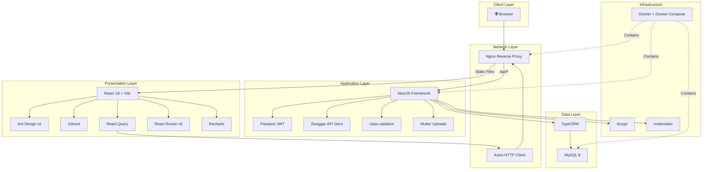
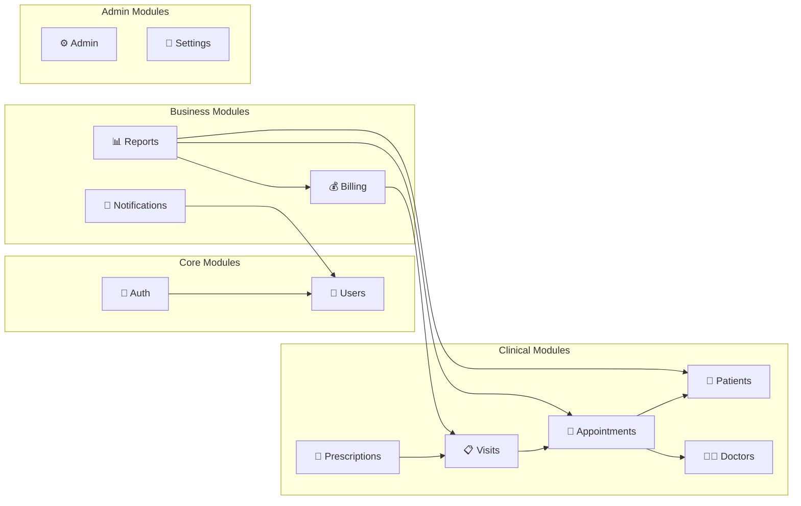
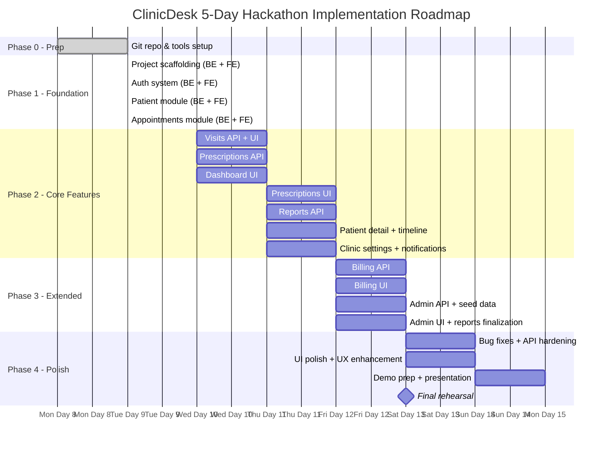
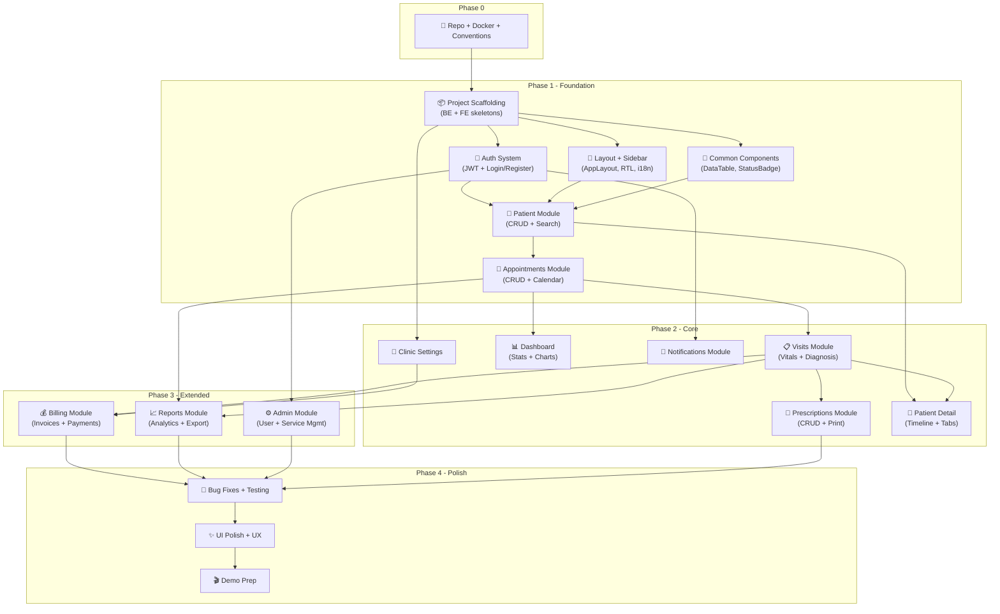

# ClinicDesk — Part 6: Tech Stack, Project Structure & Implementation Roadmap

---

## 13. Tech Stack Justification

The following technology choices are optimized for a **5-day hackathon** environment — prioritizing developer velocity, ecosystem maturity, and the ability to deliver a polished, production-realistic demo within extreme time constraints.

| Technology | Purpose | Justification (for Hackathon) |
|---|---|---|
| **React 18** | Frontend framework | Largest ecosystem of any UI library; component reuse accelerates parallel development; hooks simplify state management without boilerplate; concurrent rendering features improve perceived performance; team familiarity ensures zero ramp-up time |
| **Vite** | Build tool | Instant Hot Module Replacement (HMR) during development — sub-50ms updates vs. CRA's multi-second rebuilds; native ES module support eliminates bundling during dev; production builds via Rollup are optimized out of the box; minimal configuration required |
| **React Router v6** | Routing | Industry-standard declarative routing for React; nested route support maps naturally to the clinic layout hierarchy; built-in loader/action patterns simplify data fetching; `<Outlet>` enables clean layout composition |
| **Ant Design (antd)** | UI Component Library | 60+ production-ready components — tables with sorting/filtering/pagination, forms with validation, date pickers, calendars, modals, notifications, and layout primitives; first-class **RTL support** for Arabic interface; built-in theming via CSS variables; saves an estimated **3-4 days** of custom UI development |
| **i18next + react-i18next** | Internationalization | Seamless Arabic/English switching with namespace-based translation files; automatic RTL/LTR direction handling; pluralization rules; interpolation support; lazy-loading of locale bundles; the de facto standard for React i18n |
| **Axios** | HTTP client | Request/response interceptors enable automatic JWT token injection and refresh logic; consistent error handling via interceptor chains; built-in request cancellation; cleaner API than native `fetch` for complex use cases |
| **Recharts** | Charts | Built specifically for React — composable chart components using JSX; responsive containers; simple API for bar, line, pie, and area charts; sufficient for dashboard analytics without the overhead of D3.js |
| **React Query (TanStack Query)** | Server state management | Automatic caching eliminates redundant API calls; background re-fetching keeps data fresh; built-in loading/error/success states reduce boilerplate by ~60%; optimistic updates for better UX; devtools for debugging; mutations with automatic cache invalidation |
| **NestJS** | Backend framework | Full TypeScript support with strict typing; modular architecture maps 1:1 to clinic domains; built-in Dependency Injection (DI) container; decorators for routes, guards, pipes, and interceptors; first-class Swagger integration; opinionated structure eliminates architecture debates |
| **TypeORM** | ORM | Decorator-based entity definitions match NestJS patterns; automatic migration generation from entity changes; supports MySQL natively; repository pattern for clean data access; eager/lazy relation loading; query builder for complex reports |
| **MySQL 8** | Database | Reliable ACID-compliant relational database; excellent for structured clinic data (patients, appointments, invoices); JSON column support for flexible fields; team familiarity reduces debugging time; well-documented, battle-tested in healthcare systems |
| **Passport + passport-jwt** | Authentication | Standard JWT strategy integrates seamlessly with NestJS guards; stateless authentication eliminates session management; token-based auth works cleanly with SPA frontend; extensible for future OAuth/SSO integration |
| **class-validator + class-transformer** | Validation | Decorator-based DTO validation (`@IsEmail()`, `@IsNotEmpty()`, `@MinLength()`) integrates with NestJS `ValidationPipe`; automatic request body transformation; clear, self-documenting validation rules; reduces manual validation code to near-zero |
| **Swagger (@nestjs/swagger)** | API documentation | Auto-generated from controller decorators and DTOs — zero maintenance overhead; interactive API explorer for frontend developers; schema validation documentation; enables parallel frontend/backend development from Day 1 |
| **Multer** | File upload | Standard multipart/form-data handling middleware; configurable file size limits and type filters; integrates with NestJS via `@UseInterceptors(FileInterceptor())`; handles patient document and profile photo uploads |
| **Docker + Docker Compose** | Containerization | One-command environment setup (`docker-compose up`); eliminates "works on my machine" issues; consistent MySQL + Node.js + Nginx stack across all team members; reproducible demo environment for judges |
| **Nginx** | Reverse proxy | Serves static frontend build; proxies `/api` requests to NestJS backend; SSL termination for HTTPS; gzip compression; clean URL routing (SPA history fallback); production-realistic deployment architecture |
| **bcrypt** | Password hashing | Industry-standard adaptive hashing algorithm; configurable salt rounds; resistant to rainbow table and brute-force attacks; well-audited Node.js implementation; meets healthcare security baseline requirements |
| **nodemailer** | Email (optional) | Simple SMTP-based email sending for appointment reminders and password resets; template support for HTML emails; works with Gmail SMTP for demo purposes; can be stubbed during development and enabled for demo |

### Tech Stack Architecture Overview



---

## 14. Folder Structure

### 14.1 Frontend (React + Vite)

```
clinic-desk-frontend/
├── public/
│   ├── favicon.ico
│   └── locales/
│       ├── en/
│       │   └── translation.json
│       └── ar/
│           └── translation.json
├── src/
│   ├── main.jsx
│   ├── App.jsx
│   ├── api/
│   │   ├── axiosInstance.js          # Base Axios config, interceptors, token refresh
│   │   ├── authApi.js                # login(), register(), logout(), refreshToken()
│   │   ├── patientApi.js             # CRUD + search + timeline
│   │   ├── appointmentApi.js         # CRUD + calendar queries
│   │   ├── visitApi.js               # CRUD + vitals + diagnosis
│   │   ├── prescriptionApi.js        # CRUD + print/PDF
│   │   ├── billingApi.js             # Invoices + payments
│   │   ├── reportApi.js              # Dashboard stats + report generation
│   │   └── adminApi.js               # User management + clinic settings
│   ├── assets/
│   │   ├── images/                   # Logo, placeholders, illustrations
│   │   └── styles/
│   │       ├── global.css            # Base styles, font imports
│   │       ├── variables.css         # CSS custom properties (colors, spacing)
│   │       └── rtl.css               # RTL-specific overrides
│   ├── components/
│   │   ├── common/                   # Shared, reusable UI components
│   │   │   ├── AppLayout.jsx         # Main layout shell (sidebar + header + content)
│   │   │   ├── Sidebar.jsx           # Navigation sidebar with role-based menu
│   │   │   ├── Header.jsx            # Top bar: user info, language toggle, notifications
│   │   │   ├── Footer.jsx            # App footer with version info
│   │   │   ├── LoadingSpinner.jsx    # Full-page and inline loading states
│   │   │   ├── ErrorBoundary.jsx     # React error boundary with fallback UI
│   │   │   ├── ProtectedRoute.jsx    # Auth check wrapper for routes
│   │   │   ├── RoleGuard.jsx         # Role-based access control wrapper
│   │   │   ├── LanguageToggle.jsx    # AR/EN language switcher button
│   │   │   ├── DataTable.jsx         # Reusable Ant Design table with pagination
│   │   │   ├── StatusBadge.jsx       # Color-coded status indicators
│   │   │   ├── ConfirmModal.jsx      # Reusable confirmation dialog
│   │   │   └── PageHeader.jsx        # Consistent page title + breadcrumb + actions
│   │   ├── auth/
│   │   │   ├── LoginForm.jsx         # Email + password login form
│   │   │   └── RegisterForm.jsx      # New user registration form
│   │   ├── patients/
│   │   │   ├── PatientForm.jsx       # Create/edit patient form (demographics, contact)
│   │   │   ├── PatientCard.jsx       # Patient summary card for lists
│   │   │   └── PatientTimeline.jsx   # Visit history timeline view
│   │   ├── appointments/
│   │   │   ├── AppointmentForm.jsx   # Schedule/edit appointment modal
│   │   │   ├── AppointmentCalendar.jsx # Calendar view (day/week/month)
│   │   │   └── AppointmentCard.jsx   # Appointment summary card
│   │   ├── visits/
│   │   │   ├── VisitForm.jsx         # Visit creation/editing form
│   │   │   ├── VitalsForm.jsx        # Blood pressure, temp, weight, height
│   │   │   └── DiagnosisForm.jsx     # Diagnosis entry with ICD codes
│   │   ├── prescriptions/
│   │   │   ├── PrescriptionForm.jsx  # Medication entry form (drug, dosage, frequency)
│   │   │   └── PrescriptionPreview.jsx # Print-ready prescription view
│   │   ├── billing/
│   │   │   ├── InvoiceForm.jsx       # Create invoice with line items
│   │   │   ├── PaymentForm.jsx       # Record payment (cash, card, insurance)
│   │   │   └── InvoicePreview.jsx    # Print-ready invoice view
│   │   ├── dashboard/
│   │   │   ├── StatsCard.jsx         # KPI card (patients today, revenue, etc.)
│   │   │   ├── RevenueChart.jsx      # Revenue over time (line/bar chart)
│   │   │   ├── AppointmentChart.jsx  # Appointment distribution chart
│   │   │   └── RecentActivity.jsx    # Activity feed / recent actions list
│   │   └── admin/
│   │       ├── UserForm.jsx          # Create/edit staff user
│   │       ├── ServiceForm.jsx       # Define clinic services & pricing
│   │       └── ClinicSettingsForm.jsx # Clinic name, logo, working hours
│   ├── contexts/
│   │   ├── AuthContext.jsx           # Authentication state & user info provider
│   │   ├── LanguageContext.jsx       # i18n language direction & locale provider
│   │   └── NotificationContext.jsx   # In-app notification state provider
│   ├── hooks/
│   │   ├── useAuth.js                # Auth context consumer + helper methods
│   │   ├── usePermissions.js         # Role/permission checking hook
│   │   ├── useNotifications.js       # Notification display helper
│   │   └── usePagination.js          # Table pagination state management
│   ├── pages/
│   │   ├── LoginPage.jsx             # Login page layout
│   │   ├── RegisterPage.jsx          # Registration page layout
│   │   ├── DashboardPage.jsx         # Main dashboard with stats & charts
│   │   ├── patients/
│   │   │   ├── PatientListPage.jsx   # Searchable patient list with filters
│   │   │   └── PatientDetailPage.jsx # Single patient view with tabs
│   │   ├── appointments/
│   │   │   ├── AppointmentListPage.jsx    # Appointment list with date filters
│   │   │   └── AppointmentCalendarPage.jsx # Full calendar view
│   │   ├── visits/
│   │   │   ├── VisitListPage.jsx     # Visit history list
│   │   │   └── VisitDetailPage.jsx   # Visit details with vitals & diagnosis
│   │   ├── prescriptions/
│   │   │   └── PrescriptionListPage.jsx # Prescription list with print
│   │   ├── billing/
│   │   │   ├── InvoiceListPage.jsx   # Invoice list with status filters
│   │   │   └── InvoiceDetailPage.jsx # Invoice detail with payment history
│   │   ├── reports/
│   │   │   └── ReportsPage.jsx       # Report generation & viewing
│   │   ├── admin/
│   │   │   ├── UserManagementPage.jsx    # Staff user CRUD
│   │   │   ├── ServiceManagementPage.jsx # Services & pricing CRUD
│   │   │   └── ClinicSettingsPage.jsx    # Clinic configuration
│   │   └── NotFoundPage.jsx          # 404 page
│   ├── routes/
│   │   └── AppRoutes.jsx             # Central route definitions with guards
│   └── utils/
│       ├── constants.js              # API URLs, role names, status values
│       ├── formatters.js             # Date, currency, phone formatters
│       ├── validators.js             # Client-side validation rules
│       └── helpers.js                # Misc utility functions
├── .env.example                      # Environment variable template
├── .eslintrc.cjs                     # ESLint configuration
├── vite.config.js                    # Vite configuration with proxy
├── package.json                      # Dependencies and scripts
└── README.md                         # Frontend setup instructions
```

### 14.2 Backend (NestJS)

```
clinic-desk-backend/
├── src/
│   ├── main.ts                       # Bootstrap: Swagger, CORS, ValidationPipe, prefix
│   ├── app.module.ts                 # Root module importing all feature modules
│   ├── common/                       # Shared code across all modules
│   │   ├── decorators/
│   │   │   ├── roles.decorator.ts              # @Roles('admin', 'doctor') metadata
│   │   │   ├── current-user.decorator.ts       # @CurrentUser() param decorator
│   │   │   └── api-paginated-response.decorator.ts # Swagger pagination docs
│   │   ├── dto/
│   │   │   ├── pagination.dto.ts               # { page, limit, total, data[] }
│   │   │   └── api-response.dto.ts             # { success, message, data }
│   │   ├── enums/
│   │   │   ├── role.enum.ts                    # ADMIN, DOCTOR, RECEPTIONIST, NURSE
│   │   │   ├── appointment-status.enum.ts      # SCHEDULED, CONFIRMED, IN_PROGRESS, COMPLETED, CANCELLED, NO_SHOW
│   │   │   ├── invoice-status.enum.ts          # DRAFT, SENT, PAID, PARTIALLY_PAID, OVERDUE, CANCELLED
│   │   │   ├── payment-method.enum.ts          # CASH, CREDIT_CARD, INSURANCE, BANK_TRANSFER
│   │   │   └── gender.enum.ts                  # MALE, FEMALE
│   │   ├── filters/
│   │   │   └── http-exception.filter.ts        # Global exception handling & formatting
│   │   ├── guards/
│   │   │   ├── jwt-auth.guard.ts               # JWT token verification guard
│   │   │   └── roles.guard.ts                  # Role-based access control guard
│   │   ├── interceptors/
│   │   │   ├── transform.interceptor.ts        # Wrap responses in standard format
│   │   │   └── audit-log.interceptor.ts        # Log write operations for audit trail
│   │   ├── middleware/
│   │   │   └── logger.middleware.ts            # Request logging middleware
│   │   └── pipes/
│   │       └── validation.pipe.ts              # Global DTO validation pipe config
│   ├── config/
│   │   ├── database.config.ts        # TypeORM MySQL connection configuration
│   │   ├── jwt.config.ts             # JWT secret, expiration, algorithm
│   │   └── app.config.ts             # Port, CORS origins, upload limits
│   ├── modules/                      # Feature modules (domain-driven)
│   │   ├── auth/
│   │   │   ├── auth.module.ts        # Auth module: imports JWT, Passport
│   │   │   ├── auth.controller.ts    # POST /auth/login, /auth/register, /auth/refresh
│   │   │   ├── auth.service.ts       # Login validation, token generation, password hashing
│   │   │   ├── strategies/
│   │   │   │   └── jwt.strategy.ts   # Passport JWT extraction & validation strategy
│   │   │   └── dto/
│   │   │       ├── login.dto.ts              # { email, password }
│   │   │       ├── register.dto.ts           # { name, email, password, role }
│   │   │       └── change-password.dto.ts    # { currentPassword, newPassword }
│   │   ├── users/
│   │   │   ├── users.module.ts
│   │   │   ├── users.controller.ts   # CRUD /users, role-restricted
│   │   │   ├── users.service.ts
│   │   │   ├── entities/
│   │   │   │   └── user.entity.ts    # id, name, email, password, role, isActive, avatar
│   │   │   └── dto/
│   │   │       ├── create-user.dto.ts
│   │   │       └── update-user.dto.ts
│   │   ├── patients/
│   │   │   ├── patients.module.ts
│   │   │   ├── patients.controller.ts # CRUD /patients + search + timeline
│   │   │   ├── patients.service.ts
│   │   │   ├── entities/
│   │   │   │   └── patient.entity.ts  # id, name, dob, gender, phone, email, address,
│   │   │   │                          # bloodType, allergies, medicalHistory, emergencyContact
│   │   │   └── dto/
│   │   │       ├── create-patient.dto.ts
│   │   │       ├── update-patient.dto.ts
│   │   │       └── filter-patient.dto.ts     # Search by name, phone, date range
│   │   ├── doctors/
│   │   │   ├── doctors.module.ts
│   │   │   ├── doctors.controller.ts  # CRUD /doctors + schedule + availability
│   │   │   ├── doctors.service.ts
│   │   │   ├── entities/
│   │   │   │   └── doctor.entity.ts   # id, userId, specialization, licenseNumber, schedule
│   │   │   └── dto/
│   │   ├── appointments/
│   │   │   ├── appointments.module.ts
│   │   │   ├── appointments.controller.ts # CRUD /appointments + calendar + status
│   │   │   ├── appointments.service.ts    # Conflict detection, status transitions
│   │   │   ├── entities/
│   │   │   │   └── appointment.entity.ts  # id, patientId, doctorId, dateTime, duration,
│   │   │   │                              # status, type, notes
│   │   │   └── dto/
│   │   │       ├── create-appointment.dto.ts
│   │   │       ├── update-appointment.dto.ts
│   │   │       └── filter-appointment.dto.ts  # Filter by date, doctor, status
│   │   ├── visits/
│   │   │   ├── visits.module.ts
│   │   │   ├── visits.controller.ts   # CRUD /visits + vitals + diagnosis
│   │   │   ├── visits.service.ts
│   │   │   ├── entities/
│   │   │   │   ├── visit.entity.ts        # id, appointmentId, patientId, doctorId,
│   │   │   │   │                          # chiefComplaint, vitals, notes, createdAt
│   │   │   │   └── diagnosis.entity.ts    # id, visitId, icdCode, description, notes
│   │   │   └── dto/
│   │   ├── prescriptions/
│   │   │   ├── prescriptions.module.ts
│   │   │   ├── prescriptions.controller.ts # CRUD /prescriptions + print
│   │   │   ├── prescriptions.service.ts
│   │   │   ├── entities/
│   │   │   │   ├── prescription.entity.ts      # id, visitId, patientId, doctorId, date, notes
│   │   │   │   └── prescription-item.entity.ts # id, prescriptionId, medication, dosage,
│   │   │   │                                   # frequency, duration, instructions
│   │   │   └── dto/
│   │   ├── billing/
│   │   │   ├── billing.module.ts
│   │   │   ├── billing.controller.ts  # CRUD /invoices + /payments
│   │   │   ├── billing.service.ts     # Invoice generation, payment processing, balance calc
│   │   │   ├── entities/
│   │   │   │   ├── invoice.entity.ts       # id, patientId, visitId, invoiceNumber, status,
│   │   │   │   │                           # subtotal, tax, discount, total, dueDate
│   │   │   │   ├── invoice-item.entity.ts  # id, invoiceId, serviceId, description, qty,
│   │   │   │   │                           # unitPrice, total
│   │   │   │   └── payment.entity.ts       # id, invoiceId, amount, method, date, reference
│   │   │   └── dto/
│   │   ├── notifications/
│   │   │   ├── notifications.module.ts
│   │   │   ├── notifications.controller.ts # GET /notifications, PATCH mark-as-read
│   │   │   ├── notifications.service.ts    # Create, send, mark-read
│   │   │   ├── entities/
│   │   │   │   └── notification.entity.ts  # id, userId, type, title, message, isRead, createdAt
│   │   │   └── dto/
│   │   ├── reports/
│   │   │   ├── reports.module.ts
│   │   │   ├── reports.controller.ts  # GET /reports/revenue, /reports/patients, /reports/appointments
│   │   │   └── reports.service.ts     # Aggregate queries, date-range reports
│   │   ├── admin/
│   │   │   ├── admin.module.ts
│   │   │   ├── admin.controller.ts    # System-wide admin operations
│   │   │   └── admin.service.ts       # User management, system health, audit logs
│   │   └── clinic-settings/
│   │       ├── clinic-settings.module.ts
│   │       ├── clinic-settings.controller.ts # GET/PUT /clinic-settings
│   │       ├── clinic-settings.service.ts
│   │       ├── entities/
│   │       │   └── clinic-settings.entity.ts # id, clinicName, logo, address, phone,
│   │       │                                 # workingHours, currency, taxRate
│   │       └── dto/
│   ├── database/
│   │   ├── migrations/               # TypeORM auto-generated migrations
│   │   └── seeds/
│   │       ├── seed.ts               # Master seed runner
│   │       ├── roles.seed.ts         # Default roles
│   │       ├── admin-user.seed.ts    # Default admin account
│   │       └── sample-data.seed.ts   # Demo patients, doctors, appointments
│   └── uploads/                      # Uploaded files (patient docs, avatars)
├── test/
│   ├── app.e2e-spec.ts               # End-to-end API tests
│   └── jest-e2e.json                 # Jest e2e configuration
├── .env.example                      # Environment variable template
├── .eslintrc.js                      # ESLint configuration
├── nest-cli.json                     # NestJS CLI configuration
├── tsconfig.json                     # TypeScript configuration
├── tsconfig.build.json               # TypeScript build configuration
├── package.json                      # Dependencies and scripts
├── docker-compose.yml                # MySQL + Backend + Frontend + Nginx
├── Dockerfile                        # Multi-stage Node.js build
├── nginx/
│   └── nginx.conf                    # Reverse proxy configuration
└── README.md                         # Backend setup instructions
```

### 14.3 Structural Design Rationale

#### Domain-Driven Module Organization

The backend follows a **domain-driven modular architecture** where each business domain (patients, appointments, billing, etc.) is encapsulated as a self-contained NestJS module:



**Why this structure works for a hackathon:**

| Principle | Implementation | Hackathon Benefit |
|---|---|---|
| **Separation of Concerns** | Each module owns its entities, DTOs, service, and controller | Developers work on different modules without merge conflicts |
| **Single Responsibility** | One module = one business domain | Easy to reason about; new team members can understand a module in minutes |
| **Encapsulation** | Modules export only their service; entities are internal | Changes to one module don't cascade to others |
| **Consistent Convention** | Every module follows the same `module → controller → service → entity → dto` pattern | Any developer can jump into any module and know exactly where to find things |
| **Parallel Development** | Independent modules with clear interfaces | 3-4 developers can work simultaneously on different modules |

#### Frontend Organization Principles

The frontend structure follows a **feature-based** organization layered on top of a **type-based** foundation:

```
src/
├── api/          → HOW we talk to the backend (data access layer)
├── components/   → WHAT we render (UI building blocks, by domain)
├── contexts/     → WHERE state lives (global state providers)
├── hooks/        → REUSABLE logic (custom hooks)
├── pages/        → WHERE routes land (route-level components)
├── routes/       → HOW navigation works (route definitions)
└── utils/        → SHARED helpers (pure functions)
```

**Key design decisions:**

1. **`api/` layer isolates network calls** — Components never call Axios directly. This enables easy mocking for development before the backend is ready, and centralizes error handling.

2. **`components/common/` provides the design system** — `DataTable`, `PageHeader`, `StatusBadge`, and `ConfirmModal` ensure visual consistency across all pages and reduce duplicate code.

3. **`components/{domain}/` groups by feature** — Patient-related components live together, appointment components live together. This mirrors the backend module structure and makes it intuitive to find code.

4. **`pages/` mirrors the route structure** — Every route maps to exactly one page component. Pages compose domain components and handle data fetching via React Query.

5. **`contexts/` + `hooks/` separate state from UI** — `AuthContext` provides auth state; `useAuth()` hook makes it consumable. This pattern keeps components clean and testable.

---

## 15. Implementation Roadmap

### Team Composition (Assumed)

| Role | ID | Primary Responsibility |
|---|---|---|
| **Dev A** | Backend Lead | NestJS, database, API architecture |
| **Dev B** | Backend Support | API modules, seed data, testing |
| **Dev C** | Frontend Lead | React architecture, layout, core pages |
| **Dev D** | Frontend Support | Feature pages, charts, i18n, polish |

> **Note:** If the team has 3 developers, merge Dev B's tasks into Dev A's schedule and defer notifications module and email functionality.

---

### Phase 0: Pre-Hackathon (Before Day 1)

> **Goal:** Zero setup time on Day 1 — hit the ground running.

| # | Task | Owner | Deliverable |
|---|---|---|---|
| 0.1 | Create GitHub repository with `main` and `develop` branches | Dev A | Repo URL, branch protection rules |
| 0.2 | Set up communication channel (Discord/Slack) with channels: `#general`, `#frontend`, `#backend`, `#bugs` | Any | Channel invites sent |
| 0.3 | Create Docker Compose template (MySQL 8 + phpMyAdmin) | Dev A | Working `docker-compose.yml` |
| 0.4 | Agree on coding conventions: ESLint config, naming (camelCase TS, kebab-case files), commit message format (conventional commits) | All | `.eslintrc` files committed |
| 0.5 | Define PR process: feature branches (`feature/patients-crud`), at least 1 review, squash merge | All | `CONTRIBUTING.md` |
| 0.6 | Set up project board (GitHub Projects / Trello) with swim lanes: To Do, In Progress, Review, Done | Any | Board link shared |
| 0.7 | Share `.env.example` templates for frontend and backend | Dev A + C | Files committed |
| 0.8 | Install all tools: Node 20 LTS, Docker Desktop, MySQL Workbench, VS Code extensions (ESLint, Prettier, NestJS snippets) | All | Confirmed in chat |

---

### Phase 1: Foundation (Day 1, Hours 1-8)

> **Goal:** By end of Day 1, the app skeleton is running — backend serves APIs, frontend renders pages, auth works end-to-end.

#### Hour-by-Hour Breakdown

##### Hours 1-2: Project Scaffolding

| Time | Dev A (Backend) | Dev B (Backend) | Dev C (Frontend) | Dev D (Frontend) |
|---|---|---|---|---|
| **H1** | `nest new clinic-desk-backend` — configure TypeORM, MySQL connection, Swagger setup, global pipes/filters/interceptors | Define all enums (`role`, `appointment-status`, `invoice-status`, `payment-method`, `gender`) in `common/enums/` | `npm create vite@latest clinic-desk-frontend -- --template react` — install Ant Design, React Router, Axios, i18next, React Query | Set up i18n: configure `i18next`, create `en/translation.json` and `ar/translation.json` with initial keys (nav items, common labels) |
| **H2** | Create `User` entity with all fields; create auth module skeleton (controller, service, JWT strategy) | Create common DTOs (`pagination.dto.ts`, `api-response.dto.ts`), guards (`jwt-auth.guard.ts`, `roles.guard.ts`), decorators (`@Roles`, `@CurrentUser`) | Set up project structure: create all directories (`api/`, `components/`, `pages/`, etc.); configure `axiosInstance.js` with base URL and interceptor stubs | Set up RTL support: configure Ant Design `ConfigProvider` with direction, create `rtl.css`, implement `LanguageToggle` component |

##### Hours 3-4: Auth System

| Time | Dev A (Backend) | Dev B (Backend) | Dev C (Frontend) | Dev D (Frontend) |
|---|---|---|---|---|
| **H3** | Implement `AuthService`: `register()` with bcrypt hashing, `login()` with JWT generation, `validateUser()` | Implement `JwtStrategy`, configure Passport module, test token generation with Swagger | Build `LoginForm.jsx` and `LoginPage.jsx` using Ant Design `Form`, `Input`, `Button` | Build `AppLayout.jsx` with Ant Design `Layout`, `Sider`, `Content`; implement `Sidebar.jsx` with role-based menu items |
| **H4** | Implement `AuthController`: `POST /auth/login`, `POST /auth/register`; add Swagger decorators; test with Postman/Swagger UI | Create `UsersModule` with basic CRUD: `UsersController`, `UsersService`, `User` entity repository | Build `AuthContext.jsx`: store user + token in state and localStorage; implement `useAuth()` hook; build `ProtectedRoute.jsx` | Build `Header.jsx` with user avatar, language toggle, notification bell; build `PageHeader.jsx` reusable component |

##### Hours 5-6: Patient Module (First Domain Module)

| Time | Dev A (Backend) | Dev B (Backend) | Dev C (Frontend) | Dev D (Frontend) |
|---|---|---|---|---|
| **H5** | Create `Patient` entity with all fields (demographics, contact, medical history); create `PatientsModule` with CRUD endpoints | Create `Doctor` entity linking to `User`; create `DoctorsModule` skeleton | Build `patientApi.js` with all CRUD functions; build `PatientListPage.jsx` with `DataTable` component showing patient list | Build reusable `DataTable.jsx` wrapping Ant Design `Table` with search, pagination, and loading states; build `StatusBadge.jsx` |
| **H6** | Implement patient search/filter endpoint (`GET /patients?search=&gender=&dateFrom=&dateTo=`); add pagination | Implement `DoctorsController` CRUD; add doctor availability/schedule fields | Build `PatientForm.jsx` (create/edit modal) with validation; connect to API | Build `PatientCard.jsx` summary component; build `ConfirmModal.jsx` for delete confirmations |

##### Hours 7-8: Appointments Module

| Time | Dev A (Backend) | Dev B (Backend) | Dev C (Frontend) | Dev D (Frontend) |
|---|---|---|---|---|
| **H7** | Create `Appointment` entity with relations (patient, doctor); implement `AppointmentsModule` with CRUD + status transitions | Implement appointment conflict detection (no double-booking same doctor at same time); add filter endpoints | Build `appointmentApi.js`; build `AppointmentListPage.jsx` with date/status filters | Build `AppointmentForm.jsx` (schedule modal) with doctor/patient select, date/time picker, duration |
| **H8** | Add appointment calendar query endpoint (`GET /appointments/calendar?start=&end=&doctorId=`); test all Day 1 endpoints | Write database seed script: create admin user, sample doctors, 20 sample patients, 50 sample appointments | Build `AppointmentCalendarPage.jsx` using Ant Design Calendar or custom calendar view | Integration testing: verify login → dashboard → patients list → create patient → appointments flow end-to-end |

#### Day 1 Checkpoint ✅

By end of Day 1, verify:
- [ ] Login/Register works end-to-end
- [ ] Protected routes redirect unauthenticated users
- [ ] Patient CRUD works (list, create, edit, delete)
- [ ] Appointment CRUD works with calendar view
- [ ] Sidebar navigation reflects user role
- [ ] Language toggle switches AR/EN with RTL layout change
- [ ] Seed data populates demo-ready content
- [ ] Docker Compose starts the full stack

---

### Phase 2: Core Features (Days 2-3)

> **Goal:** Complete the clinical workflow — visits, prescriptions, and the dashboard. All four developers work on parallel streams.

#### Day 2: Clinical Workflow

| Stream | Owner | Tasks | Depends On |
|---|---|---|---|
| **Visits API** | Dev A | Create `Visit` + `Diagnosis` entities; implement `VisitsModule` CRUD; link visits to appointments (auto-create visit when appointment status → `IN_PROGRESS`); vitals recording endpoint | Appointments module |
| **Prescriptions API** | Dev B | Create `Prescription` + `PrescriptionItem` entities; implement `PrescriptionsModule` CRUD; link to visits; prescription print/PDF endpoint | Visits module (can stub initially) |
| **Visits UI** | Dev C | Build `visitApi.js`; build `VisitListPage.jsx`, `VisitDetailPage.jsx`; implement `VisitForm.jsx`, `VitalsForm.jsx`, `DiagnosisForm.jsx`; connect appointment → visit flow | Visits API |
| **Dashboard UI** | Dev D | Build `reportApi.js`; build `DashboardPage.jsx`; implement `StatsCard.jsx` (4 KPI cards), `RevenueChart.jsx`, `AppointmentChart.jsx`, `RecentActivity.jsx` using Recharts | Reports API (can use mock data initially) |

#### Day 3: Prescriptions UI + Reports API + Patient Detail

| Stream | Owner | Tasks | Depends On |
|---|---|---|---|
| **Reports API** | Dev A | Implement `ReportsModule`: revenue by period, patient count trends, appointment statistics, doctor performance; aggregate SQL queries with TypeORM QueryBuilder | Billing entities (stub), Visits, Appointments |
| **Clinic Settings + Notifications** | Dev B | Implement `ClinicSettingsModule` (CRUD for clinic info); implement `NotificationsModule` (in-app notifications: new appointment, visit completed); configure nodemailer (optional) | — |
| **Prescriptions UI** | Dev C | Build `prescriptionApi.js`; build `PrescriptionListPage.jsx`; implement `PrescriptionForm.jsx` and `PrescriptionPreview.jsx` (print-ready layout) | Prescriptions API |
| **Patient Detail + Timeline** | Dev D | Build `PatientDetailPage.jsx` with tabbed view (Info, Visits, Prescriptions, Invoices); implement `PatientTimeline.jsx` showing chronological visit history | Visits API, Prescriptions API |

#### Day 2-3 Checkpoint ✅

By end of Day 3, verify:
- [ ] Complete clinical flow: Appointment → Check-in → Visit → Vitals → Diagnosis → Prescription
- [ ] Dashboard shows real statistics from database
- [ ] Patient detail page shows full history with timeline
- [ ] Prescriptions can be created and previewed for printing
- [ ] Clinic settings can be configured
- [ ] In-app notifications appear for key events

---

### Phase 3: Extended Features (Day 4)

> **Goal:** Add billing/invoicing, finalize reports, and polish the admin panel.

#### Day 4: Billing + Reports + Admin

| Stream | Owner | Tasks | Depends On |
|---|---|---|---|
| **Billing API** | Dev A | Create `Invoice`, `InvoiceItem`, `Payment` entities; implement `BillingModule`: create invoice from visit, add line items, record payments, calculate balances; invoice number auto-generation | Visits module |
| **Admin API + Seed Data** | Dev B | Implement `AdminModule`: user management (CRUD staff), service management (define clinic services with pricing); enhance seed data with realistic demo content (50+ patients, 200+ appointments, invoices) | Users module |
| **Billing UI** | Dev C | Build `billingApi.js`; build `InvoiceListPage.jsx` with status filters; build `InvoiceDetailPage.jsx`; implement `InvoiceForm.jsx`, `PaymentForm.jsx`, `InvoicePreview.jsx` (print-ready) | Billing API |
| **Admin UI + Reports** | Dev D | Build `adminApi.js`; build `UserManagementPage.jsx`, `ServiceManagementPage.jsx`, `ClinicSettingsPage.jsx`; enhance `ReportsPage.jsx` with date-range filters and export | Admin API, Reports API |

#### Day 4 Checkpoint ✅

By end of Day 4, verify:
- [ ] Invoices can be created from visits with service line items
- [ ] Payments can be recorded against invoices
- [ ] Invoice status updates correctly (Draft → Sent → Paid)
- [ ] Admin can manage users (create, edit, activate/deactivate)
- [ ] Admin can manage clinic services and pricing
- [ ] Reports page shows revenue, patient, and appointment analytics
- [ ] All CRUD operations work with proper validation and error messages

---

### Phase 4: Polish & Demo Prep (Day 5)

> **Goal:** Bug-free, visually polished, demo-ready application.

#### Day 5 Morning (Hours 1-4): Bug Fixes & Testing

| Stream | Owner | Tasks |
|---|---|---|
| **API Hardening** | Dev A | Fix all known backend bugs; add missing validation rules; ensure proper error messages; verify all Swagger docs are accurate; test edge cases (empty states, large datasets) |
| **E2E Testing** | Dev B | Write and run key e2e test scenarios; test role-based access (admin vs doctor vs receptionist); verify all API endpoints return correct status codes; load test with seed data |
| **UI Polish** | Dev C | Fix responsive layout issues; ensure all forms validate properly on submit; add loading states to all API calls; fix RTL layout issues; ensure print views (prescription, invoice) work correctly |
| **UX Enhancement** | Dev D | Add empty state illustrations; improve error messages (user-friendly Arabic/English); add success notifications (Ant Design `message.success`); ensure consistent spacing and alignment |

#### Day 5 Afternoon (Hours 5-8): Demo Preparation

| Stream | Owner | Tasks |
|---|---|---|
| **Demo Environment** | Dev A | Deploy final Docker Compose stack; verify database with full seed data; create demo user accounts (admin, doctor, receptionist); ensure clean environment startup |
| **Demo Script** | Dev B | Write step-by-step demo script covering: login → dashboard → create patient → schedule appointment → record visit → write prescription → generate invoice → view reports; time the demo to fit presentation slot |
| **Demo Data** | Dev C | Ensure seed data tells a compelling story; create realistic patient names (Arabic/English), appointment history, billing data; verify charts show meaningful trends |
| **Presentation** | Dev D | Prepare presentation slides (if required): problem statement, solution overview, architecture diagram, tech stack, live demo plan, future roadmap; practice demo transitions |

#### Final Checklist ✅

- [ ] Application starts cleanly with `docker-compose up`
- [ ] Login works for all roles (admin, doctor, receptionist)
- [ ] Dashboard loads with meaningful data
- [ ] Complete patient workflow demonstrated
- [ ] Arabic/English switching works flawlessly with RTL
- [ ] Print views (prescription, invoice) render correctly
- [ ] No console errors in browser
- [ ] API returns proper error messages
- [ ] Demo script rehearsed at least twice
- [ ] Backup plan if live demo fails (screenshots/video recording)

---

### Implementation Timeline — Gantt Chart



---

### Task Dependency Diagram

The following diagram shows which tasks **block** other tasks. Arrows indicate "must be completed before":



#### Critical Path

The **critical path** (longest chain of dependencies) that determines the minimum project duration:

```
Repo Setup → Scaffolding → Auth → Patients → Appointments → Visits → Billing → Bug Fixes → Polish → Demo
```

> [!IMPORTANT]
> **The critical path runs through the clinical workflow.** Any delay in the Auth → Patients → Appointments → Visits chain will directly delay the entire project. Prioritize these modules above all else.

#### Parallel Work Opportunities

| Parallel Stream | Can Run Simultaneously With |
|---|---|
| Frontend layout + i18n + common components | Backend auth + patient module |
| Dashboard UI (with mock data) | Visits API development |
| Prescriptions API | Visits UI development |
| Clinic Settings module | Any Phase 2 work |
| Notifications module | Any Phase 2 work |
| Admin UI | Billing UI |
| Reports finalization | Admin API |

#### Risk Mitigation — What to Cut if Behind Schedule

| Priority | Feature | Cut Strategy |
|---|---|---|
| 🔴 **Must Have** | Auth, Patients, Appointments, Visits | Cannot cut — these ARE the app |
| 🟡 **Should Have** | Dashboard, Prescriptions, Billing | Simplify: use basic tables instead of charts; remove print preview; basic invoice without payments |
| 🟢 **Nice to Have** | Notifications, Email, Reports export, Admin panel | Cut entirely if behind; hardcode clinic settings; skip notification module; show reports as static queries |
| ⚪ **Polish** | RTL perfection, animations, empty states, loading skeletons | Reduce scope: ensure AR works but skip fine-tuning; remove animations; use basic loading spinners |

---

> **Last Updated:** June 9, 2026
> **Document Version:** 1.0
> **Status:** Ready for execution
